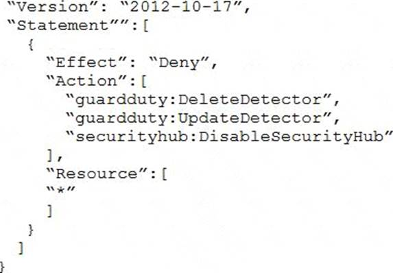
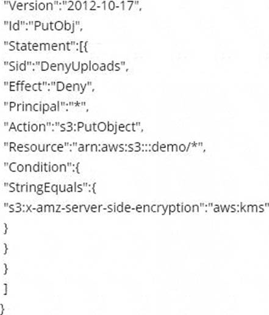
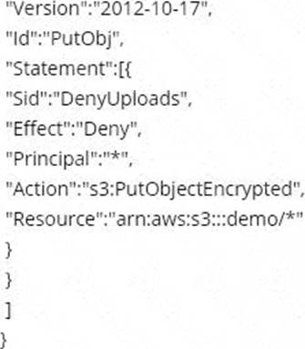
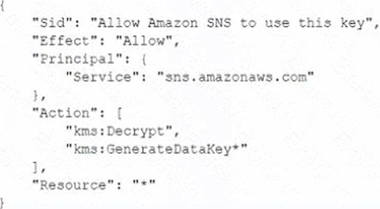
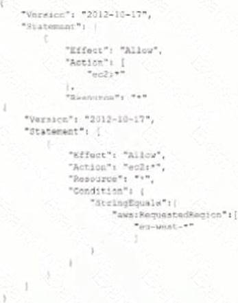
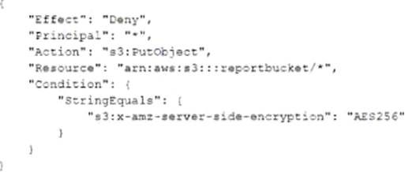
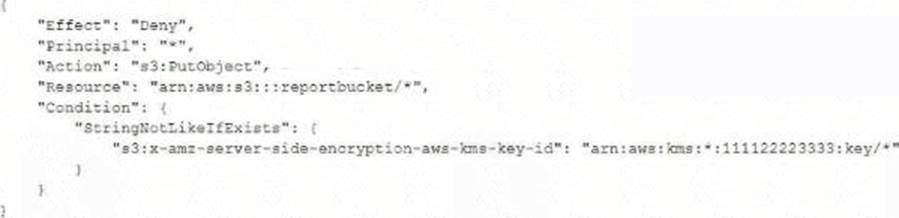

1. A business requires a forensic logging solution for hundreds of Docker-based apps running on Amazon EC2. The solution must analyze logs in real time, provide message replay, and persist logs. Which Amazon Web Offerings (IAM) services should be employed to satisfy these requirements? (Select TWO)

    - A) Amazon Athena.
    - B) Amazon Kinesis.
    - C) Amazon SQS.
    - D) Amazon Elasticsearch.
    - E) Amazon EMR.

<b>Answer</b>
 Correct Answer(s): B, D

2. A company developed an application by using AWS Lambda, Amazon S3, Amazon Simple Notification Service (Amazon SNS), and Amazon DynamoDB. An external application puts objects into the company's S3 bucket and tags the objects with date and time. A Lambda function periodically pulls data from the company's S3 bucket based on date and time tags and inserts specific values into a DynamoDB table for further processing. The data includes personally identifiable information (Pll). The company must remove data that is older than 30 days from the S3 bucket and the DynamoDB table. Which solution will meet this requirement with the MOST operational efficiency?

    - A) Update the Lambda function to add a TTL S3 flag to S3 objects. Create an S3 Lifecycle policy to expire objects that are older than 30 days by using the TTL S3 flag.
    - B) Create an S3 Lifecycle policy to expire objects that are older than 30 days. Update the Lambda function to add the TTL attribute in the DynamoDB table. Enable TTL on the DynamoDB table to expire entires that are older than 30 days based on the TTL attribute.
    - C) Create an S3 Lifecycle policy to expire objects that are older than 30 days and to add all prefixes to the S3 bucket. Update the Lambda function to delete entries that are older than 30 days.
    - D) Create an S3 Lifecycle policy to expire objects that are older than 30 days by using object tags. Update the Lambda function to delete entries that are older than 30 days.

<b>Answer</b>
 Correct Answer(s): B

3. A company is hosting a static website on Amazon S3 The company has configured an Amazon CloudFront distribution to serve the website contents. The company has associated an IAM WAF web ACL with the CloudFront distribution. The Web ACL ensures that requests originate from the United States to address compliance restrictions. THE company is worried that the S3 URL might still be accessible directly and that requests can bypass the CloudFront distribution. Which combination of steps should the company take to remove direct access to the S3 URL? (Select TWO)

    - A) Select `Restrict Bucket Access` in the origin settings of the CloudFront distribution
    - B) Create an origin access identity (OAI) for the S3 origin.
    - C) Update the S3 bucket policy to allow s3 GetObject with a condition that the IAM Referer key matches the secret value Deny all other.
    - D) Configure the S3 bucket poky so that only the origin access identity (OAI) has read permission for objects in the bucket.
    - E) Add an origin custom header that has the name Referer to the CloudFront distribution Give the header a secret value.

<b>Answer</b>
 Correct Answer(s): A, B

4. A company is testing its incident response plan for compromised credentials. The company runs a database on an Amazon EC2 instance and stores the sensitive data-base credentials as a secret in AWS Secrets Manager. The secret has rotation configured with an AWS Lambda function that uses the generic rotation function template. The EC2 instance and the Lambda function are deployed in the same private subnet. The VPC has a Secrets Manager VPC endpoint. A security engineer discovers that the secret cannot rotate. The security engineer determines that the VPC endpoint is working as intended. The Amazon Cloud-Watch logs contain the following error: `"setSecret: Unable to log into database"`. Which solution will resolve this error?

    - A) Use the AWS Management Console to edit the JSON structure of the secret in Secrets Manager so that the secret automatically conforms with the structure that the database requires.
    - B) Ensure that the security group that is attached to the Lambda function al-lows outbound connections to the EC2 instance. Ensure that the security group that is attached to the EC2 instance allows inbound connections from the security group that is attached to the Lambda function.
    - C) Use the Secrets Manager list-secrets command in the AWS CLI to list the secret. Identify the database
credentials. Use the Secrets Manager rotate-secret command in the AWS CLI to force the immediate rotation of the secret.
    - D) Add an internet gateway to the VPC. Create a NAT gateway in a public sub-net. Update the VPC route tables so that traffic from the Lambda function and traffic from the EC2 instance can reach the Secrets Manager public endpoint.

<b>Answer</b>
 Correct Answer(s): B

5. A company needs a forensic-logging solution for hundreds of applications running in Docker on Amazon EC2 The solution must perform real-time analytics on the togs must support the replay of messages and must persist the logs. Which IAM services should be used to meet these requirements? (Select TWO)

    - A) Amazon Athena.
    - B) Amazon Kinesis.
    - C) Amazon SQS.
    - D) Amazon Elasticsearch.
    - E) Amazon EMR.

<b>Answer</b>
 Correct Answer(s): B, D

6. A company is evaluating the use of AWS Systems Manager Session Manager to gam access to the company's Amazon EC2 instances. However, until the company implements the change, the company must protect the key file for the EC2 instances from read and write operations by any other users. When a security administrator tries to connect to a critical EC2 Linux instance during an emergency, the security administrator receives the following error. `"Error Unprotected private key file – Permissions for' ssh/my_private_key pern' are too open"`. Which command should the security administrator use to modify the private key Me permissions to resolve this error?

    - A) chmod 0040 ssh/my_private_key pern.
    - B) chmod 0400 ssh/my_private_key pern.
    - C) chmod 0004 ssh/my_private_key pern.
    - D) chmod 0777 ssh/my_private_key pern.

<b>Answer</b>
 Correct Answer(s): B

7. A company deploys a set of standard IAM roles in AWS accounts. The IAM roles are based on job functions within the company. To balance operational efficiency and security, a security engineer implemented AWS Organizations SCPs to restrict access to critical security services in all company accounts. All of the company's accounts and OUs within AWS Organizations have a default FullAWSAccess SCP that is attached. The security engineer needs to ensure that no one can disable Amazon GuardDuty and AWS Security Hub. The security engineer also must not override other permissions that are granted by IAM policies that are defined in the accounts. Which SCP should the security engineer attach to the root of the organization to meet these requirements?

    - A) Option A.

    - B) Option B.

    - C) Option C.

    - D) Option D.

<b>Answer</b>
 Correct Answer(s): A

8. A company is building a data processing application mat uses AWS Lambda functions. The application's Lambda functions need to communicate with an Amazon RDS OB instance that is deployed within a VPC in the same AWS accountWhich solution meets these requirements in the MOST secure way?

    - A) Configure the DB instance to allow public access Update the DB instance security group to allow access from the Lambda public address space for the AWS Region.
    - B) Deploy the Lambda functions inside the VPC Attach a network ACL to the Lambda subnet Provide outbound rule access to the VPC CIDR range only Update the DB instance security group to allow traffic from 0.0.0.0/0.
    - C) Deploy the Lambda functions inside the VPC Attach a security group to the Lambda functions Provide outbound rule access to the VPC CIDR range only Update the DB instance security group to allow traffic from the Lambda security group.
    - D) Peer the Lambda default VPC with the VPC that hosts the DB instance to allow direct network access without the need for security groups.

<b>Answer</b>
 Correct Answer(s): C

9. A company has an application that uses an Amazon RDS PostgreSQL database. The company is developing an application feature that will store sensitive information for an individual in the database. During a security review of the environment, the company discovers that the RDS DB instance is not encrypting data at rest. The company needs a solution that will provide encryption at rest for all the existing data and for any new data that is entered for an individual. Which combination of options can the company use to meet these requirements? (Select TWO)

    - A) Create a snapshot of the DB instance. Copy the snapshot to a new snapshot, and enable encryption for the copy process. Use the new snapshot to restore the DB instance.
    - B) Modify the configuration of the DB instance by enabling encryption. Create a snapshot of the DB instance. Use the snapshot to restore the DB instance.
    - C) Use IAM Key Management Service (AWS KMS) to create a new default IAM managed awards key. Select this key as the encryption key for operations with Amazon RDS.
    - D) Use IAM Key Management Service (AWS KMS) to create a new CMK. Select this key as the encryption key for operations with Amazon RDS.
    - E) Create a snapshot of the DB instance. Enable encryption on the snapshoVUse the snapshot to restore the DB instance.

<b>Answer</b>
 Correct Answer(s): A, D

10. Which of the following bucket policies will ensure that objects being uploaded to a bucket called 'demo' are encrypted?

    - A) Option A.

    - B) Option B.

    - C) Option C.

    - D) Option D.

<b>Answer</b>
 Correct Answer(s): A

11. A company uses AWS Organizations to manage a multi-account AWS environment in a single AWS Region. The organization's management account is named management-01. The company has turned on AWS Config in all accounts in the organization. The company has designated an account named security-01 as the delegated administrator for AWS Config. All accounts report the compliance status of each account's rules to the AWS Config delegated administrator account by using an AWS Config aggregator. Each account administrator can configure and manage the account's own AWS Config rules to handle each account's unique compliance requirements. A security engineer needs to implement a solution to automatically deploy a set of 10 AWS Config rules to all existing and future AWS accounts in the organization. The solution must turn on AWS Config automatically during account creation. Which combination of steps will meet these requirements? (Select TWO)

    - A) Create an AWS CloudFormation template that contains the 1 0 required AVVS Config rules. Deploy the template by using CloudFormation StackSets in the security-01 account.
    - B) Create a conformance pack that contains the 10 required AWS Config rules. Deploy the conformance pack from the security-01 account.
    - C) Create a conformance pack that contains the 10 required AWS Config rules. Deploy the conformance pack from the management-01 account.
    - D) Create an AWS CloudFormation template that will activate AWS Config. Deploy the template by using CloudFormation StackSets in the security-01 ac-count.
    - E) Create an AWS CloudFormation template that will activate AWS Config. Deploy the template by using CloudFormation StackSets in the management-01 account.

<b>Answer</b>
 Correct Answer(s): B, E

12. A company has two IAM accounts within IAM Organizations. In Account-1. Amazon EC2 Auto Scaling is launched using a service-linked role. In Account-2. Amazon EBS volumes are encrypted with an AWS KMS key. A Security Engineer needs to ensure that the service-linked role can launch instances with these encrypted volumesWhich combination of steps should the Security Engineer take in both accounts? (Select TWO)

    - A) Allow Account-1 to access the KMS key in Account-2 using a key policy
    - B) Attach an IAM policy to the service-linked role in Account-1 that allows these actions CreateGrant. DescnbeKey, Encrypt, GenerateDataKey, Decrypt, and ReEncrypt
    - C) Create a KMS grant for the service-linked role with these actions CreateGrant, DescnbeKey Encrypt GenerateDataKey Decrypt, and ReEncrypt
    - D) Attach an IAM policy to the role attached to the EC2 instances with KMS actions and then allow Account-1 in the KMS key policy.
    - E) Attach an IAM policy to the user who is launching EC2 instances and allow the user to access the KMS key policy of Account-2.

<b>Answer</b>
 Correct Answer(s): A, C

13. Which of the following are valid configurations for using SSL certificates with Amazon CloudFront? (Select THREE)

    - A) Default AWS Certificate Manager certificate.
    - B) Custom SSL certificate stored in AWS KMS.
    - C) Default CloudFront certificate.
    - D) Custom SSL certificate stored in AWS Certificate Manager.
    - E) Default SSL certificate stored in AWS Secrets Manager.
    - F) Custom SSL certificate stored in AWS IAM.

<b>Answer</b>
 Correct Answer(s): C, D, F

14. A Security Engineer is troubleshooting an issue with a company's custom logging application. The application logs are written to an Amazon S3 bucket with event notifications enabled to send events to an Amazon SNS topic. All logs are encrypted at rest using an AWS KMS CMK. The SNS topic is subscribed to an encrypted Amazon SQS queue. The logging application polls the queue for new messages that contain metadata about the S3 object. The application then reads the content of the object from the S3 bucket for indexing. The Logging team reported that Amazon CloudWatch metrics for the number of messages sent or received is showing zero. No tags are being received. What should the Security Engineer do to troubleshoot this issue?

    - A) Option A: Add the following statement to the IAM managed CMKs.

    - B) Option B: Add the following statement to the CMK key policy.

    - C) Option C: Add the following statement to the CMK key policy.

    - D) Option D: Add the following statement to the CMK key policy.

<b>Answer</b>
 Correct Answer(s): B

15. A security engineer needs to implement a write-once-read-many (WORM) model for data that a company will store in Amazon S3 buckets. The company uses the S3 Standard storage class for all of its S3 buckets. The security engineer must ensure that objects cannot be overwritten or deleted by any user, including the AWS account root user. Which solution will meet these requirements?

    - A) Create new S3 buckets with S3 Object Lock enabled in compliance mode. Place objects in the S3 buckets.
    - B) Use S3 Glacier Vault Lock to attach a Vault Lock policy to new S3 buckets. Wait 24 hours to complete the Vault Lock process. Place objects in the S3 buckets.
    - C) Create new S3 buckets with S3 Object Lock enabled in governance mode. Place objects in the S3 buckets.
    - D) Create new S3 buckets with S3 Object Lock enabled in governance mode. Add a legal hold to the S3 buckets. Place objects in the S3 buckets.

<b>Answer</b>
 Correct Answer(s): A

16. A development team is attempting to encrypt and decode a secure string parameter from the IAM Systems Manager Parameter Store using an IAM Key Management Service (AWS KMS) CMK. However, each attempt results in an error message being sent to the development team. Which CMK-related problems possibly account for the error? (Select TWO)

    - A) The CMK is used in the attempt does not exist.
    - B) The CMK is used in the attempt needs to be rotated.
    - C) The CMK is used in the attempt is using the CMKs key ID instead of the CMK ARN.
    - D) The CMK is used in the attempt is not enabled.
    - E) The CMK is used in the attempt is using an alias.

<b>Answer</b>
 Correct Answer(s): A, D

17. A security engineer logs in to the AWS Lambda console with administrator permissions. The security engineer is trying to view logs in Amazon CloudWatch for a Lambda function that is named my Function. When the security engineer chooses the option in the Lambda console to view logs in CloudWatch, an `error loading Log Streams` message appears. The IAM policy for the Lambda function's execution role contains the following. How should the security engineer correct the error?

    - A) Move the `logs:CreateLogGroup` action to the second Allow statement.
    - B) Add the `logs:PutDestination` action to the second Allow statement.
    - C) Add the `logs:GetLogEvents` action to the second Allow statement.
    - D) Add the `logs:CreateLogStream` action to the second Allow statement.

<b>Answer</b>
 Correct Answer(s): D

18. A company plans to create individual child accounts within an existing organization in IAM Organizations for each of its DevOps teams. AWS CloudTrail has been enabled and configured on all accounts to write audit logs to an Amazon S3 bucket in a centralized IAM account. A security engineer needs to ensure that DevOps team members are unable to modify or disable this configuration. How can the security engineer meet these requirements?

    - A) Create an IAM policy that prohibits changes to the specific CloudTrail trail and apply the policy to the IAM account root user.
    - B) Create an S3 bucket policy in the specified destination account for the CloudTrail trail that prohibits configuration changes from the IAM account root user in the source account.
    - C) Create an SCP that prohibits changes to the specific CloudTrail trail and apply the SCP to the appropriate organizational unit or account in Organizations.
    - D) Create an IAM policy that prohibits changes to the specific CloudTrail trail and apply the policy to a new IAM group. Have team members use individual IAM accounts that are members of the new IAM group.

<b>Answer</b>
 Correct Answer(s): C

19. A company uses Amazon RDS for MySQL as a database engine for its applications. A recent security audit revealed an RDS instance that is not compliant with company policy for encrypting data at rest. A security engineer at the company needs to ensure that all existing RDS databases are encrypted using server-side encryption and that any future deviations from the policy are detected. Which combination of steps should the security engineer take to accomplish this? (Select TWO)

    - A) Create an AWS Config rule to detect the creation of encrypted RDS databases. Create an Amazon EventBridge (Amazon CloudWatch Events) rule to trigger on the AWS Config rules compliance state change and use Amazon Simple Notification Service (Amazon SNS) to notify the security operations team.
    - B) Use AWS System Manager State Manager to detect RDS database encryption configuration drift. Create an Amazon EventBridge (Amazon CloudWatch Events) rule to track state changes and use Amazon Simple Notification Service (Amazon SNS) to notify the security operations team.
    - C) Create a read replica for the existing unencrypted RDS database and enable replica encryption in the process. Once the replica becomes active, promote it into a standalone database instance and terminate the unencrypted database instance.
    - D) Take a snapshot of the unencrypted RDS database. Copy the snapshot and enable snapshot encryption in the process. Restore the database instance from the newly created encrypted snapshot. Terminate the unencrypted database instance.
    - E) Enable encryption for the identified unencrypted RDS instance by changing the configurations of the existing database.

<b>Answer</b>
 Correct Answer(s): A, D

20. A company has a large fleet of Linux Amazon EC2 instances and Windows EC2 instances that run in private subnets. The company wants all remote administration to be performed as securely as possible in the AWS Cloud. Which solution will meet these requirements?

    - A) Do not use SSH-RSA private keys during the launch of new instances. Implement AWS Systems Manager Session Manager.
    - B) Generate new SSH-RSA private keys for existing instances. Implement AWS Systems Manager Session Manager.
    - C) Do not use SSH-RSA private keys during the launch of new instances. Configure EC2 Instance Connect.
    - D) Generate new SSH-RSA private keys for existing instances. Configure EC2 Instance Connect.

<b>Answer</b>
 Correct Answer(s): A

21. A company has an AWS Lambda function that creates image thumbnails from larger images. The Lambda function needs read and write access to an Amazon S3 bucket in the same AWS account. Which solutions will provide the Lambda function this access? (Select TWO)

    - A) Create an IAM user that has only programmatic access. Create a new access key pair. Add environmental variables to the Lambda function with the access key ID and secret access key. Modify the Lambda function to use the environmental variables at run time during communication with Amazon S3.
    - B) Generate an Amazon EC2 key pair. Store the private key in AWS Secrets Man-ager. Modify the Lambda function to retrieve the private key from Secrets Manager and to use the private key during communication with Amazon S3.
    - C) Create an IAM role for the Lambda function. Attach an IAM policy that al-lows access to the S3 bucket.
    - D) Create an IAM role for the Lambda function. Attach a bucket policy to the S3 bucket to allow access. Specify the function's IAM role as the principal.
    - E) Create a security group. Attach the security group to the Lambda function. Attach a bucket policy that allows access to the S3 bucket through the security group ID.

<b>Answer</b>
 Correct Answer(s): C, D

22. A security engineer is designing an IAM policy for a script that will use the AWS CLI. The script currently assumes an IAM role that is attached to three AWS managed IAM policies: AmazonEC2FullAccess, AmazonDynamoDBFullAccess, and Ama-zonVPCFull Access. The security engineer needs to construct a least privilege IAM policy that will replace the AWS managed IAM policies that are attached to this role. Which solution will meet these requirements in the MOST operationally efficient way?

    - A) In AWS CloudTrail, create a trail for management events. Run the script with the existing AWS managed IAM policies. Use IAM Access Analyzer to generate a new IAM policy that is based on access activity in the trail. Replace the existing AWS managed IAM policies with the generated IAM poli-cy for the role.
    - B) Remove the existing AWS managed IAM policies from the role. Attach the IAM Access Analyzer Role Policy Generator to the role. Run the script. Return to IAM Access Analyzer and generate a least privilege IAM policy. Attach the new IAM policy to the role.
    - C) Create an account analyzer in IAM Access Analyzer. Create an archive rule that has a filter that checks whether the Principal Arn value matches the ARN of the role. Run the script. Remove the existing AWS managed IAM policies from the role.
    - D) In AWS CloudTrail, create a trail for management events. Remove the existing AWS managed IAM policies from the role. Run the script. Find the authorization failure in the trail event that is associated with the script. Create a new IAM policy that includes the action and resource that caused the authorization failure. Repeat the process until the script succeeds. Attach the new IAM policy to the role.

<b>Answer</b>
 Correct Answer(s): A

23. A company that uses AWS Organizations wants to see AWS Security Hub findings for many AWS accounts and AWS Regions. Some of the accounts are in the company's organization, and some accounts are in organizations that the company manages for customers. Although the company can see findings in the Security Hub administrator account for accounts in the company's organization, there are no findings from accounts in other organizations. Which combination of steps should the company take to see findings from accounts that are outside the organization that includes the Security Hub administrator account? (Select TWO)

    - A) Use a designated administration account to automatically set up member accounts.
    - B) Create the AWS Service Role ForSecurrty Hub service-linked rote for Security Hub.
    - C) Send an administration request from the member accounts.
    - D) Enable Security Hub for all member accounts.
    - E) Send invitations to accounts that are outside the company's organization from the Security Hub administrator account.

<b>Answer</b>
 Correct Answer(s): C, E

24. A company uses identity federation to authenticate users into an identity account (987654321987) where the users assume an IAM role named IdentityRole. The users then assume an IAM role named JobFunctionRole in the target IAM account (123456789123) to perform their job functions. A user is unable to assume the IAM role in the target account. The policy attached to the role in the identity account is. What should be done to enable the user to assume the appropriate role in the target account?

    - A) Option A: Update the IAM policy attached to the role in the identity account to be.

    - B) Option B: Update the trust policy on the role in the target account to be.

    - C) Option C: Update the trust policy on the role in the identity account to be.

    - D) Option D: Update the IAM policy attached to the role in the target account to be.

<b>Answer</b>
 Correct Answer(s): B

25. A company hosts a web application on an Apache Web server. The application runs on Amazon EC2 instances that are in an Auto Scaling group. The company configured the EC2 instances to send the Apache Web server logs to an Amazon CloudWatch Logs group that the company has configured to expire after 1 year. Recently, the company discovered in the Apache Web server logs that a specific IP address is sending suspicious requests to the Web application. A security engineer wants to analyze the past week of Apache Web server logs to determine how many requests that the IP address sent and the corresponding URLs that the IP address requested. What should the security engineer do to meet these requirements with the LEAST effort?

    - A) Export the CloudWatch Logs group data to Amazon S3. Use Amazon Macie to query the logs for the specific IP address and the requested URLs.
    - B) Configure a CloudWatch Logs subscription to stream the log group to an Amazon OpenSearch Service cluster. Use OpenSearch Service to analyze the logs for the specific IP address and the requested URLs.
    - C) Use CloudWatch Logs Insights and a custom query syntax to analyze the CloudWatch logs for the specific IP address and the requested URLs.
    - D) Export the CloudWatch Logs group data to Amazon S3. Use AWS Glue to crawl the S3 bucket for only the log entries that contain the specific IP ad-dress. Use AWS Glue to view the results.

<b>Answer</b>
 Correct Answer(s): C

26. A company has multiple Amazon S3 buckets encrypted with customer-managed CMKs Due to regulatory requirements the keys must be rotated every year. The company's Security Engineer has enabled automatic key rotation for the CMKs; however the company wants to verity that the rotation has occurred. What should the Security Engineer do to accomplish this?

    - A) Filter AWS CloudTrail logs for KeyRotaton events.
    - B) Monitor Amazon CloudWatch Events for any AWS KMS CMK rotation events.
    - C) Using the IAM CLI run the `IAM kms gel-key-relation-status` operation with the `–key-id` parameter to check the CMK rotation date.
    - D) Use Amazon Athena to query AWS CloudTrail logs saved in an S3 bucket to filter Generate New Key events.

<b>Answer</b>
 Correct Answer(s): A

27. A company has implemented IAM WAF and Amazon CloudFront for an application. The application runs on Amazon EC2 instances that are part of an Auto Scaling group. The Auto Scaling group is behind an Application Load Balancer (ALB). The IAM WAF web ACL uses an IAM Managed Rules rule group and is associated with the CloudFront distribution. CloudFront receives the request from IAM WAF and then uses the ALB as the distribution's origin. During a security review, a security engineer discovers that the infrastructure is susceptible to a large, layer 7 DDoS attack. How can the security engineer improve the security at the edge of the solution to defend against this type of attack?

    - A) Configure the CloudFront distribution to use the Lambda@Edge feature. Create an IAM Lambda function that imposes a rate limit on CloudFront viewer requests. Block the request if the rate limit is exceeded.
    - B) Configure the IAM WAF web ACL so that the Web ACL has more capacity units to process all IAM WAF rules faster.
    - C) Configure IAM WAF with a rate-based rule that imposes a rate limit that automatically blocks requests when the rate limit is exceeded.
    - D) Configure the CloudFront distribution to use IAM WAF as its origin instead of the ALB.

<b>Answer</b>
 Correct Answer(s): C

28. A company has multiple accounts in the AWS Cloud. Users in the developer account need to have access to specific resources in the production account. What is the MOST secure way to provide this access?

    - A) Create one IAM user in the production account. Grant the appropriate permissions to the resources that are needed. Share the password only with the users that need access.
    - B) Create cross account access with an IAM role in the developer account. Grant the appropriate permissions to this role. Allow users in the developer account to assume this role to access the production resources.
    - C) Create cross-account access with an IAM user account in the production account. Grant the appropriate permissions to this user account. Allow users in the developer account to use this user account to access the production resources.
    - D) Create cross-account access with an IAM role in the production account. Grant the appropriate permissions to this role. Allow users in the developer account to assume this role to access the production resources.

<b>Answer</b>
 Correct Answer(s): D

29. A System Administrator is unable to start an Amazon EC2 instance in the eu-west-1 Region using an IAM role The same System Administrator is able to start an EC2 instance in the eu-west-2 and eu-west-3 Regions. The IAMSystemAdministrator access policy attached to the System Administrator IAM role allows unconditional access to all IAM services and resources within the account. Which configuration caused this issue?

    - A) Option A: An SCP is attached to the account with the following permission statement.

    - B) Option B: A permission boundary policy is attached to the System Administrator role with the following permission statement.

    - C) Option C: A permission boundary is attached to the System Administrator role with the following permission statement.

    - D) Option D: An SCP is attached to the account with the following statement.

<b>Answer</b>
 Correct Answer(s): B

30. Amazon GuardDuty has detected communications to a known command and control endpoint from a company's Amazon EC2 instance. The instance was found to be running a vulnerable version of a common web framework. The company's security operations team wants to quickly identity other compute resources with the specific version of that framework installed. Which approach should the team take to accomplish this task?

    - A) Scan all the EC2 instances for noncompliance with IAM Config. Use Amazon Athena to query AWS CloudTrail logs for the framework installation.
    - B) Scan all the EC2 instances with the Amazon Inspector Network Reachability rules package to identity instances running a web server with RecognizedPortWithListener findings.
    - C) Scan all the EC2 instances with IAM Systems Manager to identify the vulnerable version of the Web framework.
    - D) Scan an the EC2 instances with IAM Resource Access Manager to identify the vulnerable version of the Web framework.

<b>Answer</b>
 Correct Answer(s): C

31. A company stores sensitive documents in Amazon S3 by using server-side encryption with an AWS Key Management Service (AWS KMS) CMK. A new requirement mandates that the CMK that is used for these documents can be used only for S3 actions. Which statement should the company add to the key policy to meet this requirement?

    - A) Option A.

    - B) Option B.

    - C) Option C.

    - D) Option D.

<b>Answer</b>
 Correct Answer(s): C

32. A company finds that one of its Amazon EC2 instances suddenly has a high CPU usage. The company does not know whether the EC2 instance is compromised or whether the operating system is performing background cleanup. Which combination of steps should a security engineer take before investigating the issue? (Select THREE)

    - A) Disable termination protection for the EC2 instance if termination protection has not been disabled.
    - B) Enable termination protection for the EC2 instance if termination protection has not been enabled.
    - C) Take snapshots of the Amazon Elastic Block Store (Amazon EBS) data volumes that are attached to the EC2 instance.
    - D) Remove all snapshots of the Amazon Elastic Block Store (Amazon EBS) data volumes that are attached to the EC2 instance.
    - E) Capture the EC2 instance metadata, and then tag the EC2 instance as under quarantine.
    - F) Immediately remove any entries in the EC2 instance metadata that contain sensitive information.

<b>Answer</b>
 Correct Answer(s): B, C, E

33. A company hosts an application on Amazon EC2 that is subject to specific rules for regulatory compliance. One rule states that traffic to and from the workload must be inspected for network-level attacks. This involves inspecting the whole packet. To comply with this regulatory rule, a security engineer must install intrusion detection software on a c5n.4xlarge EC2 instance. The engineer must then configure the software to monitor traffic to and from the application instances. What should the security engineer do next?

    - A) Place the network interface in promiscuous mode to capture the traffic.
    - B) Configure VPC Flow Logs to send traffic to the monitoring EC2 instance using a Network Load Balancer.
    - C) Configure VPC traffic mirroring to send traffic to the monitoring EC2 instance using a Network Load Balancer.
    - D) Use Amazon Inspector to detect network-level attacks and trigger an IAM Lambda function to send the suspicious packets to the EC2 instance.

<b>Answer</b>
 Correct Answer(s): C

34. A company has a relational database workload that runs on Amazon Aurora MySQL. According to new compliance standards the company must rotate all database credentials every 30 days. The company needs a solution that maximizes security and minimizes development effort. Which solution will meet these requirements?

    - A) Store the database credentials in AWS Secrets Manager. Configure automatic credential rotation for every 30 days.
    - B) Store the database credentials in AWS Systems Manager Parameter Store. Create an AWS Lambda function to rotate the credentials every 30 days.
    - C) Store the database credentials in an environment file or in a configuration file. Modify the credentials every 30 days.
    - D) Store the database credentials in an environment file or in a configuration file. Create an AWS Lambda function to rotate the credentials every 30 days.

<b>Answer</b>
 Correct Answer(s): A

35. A company uses AWS Organizations to manage a small number of AWS accounts. However, the company plans to add 1 000 more accounts soon. The company allows only a centralized security team to create IAM roles for all AWS accounts and teams. Application teams submit requests for IAM roles to the security team. The security team has a backlog of IAM role requests and cannot review and provision the IAM roles quickly. The security team must create a process that will allow application teams to provision their own IAM roles. The process must also limit the scope of IAM roles and prevent privilege escalation. Which solution will meet these requirements with the LEAST operational overhead?

    - A) Create an IAM group for each application team. Associate policies with each IAM group. Provision IAM users for each application team member. Add the new IAM users to the appropriate IAM group by using role-based access control (RBAC).
    - B) Delegate application team leads to provision IAM rotes for each team. Conduct a quarterly review of the IAM rotes the team leads have provisioned. Ensure that the application team leads have the appropriate training to review IAM roles.
    - C) Put each AWS account in its own OU. Add an SCP to each OU to grant access to only the AWS services that the teams plan to use. Include conditions tn the AWS account of each team.
    - D) Create an SCP and a permissions boundary for IAM roles. Add the SCP to the root OU so that only roles that have the permissions boundary attached can create any new IAM roles.

<b>Answer</b>
 Correct Answer(s): D

36. A company's security engineer is developing an incident response plan to detect suspicious activity in an AWS account for VPC hosted resources. The security engineer needs to provide visibility for as many AWS Regions as possible. Which combination of steps will meet these requirements MOST cost-effectively? (Select TWO)

    - A) Turn on VPC Flow Logs for all VPCs in the account.
    - B) Activate Amazon GuardDuty across all AWS Regions.
    - C) Activate Amazon Detective across all AWS Regions.
    - D) Create an Amazon Simple Notification Service (Amazon SNS) topic. Create an Amazon EventBridge rule that responds to findings and publishes the findings to the SNS topic.
    - E) Create an AWS Lambda function. Create an Amazon EventBridge rule that invokes the Lambda function to publish findings to Amazon Simple Email Ser-vice (Amazon SES).

<b>Answer</b>
 Correct Answer(s): B, D

37. A team is using AWS Secrets Manager to store an application database password. Only a limited number of IAM principals within the account can have access to the secret. The principals who require access to the secret change frequently. A security engineer must create a solution that maximizes flexibility and scalability. Which solution will meet these requirements?

    - A) Use a role-based approach by creating an IAM role with an inline permissions policy that allows access to the secret. Update the IAM principals in the role trust policy as required.
    - B) Deploy a VPC endpoint for Secrets Manager. Create and attach an endpoint policy that specifies the IAM principals that are allowed to access the secret. Update the list of IAM principals as required.
    - C) Use a tag-based approach by attaching a resource policy to the secret. Apply tags to the secret and the IAM principals. Use the `aws:PrincipalTag` and `aws:ResourceTag` IAM condition keys to control access.
    - D) Use a deny-by-default approach by using IAM policies to deny access to the secret explicitly. Attach the policies to an IAM group. Add all IAM principals to the IAM group. Remove principals from the group when they need access. Add the principals to the group again when access is no longer allowed.

<b>Answer</b>
 Correct Answer(s): C

38. A company uses AWS Organizations to run workloads in multiple AWS accounts. Currently the individual team members at the company access all Amazon EC2 instances remotely by using SSH or Remote Desktop Protocol (RDP) The company does not have any audit trails and security groups are occasionally open. The company must secure access management and implement a centralized togging solution. Which solution will meet these requirements MOST securely?

    - A) Configure trusted access for AWS System Manager in Organizations. Configure a bastion host from the management account. Replace SSH and RDP by using Systems Manager Session Manager from the management account Configure Session Manager logging to Amazon CloudWatch Logs.
    - B) Replace SSH and RDP with AWS Systems Manager Session Manager. Install Systems Manager Agent (SSM Agent) on the instances Attach the.
    - C) AmazonSSMManagedlnstanceCore role to the instances. Configure session data streaming to Amazon CloudWatch Logs. Create a separate logging account that has appropriate cross-account permissions to audit the log data.
    - D) Install a bastion host in the management account. Reconfigure all SSH and RDP to allow access only from the bastion host Install AWS Systems Manager Agent (SSM Agent) on the bastion host Attach the AmazonSSMManagedlnstanceCore role to the bastion host. Configure session data streaming to Amazon CloudWatch Logs in a separate logging account to audit log data.
    - E) Replace SSH and RDP with AWS Systems Manager State Manager. Install Systems Manager Agent (SSM Agent) on the instances Attach the AmazonSSMManagedlnstanceCore role to the instances. Configure session data streaming to Amazon CloudTrail. Use CloudTrail Insights to analyze the trail data.

<b>Answer</b>
 Correct Answer(s): C

39. A company became aware that one of its access keys was exposed on a code sharing website 11 days ago. A Security Engineer must review all use of the exposed access keys to determine the extent of the exposure. The company enabled AWS CloudTrail m an regions when it opened the account. Which of the following will allow the Security Engineer 10 complete the task?

    - A) Filter the event history on the exposed access key in the CloudTrail console Examine the data from the past 11 days.
    - B) Use the IAM CLI to generate an IAM credential report Extract all the data from the past 11 days.
    - C) Use Amazon Athena to query the CloudTrail logs from Amazon S3 Retrieve the rows for the exposed access key for the past 11 days.
    - D) Use the Access Advisor tab in the IAM console to view all of the access key activity for the past 11 days.

<b>Answer</b>
 Correct Answer(s): A

40. An application team wants to use IAM Certificate Manager (ACM) to request public certificates to ensure that data is secured in transit. The domains that are being used are not currently hosted on Amazon Route 53 The application team wants to use an IAM managed distribution and caching solution to optimize requests to its systems and provide better points of presence to customers The distribution solution will use a primary domain name that is customized The distribution solution also will use several alternative domain names The certificates must renew automatically over an indefinite period of time. Which combination of steps should the application team take to deploy this architecture? (Select THREE)

    - A) Request a certificate for ACM in the `us-west-2`. Region Add the domain names that the certificate will secure.
    - B) Send an email message to the domain administrators to request vacation of the domains for ACM.
    - C) Request validation of the domains for ACM through DNS Insert CNAME records into each domain's DNS zone.
    - D) Create an Application Load Balancer for me caching solution Select the newly requested certificate from ACM to be used for secure connections.
    - E) Create an Amazon CloudFront distribution for the caching solution Enter the main CNAME record as the Origin Name Enter the subdomain names or alternate names in the Alternate Domain Names Distribution Settings Select the newly requested certificate from ACM to be used for secure connections.
    - F) Request a certificate from ACM in the `us-east-1` Region Add the domain names that the certificate. Wil secure.

<b>Answer</b>
 Correct Answer(s): A, C, E

41. A company uses Amazon API Gateway to present REST APIs to users. An API developer wants to analyze API access patterns without the need to parse the log files. Which combination of steps will meet these requirements with the LEAST effort? (Select TWO)

    - A) Configure access logging for the required API stage.
    - B) Configure an AWS CloudTrail trail destination for API Gateway events. Configure filters on the userldentity, userAgent, and sourcelPAddress fields.
    - C) Configure an Amazon S3 destination for API Gateway logs. Run Amazon Athena queries to analyze API access information.
    - D) Use Amazon CloudWatch Logs Insights to analyze API access information.
    - E) Select the Enable Detailed CloudWatch Metrics option on the required API stage.

<b>Answer</b>
 Correct Answer(s): A, D

42. There are currently multiple applications hosted in a VPC. During monitoring it has been noticed that multiple port scans are coming in from a specific IP Address block. The internal security team has requested that all offending IP Addresses be denied for the next 24 hours. Which of the following is the best method to quickly and temporarily deny access from the specified IP Address's.

    - A) Create an AD policy to modify the. Windows Firewall settings on all hosts in the VPC to deny access from the IP Address block.
    - B) Modify the Network ACLs associated with all public subnets in the VPC to deny access from the IP Address block.
    - C) Add a rule to all of the VPC Security Groups to deny access from the IP Address block.
    - D) Modify the. Windows Firewall settings on all AMI'S that your organization uses in that VPC to deny access from the IP address block.

<b>Answer</b>
 Correct Answer(s): B

43. A company needs to store multiple years of financial records. The company wants to use Amazon S3 to store copies of these documents. The company must implement a solution to prevent the documents from being edited, replaced, or deleted for 7 years after the documents are stored in Amazon S3. The solution must also encrypt the documents at rest. A security engineer creates a new S3 bucket to store the documents. What should the security engineer do next to meet these requirements?

    - A) Configure S3 server-side encryption. Create an S3 bucket policy that has an explicit deny rule for all users for `s3:DeleteObject` and `s3:PutObject` API calls. Configure S3 Object Lock to use governance mode with a retention period of 7 years.
    - B) Configure S3 server-side encryption. Configure S3 Versioning on the S3 bucket. Configure S3 Object Lock to use compliance mode with a retention period of 7 years.
    - C) Configure S3 Versioning. Configure S3 Intelligent-Tiering on the S3 bucket to move the documents to S3 Glacier Deep Archive storage. Use S3 server-side encryption immediately. Expire the objects after 7 years.
    - D) Set up S3 Event Notifications and use S3 server-side encryption. Configure S3 Event Notifications to target an AWS Lambda function that will review any S3 API call to the S3 bucket and deny the `s3:DeleteObject` and `s3:PutObject` API calls. Remove the S3 event notification after 7 years.

<b>Answer</b>
 Correct Answer(s): B

44. There is a requirement for a company to transfer large amounts of data between IAM and an on-premise location. There is an additional requirement for low latency and high consistency traffic to IAM. Given these requirements how would you design a hybrid architecture?

    - A) Provision a Direct Connect connection to an IAM region using a Direct Connect partner.
    - B) Create a VPN tunnel for private connectivity, which increases network consistency and reduces latency.
    - C) Create an IPsec tunnel for private connectivity, which increases network consistency and reduces latency.
    - D) Create a VPC peering connection between IAM and the Customer gateway.

<b>Answer</b>
 Correct Answer(s): A

45. A company uses a third-party identity provider and SAML-based SSO for its AWS accounts. After the third-party identity provider renewed an expired signing certificate, users saw the following message. When trying to log in: Error: `Response Signature Invalid (Service: AWSSecurityTokenService; Status Code: 400; Error Code:InvalidldentityToken)`. A security engineer needs to provide a solution that corrects the error and minimizes operational overhead. Which solution meets these requirements?

    - A) Upload the third-party signing certificate's new private key to the AWS identity provider entity defined in AWS Identity and Access Management (IAM) by using the AWS Management Console.
    - B) Sign the identity provider's metadata file with the new public key. Upload the signature to the AWS identity provider entity defined in AWS Identity and Access Management (IAM) by using the AWS CU.
    - C) Download the updated SAML metadata file from the identity service provider. Update the file in the AWS identity provider entity defined in AWS Identity and Access Management (IAM) by using the AWS CLI.
    - D) Configure the AWS identity provider entity defined in AWS Identity and Access Management (IAM) to synchronously fetch the new public key by using the AWS Management Console.

<b>Answer</b>
 Correct Answer(s): C

46. An AWS account that is used for development projects has a VPC that contains two subnets. The first subnet is named public-subnet-1 and has the CIDR block 192.168.1.0/24 assigned. The other subnet is named private-subnet-2 and has the CIDR block 192.168.2.0/24 assigned. Each subnet contains Amazon EC2 instances. Each subnet is currently using the VPC's default network ACL. The security groups that the EC2 instances in these subnets use have rules that allow traffic between each instance. Where required. Currently, all network traffic flow is working as expected between the EC2 instances that are using these subnets. A security engineer creates a new network ACL that is named subnet-2-NACL with default entries. The security engineer immediately configures private-subnet-2 to use the new network ACL and makes no other changes to the infrastructure. The security engineer starts to receive reports that the EC2 instances in public-subnet-1 and public-subnet-2 cannot communicate with each other. Which combination of steps should the security engineer take to allow the EC2 instances that are running in these two subnets to communicate again? (Select TWO)

    - A) Add an outbound allow rule for 192.168.2.0/24 in the VPC's default network ACL.
    - B) Add an inbound allow rule for 192.168.2.0/24 in the VPC's default network ACL.
    - C) Add an outbound allow rule for 192.168.2.0/24 in subnet-2-NACL.
    - D) Add an inbound allow rule for 192.168.1.0/24 in subnet-2-NACL.
    - E) Add an outbound allow rule for 192.168.1.0/24 in subnet-2-NACL.

<b>Answer</b>
 Correct Answer(s): D, E

47. Within a VPC, a corporation runs an Amazon RDS Multi-AZ DB instance. The database instance is connected to the internet through a NAT gateway via two subnets. Additionally, the organization has application servers that are hosted on Amazon EC2 instances and use the RDS database. These EC2 instances have been deployed onto two more private subnets inside the same VPC. These EC2 instances connect to the internet through a default route via the same NAT gateway. Each VPC subnet has its own route table. The organization implemented a new security requirement after a recent security examination. Never allow the database instance to connect to the internet. A security engineer must perform this update promptly without interfering with the network traffic of the application servers. How will the security engineer be able to comply with these requirements?

    - A) Remove the existing NAT gateway. Create a new NAT gateway that only the application server subnets can use.
    - B) Configure the DB instances inbound network ACL to deny traffic from the security group ID of the NAT gateway.
    - C) Modify the route tables of the DB instance subnets to remove the default route to the NAT gateway.
    - D) Configure the route table of the NAT gateway to deny connections to the DB instance subnets.

<b>Answer</b>
 Correct Answer(s): C

48. An audit determined that a company's Amazon EC2 instance security group violated company policy by allowing unrestricted incoming SSH traffic. A security engineer must implement a near-real-time monitoring and alerting solution that will notify administrators of such violations. Which solution meets these requirements with the MOST operational efficiency?

    - A) Create a recurring Amazon Inspector assessment run that runs every day and uses the Network Reachability package. Create an Amazon CloudWatch rule that invokes an IAM Lambda function when an assessment run starts. Configure the Lambda function to retrieve and evaluate the assessment run report when it completes. Configure the Lambda function also to publish an Amazon Simple Notification Service (Amazon SNS) notification if there are any violations for unrestricted incoming SSH traffic.
    - B) Use the restricted-ssh IAM Config managed rule that is invoked by security group configuration changes that are not compliant. Use the IAM Config remediation feature to publish a message to an Amazon Simple Notification Service (Amazon SNS) topic.
    - C) Configure VPC Flow Logs for the VPC. and specify an Amazon CloudWatch Logs group. Subscribe the CloudWatch Logs group to an IAM Lambda function that parses new log entries, detects successful connections on port 22, and publishes a notification through Amazon Simple Notification Service (Amazon SNS).
    - D) Create a recurring Amazon Inspector assessment run that runs every day and uses the Security Best Practices package. Create an Amazon CloudWatch rule that invokes an IAM Lambda function when an assessment run starts. Configure the Lambda function to retrieve and evaluate the assessment run report when it completes. Configure the Lambda function also to publish an Amazon Simple Notification Service (Amazon SNS) notification if there are any violations for unrestricted incoming SSH traffic.

<b>Answer</b>
 Correct Answer(s): B

49. A company is using Amazon Elastic Container Service (Amazon ECS) to deploy an application that deals with sensitive data During a recent security audit, the company identified a security issue in which Amazon RDS credentials were stored with the application code In the company's source code repository. A security engineer needs to develop a solution to ensure that database credentials are stored securely and rotated periodically. The credentials should be accessible to the application only. The engineer also needs to prevent database administrators from sharing database credentials as plaintext with other teammates. The solution must also minimize administrate overhead. Which solution meets these requirements?

    - A) Use the IAM Systems Manager Parameter Store to generate database credentials. Use an IAM profile for ECS tasks to restrict access to database credentials to specific containers only.
    - B) Use IAM Secrets Manager to store database credentials. Use an IAM inline policy for ECS tasks to restrict access to database credentials to specific containers only.
    - C) Use the IAM Systems Manager Parameter Store to store database credentials. Use IAM roles for ECS tasks to restrict access to database credentials to specific containers only
    - D) Use IAM Secrets Manager to store database credentials. Use IAM roles for ECS tasks to restrict access to database credentials to specific containers only.

<b>Answer</b>
 Correct Answer(s): D

50. A company discovers a billing anomaly in its AWS account. A security consultant investigates the anomaly and discovers that an employee. Who left the company 30 days ago still has access to the account. The company has not monitored account activity in the past. The security consultant needs to determine. Which resources have been deployed or reconfigured by the employee as quickly as possible. Which solution will meet these requirements?

    - A) In AWS Cost Explorer, filter chart data to display results from the past 30 days. Export the results to a data table. Group the data table by re-source.
    - B) Use AWS Cost Anomaly Detection to create a cost monitor. Access the detection history. Set the time frame to Last 30 days. In the search area, choose the service category.
    - C) In AWS CloudTrail, filter the event history to display results from the past 30 days. Create an Amazon Athena table that contains the data. Partition the table by event source.
    - D) Use AWS Audit Manager to create an assessment for the past 30 days. Apply a usage-based framework to the assessment. Configure the assessment to assess by resource.

<b>Answer</b>
 Correct Answer(s): C

51. A company wants to monitor the deletion of AWS Key Management Service (AWS KMS) customer managed keys. A security engineer needs to create an alarm that will notify the company before a KMS key is deleted. The security engineer has configured the integration of AWS CloudTrail with Amazon CloudWatch. What should the security engineer do next to meet these requirements?

    - A) Specify the deletion time of the key material during KMS key creation. Create a custom AWS Config rule to assess the key's scheduled deletion. Configure the rule to trigger upon a configuration change. Send a message to an Amazon Simple Notification Service (Amazon SNS) topic if the key is scheduled for deletion.
    - B) Create an Amazon EventBridge rule to detect KMS API calls of DeleteAlias. Create an AWS Lambda function to send an Amazon Simple Notification Service (Amazon SNS) message to the company. Add the Lambda function as the target of the EventBridge rule.
    - C) Create an Amazon EventBridge rule to detect KMS API calls of DisableKey and ScheduleKeyDeletion. Create an AWS Lambda function to send an Amazon Simple Notification Service (Amazon SNS) message to the company. Add the Lambda function as the target of the EventBridge rule.
    - D) Create an Amazon Simple Notification Service (Amazon SNS) policy to detect KMS API calls of RevokeGrant and ScheduleKeyDeletion. Create an AWS Lambda function to generate the alarm and send the notification to the company. Add the Lambda function as the target of the SNS policy.

<b>Answer</b>
 Correct Answer(s): C

52. A company accidentally deleted the private key for an Amazon Elastic Block Store (Amazon EBS)-backed Amazon EC2 instance. A security engineer needs to regain access to the instance. Which combination of steps will meet this requirement? (Choose TWO)

    - A) Stop the instance. Detach the root volume. Generate a new key pair.
    - B) Keep the instance running. Detach the root volume. Generate a new key pair.
    - C) When the volume is detached from the original instance, attach the volume to another instance as a data volume. Modify the authorized_keys file with a new public key. Move the volume back to the original instance. Start the instance.
    - D) When the volume is detached from the original instance, attach the volume to another instance as a data volume. Modify the authorized_keys file with a new private key. Move the volume back to the original instance. Start the instance.
    - E) When the volume is detached from the original instance, attach the volume to another instance as a data volume. Modify the authorized_keys file with a new public key. Move the volume back to the original instance that is running.

<b>Answer</b>
 Correct Answer(s): A, C

53. A company deployed Amazon GuardDuty in the `us-east-1` Region. The company wants all DNS logs that relate to the company's Amazon EC2 instances to be inspected. What should a security engineer do to ensure that the EC2 instances are logged?

    - A) Use IPv6 addresses that are configured for hostnames.
    - B) Configure external DNS resolvers as internal resolvers that are visible only to IAM.
    - C) Use IAM DNS resolvers for all EC2 instances.
    - D) Configure a third-party DNS resolver with logging for all EC2 instances.

<b>Answer</b>
 Correct Answer(s): C

54. An ecommerce website was down for 1 hour following a DDoS attack Users were unable to connect to the website during the attack period. The ecommerce company's security team is worried about future potential attacks and wants to prepare for such events The company needs to minimize downtime in its response to similar attacks in the future. Which steps would help achieve this9 (Select TWO)

    - A) Enable Amazon GuardDuty to automatically monitor for malicious activity and block unauthorized access.
    - B) Subscribe to AWS Shield Advanced and reach out to IAM Support in the event of an attack.
    - C) Use VPC Flow Logs to monitor network: traffic and an IAM Lambda function to automatically block an attacker's IP using security groups.
    - D) Set up an Amazon CloudWatch Events rule to monitor the AWS CloudTrail events in real time use IAM Config rules to audit the configuration, and use IAM Systems Manager for remediation.
    - E) Use IAM WAF to create rules to respond to such attacks.

<b>Answer</b>
 Correct Answer(s): B, E

55. A security engineer receives an IAM abuse email message. According to the message, an Amazon EC2 instance that is running in the security engineer's IAM account is sending phishing email messages.  The EC2 instance is part of an application that is deployed in production. The application runs on many EC2 instances behind an Application Load Balancer. The instances run in an Amazon EC2 Auto Scaling group across multiple subnets and multiple Availability Zones. The instances normally communicate only over the HTTP. HTTPS, and MySQL protocols. Upon investigation, the security engineer discovers that email messages are being sent over port 587. All other traffic is normal. The security engineer must create a solution that contains the compromised EC2 instance, preserves forensic evidence for analysis, and minimizes application downtime. Which combination of steps must the security engineer take to meet these requirements? (Select THREE)

    - A) Add an outbound rule to the security group that is attached to the compromised EC2 instance to deny traffic to 0.0.0.0/0 and port 587.
    - B) Add an outbound rule to the network ACL for the subnet that contains the compromised EC2 instance to deny traffic to 0.0.0.0/0 and port 587.
    - C) Gather volatile memory from the compromised EC2 instance. Suspend the compromised EC2 instance from the Auto Scaling group. Then take a snapshot of the compromised EC2 instance.
    - D) Take a snapshot of the compromised EC2 instance. Suspend the compromised EC2 instance from the Auto Scaling group. Then gather volatile memory from the compromised EC2 instance.
    - E) Move the compromised EC2 instance to an isolated subnet that has a network ACL that has no inbound rules or outbound rules.
    - F) Replace the existing security group that is attached to the compromised EC2 instance with a new security group that has no inbound rules or outbound rules.

<b>Answer</b>
 Correct Answer(s): B, C, F

56. You need to create a policy and apply it for just an individual user. How could you accomplish this in the right way?

    - A) Add an IAM managed policy for the user.
    - B) Add a service policy for the user.
    - C) Add an IAM role for the user.
    - D) Add an inline policy for the user.

<b>Answer</b>
 Correct Answer(s): D

57. Company A has an AWS account that is named Account A. Company A recently acquired Company B, which has an AWS account that is named Account B. Company B stores its files in an Amazon S3 bucket. The administrators need to give a user from Account A full access to the S3 bucket in Account B. After the administrators adjust the IAM permissions for the user in Account A to access the S3 bucket in Account B, the user still cannot access any files in the S3 bucket. Which solution will resolve this issue?

    - A) In Account B, create a bucket ACL to allow the user from Account A to access the S3 bucket in Account B.
    - B) In Account B, create an object ACL to allow the user from Account A to access all the objects in the S3 bucket in Account B.
    - C) In Account B, create a bucket policy to allow the user from Account A to access the S3 bucket in Account B.
    - D) In Account B, create a user policy to allow the user from Account A to access the S3 bucket in Account B.

<b>Answer</b>
 Correct Answer(s): C

58. A company has a web-based application using Amazon CloudFront and running on Amazon Elastic Container Service (Amazon ECS) behind an Application Load Balancer (ALB). The ALB is terminating TLS and balancing load across ECS service tasks A security engineer needs to design a solution to ensure that application content is accessible only through CloudFront and that I is never accessible directly. How should the security engineer build the MOST secure solution?

    - A) Add an origin custom header. Set the viewer protocol policy to HTTP and HTTPS. Set the origin protocol pokey to HTTPS only. Update the application to validate the CloudFront custom header.
    - B) Add an origin custom header. Set the viewer protocol policy to HTTPS only. Set the origin protocol policy to match viewer. Update the application to validate the CloudFront custom header.
    - C) Add an origin custom header. Set the viewer protocol policy to redirect HTTP to HTTPS. Set the origin protocol policy to HTTP only. Update the application to validate the CloudFront custom header.
    - D) Add an origin custom header. Set the viewer protocol policy to redirect HTTP to HTTPS. Set the origin protocol policy to HTTPS only. Update the application to validate the CloudFront custom header.

<b>Answer</b>
 Correct Answer(s): B

59. A company is using IAM Secrets Manager to store secrets for its production Amazon RDS database. The Security Officer has asked that secrets be rotated every 3 months. Which solution would allow the company to securely rotate the secrets? (Select TWO)

    - A) Place the RDS instance in a public subnet and an IAM Lambda function outside the VPC. Schedule the Lambda function to run every 3 months to rotate the secrets.
    - B) Place the RDS instance in a private subnet and an IAM Lambda function inside the VPC in the private subnet. Configure the private subnet to use a NAT gateway. Schedule the Lambda function to run every 3 months to rotate the secrets.
    - C) Place the RDS instance in a private subnet and an IAM Lambda function outside the VPC. Configure the private subnet to use an internet gateway. Schedule the Lambda function to run every 3 months to rotate the secrets.
    - D) Place the RDS instance in a private subnet and an IAM Lambda function inside the VPC in the private subnet. Schedule the Lambda function to run quarterly to rotate the secrets.
    - E) Place the RDS instance in a private subnet and an IAM Lambda function inside the VPC in the private subnet. Configure a Secrets Manager interface endpoint. Schedule the Lambda function to run every 3 months to rotate the secrets.

<b>Answer</b>
 Correct Answer(s): B, E

60. You work at a company that makes use of IAM resources. One of the key security policies is to ensure that all data i encrypted both at rest and in transit. Which of the following is one of the right ways to implement this?

    - A) Use S3 SSE and use SSL for data in transit.
    - B) SSL termination on the ELB.
    - C) Enabling Proxy Protocol.
    - D) Enabling sticky sessions on your load balancer.

<b>Answer</b>
 Correct Answer(s): A

61. A security engineer configures Amazon S3 Cross-Region Replication (CRR) for all objects that are in an S3 bucket in the `us-east-1`. Region Some objects in this S3 bucket use server-side encryption with AWS KMS keys (SSE-KMS) for encryption at test. The security engineer creates a destination S3 bucket in the `us-west-2` Region. The destination S3 bucket is in the same AWS account as the source S3 bucket. The security engineer also creates a customer managed key in `us-west-2` to encrypt objects at rest in the destination S3 bucket. The replication configuration is set to use the key in `us-west-2` to encrypt objects in the destination S3 bucket. The security engineer has provided the S3 replication configuration with an IAM role to perform the replication in Amazon S3. After a day, the security engineer notices that no encrypted objects from the source S3 bucket are replicated to the destination S3 bucket. However, all the unencrypted objects are replicated. Which combination of steps should the security engineer take to remediate this issue? (Select THREE)

    - A) Change the replication configuration to use the key in `us-east-1` to encrypt the objects that are in the destination S3 bucket.
    - B) Grant the IAM role the kms. Encrypt permission for the key in `us-east-1` that encrypts source objects.
    - C) Grant the IAM role the `s3:GetObjectVersionForReplication` permission for objects that are in the source S3 bucket.
    - D) Grant the IAM role the `kms:Decrypt` permission for the key in `us-east-1` that encrypts source objects.
    - E) Change the key policy of the key in `us-east-1` to grant the kms. Decrypt permission to the security engineer's IAM account.
    - F) Grant the IAM role the `kms:Encrypt` permission for the key in `us-west-2` that encrypts objects that are in the destination S3 bucket.

<b>Answer</b>
 Correct Answer(s): C, D, F

62. A company uses an Amazon S3 bucket to store reports Management has mandated that all new objects stored in this bucket must be encrypted at rest using server-side encryption with a client-specified IAM Key Management Service (AWS KMS) CMK owned by the same account as the S3 bucket. The IAM account number is 111122223333, and the bucket name is report bucket. The company's security specialist must write the S3 bucket policy to ensure the mandate can be Implemented. Which statement should the security specialist include in the policy?

    - A) Option A.

    - B) Option B.

    - C) Option C.

    - D) Option D.

<b>Answer</b>
 Correct Answer(s): D

63. A Security Engineer is working with the development team to design a supply chain application that stores sensitive inventory data in an Amazon S3 bucket. The application will use an AWS KMS customer master key (CMK) to encrypt the data on Amazon S3. The inventory data on Amazon S3 will be shared of vendors. All vendors will use AWS principals from their own AWS accounts to access the data on Amazon S3. The vendor list may change weekly, and the solution must support cross-account access. What is the MOST efficient way to manage access control for the KMS CMK7?

    - A) Use KMS grants to manage key access. Programmatically create and revoke grants to manage vendor access.
    - B) Use an IAM role to manage key access. Programmatically update the IAM role policies to manage vendor access.
    - C) Use KMS key policies to manage key access. Programmatically update the KMS key policies to manage vendor access.
    - D) Use delegated access across AWS accounts by using IAM roles to manage key access. Programmatically update the IAM trust policy to manage cross- account vendor access.

<b>Answer</b>
 Correct Answer(s): A

64. A developer 15 building a serverless application hosted on IAM that uses Amazon Redshift in a data store. The application has separate modules for read/write and read-only functionality. The modules need their own database users for compliance reasons. Which combination of steps should a security engineer implement to grant appropriate access? (Select TWO)

    - A) Configure cluster security groups for each application module to control access to database users that are required for read-only and read/write.
    - B) Configure a VPC endpoint for Amazon Redshift Configure an endpoint policy that maps database users to each application module, and allow access to the tables that are required for read-only and read/write.
    - C) Configure an IAM policy for each module Specify the ARN of an Amazon Redshift database user that allows the `GetClusterCredentials` API call.
    - D) Create focal database users for each module.
    - E) Configure an IAM policy for each module Specify the ARN of an IAM user that allows the `GetClusterCredentials` API call.

<b>Answer</b>
 Correct Answer(s): C, D

65. Your company uses AWS to host its resources. They have the following requirements: 1. Record all API calls and Transitions. 2. Help in understanding what resources are there in the account. 3. Facility to allow auditing credentials and logins. Which services would suffice the above requirements?

    - A) 1. IAM Inspector. 2. CloudTrail. 3. IAM Credential Reports.
    - B) 1. CloudTrail. 2. IAM Credential Reports. 3. IAM SNS.
    - C) 1. CloudTrail. 2. IAM Config. 3. IAM Credential Reports.
    - D) 1. IAM SQS. 2. IAM Credential Reports. 3. CloudTrail.

<b>Answer</b>
 Correct Answer(s): C

