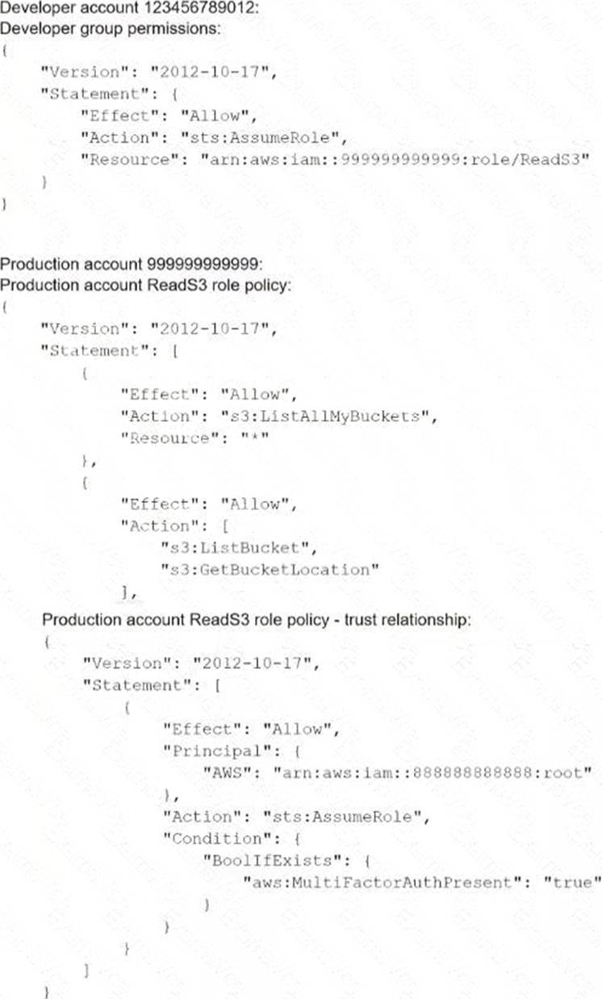
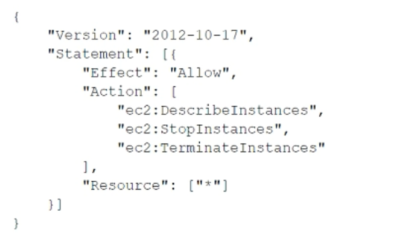

# Practice Exam 3

Click on the **Answer** button for the correct answer and its explanation.

If this practice exam has been helpful to you please share it with others and react to this below.

---

1. A company is designing a multi-account structure for its development teams. The company is using AWS Organizations and AWS Single Sign-On (AWS SSO). The company must implement a solution so that the development teams can use only specific AWS Regions and so that each AWS account allows access to only specific AWS services. Which solution will meet these requirements with the LEAST operational overhead?

    - A) Use AWS SSO to set up service-linked roles with IAM policy statements that include the Condition, Resource, and NotAction elements to allow access to only the Regions and services that are needed.
    - B) Deactivate AWS Security Token Service (AWS STS) in Regions that the developers are not allowed to use.
    - C) Create SCPs that include the Condition, Resource, and NotAction elements to allow access to only the Regions and services that are needed.
    - D) For each AWS account, create tailored identity-based policies for AWS SSO. Use statements that include the Condition, Resource, and NotAction elements to allow access to only the Regions and services that are needed.

<b>Answer</b>
 Correct Answer(s): C

2. A company has deployed Amazon GuardDuty and now wants to implement automation for potential threats. The company has decided to start with RDP brute force attacks that come from Amazon EC2 instances in the company's AWS environment. A security engineer needs to implement a solution that blocks the detected communication from a suspicious instance until investigation and potential remediation can occur. Which solution will meet these requirements?

    - A) Configure GuardDuty to send the event to an Amazon Kinesis data stream. Process the eventwith an Amazon Kinesis Data Analytics for Apache Flink application that sends a notification to the company through Amazon Simple Notification Service (Amazon SNS). Add rules to the network ACL to block traffic to and from the suspicious instance.
    - B) Configure GuardDuty to send the event to Amazon EventBridge (Amazon CloudWatch Events). Deploy an AWS WAF web ACL. Process the event with an AWS Lambda function that sends a notification to the company through Amazon Simple Notification Service (Amazon SNS) and adds a web ACL rule to block traffic to and from the suspicious instance.
    - C) Enable AWS Security Hub to ingest GuardDuty findings and send the event to Amazon EventBridge (Amazon CloudWatch Events). Deploy AWS Network Firewall. Process the event with an AWS Lambda function that adds a rule to a Network Firewall firewall policy to block traffic to and from the suspicious instance.
    - D) Enable AWS Security Hub to ingest GuardDuty findings. Configure an Amazon Kinesis data stream as an event destination for Security Hub. Process the event with an AWS Lambda function that replaces the security group of the suspicious instance with a security group that does not allow any connections.

<b>Answer</b>
 Correct Answer(s): C

3. A company uses an external identity provider to allow federation into different IAM accounts. A security engineer for the company needs to identify the federated user that terminated a production Amazon EC2 instance a week ago. What is the FASTEST way for the security engineer to identify the federated user?

    - A) Review the AWS CloudTrail event history logs in an Amazon S3 bucket and look for the Terminatelnstances event to identify the federated user from the role session name.
    - B) Filter the AWS CloudTrail event history for the Terminatelnstances event and identify the assumed IAM role. Review the AssumeRoleWithSAML event call in CloudTrail to identify the corresponding username.
    - C) Search the AWS CloudTrail logs for the Terminatelnstances event and note the event time. Review the IAM Access Advisor tab for all federated roles. The last accessed time should match the time when the instance was terminated.
    - D) Use Amazon Athena to run a SQL query on the AWS CloudTrail logs stored in an Amazon S3 bucket and filter on the Terminatelnstances event. Identify the corresponding role and run another query to filter the AssumeRoleWithWebldentity event for the user name.

<b>Answer</b>
 Correct Answer(s): B

4. A company is planning to use Amazon Elastic File System (Amazon EFS) with its on-premises servers. The company has an existing IAM Direct Connect connection established between its on-premises data center and an IAM Region Security policy states that the company's on-premises firewall should only have specific IP addresses added to the allow list and not a CIDR range. The company also wants to restrict access so that only certain data center-based servers have access to Amazon EFS. How should a security engineer implement this solution?

    - A) Add the file-system-id efs IAM-region amazonIAM com URL to the allow list for the data center firewall. Install the IAM CLI on the data center-based servers to mount the EFS file system in the EFS security group add the data center IP range to the allow list. Mount the EFS using the EFS file system name.
    - B) Assign an Elastic IP address to Amazon EFS and add the Elastic IP address to the allow list for the data center firewall. Install the IAM CLI on the data center-based servers to mount the EFS file system. In the EFS security group, add the IP addresses of the data center servers to the allow list. Mount the EFS using the Elastic IP address.
    - C) Add the EFS file system mount target IP addresses to the allow list for the data center firewall. In the EFS security group, add the data center server IP addresses to the allow list. Use the Linux terminal to mount the EFS file system using the IP address of one of the mount targets.
    - D) Assign a static range of IP addresses for the EFS file system by contacting IAM Support. In the EFS security group add the data center server IP addresses to the allow list. Use the Linux terminal to mount the EFS file system using one of the static IP addresses.

<b>Answer</b>
 Correct Answer(s): C

5. A website currently runs on Amazon EC2, with mostly static content on the site. Recently, the site was subjected to a DDoS attack, and a Security Engineer was tasked with redesigning the edge security to help mitigate this risk in the future. What are some ways the Engineer could achieve this? (Select THREE)

    - A) Use AWS X-Ray to inspect the traffic going to the EC2 instances.
    - B) Move the static content to Amazon S3, and front this with an Amazon CloudFront distribution.
    - C) Change the security group configuration to block the source of the attack traffic.
    - D) Use AWS WAF security rules to inspect the inbound traffic.
    - E) Use Amazon Inspector assessment templates to inspect the inbound traffic.
    - F) Use Amazon Route 53 to distribute traffic.

<b>Answer</b>
 Correct Answer(s): B, D, F

6. A company needs to use HTTPS when connecting to its web applications to meet compliance requirements. These web applications run in Amazon VPC on Amazon EC2 instances behind an Application Load Balancer (ALB). A security engineer wants to ensure that the load balancer win only accept connections over port 443. even if the ALB is mistakenly configured with an HTTP listener. Which configuration steps should the security engineer take to accomplish this task?

    - A) Create a security group with a rule that denies Inbound connections from 0.0.0.0/0 on port 00. Attach this security group to the ALB to overwrite more permissive rules from the ALB's default security group.
    - B) Create a network ACL that denies inbound connections from 0 0.0.0/0 on port 80 Associate the network ACL with the VPC s internet gateway.
    - C) Create a network ACL that allows outbound connections to the VPC IP range on port 443 only. Associate the network ACL with the VPC's internet gateway.
    - D) Create a security group with a single inbound rule that allows connections from 0.0.0.0/0 on port 443. Ensure this security group is the only one associated with the ALB.

<b>Answer</b>
 Correct Answer(s): D

7. Example.com is hosted on Amazon EC2 instances behind an Application Load Balancer (ALB). Third-party host intrusion detection system (HIDS) agents that capture the traffic of the EC2 instance are running on each host. The company must ensure they are using privacy enhancing technologies for users, without losing the assurance the third-party solution offers. What is the MOST secure way to meet these requirements?

    - A) Enable TLS pass through on the ALB, and handle decryption at the server using Elliptic Curve Diffie-Hellman (ECDHE) cipher suites.
    - B) Create a listener on the ALB that uses encrypted connections with Elliptic Curve Diffie-Hellman (ECDHE) cipher suites, and pass the traffic in the clear to the server.
    - C) Create a listener on the ALB that uses encrypted connections with Elliptic Curve Diffie-Hellman (ECDHE) cipher suites, and use encrypted connections to the servers that do not enable Perfect Forward Secrecy (PFS).
    - D) Create a listener on the ALB that does not enable Perfect Forward Secrecy (PFS) cipher suites, and use encrypted connections to the servers using Elliptic Curve Diffie-Hellman (ECDHE) cipher suites.

<b>Answer</b>
 Correct Answer(s): C

8. A company has an AWS Key Management Service (AWS KMS) customer managed key with imported key material Company policy requires all encryption keys to be rotated every year. What should a security engineer do to meet this requirement for this customer managed key?

    - A) Enable automatic key rotation annually for the existing customer managed key.
    - B) Use the AWS CLI to create an AWS Lambda function to rotate the existing customer managed key annually.
    - C) Import new key material to the existing customer managed key. Manually rotate the key.
    - D) Create a new customer managed key. Import new key material to the new key. Point the key alias to the new key.

<b>Answer</b>
 Correct Answer(s): D

9. A company's on-premises networks are connected to VPCs using an IAM Direct Connect gateway. The company's on-premises application needs to stream data using an existing Amazon Kinesis Data Firehose delivery stream. The company's security policy requires that data be encrypted in transit using a private network. How should the company meet these requirements?

    - A) Create a VPC endpoint for Kinesis Data Firehose. Configure the application to connect to the VPC endpoint.
    - B) Configure an IAM policy to restrict access to Kinesis Data Firehose using a source IP condition. Configure the application to connect to the existing Firehose delivery stream.
    - C) Create a new TLS certificate in IAM Certificate Manager (ACM). Create a public-facing Network Load Balancer (NLB) and select the newly created TLS certificate. Configure the NLB to forward all traffic to Kinesis Data Firehose. Configure the application to connect to the NLB.
    - D) Peer the on-premises network with the Kinesis Data Firehose VPC using Direct Connect. Configure the application to connect to the existing Firehose delivery stream.

<b>Answer</b>
 Correct Answer(s): A

10. A security team is using Amazon EC2 Image Builder to build a hardened AMI with forensic capabilities. An AWS Key Management Service (AWS KMS) key will encrypt the forensic AMI EC2 Image Builder successfully installs the required patches and packages in the security team's AWS account. The security team uses a federated IAM role m the same AWS account to sign in to the AWS Management Console and attempts to launch the forensic AMI. The EC2 instance launches and immediately terminates. What should the security learn do to launch the EC2 instance successfully

    - A) Update the policy that is associated with the federated IAM role to allow the ec2. Describelmages action for the forensic AMI.
    - B) Update the policy that is associated with the federated IAM role to allow the ec2 Start Instances action m the security team's AWS account.
    - C) Update the policy that is associated with the KMS key that is used to encrypt the forensic AMI. Configure the policy to allow the kms. Encrypt and kms Decrypt actions for the federated IAM role.
    - D) Update the policy that is associated with the federated IAM role to allow the kms. DescribeKey action for the KMS key that is used to encrypt the forensic AMI.

<b>Answer</b>
 Correct Answer(s): C

11. A company wants to monitor the deletion of customer managed CMKs. A security engineer must create an alarm that will notify the company before a CMK is deleted. The security engineer has configured the integration of AWS CloudTrail with Amazon CloudWatch. What should the security engineer do next to meet this requirement?

    - A) Within AWS Key Management Service (AWS KMS), specify the deletion time of the key material during CMK creation. AWS KMS will automatically create a CloudWatch alarm.
    - B) Create an Amazon EventBridge (Amazon CloudWatch Events) rule to look for API calls of DeleteAlias. Create an AWS Lambda function to send an Amazon Simple Notification Service (Amazon SNS) message to the company. Add the Lambda function as the target of the Eventbridge (CloudWatch Events) rule.
    - C) Create an Amazon EventBridge (Amazon CloudWatch Events) rule to look for API calls of DisableKey and ScheduleKeyDeletion. Create an AWS Lambda function to send an Amazon Simple Notification Service (Amazon SNS) message to the company. Add the Lambda function as the target of the Eventbridge (CloudWatch Events) rule.
    - D) Create an Amazon Simple Notification Service (Amazon SNS) policy to look for AWS Key Management Service (AWS KMS) API calls of RevokeGrant and ScheduleKeyDeletion. Create an AWS Lambda function to generate the alarm and send the notification to the company. Add the Lambda function as the target of the SNS policy.

<b>Answer</b>
 Correct Answer(s): C

12. A company is building an application on AWS that will store sensitive information. The company has a support team with access to the IT infrastructure, including databases. The company's security engineer must introduce measures to protect the sensitive data against any data breach while minimizing management overhead. The credentials must be regularly rotated. What should the security engineer recommend?

    - A) Enable Amazon RDS encryption to encrypt the database and snapshots. Enable Amazon Elastic Block Store (Amazon EBS) encryption on Amazon EC2 instances. Include the database credential in the EC2 user data field. Use an AWS Lambda function to rotate database credentials. Set up TLS for the connection to the database.
    - B) Install a database on an Amazon EC2 instance. Enable third-party disk encryption to encrypt Amazon Elastic Block Store (Amazon EBS) volume. Store the database credentials in AWS CloudHSM with automatic rotation. Set up TLS for the connection to the database.
    - C) Enable Amazon RDS encryption to encrypt the database and snapshots. Enable Amazon Elastic Block Store (Amazon EBS) encryption on Amazon EC2 instances. Store the database credentials in AWS Secrets Manager with automatic rotation. Set up TLS for the connection to the RDS hosted database.
    - D) Set up an AWS CloudHSM cluster with AWS Key Management Service (AWS KMS) to store KMS keys. Set up Amazon RDS encryption using AWS KSM to encrypt the database. Store the database credentials in AWS Systems Manager Parameter Store with automatic rotation. Set up TLS for the connection to the RDS hosted database.

<b>Answer</b>
 Correct Answer(s): C

13. A company deployed IAM Organizations to help manage its increasing number of IAM accounts. A security engineer wants to ensure only principals in the Organization structure can access a specic Amazon S3 bucket. The solution must also minimize operational overhead. Which solution will meet these requirements?

    - A) Put all users into an IAM group with an access policy granting access to the bucket.
    - B) Have the account creation trigger an IAM Lambda function that manages the bucket policy, allowing access to accounts listed in the policy only.
    - C) Add an SCP to the Organizations master account, allowing all principals access to the bucket.
    - D) Specify the organization ID in the global key condition element of a bucket policy, allowing all principals access.

<b>Answer</b>
 Correct Answer(s): D

14. A company is undergoing a layer 3 and layer 4 DDoS attack on its web servers running on IAM. Which combination of IAM services and features will provide protection in this scenario? (Select THREE)

    - A) Amazon Route 53.
    - B) IAM Certificate Manager (ACM).
    - C) Amazon S3.
    - D) AWS Shield.
    - E) Elastic Load Balancer.
    - F) Amazon Guard Duty.

<b>Answer</b>
 Correct Answer(s): A, D, E

15. Your CTO thinks your IAM account was hacked. What is the only way to know for certain if there was unauthorized access and what they did, assuming your hackers are very sophisticated IAM engineers and doing everything they can to cover their tracks?

    - A) Use CloudTrail Log File Integrity Validation.
    - B) Use IAM Config SNS Subscriptions and process events in real time.
    - C) Use CloudTrail backed up to IAM S3 and Glacier.
    - D) Use IAM Config Timeline forensics.

<b>Answer</b>
 Correct Answer(s): A

16. A company is developing a highly resilient application to be hosted on multiple Amazon EC2 instances. The application will store highly sensitive user data in Amazon RDS tables The application must. Include migration to a different IAM Region in the application disaster recovery plan. Provide a full audit trail of encryption key administration events. Allow only company administrators to administer keys. Protect data at rest using application layer encryption A Security Engineer is evaluating options for encryption key management. Why should the Security Engineer choose AWS CloudHSM over AWS KMS for encryption key management in this situation?

    - A) The key administration event logging generated by CloudHSM is significantly more extensive than AWS KMS.
    - B) CloudHSM ensures that only company support staff can administer encryption keys, whereas AWS KMS allows IAM staff to administer keys.
    - C) The ciphertext produced by CloudHSM provides more robust protection against brute force decryption attacks than the ciphertext produced by AWS KMS.
    - D) CloudHSM provides the ability to copy keys to a different Region, whereas AWS KMS does not.

<b>Answer</b>
 Correct Answer(s): D

17. A company wants to ensure that its IAM resources can be launched only in the `us-east-1` and `us-west-2` Regions. What is the MOST operationally efficient solution that will prevent developers from launching Amazon EC2 instances in other Regions?

    - A) Enable Amazon GuardDuty in all Regions. Create alerts to detect unauthorized activity outside `us-east-1` and `us-west-2`.
    - B) Use an organization in IAM Organizations. Attach an SCP that allows all actions when the IAM: Requested Region condition key is either `us-east-1` or `us-west-2`. Delete the FullIAMAccess policy.
    - C) Provision EC2 resources by using IAM Cloud Formation templates through IAM CodePipeline. Allow only the values of `us-east-1` and `us-west-2` in the IAM CloudFormation template's parameters.
    - D) Create an IAM Config rule to prevent unauthorized activity outside `us-east-1` and `us-west-2`.

<b>Answer</b>
 Correct Answer(s): B

18. A company's Security Team received an email notification from the Amazon EC2 Abuse team that one or more of the company's Amazon EC2 instances may have been compromised. Which combination of actions should the Security team take to respond to be current modem? (Select TWO)

    - A) Open a support case with the IAM Security team and ask them to remove the malicious code from the affected instance.
    - B) Respond to the notification and list the actions that have been taken to address the incident.
    - C) Delete all IAM users and resources in the account.
    - D) Detach the internet gateway from the VPC remove aft rules that contain 0.0.0.0/0 from the security groups, and create a NACL rule to deny all traffic Inbound from the internet.
    - E) Delete the identified compromised instances and delete any associated resources that the Security team did not create.

<b>Answer</b>
 Correct Answer(s): B, D

19. A company is using Amazon Macie, AWS Firewall Manager, Amazon Inspector, and AWS Shield Advanced in its AWS account. The company wants to receive alerts if a DDoS attack occurs against the account. Which solution will meet this requirement?

    - A) Use Macie to detect an active DDoS event. Create Amazon CloudWatch alarms that respond to Macie findings.
    - B) Use Amazon Inspector to review resources and to invoke Amazon CloudWatch alarms for any resources that are vulnerable to DDoS attacks.
    - C) Create an Amazon CloudWatch alarm that monitors Firewall Manager metrics for an active DDoS event.
    - D) Create an Amazon CloudWatch alarm that monitors Shield Advanced metrics for an active DDoS event.

<b>Answer</b>
 Correct Answer(s): D

20. A company is running internal microservices on Amazon Elastic Container Service (Amazon ECS) with the Amazon EC2 launch type. The company is using Amazon Elastic Container Registry (Amazon ECR) private repositories. A security engineer needs to encrypt the private repositories by using AWS Key Management Service (AWS KMS). The security engineer also needs to analyze the container images for any common vulnerabilities and exposures (CVEs). Which solution will meet these requirements?

    - A) Enable KMS encryption on the existing ECR repositories. Install Amazon Inspector Agent from the ECS container instances' user data. Run an assessment with the CVE rules.
    - B) Recreate the ECR repositories with KMS encryption and ECR scanning enabled. Analyze the scan report after the next push of images.
    - C) Recreate the ECR repositories with KMS encryption and ECR scanning enabled. Install AWS Systems
Manager Agent on the ECS container instances. Run an inventory report.
    - D) Enable KMS encryption on the existing ECR repositories. Use AWS Trusted Advisor to check the ECS container instances and to verily the findings against a list of current CVEs.

<b>Answer</b>
 Correct Answer(s): B

21. A business stores website images in an Amazon S3 bucket. The firm serves the photos to end users through Amazon CloudFront. The firm learned lately that the photographs are being accessible from nations in which it does not have a distribution license. Which steps should the business take to safeguard the photographs and restrict their distribution? (Select TWO)

    - A) Update the S3 bucket policy to restrict access to a CloudFront origin access identity (OAI).
    - B) Update the website DNS record to use an Amazon Route 53 geolocation record deny list of countries where the company lacks a license.
    - C) Add a CloudFront geo restriction deny list of countries where the company lacks a license.
    - D) Update the S3 bucket policy with a deny list of countries where the company lacks a license.
    - E) Enable the Restrict Viewer Access option in CloudFront to create a deny list of countries where the company lacks a license.

<b>Answer</b>
 Correct Answer(s): A, C

22. A company wants to remove all SSH keys permanently from a specific subset of its Amazon Linux 2 Amazon EC2 instances that are using the same IAM instance profile However three individuals who have IAM user accounts will need to access these instances by using an SSH session to perform critical duties How can a security engineer provide the access to meet these requirements?

    - A) Assign an IAM policy to the instance profile to allow the EC2 instances to be managed by AWS Systems Manager. Provide the IAM user accounts with permission to use Systems Manager. Remove the SSH keys from the EC2 instances. Use Systems Manager Inventory to select the EC2 instance and connect.
    - B) Assign an IAM policy to the IAM user accounts to provide permission to use AWS Systems Manager. Run Command. Remove the SSH keys from the EC2 instances. Use Run Command to open an SSH connection to the EC2 instance.
    - C) Assign an IAM policy to the instance profile to allow the EC2 instances to be managed by AWS Systems Manager. Provide the IAM user accounts with permission to use Systems Manager. Remove the SSH keys from the EC2 instances Use Systems Manager Session Manager to select the EC2 instance and connect.
    - D) Assign an IAM policy to the IAM user accounts to provide permission to use the EC2 service in the AWS Management Console. Remove the SSH keys from the EC2 instances. Connect to the EC2 instance as the ec2-user through the AWS Management Console's EC2 SSH client method.

<b>Answer</b>
 Correct Answer(s): C

23. A security engineer is using AWS Organizations and wants to optimize SCPs. The security engineer needs to ensure that the SCPs conform to best practices. Which approach should the security engineer take to meet this requirement?

    - A) Use AWS IAM Access Analyzer to analyze the policies. View the findings from policy validation checks.
    - B) Review AWS Trusted Advisor checks for all accounts in the organization.
    - C) Set up AWS Audit Manager. Run an assessment for all AWS Regions for all accounts.
    - D) Ensure that Amazon Inspector agents are installed on all Amazon EC2 in-stances in all accounts.

<b>Answer</b>
 Correct Answer(s): A

24. A company is using AWS Organizations to manage multiple accounts. The company needs to allow an IAM user to use a role to access resources that are in another organization's AWS account. Which combination of steps must the company perform to meet this requirement? (Select TWO)

    - A) Create an identity policy that allows the `sts:AssumeRole` action in the AWS account that contains the resources. Attach the identity policy to the IAM user.
    - B) Ensure that the `sts:AssumeRole` action is allowed by the SCPs of the organization that owns the resources that the IAM user needs to access.
    - C) Create a role in the AWS account that contains the resources. Create an entry in the role's trust policy that allows the IAM user to assume the role. Attach the trust policy to the role.
    - D) Establish a trust relationship between the IAM user and the AWS account that contains the resources.
    - E) Create a role in the IAM user's AWS account. Create an identity policy that allows the `sts:AssumeRole` action. Attach the identity policy to the role.

<b>Answer</b>
 Correct Answer(s): B, C

25. A company's AWS CloudTrail logs are all centrally stored in an Amazon S3 bucket. The security team controls the company's AWS account. The security team must prevent unauthorized access and tampering of the CloudTrail logs. Which combination of steps should the security team take? (Choose THREE)

    - A) Configure server-side encryption with AWS KMS managed encryption keys (SSE-KMS).
    - B) Compress log file with secure gzip.
    - C) Create an Amazon EventBridge (Amazon CloudWatch Events) rule to notify the security team of any modifications on CloudTrail log files.
    - D) Implement least privilege access to the S3 bucket by configuring a bucket policy.
    - E) Configure CloudTrail log file integrity validation.
    - F) Configure Access Analyzer for S3.

<b>Answer</b>
 Correct Answer(s): A, D, E

26. A security engineer receives a notice from the AWS Abuse team about suspicious activity from a Linux-based Amazon EC2 instance that uses Amazon Elastic Block Store (Amazon EBS)-based storage. The instance is making connections to known malicious addresses. The instance is in a development account within a VPC that is in the us-east-1 Region. The VPC contains an internet gateway and has a subnet in us-east-1a and us-east-1 b. Each subnet is associate with a route table that uses the internet gateway as a default route. Each subnet also uses the default network ACL. The suspicious EC2 instance runs within the us-east-1 b subnet. During an initial investigation, a security engineer discovers that the suspicious instance is the only instance that runs in the subnet. Which response will immediately mitigate the attack and help investigate the root cause?

    - A) Log in to the suspicious instance and use the netstat command to identify remote connections. Use the IP addresses from these remote connections to create deny rules in the security group of the instance. Install diagnostic tools on the instance for investigation. Update the outbound network ACL for the subnet in us-east-1b to explicitly deny all connections as the first rule during the investigation of the instance.
    - B) Update the outbound network ACL for the subnet in us-east-1b to explicitly deny all connections as the first rule. Replace the security group with a new security group that allows connections only from a diagnostics security group. Update the outbound network ACL for the us-east-1b subnet to remove the deny all rule. Launch a new EC2 instance that has diagnostic tools. Assign the new security group to the new EC2 instance. Use the new EC2 instance to investigate the suspicious instance.
    - C) Ensure that the Amazon Elastic Block Store (Amazon EBS) volumes that are attached to the suspicious EC2 instance will not delete upon termination. Terminate the instance. Launch a new EC2 instance in us-east-1a that has diagnostic tools. Mount the EBS volumes from the terminated instance for investigation.
    - D) Create an AWS WAF web ACL that denies traffic to and from the suspicious instance. Attach the AWS WAF web ACL to the instance to mitigate the attack. Log in to the instance and install diagnostic tools to investigate the instance.

<b>Answer</b>
 Correct Answer(s): B

27. A Security Engineer receives alerts that an Amazon EC2 instance on a public subnet is under an SFTP brute force attack from a specific IP address, which is a known malicious bot. What should the Security Engineer do to block the malicious bot?

    - A) Add a deny rule to the public VPC security group to block the malicious IP.
    - B) Add the malicious IP to IAM WAF backhsted IPs.
    - C) Configure Linux iptables or Windows Firewall to block any traffic from the malicious IP.
    - D) Modify the hosted zone in Amazon Route 53 and create a DNS sinkhole for the malicious IP.

<b>Answer</b>
 Correct Answer(s): A

28. A systems engineer deployed containers from several custom-built images that an application team provided through a QA workflow The systems engineer used Amazon Elastic Container Service (Amazon ECS) with the Fargate launch type as the target platform The system engineer now needs to collect logs from all containers into an existing Amazon CloudWatch log group. Which solution will meet this requirement?

    - A) Turn on the awslogs log driver by specifying parameters for awslogs-group and awslogs-region m the LogConfiguration property.
    - B) Download and configure the CloudWatch agent on the container instances.
    - C) Set up Fluent Bit and FluentO as a DaemonSet to send logs to Amazon CloudWatch Logs.
    - D) Configure an IAM policy that includes the togs CreateLogGroup action Assign the policy to the container instances.

<b>Answer</b>
 Correct Answer(s): A

29. A recent security audit found that AWS CloudTrail logs are insufficiently protected from tampering and unauthorized access. Which actions must the Security Engineer take to address these audit findings? (Select THREE)

    - A) Ensure CloudTrail log file validation is turned on.
    - B) Configure an S3 lifecycle rule to periodically archive CloudTrail logs into Glacier for long-term storage.
    - C) Use an S3 bucket with tight access controls that exists m a separate account.
    - D) Use Amazon Inspector to monitor the file integrity of CloudTrail log files.
    - E) Request a certificate through ACM and use a generated certificate private key to encrypt CloudTrail log files.
    - F) Encrypt the CloudTrail log files with server-side encryption with AWS KMS-managed keys (SSE-KMS).

<b>Answer</b>
 Correct Answer(s): A, C, F

30. Auditors for a health care company have mandated that all data volumes be encrypted at rest Infrastructure is deployed mainly via IAM CloudFormation however third-party frameworks and manual deployment are required on some legacy systems. What is the BEST way to monitor, on a recurring basis, whether all EBS volumes are encrypted?

    - A) On a recurring basis, update an IAM user policies to require that EC2 instances are created with an encrypted volume.
    - B) Configure an IAM Config rule to run on a recurring basis for volume encryption.
    - C) Set up Amazon Inspector rules for volume encryption to run on a recurring schedule.
    - D) Use CloudWatch Logs to determine whether instances were created with an encrypted volume.

<b>Answer</b>
 Correct Answer(s): B

31. A startup company is using a single AWS account that has resources in a single AWS Region. A security engineer configures an AWS CloudTrail trail in the same Region to deliver log files to an Amazon S3 bucket by using the AWS CLI. Because of expansion, the company adds resources in multiple Regions. The security engineer notices that the logs from the new Regions are not reaching the S3 bucket. What should the security engineer do to fix this issue with the LEAST amount of operational overhead?

    - A) Create a new CloudTrail trail. Select the new Regions where the company added resources.
    - B) Change the S3 bucket to receive notifications to track all actions from all Regions.
    - C) Create a new CloudTrail trail that applies to all Regions.
    - D) Change the existing CloudTrail trail so that it applies to all Regions.

<b>Answer</b>
 Correct Answer(s): D

32. A company's cloud operations team is responsible for building effective security for IAM cross-account access. The team asks a security engineer to help troubleshoot why some developers in the developer account (123456789012) in the developers group are not able to assume a cross-account role (ReadS3) into a production account (999999999999) to read the contents of an Amazon S3 bucket (productionapp). The two account policies are as follows. Which recommendations should the security engineer make to resolve this issue? (Select TWO)

    - A) Ask the developers to change their password and use a different web browser.
    - B) Ensure that developers are using multi-factor authentication (MFA) when they log in to their developer account as the developer role.
    - C) Modify the production account ReadS3 role policy to allow the PutBucketPolicy action on the productionapp S3 bucket.
    - D) Update the trust relationship policy on the production account S3 role to allow the account number of the developer account.
    - E) Update the developer group permissions in the developer account to allow access to the productionapp S3 bucket.

<b>Answer</b>
 Correct Answer(s): D, E

33. A company deploys a distributed web application on a fleet of Amazon EC2 instances. The fleet is behind an Application Load Balancer (ALB) that will be configured to terminate the TLS connection. All TLS traffic to the ALB must stay secure, even if the certificate private key is compromised. How can a security engineer meet this requirement?

    - A) Create an HTTPS listener that uses a certificate that is managed by IAM Certificate Manager (ACM).
    - B) Create an HTTPS listener that uses a security policy that uses a cipher suite with perfect toward secrecy (PFS).
    - C) Create an HTTPS listener that uses the Server Order Preference security feature.
    - D) Create a TCP listener that uses a custom security policy that allows only cipher suites with perfect forward secrecy (PFS).

<b>Answer</b>
 Correct Answer(s): B

34. A company's public Application Load Balancer (ALB) recently experienced a DDoS attack. To mitigate this issue. the company deployed Amazon CloudFront in front of the ALB so that users would not directly access the Amazon EC2 instances behind the ALB. The company discovers that some traffic is still coming directly into the ALB and is still being handled by the EC2 instances. Which combination of steps should the company take to ensure that the EC2 instances will receive traffic only from CloudFront? (Choose TWO)

    - A) Configure CloudFront to add a cache key policy to allow a custom HTTP header that CloudFront sends to the ALB.
    - B) Configure CloudFront to add a custom HTTP header to requests that CloudFront sends to the ALB.
    - C) Configure the ALB to forward only requests that contain the custom HTTP header.
    - D) Configure the ALB and CloudFront to use the X-Forwarded-For header to check client IP addresses.
    - E) Configure the ALB and CloudFront to use the same X.509 certificate that is generated by AWS Certificate Manager (ACM).

<b>Answer</b>
 Correct Answer(s): B, C

35. A company has a legacy application that runs on a single Amazon EC2 instance. A security audit shows that the application has been using an IAM access key within its code to access an Amazon S3 bucket that is named DOC-EXAMPLE-BUCKET1 in the same AWS account. This access key pair has the `s3:GetObject` permission to all objects in only this S3 bucket. The company takes the application offline because the application is not compliant with the company's security policies for accessing other AWS resources from Amazon EC2. A security engineer validates that AWS CloudTrail is turned on in all AWS Regions. CloudTrail is sending logs to an S3 bucket that is named DOC-EXAMPLE-BUCKET2. This S3 bucket is in the same AWS account as DOC-EXAMPLE-BUCKET1. However, CloudTrail has not been configured to send logs to Amazon CloudWatch Logs. The company wants to know if any objects in DOC-EXAMPLE-BUCKET1 were accessed with the IAM access key in the past 60 days. If any objects were accessed, the company wants to know if any of the objects that are text files (.txt extension) contained personally identifiable information (PII). Which combination of steps should the security engineer take to gather this information? (Choose TWO)

    - A) Configure Amazon Macie to identify any objects in DOC-EXAMPLE-BUCKET1 that contain PII and that were available to the access key.
    - B) Use Amazon CloudWatch Logs Insights to identify any objects in DOC-EXAMPLE-BUCKET1 that contain PII and that were available to the access key.
    - C) Use Amazon OpenSearch Service (Amazon Elasticsearch Service) to query the CloudTrail logs in DOC-EXAMPLE-BUCKET2 for API calls that used the access key to access an object that contained PII.
    - D) Use Amazon Athena to query the CloudTrail logs in DOC-EXAMPLE-BUCKET2 for any API calls that used the access key to access an object that contained PII.
    - E) Use AWS Identity and Access Management Access Analyzer to identify any API calls that used the access key to access objects that contained PII in DOC-EXAMPLE-BUCKET1.

<b>Answer</b>
 Correct Answer(s): A, D

36. A security engineer is configuring a new website that is named example.com. The security engineer wants to secure communications with the website by requiring users to connect to example.com through HTTPS. Which of the following is a valid option for storing SSL/TLS certificates?

    - A) Custom SSL certificate that is stored in AWS Key Management Service (AWS KMS).
    - B) Default SSL certificate that is stored in Amazon CloudFront.
    - C) Custom SSL certificate that is stored in AWS Certificate Manager (ACM).
    - D) Default SSL certificate that is stored in Amazon S3.

<b>Answer</b>
 Correct Answer(s): C

37. A security engineer needs to develop a process to investigate and respond to potential security events on a company's Amazon EC2 instances. All the EC2 instances are backed by Amazon Elastic Block Store (Amazon EBS). The company uses AWS Systems Manager to manage all the EC2 instances and has installed Systems Manager Agent (SSM Agent) on all the EC2 instances. The process that the security engineer is developing must comply with AWS security best practices and must meet the following requirements: A compromised EC2 instance's volatile memory and non-volatile memory must be preserved for forensic purposes. A compromised EC2 instance's metadata must be updated with corresponding incident ticket information. A compromised EC2 instance must remain online during the investigation but must be isolated to prevent the spread of malware. Any investigative activity during the collection of volatile data must be captured as part of the process. Which combination of steps should the security engineer take to meet these requirements with the LEAST operational overhead? (Choose THREE)

    - A) Gather any relevant metadata for the compromised EC2 instance. Enable termination protection. Isolate the instance by updating the instance's security groups to restrict access. Detach the instance from any Auto Scaling groups that the instance is a member of. Deregister the instance from any Elastic Load Balancing (ELB) resources.
    - B) Gather any relevant metadata for the compromised EC2 instance. Enable termination protection. Move the instance to an isolation subnet that denies all source and destination traffic. Associate the instance with the subnet to restrict access. Detach the instance from any Auto Scaling groups that the instance is a member of. Deregister the instance from any Elastic Load Balancing (ELB) resources.
    - C) Use Systems Manager Run Command to invoke scripts that collect volatile data.
    - D) Establish a Linux SSH or Windows Remote Desktop Protocol (RDP) session to the compromised EC2 instance to invoke scripts that collect volatile data.
    - E) Create a snapshot of the compromised EC2 instance's EBS volume for follow-up investigations. Tag the instance with any relevant metadata and incident ticket information.
    - F) Create a Systems Manager State Manager association to generate an EBS volume snapshot of the compromised EC2 instance. Tag the instance with any relevant metadata and incident ticket information.

<b>Answer</b>
 Correct Answer(s): A, C, E

38. A company has an organization in AWS Organizations. The company wants to use AWS CloudFormation StackSets in the organization to deploy various AWS design patterns into environments. These patterns consist of Amazon EC2 instances, Elastic Load Balancing (ELB) load balancers, Amazon RDS databases, and Amazon Elastic Kubernetes Service (Amazon EKS) clusters or Amazon Elastic Container Service (Amazon ECS) clusters. Currently, the company's developers can create their own CloudFormation stacks to increase the overall speed of delivery. A centralized CI/CD pipeline in a shared services AWS account deploys each CloudFormation stack. The company's security team has already provided requirements for each service in accordance with internal standards. If there are any resources that do not comply with the internal standards, the security team must receive notification to take appropriate action. The security team must implement a notification solution that gives developers the ability to maintain the same overall delivery speed that they currently have. Which solution will meet these requirements in the MOST operationally efficient way?

    - A) Create an Amazon Simple Notification Service (Amazon SNS) topic. Subscribe the security team's email addresses to the SNS topic. Create a custom AWS Lambda function that will run the aws cloudformation validate-template AWS CLI command on all CloudFormation templates before the build stage in the CI/CD pipeline. Configure the CI/CD pipeline to publish a notification to the SNS topic if any issues are found.
    - B) Create an Amazon Simple Notification Service (Amazon SNS) topic. Subscribe the security team's email addresses to the SNS topic. Create custom rules in CloudFormation Guard for each resource configuration. In the CI/CD pipeline, before the build stage, configure a Docker image to run the cfn-guard command on the CloudFormation template. Configure the CI/CD pipeline to publish a notification to the SNS topic if any issues are found.
    - C) Create an Amazon Simple Notification Service (Amazon SNS) topic and an Amazon Simple Queue Service (Amazon SQS) queue. Subscribe the security team's email addresses to the SNS topic. Create an Amazon S3 bucket in the shared services AWS account. Include an event notification to publish to the SQS queue when new objects are added to the S3 bucket. Require the developers to put their CloudFormation templates in the S3 bucket. Launch EC2 instances that automatically scale based on the SQS queue depth. Configure the EC2 instances to use CloudFormation Guard to scan the templates and deploy the templates if there are no issues. Configure the CI/CD pipeline to publish a notification to the SNS topic if any issues are found.
    - D) Create a centralized CloudFormation stack set that includes a standard set of resources that the developers can deploy in each AWS account. Configure each CloudFormation template to meet the security requirements. For any new resources or configurations, update the CloudFormation template and send the template to the security team for review. When the review is completed, add the new CloudFormation stack to the repository for the developers to use.

<b>Answer</b>
 Correct Answer(s): B

39. A company is migrating one of its legacy systems from an on-premises data center to AWS. The application server will run on AWS, but the database must remain in the on-premises data center for compliance reasons. The database is sensitive to network latency. Additionally, the data that travels between the on-premises data center and AWS must have IPsec encryption. Which combination of AWS solutions will meet these requirements? (Choose TWO)

    - A) AWS Site-to-Site VPN.
    - B) AWS Direct Connect.
    - C) AWS VPN CloudHub.
    - D) VPC peering.
    - E) NAT gateway.

<b>Answer</b>
 Correct Answer(s): A, B

40. A company has an application that uses dozens of Amazon DynamoDB tables to store data. Auditors find that the tables do not comply with the company's data protection policy. The company's retention policy states that all data must be backed up twice each month: once at midnight on the 15th day of the month and again at midnight on the 25th day of the month. The company must retain the backups for 3 months. Which combination of steps should a security engineer take to meet these requirements? (Choose TWO)

    - A) Use the DynamoDB on-demand backup capability to create a backup plan. Configure a lifecycle policy to expire backups after 3 months.
    - B) Use AWS DataSync to create a backup plan. Add a backup rule that includes a retention period of 3 months.
    - C) Use AWS Backup to create a backup plan. Add a backup rule that includes a retention period of 3 months.
    - D) Set the backup frequency by using a cron schedule expression. Assign each DynamoDB table to the backup plan.
    - E) Set the backup frequency by using a rate schedule expression. Assign each DynamoDB table to the backup plan.

<b>Answer</b>
 Correct Answer(s): C, D

41. A company needs a security engineer to implement a scalable solution for multi-account authentication and authorization. The solution should not introduce additional user-managed architectural components. Native AWS features should be used as much as possible. The security engineer has set up AWS Organizations with all features activated and AWS IAM Identity Center (AWS Single Sign-On) enabled. Which additional steps should the security engineer take to complete the task?

    - A) Use AD Connector to create users and groups for all employees that require access to AWS accounts. Assign AD Connector groups to AWS accounts and link to the IAM roles in accordance with the employees' job functions and access requirements. Instruct employees to access AWS accounts by using the AWS Directory Service user portal.
    - B) Use an IAM Identity Center default directory to create users and groups for all employees that require access to AWS accounts. Assign groups to AWS accounts and link to permission sets in accordance with the employees' job functions and access requirements. Instruct employees to access AWS accounts by using the IAM Identity Center user portal.
    - C) Use an IAM Identity Center default directory to create users and groups for all employees that require access to AWS accounts. Link IAM Identity Center groups to the IAM users present in all accounts to inherit existing permissions. Instruct employees to access AWS accounts by using the IAM Identity Center user portal.
    - D) Use an IAM Identity Center default directory to create users and groups for all employees that require access to AWS accounts. Link IAM Identity Center groups to the IAM users present in all accounts to inherit existing permissions. Instruct employees to access AWS accounts by using the IAM Identity Center user portal.

<b>Answer</b>
 Correct Answer(s): B

42. A company has an AWS account that hosts a production application. The company receives an email notification that Amazon GuardDuty has detected an Impact:IAMUser/AnomalousBehavior finding in the account. A security engineer needs to run the investigation playbook for this security incident and must collect and analyze the information without affecting the application. Which solution will meet these requirements MOST quickly?

    - A) Log in to the AWS account by using read-only credentials. Review the GuardDuty finding for details about the IAM credentials that were used. Use the IAM console to add a DenyAll policy to the IAM principal.
    - B) Log in to the AWS account by using read-only credentials. Review the GuardDuty finding to determine which API calls initiated the finding. Use Amazon Detective to review the API calls in context.
    - C) Log in to the AWS account by using administrator credentials. Review the GuardDuty finding for details about the IAM credentials that were used. Use the IAM console to add a DenyAll policy to the IAM principal.
    - D) Log in to the AWS account by using read-only credentials. Review the GuardDuty finding to determine which API calls initiated the finding. Use AWS CloudTrail Insights and AWS CloudTrail Lake to review the API calls in context.

<b>Answer</b>
 Correct Answer(s): B

43. A company wants to receive an email notification about critical findings in AWS Security Hub. The company does not have an existing architecture that supports this functionality. Which solution will meet the requirement?

    - A) Create an AWS Lambda function to identify critical Security Hub findings. Create an Amazon Simple Notification Service (Amazon SNS) topic as the target of the Lambda function. Subscribe an email endpoint to the SNS topic to receive published messages.
    - B) Create an Amazon Kinesis Data Firehose delivery stream. Integrate the delivery stream with Amazon EventBridge. Create an EventBridge rule that has a filter to detect critical Security Hub findings. Configure the delivery stream to send the findings to an email address.
    - C) Create an Amazon EventBridge rule to detect critical Security Hub findings. Create an Amazon Simple Notification Service (Amazon SNS) topic as the target of the EventBridge rule. Subscribe an email endpoint to the SNS topic to receive published messages.
    - D) Create an Amazon EventBridge rule to detect critical Security Hub findings. Create an Amazon Simple Email Service (Amazon SES) topic as the target of the EventBridge rule. Use the Amazon SES API to format the message. Choose an email address to be the recipient of the message.

<b>Answer</b>
 Correct Answer(s): C

44. An international company has established a new business entity in South Korea. The company also has established a new AWS account to contain the workload for the South Korean region. The company has set up the workload in the new account in the ap-northeast-2 Region. The workload consists of three Auto Scaling groups of Amazon EC2 instances. All workloads that operate in this Region must keep system logs and application logs for 7 years. A security engineer must implement a solution to ensure that no logging data is lost for each instance during scaling activities. The solution also must keep the logs for only the required period of 7 years. Which combination of steps should the security engineer take to meet these requirements? (Choose THREE)

    - A) Ensure that the Amazon CloudWatch agent is installed on all the EC2 instances that the Auto Scaling groups launch. Generate a CloudWatch agent configuration file to forward the required logs to Amazon CloudWatch Logs.
    - B) Set the log retention for desired log groups to 7 years.
    - C) Attach an IAM role to the launch configuration or launch template that the Auto Scaling groups use. Configure the role to provide the necessary permissions to forward logs to Amazon CloudWatch Logs.
    - D) Attach an IAM role to the launch configuration or launch template that the Auto Scaling groups use. Configure the role to provide the necessary permissions to forward logs to Amazon S3.
    - E) Ensure that a log forwarding application is installed on all the EC2 instances that the Auto Scaling groups launch. Configure the log forwarding application to periodically bundle the logs and forward the logs to Amazon S3.
    - F) Configure an Amazon S3 Lifecycle policy on the target S3 bucket to expire objects after 7 years.

<b>Answer</b>
 Correct Answer(s): A, B, C

45. A security engineer is designing an IAM policy to protect AWS API operations. The policy must enforce multi-factor authentication (MFA) for IAM users to access certain services in the AWS production account. Each session must remain valid for only 2 hours. The current version of the IAM policy is as follows. Which combination of conditions must the security engineer add to the IAM policy to meet these requirements? (Choose TWO)

    - A) `"Bool": {"aws:MultiFactorAuthPresent": "true"}`.
    - B) `"Bool": {"aws:MultiFactorAuthPresent": "false"}`.
    - C) `"NumericLessThan": {"aws:MultiFactorAuthAge": "7200"}`.
    - D) `"NumericGreaterThan": {"aws:MultiFactorAuthAge": "7200"}`.
    - E) `"NumericLessThan": {"MaxSessionDuration": "7200"}`.

<b>Answer</b>
 Correct Answer(s): A, C

46. A company uses AWS Organizations and has production workloads across multiple AWS accounts. A security engineer needs to design a solution that will proactively monitor for suspicious behavior across all the accounts that contain production workloads. The solution must automate remediation of incidents across the production accounts. The solution also must publish a notification to an Amazon Simple Notification Service (Amazon SNS) topic when a critical security finding is detected. In addition, the solution must send all security incident logs to a dedicated account. Which solution will meet these requirements?

    - A) Activate Amazon GuardDuty in each production account. In a dedicated logging account, aggregate all GuardDuty logs from each production account. Remediate incidents by configuring GuardDuty to directly invoke an AWS Lambda function. Configure the Lambda function to also publish notifications to the SNS topic.
    - B) Activate AWS Security Hub in each production account. In a dedicated logging account, aggregate all Security Hub findings from each production account. Remediate incidents by using AWS Config and AWS Systems Manager. Configure Systems Manager to also publish notifications to the SNS topic.
    - C) Activate Amazon GuardDuty in each production account. In a dedicated logging account, aggregate all GuardDuty logs from each production account. Remediate incidents by using Amazon EventBridge to invoke a custom AWS Lambda function from the GuardDuty findings. Configure the Lambda function to also publish notifications to the SNS topic.
    - D) Activate AWS Security Hub in each production account. In a dedicated logging account, aggregate all Security Hub findings from each production account. Remediate incidents by using Amazon EventBridge to invoke a custom AWS Lambda function from the Security Hub findings. Configure the Lambda function to also publish notifications to the SNS topic.

<b>Answer</b>
 Correct Answer(s): C

47. A company is developing an ecommerce application. The application uses Amazon EC2 instances and an Amazon RDS MySQL database. For compliance reasons, data must be secured in transit and at rest. The company needs a solution that minimizes operational overhead and minimizes cost. Which solution meets these requirements?

    - A) Use TLS certificates from AWS Certificate Manager (ACM) with an Application Load Balancer. Deploy self-signed certificates on the EC2 instances. Ensure that the database client software uses a TLS connection to Amazon RDS. Enable encryption of the RDS DB instance. Enable encryption on the Amazon Elastic Block Store (Amazon EBS) volumes that support the EC2 instances.
    - B) Use TLS certificates from a third-party vendor with an Application Load Balancer. Install the same certificates on the EC2 instances. Ensure that the database client software uses a TLS connection to Amazon RDS. Use AWS Secrets Manager for client-side encryption of application data.
    - C) Use AWS CloudHSM to generate TLS certificates for the EC2 instances. Install the TLS certificates on the EC2 instances. Ensure that the database client software uses a TLS connection to Amazon RDS. Use the encryption keys from CloudHSM for client-side encryption of application data.
    - D) Use Amazon CloudFront with AWS WAF. Send HTTP connections to the origin EC2 instances. Ensure that the database client software uses a TLS connection to Amazon RDS. Use AWS Key Management Service (AWS KMS) for client-side encryption of application data before the data is stored in the RDS database.

<b>Answer</b>
 Correct Answer(s): A

48. A security engineer is working with a company to design an ecommerce application. The application will run on Amazon EC2 instances that run in an Auto Scaling group behind an Application Load Balancer (ALB). The application will use an Amazon RDS DB instance for its database. The only required connectivity from the internet is for HTTP and HTTPS traffic to the application. The application must communicate with an external payment provider that allows traffic only from a preconfigured allow list of IP addresses. The company must ensure that communications with the external payment provider are not interrupted as the environment scales. Which combination of actions should the security engineer recommend to meet these requirements? (Choose THREE)

    - A) Deploy a NAT gateway in each private subnet for every Availability Zone that is in use.
    - B) Place the DB instance in a public subnet.
    - C) Place the DB instance in a private subnet.
    - D) Configure the Auto Scaling group to place the EC2 instances in a public subnet.
    - E) Configure the Auto Scaling group to place the EC2 instances in a private subnet.
    - F) Deploy the ALB in a private subnet.

<b>Answer</b>
 Correct Answer(s): A, C, E

49. A company uses several AWS CloudFormation stacks to handle the deployment of a suite of applications. The leader of the company's application development team notices that the stack deployments fail with permission errors when some team members try to deploy the stacks. However, other team members can deploy the stacks successfully. The team members access the account by assuming a role that has a specific set of permissions that are necessary for the job responsibilities of the team members. All team members have permissions to perform operations on the stacks. Which combination of steps will ensure consistent deployment of the stacks MOST securely? (Choose THREE)

    - A) Create a service role that has a composite principal that contains each service that needs the necessary permissions. Configure the role to allow the `sts:AssumeRole` action.
    - B) Create a service role that has `cloudformation.amazonaws.com` as the service principal. Configure the role to allow the `sts:AssumeRole` action.
    - C) For each required set of permissions, add a separate policy to the role to allow those permissions. Add the ARN of each CloudFormation stack in the resource field of each policy.
    - D) For each required set of permissions, add a separate policy to the role to allow those permissions. Add the ARN of each service that needs the permissions in the resource field of the corresponding policy.
    - E) Update each stack to use the service role.
    - F) Add a policy to each member role to allow the `iam:PassRole` action. Set the policy's resource field to the ARN of the service role.

<b>Answer</b>
 Correct Answer(s): B, E, F

50. A company used a lift-and-shift approach to migrate from its on-premises data centers to the AWS Cloud. The company migrated on-premises VMs to Amazon EC2 instances. Now the company wants to replace some of components that are running on the EC2 instances with managed AWS services that provide similar functionality. Initially, the company will transition from load balancer software that runs on EC2 instances to AWS Elastic Load Balancers. A security engineer must ensure that after this transition, all the load balancer logs are centralized and searchable for auditing. The security engineer must also ensure that metrics are generated to show which ciphers are in use. Which solution will meet these requirements?

    - A) Create an Amazon CloudWatch Logs log group. Configure the load balancers to send logs to the log group. Use the CloudWatch Logs console to search the logs. Create CloudWatch Logs filters on the logs for the required metrics.
    - B) Create an Amazon S3 bucket. Configure the load balancers to send logs to the S3 bucket. Use Amazon Athena to search the logs that are in the S3 bucket. Create Amazon CloudWatch filters on the S3 log files for the required metrics.
    - C) Create an Amazon S3 bucket. Configure the load balancers to send logs to the S3 bucket. Use Amazon Athena to search the logs that are in the S3 bucket. Create Athena queries for the required metrics. Publish the metrics to Amazon CloudWatch.
    - D) Create an Amazon CloudWatch Logs log group. Configure the load balancers to send logs to the log group. Use the AWS Management Console to search the logs. Create Amazon Athena queries for the required metrics. Publish the metrics to Amazon CloudWatch.

<b>Answer</b>
 Correct Answer(s): C

51. A security engineer creates an Amazon S3 bucket policy that denies access to all users. A few days later, the security engineer adds an additional statement to the bucket policy to allow read-only access to one other employee. Even after updating the policy, the employee sill receives an access denied message. What is the likely cause of this access denial?

    - A) The ACL in the bucket needs to be updated.
    - B) The IAM policy does not allow the user to access the bucket.
    - C) It takes a few minutes for a bucket policy to take effect.
    - D) The allow permission is being overridden by the deny.

<b>Answer</b>
 Correct Answer(s): D

52. A company needs complete encryption of the traffic between external users and an application. The company hosts the application on a fleet of Amazon EC2 instances that run in an Auto Scaling group behind an Application Load Balancer (ALB). How can a security engineer meet these requirements?

    - A) Create a new Amazon-issued certificate in AWS Secrets Manager. Export the certificate from Secrets Manager. Import the certificate into the ALB and the EC2 instances.
    - B) Create a new Amazon-issued certificate in AWS Certificate Manager (ACM). Associate the certificate with the ALExport the certificate from ACM. Install the certificate on the EC2 instances.
    - C) Import a new third-party certificate into AWS Identity and Access Management (IAM). Export the certificate from IAM. Associate the certificate with the ALB and the EC2 instances.
    - D) Import a new third-party certificate into AWS Certificate Manager (ACM). Associate the certificate with the ALB. Install the certificate on the EC2 instances.

<b>Answer</b>
 Correct Answer(s): D

53. While securing the connection between a company's VPC and its on-premises data center, a security engineer sent a ping command from an on-premises host (IP address 203.0.113.12) to an Amazon EC2 instance (IP address 172.31.16.139). The ping command did not return a response. The flow log in the VPC showed the following. What action should be performed to allow the ping to work?

    - A) In the security group of the EC2 instance, allow inbound ICMP traffic.
    - B) In the security group of the EC2 instance, allow outbound ICMP traffic.
    - C) In the VPC's NACL, allow inbound ICMP traffic.
    - D) In the VPC's NACL, allow outbound ICMP traffic.

<b>Answer</b>
 Correct Answer(s): D

54. What are the MOST secure ways to protect the AWS account root user of a recently opened AWS account? (Choose TWO)

    - A) Use the AWS account root user access keys instead of the AWS Management Console.
    - B) Enable multi-factor authentication for the AWS IAM users with the AdministratorAccess managed policy attached to them.
    - C) Use AWS KMS to encrypt all AWS account root user and AWS IAM access keys and set automatic rotation to 30 days.
    - D) Do not create access keys for the AWS account root user; instead, create AWS IAM users.
    - E) Enable multi-factor authentication for the AWS account root user.

<b>Answer</b>
 Correct Answer(s): D, E

55. A company is expanding its group of stores. On the day that each new store opens, the company wants to launch a customized web application for that store. Each store's application will have a non-production environment and a production environment. Each environment will be deployed in a separate AWS account. The company uses AWS Organizations and has an OU that is used only for these accounts. The company distributes most of the development work to third-party development teams. A security engineer needs to ensure that each team follows the company's deployment plan for AWS resources. The security engineer also must limit access to the deployment plan to only the developers who need access. The security engineer already has created an AWS CloudFormation template that implements the deployment plan. What should the security engineer do next to meet the requirements in the MOST secure way?

    - A) Create an AWS Service Catalog portfolio in the organization's management account. Upload the CloudFormation template. Add the template to the portfolio's product list. Share the portfolio with the OU.
    - B) Use the CloudFormation CLI to create a module from the CloudFormation template. Register the module as a private extension in the CloudFormation registry. Publish the extension. In the OU, create an SCP that allows access to the extension.
    - C) Create an AWS Service Catalog portfolio in the organization's management account. Upload the CloudFormation template. Add the template to the portfolio's product list. Create an IAM role that has a trust policy that allows cross-account access to the portfolio for users in the OU accounts. Attach the AWSServiceCatalogEndUserFullAccess managed policy to the role.
    - D) Use the CloudFormation CLI to create a module from the CloudFormation template. Register the module as a private extension in the CloudFormation registry. Publish the extension. Share the extension with the OU.

<b>Answer</b>
 Correct Answer(s): A

56. A company is hosting a web application on Amazon EC2 instances behind an Application Load Balancer (ALB). The application has become the target of a DoS attack. Application logging shows that requests are coming from a small number of client IP addresses, but the addresses change regularly. The company needs to block the malicious traffic with a solution that requires the least amount of ongoing effort. Which solution meets these requirements?

    - A) Create an AWS WAF rate-based rule, and attach it to the ALB.
    - B) Update the security group that is attached to the ALB to block the attacking IP addresses.
    - C) Update the ALB subnet's network ACL to block the attacking client IP addresses.
    - D) Create an AWS WAF rate-based rule, and attach it to the security group of the EC2 instances.

<b>Answer</b>
 Correct Answer(s): A

57. A company has hundreds of AWS accounts in an organization in AWS Organizations. The company operates out of a single AWS Region. The company has a dedicated security tooling AWS account in the organization. The security tooling account is configured as the organization's delegated administrator for Amazon GuardDuty and AWS Security Hub. The company has configured the environment to automatically enable GuardDuty and Security Hub for existing AWS accounts and new AWS accounts. The company is performing control tests on specific GuardDuty findings to make sure that the company's security team can detect and respond to security events. The security team launched an Amazon EC2 instance and attempted to run DNS requests against a test domain, example.com, to generate a DNS finding. However, the GuardDuty finding was never created in the Security Hub delegated administrator account. Why was the finding was not created in the Security Hub delegated administrator account?

    - A) VPC flow logs were not turned on for the VPC where the EC2 instance was launched.
    - B) The VPC where the EC2 instance was launched had the DHCP option configured for a custom OpenDNS resolver.
    - C) The GuardDuty integration with Security Hub was never activated in the AWS account where the finding was generated.
    - D) Cross-Region aggregation in Security Hub was not configured.

<b>Answer</b>
 Correct Answer(s): B

58. An ecommerce company has a web application architecture that runs primarily on containers. The application containers are deployed on Amazon Elastic Container Service (Amazon ECS). The container images for the application are stored in Amazon Elastic Container Registry (Amazon ECR). The company's security team is performing an audit of components of the application architecture. The security team identifies issues with some container images that are stored in the container repositories. The security team wants to address these issues by implementing continual scanning and on-push scanning of the container images. The security team needs to implement a solution that makes any findings from these scans visible in a centralized dashboard. The security team plans to use the dashboard to view these findings along with other security-related findings that they intend to generate in the future. There are specific repositories that the security team needs to exclude from the scanning process. Which solution will meet these requirements?

    - A) Use Amazon Inspector. Create inclusion rules in Amazon ECR to match repositories that need to be scanned. Push Amazon Inspector findings to AWS Security Hub.
    - B) Use ECR basic scanning of container images. Create inclusion rules in Amazon ECR to match repositories that need to be scanned. Push findings to AWS Security Hub.
    - C) Use ECR basic scanning of container images. Create inclusion rules in Amazon ECR to match repositories that need to be scanned. Push findings to Amazon Inspector.
    - D) Use Amazon Inspector. Create inclusion rules in Amazon Inspector to match repositories that need to be scanned. Push Amazon Inspector findings to AWS Config.

<b>Answer</b>
 Correct Answer(s): A

59. A company has a single AWS account and uses an Amazon EC2 instance to test application code. The company recently discovered that the instance was compromised. The instance was serving up malware. The analysis of the instance showed that the instance was compromised 35 days ago. A security engineer must implement a continuous monitoring solution that automatically notifies the company's security team about compromised instances through an email distribution list for high severity findings. The security engineer must implement the solution as soon as possible. Which combination of steps should the security engineer take to meet these requirements? (Choose THREE)

    - A) Enable AWS Security Hub in the AWS account.
    - B) Enable Amazon GuardDuty in the AWS account.
    - C) Create an Amazon Simple Notification Service (Amazon SNS) topic. Subscribe the security team's email distribution list to the topic.
    - D) Create an Amazon Simple Queue Service (Amazon SQS) queue. Subscribe the security team's email distribution list to the queue.
    - E) Create an Amazon EventBridge rule for GuardDuty findings of high severity. Configure the rule to publish a message to the topic.
    - F) Create an Amazon EventBridge rule for Security Hub findings of high severity. Configure the rule to publish a message to the queue.

<b>Answer</b>
 Correct Answer(s): B, C, E

60. A company is using AWS Organizations to manage multiple AWS accounts for its human resources, finance, software development, and production departments. All the company's developers are part of the software development AWS account. The company discovers that developers have launched Amazon EC2 instances that were preconfigured with software that the company has not approved for use. The company wants to implement a solution to ensure that developers can launch EC2 instances with only approved software applications and only in the software development AWS account. Which solution will meet these requirements?

    - A) In the software development account, create AMIs of preconfigured instances that include only approved software. Include the AMI IDs in the condition section of an AWS CloudFormation template to launch the appropriate AMI based on the AWS Region. Provide the developers with the CloudFormation template to launch EC2 instances in the software development account.
    - B) Create an Amazon EventBridge rule that runs when any EC2 RunInstances API event occurs in the software development account. Specify AWS Systems Manager Run Command as a target of the rule. Configure Run Command to run a script that will install all approved software onto the instances that the developers launch.
    - C) Use an AWS Service Catalog portfolio that contains EC2 products with appropriate AMIs that include only approved software. Grant the developers permission to access only the Service Catalog portfolio to launch a product in the software development account.
    - D) In the management account, create AMIs of preconfigured instances that include only approved software. Use AWS CloudFormation StackSets to launch the AMIs across any AWS account in the organization. Grant the developers permission to launch the stack sets within the management account.

<b>Answer</b>
 Correct Answer(s): C

61. A company has enabled Amazon GuardDuty in all AWS Regions as part of its security monitoring strategy. In one of its VPCs, the company hosts an Amazon EC2 instance that works as an FTP server. A high number of clients from multiple locations contact the FTP server. GuardDuty identifies this activity as a brute force attack because of the high number of connections that happen every hour. The company has flagged the finding as a false positive, but GuardDuty continues to raise the issue. A security engineer must improve the signal-to-noise ratio without compromising the company's visibility of potential anomalous behavior. Which solution will meet these requirements?

    - A) Disable the FTP rule in GuardDuty in the Region where the FTP server is deployed.
    - B) Add the FTP server to a trusted IP list. Deploy the list to GuardDuty to stop receiving the notifications.
    - C) Create a suppression rule in GuardDuty to filter findings by automatically archiving new findings that match the specified criteria.
    - D) Create an AWS Lambda function that has the appropriate permissions to delete the finding whenever a new occurrence is reported.

<b>Answer</b>
 Correct Answer(s): C

62. A company's security engineer has been tasked with restricting a contractor's IAM account access to the company's Amazon EC2 console without providing access to any other AWS services. The contractor's IAM account must not be able to gain access to any other AWS service, even if the IAM account is assigned additional permissions based on IAM group membership. What should the security engineer do to meet these requirements?

    - A) Create an inline IAM user policy that allows for Amazon EC2 access for the contractor's IAM user.
    - B) Create an IAM permissions boundary policy that allows Amazon EC2 access. Associate the contractor's IAM account with the IAM permissions boundary policy.
    - C) Create an IAM group with an attached policy that allows for Amazon EC2 access. Associate the contractor's IAM account with the IAM group.
    - D) Create a IAM role that allows for EC2 and explicitly denies all other services. Instruct the contractor to always assume this role.

<b>Answer</b>
 Correct Answer(s): B

63. A company manages multiple AWS accounts using AWS Organizations. The company's security team notices that some member accounts are not sending AWS CloudTrail logs to a centralized Amazon S3 logging bucket. The security team wants to ensure there is at least one trail configured for all existing accounts and for any account that is created in the future. Which set of actions should the security team implement to accomplish this?

    - A) Create a new trail and configure it to send CloudTrail logs to Amazon S3. Use Amazon EventBridge to send notification if a trail is deleted or stopped.
    - B) Deploy an AWS Lambda function in every account to check if there is an existing trail and create a new trail, if needed.
    - C) Edit the existing trail in the Organizations management account and apply it to the organization.
    - D) Create an SCP to deny the `cloudtrail:Delete*` and `cloudtrail:Stop*` actions. Apply the SCP to all accounts.

<b>Answer</b>
 Correct Answer(s): C

64. A company recently had a security audit in which the auditors identified multiple potential threats. These potential threats can cause usage pattern changes such as DNS access peak, abnormal instance traffic, abnormal network interface traffic, and unusual Amazon S3 API calls. The threats can come from different sources and can occur at any time. The company needs to implement a solution to continuously monitor its system and identify all these incoming threats in near-real time. Which solution will meet these requirements?

    - A) Enable AWS CloudTrail logs, VPC flow logs, and DNS logs. Use Amazon CloudWatch Logs to manage these logs from a centralized account.
    - B) Enable AWS CloudTrail logs, VPC flow logs, and DNS logs. Use Amazon Macie to monitor these logs from a centralized account.
    - C) Enable Amazon GuardDuty from a centralized account. Use GuardDuty to manage AWS CloudTrail logs, VPC flow logs, and DNS logs.
    - D) Enable Amazon Inspector from a centralized account. Use Amazon Inspector to manage AWS CloudTrail logs, VPC flow logs, and DNS logs.

<b>Answer</b>
 Correct Answer(s): C

65. A company that uses AWS Organizations is using AWS IAM Identity Center (AWS Single Sign-On) to administer access to AWS accounts. A security engineer is creating a custom permission set in IAM Identity Center. The company will use the permission set across multiple accounts. An AWS managed policy and a customer managed policy are attached to the permission set. The security engineer has full administrative permissions and is operating in the management account. When the security engineer attempts to assign the permission set to an IAM Identity Center user who has access to multiple accounts, the assignment fails. What should the security engineer do to resolve this failure?

    - A) Create the customer managed policy in every account where the permission set is assigned. Give the customer managed policy the same name and same permissions in each account.
    - B) Remove either the AWS managed policy or the customer managed policy from the permission set. Create a second permission set that includes the removed policy. Apply the permission sets separately to the user.
    - C) Evaluate the logic of the AWS managed policy and the customer managed policy. Resolve any policy conflicts in the permission set before deployment.
    - D) Do not add the new permission set to the user. Instead, edit the user's existing permission set to include the AWS managed policy and the customer managed policy.

<b>Answer</b>
 Correct Answer(s): A

