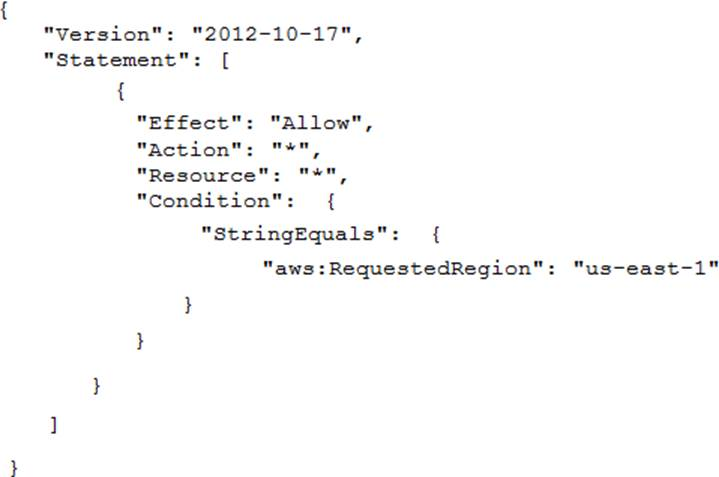

# Practice Exam 4

Click on the **Answer** button for the correct answer and its explanation.

If this practice exam has been helpful to you please share it with others and react to this below.

---

1. A company has thousands of AWS Lambda functions. While reviewing the Lambda functions, a security engineer discovers that sensitive information is being stored in environment variables and is viewable as plaintext in the Lambda console. The values of the sensitive information are only a few characters long. What is the MOST cost-effective way to address this security issue?

    - A) Set up IAM policies from the Lambda console to hide access to the environment variables.
    - B) Use AWS Step Functions to store the environment variables. Access the environment variables at runtime. Use IAM permissions to restrict access to the environment variables to only the Lambda functions that require access.
    - C) Store the environment variables in AWS Secrets Manager, and access them at runtime. Use IAM permissions to restrict access to the secrets to only the Lambda functions that require access.
    - D) Store the environment variables in AWS Systems Manager Parameter Store as secure string parameters, and access them at runtime. Use IAM permissions to restrict access to the parameters to only the Lambda functions that require access.

<b>Answer</b>
 Correct Answer(s): D

2. A company has recently recovered from a security incident that required the restoration of Amazon EC2 instances from snapshots. The company uses an AWS Key Management Service (AWS KMS) customer managed key to encrypt all Amazon Elastic Block Store (Amazon EBS) snapshots. The company performs a gap analysis of its disaster recovery procedures and backup strategies. A security engineer needs to implement a solution so that the company can recover the EC2 instances if the AWS account is compromised and the EBS snapshots are deleted. Which solution will meet this requirement?

    - A) Create a new Amazon S3 bucket. Use EBS lifecycle policies to move EBS snapshots to the new S3 bucket. Use lifecycle policies to move snapshots to the S3 Glacier Instant Retrieval storage class. Use S3 Object Lock to prevent deletion of the snapshots.
    - B) Use AWS Systems Manager to distribute a configuration that backs up all attached disks to Amazon S3.
    - C) Create a new AWS account that has limited privileges. Allow the new account to access the KMS key that encrypts the EBS snapshots. Copy the encrypted snapshots to the new account on a recurring basis.
    - D) Use AWS Backup to copy EBS snapshots to Amazon S3. Use S3 Object Lock to prevent deletion of the snapshots.

<b>Answer</b>
 Correct Answer(s): C

3. A company's security engineer is designing an isolation procedure for Amazon EC2 instances as part of an incident response plan. The security engineer needs to isolate a target instance to block any traffic to and from the target instance, except for traffic from the company's forensics team. Each of the company's EC2 instances has its own dedicated security group. The EC2 instances are deployed in subnets of a VPC. A subnet can contain multiple instances. The security engineer is testing the procedure for EC2 isolation and opens an SSH session to the target instance. The procedure starts to simulate access to the target instance by an attacker. The security engineer removes the existing security group rules and adds security group rules to give the forensics team access to the target instance on port 22. After these changes, the security engineer notices that the SSH connection is still active and usable. When the security engineer runs a ping command to the public IP address of the target instance, the ping command is blocked. What should the security engineer do to isolate the target instance?

    - A) Add an inbound rule to the security group to allow traffic from 0.0.0.0/0 for all ports. Add an outbound rule to the security group to allow traffic to 0.0.0.0/0 for all ports. Then immediately delete these rules.
    - B) Remove the port 22 security group rule. Attach an instance role policy that allows AWS Systems Manager Session Manager connections so that the forensics team can access the target instance.
    - C) Create a network ACL that is associated with the target instance's subnet. Add a rule at the top of the inbound rule set to deny all traffic from 0.0.0.0/0. Add a rule at the top of the outbound rule set to deny all traffic to 0.0.0.0/0.
    - D) Create an AWS Systems Manager document that adds a host-level firewall rule to block all inbound traffic and outbound traffic. Run the document on the target instance.

<b>Answer</b>
 Correct Answer(s): B

4. A company has five AWS accounts and wants to use AWS CloudTrail to log API calls. The log files must be stored in an Amazon S3 bucket that resides in a new account specifically built for centralized services with a unique top-level prefix for each trail. The configuration must also enable detection of any modification to the logs. Which of the following steps will implement these requirements? (Choose THREE)

    - A) Create a new S3 bucket in a separate AWS account for centralized storage of CloudTrail logs, and enable Log File Validation on all trails.
    - B) Use an existing S3 bucket in one of the accounts, apply a bucket policy to the new centralized S3 bucket that permits the CloudTrail service to use the `s3: PutObject` action and the `s3 GetBucketACL` action, and specify the appropriate resource ARNs for the CloudTrail trails.
    - C) Apply a bucket policy to the new centralized S3 bucket that permits the CloudTrail service to use the `s3 PutObject` action and the `s3 GelBucketACL` action, and specify the appropriate resource ARNs for the CloudTrail trails.
    - D) Use unique log file prefixes for trails in each AWS account.
    - E) Configure CloudTrail in the centralized account to log all accounts to the new centralized S3 bucket.
    - F) Enable encryption of the log files by using AWS Key Management Service.

<b>Answer</b>
 Correct Answer(s): A, C, D

5. A security engineer is checking an AWS CloudFormation template for vulnerabilities. The security engineer finds a parameter that has a default value that exposes an application's API key in plaintext. The parameter is referenced several times throughout the template. The security engineer must replace the parameter while maintaining the ability to reference the value in the template. Which solution will meet these requirements in the MOST secure way?

    - A) Store the API key value as a SecureString parameter in AWS Systems Manager Parameter Store. In the template, replace all references to the value with `{{resolve:ssm:MySSMParameterName:1}}`.
    - B) Store the API key value in AWS Secrets Manager. In the template, replace all references to the value with `{{resolve:secretsmanager:MySecretId:SecretString}}`.
    - C) Store the API key value in Amazon DynamoDB. In the template, replace all references to the value with `{{resolve:dynamodb:MyTableName:MyPrimaryKey}}`.
    - D) Store the API key value in a new Amazon S3 bucket. In the template, replace all references to the value with `{{resolve:s3:MyBucketName:MyObjectName}}`.

<b>Answer</b>
 Correct Answer(s): B

6. A company has several petabytes of data. The company must preserve this data for 7 years to comply with regulatory requirements. The company's compliance team asks a security officer to develop a strategy that will prevent anyone from changing or deleting the data. Which solution will meet this requirement MOST cost-effectively?

    - A) Create an Amazon S3 bucket. Configure the bucket to use S3 Object Lock in compliance mode. Upload the data to the bucket. Create a resource-based bucket policy that meets all the regulatory requirements.
    - B) Create an Amazon S3 bucket. Configure the bucket to use S3 Object Lock in governance mode. Upload the data to the bucket. Create a user-based IAM policy that meets all the regulatory requirements.
    - C) Create a vault in Amazon S3 Glacier. Create a Vault Lock policy in S3 Glacier that meets all the regulatory requirements. Upload the data to the vault.
    - D) Create an Amazon S3 bucket. Upload the data to the bucket. Use a lifecycle rule to transition the data to a vault in S3 Glacier. Create a Vault Lock policy that meets all the regulatory requirements.

<b>Answer</b>
 Correct Answer(s): C

7. A company has several workloads running on AWS. Employees are required to authenticate using on-premises ADFS and SSO to access the AWS Management Console. Developers migrated an existing legacy web application to an Amazon EC2 instance. Employees need to access this application from anywhere on the internet, but currently, there is no authentication system built into the application. How should the security engineer implement employee-only access to this system without changing the application?

    - A) Place the application behind an Application Load Balancer (ALB). Use Amazon Cognito as authentication for the ALB. Define a SAML-based Amazon Cognito user pool and connect it to ADFS.
    - B) Implement AWS IAM Identity Center (AWS Single Sign-On) in the management account and link it to ADFS as an identity provider. Define the EC2 instance as a managed resource, then apply an IAM policy on the resource.
    - C) Define an Amazon Cognito identity pool, then install the connector on the Active Directory server. Use the Amazon Cognito SDK on the application instance to authenticate the employees using their Active Directory user names and passwords.
    - D) Create an AWS Lambda custom authorizer as the authenticator for a reverse proxy on Amazon EC2. Ensure the security group on Amazon EC2 only allows access from the Lambda function.

<b>Answer</b>
 Correct Answer(s): A

8. A company is using AWS to run a long-running analysis process on data that is stored in Amazon S3 buckets. The process runs on a fleet of Amazon EC2 instances that are in an Auto Scaling group. The EC2 instances are deployed in a private subnet of a VPC that does not have internet access. The EC2 instances and the S3 buckets are in the same AWS account. The EC2 instances access the S3 buckets through an S3 gateway endpoint that has the default access policy. Each EC2 instance is associated with an instance profile role that has a policy that explicitly allows the `s3:GetObject` action and the `s3:PutObject` action for only the required S3 buckets. The company learns that one or more of the EC2 instances are compromised and are exfiltrating data to an S3 bucket that is outside the company's organization in AWS Organizations. A security engineer must implement a solution to stop this exfiltration of data and to keep the EC2 processing job functional. Which solution will meet these requirements?

    - A) Update the policy on the S3 gateway endpoint to allow the S3 actions only if the values of the `aws:ResourceOrgID` and `aws:PrincipalOrgID` condition keys match the company's values.
    - B) Update the policy on the instance profile role to allow the S3 actions only if the value of the `aws:ResourceOrgID` condition key matches the company's value.
    - C) Add a network ACL rule to the subnet of the EC2 instances to block outgoing connections on port 443.
    - D) Apply an SCP on the AWS account to allow the S3 actions only if the values of the `aws:ResourceOrgID` and `aws:PrincipalOrgID` condition keys match the company's values.

<b>Answer</b>
 Correct Answer(s): D

9. A company that operates in a hybrid cloud environment must meet strict compliance requirements. The company wants to create a report that includes evidence from on-premises workloads alongside evidence from AWS resources. A security engineer must implement a solution to collect, review, and manage the evidence to demonstrate compliance with company policy. Which solution will meet these requirements?

    - A) Create an assessment in AWS Audit Manager from a prebuilt framework or a custom framework. Upload manual evidence from the on-premises workloads. Add the evidence to the assessment. Generate an assessment report after Audit Manager collects the necessary evidence from the AWS resources.
    - B) Install the Amazon CloudWatch agent on the on-premises workloads. Use AWS Config to deploy a conformance pack from a sample conformance pack template or a custom YAML template. Generate an assessment report after AWS Config identifies noncompliant workloads and resources.
    - C) Set up the appropriate security standard in AWS Security Hub. Upload manual evidence from the on-premises workloads. Wait for Security Hub to collect the evidence from the AWS resources. Download the list of controls as a .csv file.
    - D) Install the Amazon CloudWatch agent on the on-premises workloads. Create a CloudWatch dashboard to monitor the on-premises workloads and the AWS resources. Run a query on the workloads and resources. Download the results.

<b>Answer</b>
 Correct Answer(s): A

10. A company's security team has defined a set of AWS Config rules that must be enforced globally in all AWS accounts the company owns. What should be done to provide a consolidated compliance overview for the security team?

    - A) Use AWS Organizations to limit AWS Config rules to the appropriate Regions, and then consolidate the Amazon CloudWatch dashboard into one AWS account.
    - B) Use AWS Config aggregation to consolidate the views into one AWS account, and provide role access to the security team.
    - C) Consolidate AWS Config rule results with an AWS Lambda function and push data to Amazon SQS. Use Amazon SNS to consolidate and alert when some metrics are triggered.
    - D) Use Amazon GuardDuty to load data results from the AWS Config rules compliance status, aggregate GuardDuty findings of all AWS accounts into one AWS account, and provide role access to the security team.

<b>Answer</b>
 Correct Answer(s): B

11. A security engineer is designing an incident response plan to address the risk of a compromised Amazon EC2 instance. The plan must recommend a solution to meet the following requirements: A trusted forensic environment must be provisioned. Automated response processes must be orchestrated. Which AWS services should be included in the plan? (Select TWO)

    - A) AWS CloudFormation.
    - B) Amazon GuardDuty.
    - C) Amazon Inspector.
    - D) Amazon Macie.
    - E) AWS Step Functions.

<b>Answer</b>
 Correct Answer(s): A, E

12. A security engineer has been tasked with implementing a solution that allows the company's development team to have interactive command line access to Amazon EC2 Linux instances using the AWS Management Console. Which steps should the security engineer take to satisfy this requirement while maintaining least privilege?

    - A) Enable AWS Systems Manager in the AWS Management Console and configure for access to EC2 instances using the default AmazonEC2RoleforSSM role. Install the Systems Manager Agent on all EC2 Linux instances that need interactive access. Configure IAM user policies to allow development team access to the Systems Manager Session Manager and attach to the team's IAM users.
    - B) Enable console SSH access in the EC2 console. Configure IAM user policies to allow development team access to the AWS Systems Manager Session Manager and attach to the development team's IAM users.
    - C) Enable AWS Systems Manager in the AWS Management Console and configure to access EC2 instances using the default AmazonEC2RoleforSSM role. Install the Systems Manager Agent on all EC2 Linux instances that need interactive access. Configure a security group that allows SSH port 22 from all published IP addresses. Configure IAM user policies to allow development team access to the AWS Systems Manager Session Manager and attach to the team's IAM users.
    - D) Enable AWS Systems Manager in the AWS Management Console and configure to access EC2 instances using the default AmazonEC2RoleforSSM role Install the Systems Manager Agent on all EC2 Linux instances that need interactive access. Configure IAM policies to allow development team access to the EC2 console and attach to the teams IAM users.

<b>Answer</b>
 Correct Answer(s): A

13. A large government organization is moving to the cloud and has specific encryption requirements. The first workload to move requires that a customer's data be immediately destroyed when the customer makes that request. Management has asked the security team to provide a solution that will securely store the data, allow only authorized applications to perform encryption and decryption and allow for immediate destruction of the data. Which solution will meet these requirements?

    - A) Use AWS Secrets Manager and an AWS SDK to create a unique secret for the customer-specific data.
    - B) Use AWS Key Management Service (AWS KMS) and the AWS Encryption SDK to
generate and store a data encryption key for each customer.
    - C) Use AWS Key Management Service (AWS KMS) with service-managed keys to generate and store customer-specific data encryption keys.
    - D) Use AWS Key Management Service (AWS KMS) and create an AWS CloudHSM custom key store Use CloudHSM to generate and store a new CMK for each customer.

<b>Answer</b>
 Correct Answer(s): D

14. Unapproved changes were previously made to a company's Amazon S3 bucket. A security engineer configured AWS Config to record configuration changes made to the company's S3 buckets. The engineer discovers there are S3 configuration changes being made, but no Amazon SNS notifications are being sent. The engineer has already checked the configuration of the SNS topic and has confirmed the configuration is valid. Which combination of steps should the security engineer take to resolve the issue? (Select TWO)

    - A) Configure the S3 bucket ACLs to allow AWS Config to record changes to the buckets.
    - B) Configure policies attached to S3 buckets to allow AWS Config to record changes to the buckets.
    - C) Attach the AmazonS3ReadOnryAccess managed policy to the IAM user.
    - D) Verify the security engineer's IAM user has an attached policy that allows all AWS Config actions.
    - E) Assign the AWSConfigRole managed policy to the AWS Config role.

<b>Answer</b>
 Correct Answer(s): B, E

15. A company is operating an open-source software platform that is internet facing. The legacy software platform no longer receives security updates. The software platform operates using Amazon route 53 weighted load balancing to send traffic to two Amazon EC2 instances that connect to an Amazon POS cluster a recent report suggests this software platform is vulnerable to SQL injection attacks. with samples of attacks provided. The company's security engineer must secure this system against SQL injection attacks within 24 hours. The secure, engineer's solution involve the least amount of effort and maintain normal operations during implementation. What should the security engineer do to meet these requirements?

    - A) Create an Application Load Balancer with the existing EC2 instances as a target group Create an AWS WAF web ACL containing rules mat protect the application from this attach. then apply it to the ALB Test to ensure me vulnerability has been mitigated, then redirect thee Route 53 records to point to the ALB Update security groups on the EC 2 instances to prevent direct access from the internet.
    - B) Create an Amazon CloudFront distribution specifying one EC2 instance as an origin Create an AWS WAF web ACL containing rules that protect the application from this attack, then apply it to me distribution Test to ensure the vulnerability has mitigated, then redirect the Route 53 records to point to CloudFront.
    - C) Obtain me latest source code for the platform and make ire necessary updates Test me updated code to ensure that the vulnerability has been irrigated, then deploy me patched version of the platform to the EC2 instances.
    - D) Update the security group mat is attached to the EC2 instances, removing access from the internet to the TCP port used by the SQL database Create an AWS WAF web ACL containing rules mat protect me application from this attack, men apply it to the EC2 instances Test to ensure me vulnerability has been mitigated. then restore the security group to me onginal setting.

<b>Answer</b>
 Correct Answer(s): A

16. A security engineer has noticed that VPC Flow Logs are getting a lot REJECT traffic originating from a single Amazon EC2 instance in an Auto Scaling group. The security engineer is concerned that this EC2 instance may be compromised. What immediate action should the security engineer take?

    - A) Remove the instance from the Auto Seating group Close me security group mm ingress only from a single forensic P address to perform an analysis.
    - B) Remove the instance from the Auto Seating group Change me network ACL rules to allow traffic only from a single forensic IP address to perform en analysis Add a rule to deny all other traffic.
    - C) Remove the instance from the Auto Scaling group Enable Amazon GuardDuty in that AWS account Install the Amazon Inspector agent cm the suspicious EC 2 instance to perform a scan.
    - D) Take a snapshot of the suspicious EC2 instance. Create a new EC2 instance from me snapshot in a closed security group with ingress only from a single forensic IP address to perform an analysis.

<b>Answer</b>
 Correct Answer(s): A

17. A company is collecting AWS CloudTrail log data from multiple AWS accounts by managing individual trails in each account and forwarding log data to a centralized Amazon S3 bucket residing in a log archive account. After CloudTrail introduced support for AWS Organizations trails, the company decided to further centralize management and automate deployment of the CloudTrail logging capability across all of its AWS accounts. The company's security engineer created an AWS Organizations trail in the master account, enabled server-side encryption with AWS KMS managed keys (SSE-KMS) for the log files, and specified the same bucket as the storage location. However, the engineer noticed that logs recorded by the new trail were not delivered to the bucket. Which factors could cause this issue? (Select TWO)

    - A) The CMK key policy does not allow CloudTrail to make encrypt and decrypt API calls against the key.
    - B) The CMK key policy does not allow CloudTrail to make GenerateDataKey API calls against the key.
    - C) The IAM role used by the CloudTrail trail does not have permissions to make PutObject API calls against a folder created for the Organizations trail.
    - D) The S3 bucket policy does not allow CloudTrail to make PutObject API calls against a folder created for the Organizations trail.
    - E) The CMK key policy does not allow the IAM role used by the CloudTrail trail to use the key for crypto graphicaI operations.

<b>Answer</b>
 Correct Answer(s): B, D

18. A company has implemented centralized logging and monitoring of AWS CloudTrail logs from all Regions in an Amazon S3 bucket. The log Hies are encrypted using AWS KMS. A Security Engineer is attempting to review the log files using a third-party tool hosted on an Amazon EC2 instance. The Security Engineer is unable to access the logs in the S3 bucket and receives an access denied error message. What should the Security Engineer do to fix this issue?

    - A) Check that the role the Security Engineer uses grants permission to decrypt objects using the KMS CMK.
    - B) Check that the role the Security Engineer uses grants permission to decrypt objects using the KMS CMK and gives access to the S3 bucket and objects.
    - C) Check that the role the EC2 instance profile uses grants permission to decrypt objects using the KMS CMK and gives access to the S3 bucket and objects.
    - D) Check that the role the EC2 instance profile uses grants permission to decrypt objects using the KMS CMK.

<b>Answer</b>
 Correct Answer(s): C

19. A company has a VPC with several Amazon EC2 instances behind a NAT gateway. The company's security policy states that all network traffic must be logged and must include the original source and destination IP addresses. The existing VPC Flow Logs do not include this information. A security engineer needs to recommend a solution. Which combination of steps should the security engineer recommend? (Select TWO)

    - A) Edit the existing VPC Flow Logs. Change the log format of the VPC Flow Logs from the Amazon default format to a custom format.
    - B) Delete and recreate the existing VPC Flow Logs. Change the log format of the VPC Flow Logs from the Amazon default format to a custom format.
    - C) Change the destination to Amazon CloudWatch Logs.
    - D) Include the pkt-srcaddr and pkt-dstaddr fields in the log format.
    - E) Include the subnet-id and instance-id fields in the log format.

<b>Answer</b>
 Correct Answer(s): B, D

20. A company recently performed an annual security assessment of its AWS environment. The assessment showed that audit logs are not available beyond 90 days and that unauthorized changes to IAM policies are made without detection. How should a security engineer resolve these issues?

    - A) Create an Amazon S3 lifecycle policy that archives AWS CloudTrail trail logs to Amazon S3 Glacier after 90 days. Configure Amazon Inspector to provide a notification when a policy change is made to resources.
    - B) Configure AWS Artifact to archive AWS CloudTrail logs Configure AWS Trusted Advisor to provide a notification when a policy change is made to resources.
    - C) Configure Amazon CloudWatch to export log groups to Amazon S3. Configure AWS CloudTrail to provide a notification when a policy change is made to resources.
    - D) Create an AWS CloudTrail trail that stores audit logs in Amazon S3. Configure an AWS Config rule to provide a notif cation when a policy change is made to resources.

<b>Answer</b>
 Correct Answer(s): D

21. A company has several critical applications running on a large fleet of Amazon EC2 instances. As part of a security operations review, the company needs to apply a critical operating system patch to EC2 instances within 24 hours of the patch becoming available from the operating system vendor. The company does not have a patching solution deployed on AWS, but does have AWS Systems Manager configured. The solution must also minimize administrative overhead. What should a security engineer recommend to meet these requirements?

    - A) Create an AWS Config rule defining the patch as a required configuration for EC2 instances.
    - B) Use the AWS Systems Manager Run Command to patch affected instances.
    - C) Use an AWS Systems Manager Patch Manager predefined baseline to patch affected instances.
    - D) Use AWS Systems Manager Session Manager to log in to each affected instance and apply the patch.

<b>Answer</b>
 Correct Answer(s): C

22. A security engineer is asked to update an AW3 CoudTrail log file prefix for an existing trail. When attempting to save the change in the CloudTrail console, the security engineer receives the following error message. `There is a problem with the bucket policy.`. What will enable the security engineer to saw the change?

    - A) Create a new trail with the updated log file prefix, and then delete the original nail Update the existing bucket policy in the Amazon S3 console with the new log the prefix, and then update the log file prefix in the CloudTrail console.
    - B) Update the existing bucket policy in the Amazon S3 console to allow the security engineers principal to perform PutBucketPolicy, and then update the log file prefix in the CloudTrail console.
    - C) Update the existing bucket policy in the Amazon S3 console with the new log file prefix, and then update the log file prefix in the CloudTrail console.
    - D) Update the existing bucket policy in the Amazon S3 console to allow the security engineers principal to perform GetBucketPolicy, and then update the log file prefix in the CloudTrail console.

<b>Answer</b>
 Correct Answer(s): C

23. The rule set in the virtual appliance is correct. Which of the following are other valid items to troubleshoot in this scenario? (Choose TWO)

    - A) Verify that the 0.0.0.0/0 route in the route table for the Web server subnet points to a NAT gateway.
    - B) Verify which Security Group is applied to the particular web server's elastic network interface (ENI).
    - C) Verify that the 0.0.0.0/0 route in the route table for the Web server subnet points to the virtual security appliance.
    - D) Verify the registered targets in the ALB.
    - E) Verify that the 0.0.0.0/0 route in the public subnet points to a NAT gateway.

<b>Answer</b>
 Correct Answer(s): B, D

24. A Web Administrator for the website example.com has created an Amazon CloudFront distribution for dev.example.com, with a requirement to configure HTTPS using a custom TLS certificate imported to AWS Certificate Manager. Which combination of steps is required to ensure availability of the certificate in the CloudFront console? (Choose TWO)

    - A) Call UploadServerCertificate with /cloudfront/dev/ in the path parameter.
    - B) Import the certificate with a 4,096-bit RSA public key.
    - C) Ensure that the certificate, private key, and certificate chain are PKCS #12-encoded.
    - D) Import the certificate in the `us-east-1` (N. Virginia) Region.
    - E) Ensure that the certificate, private key, and certificate chain are PEM-encoded.

<b>Answer</b>
 Correct Answer(s): D, E

25. A company's Security Engineer has been asked to monitor and report all AWS account root user activities. Which of the following would enable the Security Engineer to monitor and report all root user activities? (Select TWO)

    - A) Configuring AWS Organizations to monitor root user API calls on the paying account.
    - B) Creating an Amazon CloudWatch Events rule that will trigger when any API call from the root user is reported.
    - C) Configuring Amazon Inspector to scan the AWS account for any root user activity.
    - D) Configuring AWS Trusted Advisor to send an email to the Security team when the root user logs in to the console.
    - E) Using Amazon SNS to notify the target group.

<b>Answer</b>
 Correct Answer(s): B, E

26. A company is building a data lake on Amazon S3. The data consists of millions of small files containing sensitive information. The security team has the following requirements for the architecture: Data must be encrypted in transit. Data must be encrypted at rest. The bucket must be private, but if the bucket is accidentally made public, the data must remain confidential. Which combination of steps would meet the requirements? (Select THREE)

    - A) Enable AES-256 encryption using server-side encryption with Amazon S3-managed encryption keys (SSE-S3) on the S3 bucket.
    - B) Enable default encryption with server-side encryption with AWS KMS-managed keys (SSE-KMS) on the S3 bucket.
    - C) Add a bucket policy that includes a deny if a PutObject request does not include `aws:SecureTransport`.
    - D) Add a bucket policy with `aws:SourceIp` to Allow uploads and downloads from the corporate intranet only.
    - E) Add a bucket policy that includes a deny if a PutObject request does not include `s3:x-amz-server-side-encryption: "aws: kms"`.
    - F) Enable Amazon Macie to monitor and act on changes to the data lake's S3 bucket.

<b>Answer</b>
 Correct Answer(s): B, C, E

27. A recent security audit identified that a company's application team injects database credentials into the environment variables of an AWS Fargate task. The company's security policy mandates that all sensitive data be encrypted at rest and in transit. When combination of actions should the security team take to make the application compliant within the security policy? (Select THREE)

    - A) Store the credentials securely in a file in an Amazon S3 bucket with restricted access to the application team IAM role Ask the application team to read the credentials from the S3 object instead.
    - B) Create an AWS Secrets Manager secret and specify the key/value pairs to be stored in this secret.
    - C) Modify the application to pull credentials from the AWS Secrets Manager secret instead of the environment variables.
    - D) Add the following statement to the container instance IAM role policy.
    - E) Add the following statement to the execution role policy.
    - F) Log in to the AWS Fargate instance, create a script to read the secret value from AWS Secret Manager, and inject the environment variables. Ask the application team to redeploy the application.

<b>Answer</b>
 Correct Answer(s): B, C, E

28. A company is designing the securely architecture for a global latency-sensitive. Web application it plans to deploy to AWS. A Security Engineer needs to configure a highly available and secure two-tier architecture. The security design must include controls to prevent common attacks such as DDoS, cross-site scripting, and SQL injection. Which solution meets these requirements?

    - A) Create an Application Load Balancer (ALB) that uses public subnets across multiple Availability Zones within a single Region. Point the ALB to an Auto Scaling group with Amazon EC2 instances in private subnets across multiple Availability Zones within the same Region. Create an Amazon CloudFront distribution that uses the ALB as its origin. Create appropriate AWS WAF ACLs and enable them on the CloudFront distribution.
    - B) Create an Application Load Balancer (ALB) that uses private subnets across multiple Availability Zones within a single Region. Point the ALB to an Auto Scaling group with Amazon EC2 instances in private subnets across multiple Availability Zones within the same Region. Create an Amazon CloudFront distribution that uses the ALB as its origin. Create appropriate AWS WAF ACLs and enable them on the CloudFront distribution.
    - C) Create an Application Load Balancer (ALB) that uses public subnets across multiple Availability Zones within a single Region. Point the ALB to an Auto Scaling group with Amazon EC2 instances in private subnets across multiple Availability Zones within the same Region. Create appropriate AWS WAF ACLs and enable them on the ALB.
    - D) Create an Application Load Balancer (ALB) that uses private subnets across multiple Availability Zones within a single Region. Point the ALB to an Auto Scaling group with Amazon EC2 instances in private subnets across multiple Availability Zones within the same Region. Create appropriate AWS WAF ACLs and enable them on the ALB.

<b>Answer</b>
 Correct Answer(s): A

29. A company is running an application on Amazon EC2 instances in an Auto Scaling group. The application stores logs locally. A security engineer noticed that logs were lost after a scale-in event. The security engineer needs to recommend a solution to ensure the durability and availability of log data All logs must be kept for a minimum of 1 year for auditing purposes. What should the security engineer recommend?

    - A) Within the Auto Scaling lifecycle, add a hook to create and attach an Amazon Elastic Block Store (Amazon EBS) log volume each time an EC2 instance is created. When the instance is terminated, the EBS volume can be reattached to another instance for log review.
    - B) Create an Amazon Elastic File System (Amazon EFS) file system and add a command in the user data section of the Auto Scaling launch template to mount the EFS file system during EC2 instance creation Configure a process on the instance to copy the logs once a day from an instance Amazon Elastic Block Store (Amazon EBS) volume to a directory in the EFS file system.
    - C) Build the Amazon CloudWatch agent into the AMI used in the Auto Scaling group. Configure the CloudWatch agent to send the logs to Amazon CloudWatch Logs for review.
    - D) Within the Auto Scaling lifecycle, add a lifecycle hook at the terminating state transition and alert the engineering team by using a lifecycle notification to Amazon Simple Notification Service (Amazon SNS). Configure the hook to remain in the Terminating. Wait state for 1 hour to allow manual review of the security logs prior to instance termination.

<b>Answer</b>
 Correct Answer(s): C

30. A company has multiple production AWS accounts. Each account has AWS CloudTrail configured to log to a single Amazon S3 bucket in a central account. Two of the production accounts have trails that are not logging anything to the S3 bucket. Which steps should be taken to troubleshoot the issue? (Choose THREE)

    - A) Verify that the log file prefix is set to the name of the S3 bucket where the logs should go.
    - B) Verify that the S3 bucket policy allows access for CloudTrail from the production AWS account IDs.
    - C) Create a new CloudTrail configuration in the account, and configure it to log to the account's S3 bucket.
    - D) Confirm in the CloudTrail Console that each trail is active and healthy.
    - E) Open the global CloudTrail configuration in the master account, and verify that the storage location is set to the correct S3 bucket.
    - F) Confirm in the CloudTrail Console that the S3 bucket name is set correctly.

<b>Answer</b>
 Correct Answer(s): B, D, F

31. A company has a website with an Amazon CloudFront HTTPS distribution, an Application Load Balancer (ALB) with multiple Web instances for dynamic website content, and an Amazon S3 bucket for static website content. The company's security engineer recently updated the website security requirements: HTTPS needs to be enforced for all data in transit with specific ciphers. The CloudFront distribution needs to be accessible from the internet only. Which solution will meet these requirements?

    - A) Set up an S3 bucket policy with the awssecuretransport key Configure the CloudFront origin access identity (OAI) with the S3 bucket Configure CloudFront to use specific ciphers. Enforce the ALB with an HTTPS listener only and select the appropriate security policy for the ciphers Link the ALB with AWS WAF to allow access from the CloudFront IP ranges.
    - B) Set up an S3 bucket policy with the `aws:securetransport` key. Configure the CloudFront origin access identity (OAI) with the S3 bucket. Enforce the ALB with an HTTPS listener only and select the appropriate security policy for the ciphers.
    - C) Modify the CloudFront distribution to use AWS WAF. Force HTTPS on the S3 bucket with specific ciphers in the bucket policy. Configure an HTTPS listener only for the ALB. Set up a security group to limit access to the ALB from the CloudFront IP ranges.
    - D) Modify the CloudFront distribution to use the ALB as the origin. Enforce an HTTPS listener on the ALB. Create a path-based routing rule on the ALB with proxies that connect to Amazon S3. Create a bucket policy to allow access from these proxies only.

<b>Answer</b>
 Correct Answer(s): B

32. A company is trying to replace its on-premises bastion hosts used to access on-premises Linux servers with AWS Systems Manager Session Manager. A security engineer has installed the Systems Manager Agent on all servers. The security engineer verifies that the agent is running on all the servers, but Session Manager cannot connect to them. The security engineer needs to perform verification steps before Session Manager will work on the servers. Which combination of steps should the security engineer perform? (Select THREE)

    - A) Open inbound port 22 to 0 0.0.0/0 on all Linux servers.
    - B) Open inbound port 22 to 0 0.0.0/0 on all Linux servers.
    - C) Create a managed-instance activation for the on-premises servers.
    - D) Reconfigure the Systems Manager Agent with the activation code and ID.
    - E) Assign an IAM role to all of the on-premises servers.
    - F) Initiate an inventory collection with Systems Manager on the on-premises servers.

<b>Answer</b>
 Correct Answer(s): C, D, E

33. A company has recently recovered from a security incident that required the restoration of Amazon EC2 instances from snapshots. After performing a gap analysis of its disaster recovery procedures and backup strategies, the company is concerned that, next time, it will not be able to recover the EC2 instances if the AWS account was compromised and Amazon EBS snapshots were deleted. All EBS snapshots are encrypted using an AWS KMS CMK. Which solution would solve this problem?

    - A) Create a new Amazon S3 bucket Use EBS lifecycle policies to move EBS snapshots to the new S3 bucket. Move snapshots to Amazon S3 Glacier using lifecycle policies, and apply Glacier Vault Lock policies to prevent deletion
    - B) Use AWS Systems Manager to distribute a configuration that performs local backups of all attached disks to Amazon S3.
    - C) Create a new AWS account with limited privileges. Allow the new account to access the AWS KMS key used to encrypt the EBS snapshots, and copy the encrypted snapshots to the new account on a recuning basis.
    - D) Use AWS Backup to copy EBS snapshots to Amazon S3.

<b>Answer</b>
 Correct Answer(s): C

34. A Security Engineer manages AWS Organizations for a company. The Engineer would like to restrict AWS usage to allow Amazon S3 only in one of the organizational units (OUs). The Engineer adds the following SCP to the OU:

    - A) Move the account to a new OU and deny IAM:* permissions.
    - B) Add a Deny policy for all non-S3 services at the account level.
    - C) Change the policy to:

    - D) Detach the default FullAWSAccess SCP.

<b>Answer</b>
 Correct Answer(s): D

35. A company has a serverless application for internal users deployed on AWS. The application uses AWS Lambda for the front end and for business logic. The Lambda function accesses an Amazon RDS database inside a VPC. The company uses AWS Systems Manager Parameter Store for storing database credentials. A recent security review highlighted the following issues. The Lambda function has internet access. The relational database is publicly accessible. The database credentials are not stored in an encrypted state. Which combination of steps should the company take to resolve these security issues? (Select THREE)

    - A) Disable public access to the RDS database inside the VPC.
    - B) Move all the Lambda functions inside the VPC.
    - C) Edit the IAM role used by Lambda to restrict internet access.
    - D) Create a VPC endpoint for Systems Manager. Store the credentials as a string parameter. Change the parameter type to an advanced parameter.
    - E) Edit the IAM role used by RDS to restrict internet access.
    - F) Create a VPC endpoint for Systems Manager. Store the credentials as a Secure String parameter.

<b>Answer</b>
 Correct Answer(s): A, B, F

36. A company has decided to migrate sensitive documents from on-premises data centers to Amazon S3. Currently, the hard drives are encrypted to meet a compliance requirement regarding data encryption. The CISO wants to improve security by encrypting each file using a different key instead of a single key. Using a different key would limit the security impact of a single exposed key. Which of the following requires the LEAST amount of configuration when implementing this approach?

    - A) Place each file into a different S3 bucket. Set the default encryption of each bucket to use a different AWS KMS customer managed key.
    - B) Put all the files in the same S3 bucket. Using S3 events as a trigger, write an AWS Lambda function to encrypt each file as it is added using different AWS KMS data keys.
    - C) Use the S3 encryption client to encrypt each file individually using S3-generated data keys.
    - D) Place all the files in the same S3 bucket. Use server-side encryption with AWS KMS-managed keys (SSE-KMS) to encrypt the data.

<b>Answer</b>
 Correct Answer(s): D

37. A company hosts a web-based application that captures and stores sensitive data in an Amazon DynamoDB table. A security audit reveals that the application does not provide end-to-end data protection or the ability to detect unauthorized data changes. The software engineering team needs to make changes that will address the audit findings. Which set of steps should the software engineering team take?

    - A) Use an AWS Key Management Service (AWS KMS) CMK. Encrypt the data at rest.
    - B) Use AWS Certificate Manager (ACM) Private Certificate Authority Encrypt the data in transit.
    - C) Use a DynamoDB encryption client. Use client-side encryption and sign the table items.
    - D) Use the AWS Encryption SDK. Use client-side encryption and sign the table items.

<b>Answer</b>
 Correct Answer(s): C

38. A company has a compliance requirement to rotate its encryption keys on an annual basis. A Security Engineer needs a process to rotate the KMS Customer Master Keys (CMKs) that were created using imported key material. How can the Engineer perform the key rotation process MOST efficiently?

    - A) Create a new CMK, and redirect the existing Key Alias to the new CMK.
    - B) Select the option to auto-rotate the key.
    - C) Upload new key material into the existing CMK.
    - D) Create a new CMK, and change the application to point to the new CMK.

<b>Answer</b>
 Correct Answer(s): A

39. A company's Developers plan to migrate their on-premises applications to Amazon EC2 instances running Amazon Linux AMIs. The applications are accessed by a group of partner companies. The Security Engineer needs to implement the following host-based security measures for these instances: Block traffic from documented known bad IP addresses. Detect known software vulnerabilities and CIS Benchmarks compliance. Which solution addresses these requirements?

    - A) Launch the EC2 instances with an IAM role attached. Include a user data script that uses the AWS CLI to retrieve the list of bad IP addresses from AWS Secrets Manager and uploads it as a threat list in Amazon GuardDuty. Use Amazon Inspector to scan the instances for known software vulnerabilities and CIS Benchmarks compliance
    - B) Launch the EC2 instances with an IAM role attached. Include a user data script that uses the AWS CLl to create NACLs blocking ingress traffic from the known bad IP addresses in the EC2 instance's subnets. Use AWS Systems Manager to scan the instances for known software vulnerabilities, and AWS Trusted Advisor to check instances for CIS Benchmarks compliance
    - C) Launch the EC2 instances with an IAM role attached. Include a user data script that uses the AWS CLl to create and attach security groups that only allow an allow listed source IP address range inbound. Use Amazon Inspector to scan the instances for known software vulnerabilities, and AWS Trusted Advisor to check instances for CIS Benchmarks compliance
    - D) Launch the EC2 instances with an IAM role attached. Include a user data script that creates a cron job to periodically retrieve the list of bad IP addresses from Amazon S3, and configures iptabies on the instances blocking the list of bad IP addresses. Use Amazon inspector to scan the instances for known software vulnerabilities and CIS Benchmarks compliance.

<b>Answer</b>
 Correct Answer(s): D

40. A Security Engineer noticed an anomaly within a company EC2 instance as shown in the image The Engineer must now investigate. What is causing the anomaly. What are the MOST effective steps to take to ensure that the instance is not further manipulated while allowing the Engineer to understand what happened?

    - A) Remove the instance from the Auto Scaling group Place the instance within an isolation security group, detach the EBS volume launch an EC2 instance with a forensic toolkit and attach the E8S volume to investigate.
    - B) Remove the instance from the Auto Scaling group and the Elastic Load Balancer Place the instance within an isolation security group, launch an EC2 instance with a forensic toolkit, and allow the forensic toolkit image to connect to the suspicious Instance to perform the Investigation.
    - C) Remove the instance from the Auto Scaling group Place the Instance within an isolation security group, launch an EC2 Instance with a forensic toolkit and use the forensic toolkit imago to deploy an ENI as a network span port to inspect all traffic coming from the suspicious instance.
    - D) Remove the instance from the Auto Scaling group and the Elastic Load Balancer Place the instance within an isolation security group, make a copy of the EBS volume from a new snapshot, launch an EC2 Instance with a forensic toolkit and attach the copy of the EBS volume to investigate.

<b>Answer</b>
 Correct Answer(s): D

41. A security engineer needs to configure monitoring and auditing for AWS Lambda. Which combination of actions using AWS services should the security engineer take to accomplish this goal? (Select TWO)

    - A) Use AWS Config to track configuration changes to Lambda functions, runtime environments, tags, handler names, code sizes, memory allocation, timeout settings, and concurrency settings, along with Lambda IAM execution role, subnet, and security group associations.
    - B) Use AWS CloudTrail to implement governance, compliance, operational, and risk auditing for Lambda.
    - C) Use Amazon Inspector to automatically monitor for vulnerabilities and perform governance, compliance, operational, and risk auditing for Lambda.
    - D) Use AWS Resource Access Manager to track configuration changes to Lambda functions, runtime environments, tags, handler names, code sizes, memory allocation, timeout settings, and concurrency settings, along with Lambda IAM execution role, subnet, and security group associations.
    - E) Use Amazon Macie to discover, classify, and protect sensitive data being executed inside the Lambda function.

<b>Answer</b>
 Correct Answer(s): A, B

42. A company has an AWS account and allows a third-party contractor who uses another AWS account, to assume certain IAM roles. The company wants to ensure that IAM roles can be assumed by the contractor only if the contractor has multi-factor authentication enabled on their IAM user accounts. What should the company do to accomplish this?

    - A) Add the following condition to the IAM policy attached to all IAM roles: `"Effect": "Deny", "Condition" : { "BoolItExists" : { "aws:MultiFactorAuthPresent" : false } }`.
    - B) Add the following condition to the IAM policy attached to all IAM roles: `"Effect": "Deny", "Condition" : { "Bool" : { "aws:MultiFactorAuthPresent" : false } }`.
    - C) Add the following condition to the IAM policy attached to all IAM roles: `"Effect": "Allow", "Condition" : { "Null" : { "aws:MultiFactorAuthPresent" : false } }`.
    - D) Add the following condition to the IAM policy attached to all IAM roles: `"Effect": "Allow", "Condition" : { "BoolItExists" : { "aws:MultiFactorAuthPresent" : false } }`.

<b>Answer</b>
 Correct Answer(s): A

43. A company uses Microsoft Active Directory for access management for on-premises resources and wants to use the same mechanism for accessing its AWS accounts. Additionally, the development team plans to launch a public-facing application for which they need a separate authentication solution. When coma nation of the following would satisfy these requirements? (Select TWO)

    - A) Set up domain controllers on Amazon EC2 to extend the on-premises directory to AWS
    - B) Establish network connectivity between on-premises and the user's VPC
    - C) Use Amazon Cognito user pools for application authentication
    - D) Use AD Connector for application authentication.
    - E) Set up federated sign-in to AWS through ADFS and SAML.

<b>Answer</b>
 Correct Answer(s): C, E

44. A company wants to encrypt data locally while meeting regulatory requirements related to key exhaustion. The encryption key can be no more than 10 days old or encrypt more than 2^16 objects Any encryption key must be generated on a FlPS-validated hardware security module (HSM). The company is cost-conscious, as plans to upload an average of 100 objects to Amazon S3 each second for sustained operations across 5 data producers. When approach MOST efficiently meets the company's needs?

    - A) Use the AWS Encryption SDK and set the maximum age to 10 days and the minimum number of messages encrypted to 3^16. Use AWS Key Management Service (AWS KMS) to generate the master key and data key Use data key caching with the Encryption SDk during the encryption process.
    - B) Use AWS Key Management Service (AWS KMS) to generate an AWS managed CMK. Then use Amazon S3 client-side encryption configured to automatically rotate with every object.
    - C) Use AWS CloudHSM to generate the master key and data keys. Then use Boto 3 and
Python to locally encrypt data before uploading the object Rotate the data key every 10 days or after 2^16 objects have been Uploaded to Amazon 33.
    - D) Use server-side encryption with Amazon S3 managed encryption keys (SSE-S3) and set the master key to automatically rotate.

<b>Answer</b>
 Correct Answer(s): C

45. A company plans to use custom AMIs to launch Amazon EC2 instances across multiple AWS accounts in a single Region to perform security monitoring and analytics tasks. The EC2 instances are launched in EC2 Auto Scaling groups. To increase the security of the solution, a Security Engineer will manage the lifecycle of the custom AMIs in a centralized account and will encrypt them with a centrally managed AWS KMS CMK. The Security Engineer configured the KMS key policy to allow cross-account access. However, the EC2 instances are still not being properly launched by the EC2 Auto Scaling groups. Which combination of configuration steps should the Security Engineer take to ensure the EC2 Auto Scaling groups have been granted the proper permissions to execute tasks?

    - A) Create a customer-managed CMK in the centralized account. Allow other applicable accounts to use that key for cryptographical operations by applying proper cross-account permissions in the key policy. Create an IAM role in all applicable accounts and configure its access policy to allow the use of the centrally managed CMK for cryptographical operations. Configure EC2 Auto Scaling groups within each applicable account to use the created IAM role to launch EC2 instances.
    - B) Create a customer-managed CMK in the centralized account. Allow other applicable accounts to use that key for cryptographical operations by applying proper cross-account permissions in the key policy. Create an IAM role in all applicable accounts and configure its access policy with permissions to create grants for the centrally managed CMK. Use this IAM role to create a grant for the centrally managed CMK with permissions to perform cryptographical operations and with the EC2 Auto Scaling service-linked role defined as the grantee principal.
    - C) Create a customer-managed CMK or an AWS managed CMK in the centralized account. Allow other applicable accounts to use that key for cryptographical operations by applying proper cross-account permissions in the key policy. Use the CMK administrator to create a CMK grant that includes permissions to perform cryptographical operations that define EC2 Auto Scaling service-linked roles from all other accounts as the grantee principal.
    - D) Create a customer-managed CMK or an AWS managed CMK in the centralized account. Allow other applicable accounts to use that key for cryptographical operations by applying proper cross-account permissions in the key policy. Modify the access policy for the EC2 Auto Scaling roles to perform cryptographical operations against the centrally managed CMK.

<b>Answer</b>
 Correct Answer(s): B

46. A security engineer is designing a solution that will provide end-to-end encryption between clients and Docker containers running In Amazon Elastic Container Service (Amazon ECS). This solution will also handle volatile traffic patterns. Which solution would have the MOST scalability and LOWEST latency?

    - A) Configure a Network Load Balancer to terminate the TLS traffic and then re-encrypt the traffic to the containers.
    - B) Configure an Application Load Balancer to terminate the TLS traffic and then re-encrypt the traffic to the containers.
    - C) Configure a Network Load Balancer with a TCP listener to pass through TLS traffic to the containers.
    - D) Configure Amazon Route 53 to use multivalue answer routing to send traffic to the containers.

<b>Answer</b>
 Correct Answer(s): C

47. A security engineer has noticed an unusually high amount of traffic coming from a single IP address. This was discovered by analyzing the Application Load Balancer's access logs. How can the security engineer limit the number of requests from a specific IP address without blocking the IP address?

    - A) Add a rule to the Application Load Balancer to route the traffic originating from the IP address in question and show a static webpage.
    - B) Implement a rate-based rule with AWS WAF.
    - C) Use AWS Shield to limit the originating traffic hit rate.
    - D) Implement the GeoLocation feature in Amazon Route 53.

<b>Answer</b>
 Correct Answer(s): B

48. A Security Engineer has several thousand Amazon EC2 instances split across production and development environments. Each instance is tagged with its environment. The Engineer needs to analyze and patch all the development EC2 instances to ensure they are not currently exposed to any common vulnerabilities or exposures (CVEs). Which combination of steps is the MOST efficient way for the Engineer to meet these requirements? (Select TWO)

    - A) Log on to each EC2 instance, check and export the different software versions installed, and verify this against a list of current CVEs.
    - B) Install the Amazon Inspector agent on all development instances. Build a custom rule package, and configure Inspector to perform a scan using this custom rule on all instances tagged as being in the development environment.
    - C) Install the Amazon Inspector agent on all development instances. Configure Inspector to perform a scan using the CVE rule package on all instances tagged as being in the development environment.
    - D) Install the Amazon EC2 System Manager agent on all development instances. Issue the Run command to EC2 System Manager to update all instances.
    - E) Use AWS Trusted Advisor to check that all EC2 instances have been patched to the most recent version of operating system and installed software.

<b>Answer</b>
 Correct Answer(s): C, D

49. An application running on Amazon EC2 instances generates log files in a folder on a Linux file system. The instances block access to the console and file transfer utilities, such as Secure Copy Protocol (SCP) and Secure File Transfer Protocol (SFTP). The Application Support team wants to automatically monitor the application log files so the team can set up notifications in the future. A Security Engineer must design a solution that meets the following requirements: Make the log files available through an AWS managed service. Allow for automatic monitoring of the logs. Provide an Interlace for analyzing logs. Minimize effort. Which approach meets these requirements?

    - A) Modify the application to use the AWS SDK. Write the application logs to an Amazon S3 bucket.
    - B) Install the unified Amazon CloudWatch agent on the instances. Configure the agent to collect the application log files on the EC2 file system and send them to Amazon CloudWatch Logs.
    - C) Install AWS Systems Manager Agent on the instances. Configure an automation document to copy the application log files to AWS DeepLens.
    - D) Install Amazon Kinesis Agent on the instances. Stream the application log files to Amazon Kinesis Data Firehose and set the destination to Amazon Elasticsearch Service.

<b>Answer</b>
 Correct Answer(s): B

50. To meet regulatory requirements, a Security Engineer needs to implement an IAM policy that restricts the use of AWS services to the `us-east-1` Region. What policy should the Engineer implement?

    - A) Option A.

    - B) Option B.

    - C) Option C.

    - D) Option D.

<b>Answer</b>
 Correct Answer(s): C

51. A company has a VPC with an IPv6 address range and a public subnet with an IPv6 address block. The VPC currently hosts some public Amazon EC2 instances but a Security Engineer needs to migrate a second application into the VPC that also requires IPv6 connectivity. This new application will occasionally make API requests to an external, internet-accessible endpoint to receive updates However, the Security team does not want the application's EC2 instance exposed directly to the internet The Security Engineer intends to create a private subnet with a custom route table and to associate the route table with the private subnet. What else does the Security Engineer need to do to ensure the application will not be exposed directly to the internet, but can still communicate as required?

    - A) Launch a NAT instance in the public subnet Update the custom route table with a new
route to the NAT instance.
    - B) Remove the internet gateway, and add AWS PrivateLink to the VPC Then update the custom route table with a new route to AWS PrivateLink.
    - C) Add a managed NAT gateway to the VPC Update the custom route table with a new route to the gateway.
    - D) Add an egress-only internet gateway to the VPC. Update the custom route table with a new route to the gateway.

<b>Answer</b>
 Correct Answer(s): D

52. A Security Engineer accidentally deleted the imported key material in an AWS KMS CMK. What should the Security Engineer do to restore the deleted key material?

    - A) Create a new CMK. Download a new wrapping key and a new import token to import the original key material.
    - B) Create a new CMK Use the original wrapping key and import token to import the original key material.
    - C) Download a new wrapping key and a new import token Import the original key material into the existing CMK.
    - D) Use the original wrapping key and import token Import the original key material into the existing CMK.

<b>Answer</b>
 Correct Answer(s): C

53. Authorized Administrators are unable to connect to an Amazon EC2 Linux bastion host using SSH over the internet. The connection either fails to respond or generates the following error message: `Network error: Connection timed out`. What could be responsible for the connection failure? (Select THREE)

    - A) The NAT gateway in the subnet where the EC2 instance is deployed has been misconfigured.
    - B) The internet gateway of the VPC has been reconfigured.
    - C) The security group denies outbound traffic on ephemeral ports.
    - D) The route table is missing a route to the internet gateway.
    - E) The NACL denies outbound traffic on ephemeral ports.
    - F) The host-based firewall is denying SSH traffic.

<b>Answer</b>
 Correct Answer(s): B, D, F

54. A company is setting up products to deploy in AWS Service Catalog. Management is concerned that when users launch products, elevated IAM privileges will be required to create resources. How should the company mitigate this concern?

    - A) Add a template constraint to each product in the portfolio.
    - B) Add a launch constraint to each product in the portfolio.
    - C) Define resource update constraints for each product in the portfolio.
    - D) Update the AWS CloudFormalion template backing the product to include a service role configuration.

<b>Answer</b>
 Correct Answer(s): B

55. A company is configuring three Amazon EC2 instances with each instance in a separate Availability Zone. The EC2 instances wilt be used as transparent proxies for outbound internet traffic for ports 80 and 443 so the proxies can block traffic to certain internet destinations as required by the company's security policies. A Security Engineer completed the following: Set up the proxy software on the EC2 instances. Modified the route tables on the private subnets to use the proxy EC2 instances as the default route. Created a security group rule opening inbound port 80 and 443 TCP protocols on the proxy EC2 instance security group. However, the proxy EC2 instances are not successfully forwarding traffic to the internet. What should the Security Engineer do to make the proxy EC2 instances route traffic to the internet?

    - A) Put all the proxy EC2 instances in a cluster placement group.
    - B) Disable source and destination checks on the proxy EC2 instances.
    - C) Open all inbound ports on the proxy EC2 instance security group.
    - D) Change the VPC's DHCP domain-name-servers options set to the IP addresses of proxy EC2 instances.

<b>Answer</b>
 Correct Answer(s): B

56. A financial institution has the following security requirements: Cloud-based users must be contained in a separate authentication domain. Cloud-based users cannot access on-premises systems. As part of standing up a cloud environment, the financial institution is creating a number of Amazon managed databases and Amazon EC2 instances. An Active Directory service exists on-premises that has all the administrator accounts, and these must be able to access the databases and instances. How would the organization manage its resources in the MOST secure manner? (Choose TWO)

    - A) Configure an AWS Managed Microsoft AD to manage the cloud resources.
    - B) Configure an additional on-premises Active Directory service to manage the cloud resources.
    - C) Establish a one-way trust relationship from the existing Active Directory to the new Active Directory service.
    - D) Establish a one-way trust relationship from the new Active Directory to the existing Active Directory service.
    - E) Establish a two-way trust between the new and existing Active Directory services.

<b>Answer</b>
 Correct Answer(s): A, D

57. An application developer is using an AWS Lambda function that must use AWS KMS to perform encrypt and decrypt operations for API keys that are less than 2 KB. Which key policy would allow the application to do this while granting least privilege?

    - A) Option A.

    - B) Option B.

    - C) Option C.

    - D) Option D.

<b>Answer</b>
 Correct Answer(s): B

58. A Developer is creating an AWS Lambda function that requires environment variables to store connection information and logging settings. The Developer is required to use an AWS KMS Customer Master Key (CMK) supplied by the Information Security department in order to adhere to company standards for securing Lambda environment variables. Which of the following are required for this configuration to work? (Choose TWO)

    - A) The Developer must configure Lambda access to the VPC using the `--vpc-config` parameter.
    - B) The Lambda function execution role must have the `kms:Decrypt` permission added in the AWS IAM policy.
    - C) The KMS key policy must allow permissions for the Developer to use the KMS key.
    - D) The AWS IAM policy assigned to the Developer must have the `kms:GenerateDataKey` permission added.
    - E) The Lambda execution role must have the `kms:Encrypt` permission added in the AWS IAM policy.

<b>Answer</b>
 Correct Answer(s): B, C

59. A Developer is building a serverless application that uses Amazon API Gateway as the front end. The application will not be publicly accessible. Other legacy applications running on Amazon EC2 will make calls to the application A Security Engineer Has been asked to review the security controls for authentication and authorization of the application. Which combination of actions would provide the MOST secure solution? (Select TWO)

    - A) Configure an IAM policy that allows the least permissive actions to communicate with the API Gateway Attach the policy to the role used by the legacy EC2 instances.
    - B) Enable AWS WAF for API Gateway Configure rules to explicitly allow connections from the legacy EC2 instances.
    - C) Create a VPC endpoint for API Gateway Attach an IAM resource policy that allows the role of the legacy EC2 instances to call specific APIs.
    - D) Create a usage plan Generate a set of API keys for each application that needs to call the API.
    - E) Create a usage plan Generate a set of API keys for each application that needs to call the API.

<b>Answer</b>
 Correct Answer(s): A, C

60. A company has an encrypted Amazon S3 bucket. An Application Developer has an IAM policy that allows access to the S3 bucket, but the Application Developer is unable to access objects within the bucket. What is a possible cause of the issue?

    - A) The S3 ACL for the S3 bucket fails to explicitly grant access to the Application Developer.
    - B) The AWS KMS key for the S3 bucket fails to list the Application Developer as an administrator.
    - C) The S3 bucket policy fails to explicitly grant access to the Application Developer.
    - D) The S3 bucket policy explicitly denies access to the Application Developer.

<b>Answer</b>
 Correct Answer(s): D

61. A company's web application is hosted on Amazon EC2 instances running behind an Application Load Balancer (ALB) in an Auto Scaling group. An AWS WAF web ACL is associated with the ALB. AWS CloudTrail is enabled, and stores logs in Amazon S3 and Amazon CloudWatch Logs. The operations team has observed some EC2 instances reboot at random. After rebooting, all access logs on the instances have been deleted. During an investigation, the operations team found that each reboot happened just after a PHP error occurred on the new-user-creation.php file. The operations team needs to view log information to determine if the company is being attacked. Which set of actions will identify the suspect attacker's IP address for future occurrences?

    - A) Configure VPC Flow Logs on the subnet where the ALB is located, and stream the data CloudWatch. Search for the new-user-creation.php occurrences in CloudWatch.
    - B) Configure the CloudWatch agent on the ALB Configure the agent to send application logs to CloudWatch Update the instance role to allow CloudWatch Logs access. Export the logs to CloudWatch Search for the new-user-creation.php occurrences in CloudWatch.
    - C) Configure the ALB to export access logs to an Amazon Elasticsearch Service cluster, and use the service to search for the new-user-creation.php occurrences.
    - D) Configure the Web ACL to send logs to Amazon Kinesis Data Firehose, which delivers the logs to an S3 bucket Use Amazon Athena to query the logs and find the new-user-creation php occurrences.

<b>Answer</b>
 Correct Answer(s): D

62. After a recent security audit involving Amazon S3, a company has asked assistance reviewing its S3 buckets to determine whether data is properly secured. The first S3 bucket on the list has the following bucket policy. Is this bucket policy sufficient to ensure that the data is not publicity accessible?

    - A) Yes, the bucket policy makes the whole bucket publicly accessible despite now the S3 bucket ACL or object ACLs are configured.
    - B) Yes, none of the data in the bucket is publicity accessible, regardless of how the S3 bucket ACL and object ACLs are configured.
    - C) No, the IAM user policy would need to be examined first to determine whether any data is publicly accessible.
    - D) No, the S3 bucket ACL and object ACLs need to be examined first to determine whether any data is publicly accessible.

<b>Answer</b>
 Correct Answer(s): D

63. A company's security engineer is configuring Amazon S3 permissions to ban all current and future public buckets However, the company hosts several websites directly off S3 buckets with public access enabled. The engineer needs to bock me pubic S3 buckets without causing any outages on me easting websites. The engineer has set up an Amazon CloudFrom distribution or each website. Which set or steps should the security engineer implement next?

    - A) Configure an S3 bucket as the origin an origin access identity (OAI) for the CloudFront distribution. Switch the DNS records from websites to point to the CloudFront distribution. Enable Lock public access settings at the account level.
    - B) Configure an S3 bucket as the origin with an origin access identity (OAI) for the CloudFront distribution. Switch the DNS records for the websites to point to the CloudFront disinfection. Then, for each S3 bucket enable block public access settings.
    - C) Configure an S3 bucket as the origin with an origin access identity (OAI) for the CloudFront distribution. Enable block public access settings at the account level.
    - D) Configure an S3 bucket as the origin for me CloudFront distribution. Configure the S3 bucket policy to accept connections from the CloudFront points of presence only. Switch the DNS records for the websites to point to the CloudFront distribution Enable block public access settings at me account level.

<b>Answer</b>
 Correct Answer(s): A

64. An application is currently secured using network access control lists and security groups. Web servers are located in public subnets behind an Application Load Balancer (ALB); application servers are located in private subnets. How can edge security be enhanced to safeguard the Amazon EC2 instances against attack? (Choose TWO)

    - A) Configure the application's EC2 instances to use NAT gateways for all inbound traffic.
    - B) Move the Web servers to private subnets without public IP addresses.
    - C) Configure AWS WAF to provide DDoS attack protection for the ALB.
    - D) Require all inbound network traffic to route through a bastion host in the private subnet.
    - E) Require all inbound and outbound network traffic to route through an AWS Direct Connect connection.

<b>Answer</b>
 Correct Answer(s): B, C

65. A company wants to encrypt the private network between its orvpremises environment and AWS. The company also wants a consistent network experience for its employees. What should the company do to meet these requirements?

    - A) Establish an AWS Direct Connect connection with AWS and set up a Direct Connect gateway. In the Direct Connect gateway configuration, enable IPsec and BGP, and then leverage native AWS network encryption between Availability Zones and Regions.
    - B) Establish an AWS Direct Connect connection with AWS and set up a Direct Connect gateway. Using the Direct Connect gateway, create a private virtual interface and advertise the customer gateway private IP addresses. Create a VPN connection using the customer gateway and the virtual private gateway.
    - C) Establish a VPN connection with the AWS virtual private cloud over the internet.
    - D) Establish an AWS Direct Connect connection with AWS and establish a public virtual interface. For prefixes that need to be advertised, enter the customer gateway public IP addresses. Create a VPN connection over Direct Connect using the customer gateway and the virtual private gateway.

<b>Answer</b>
 Correct Answer(s): D

