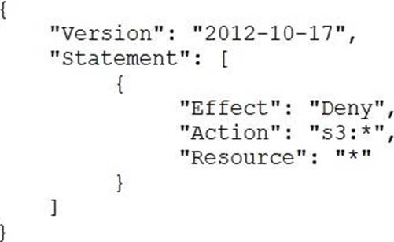
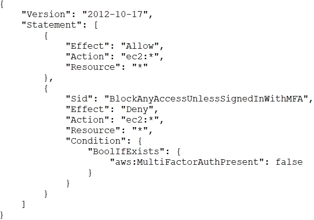
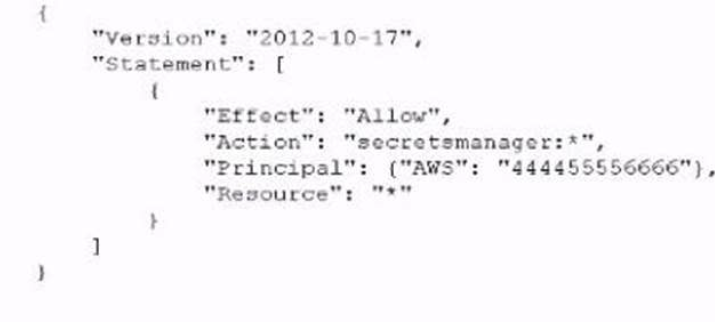
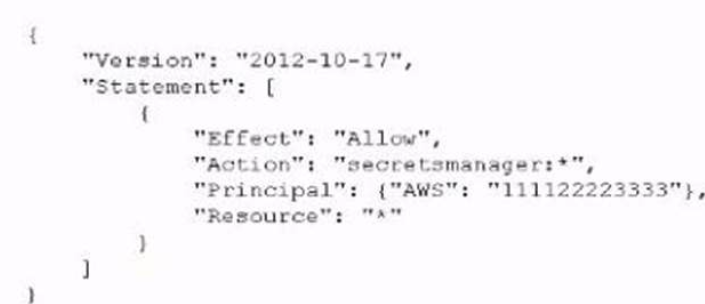
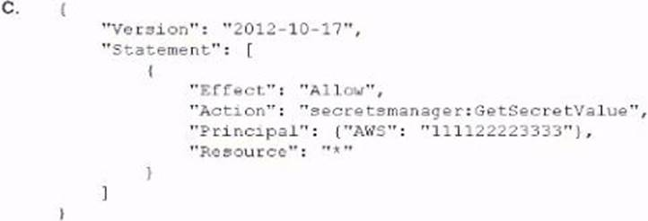
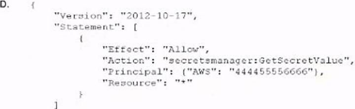
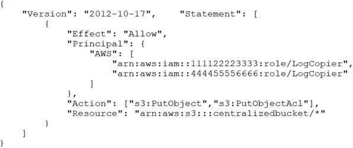
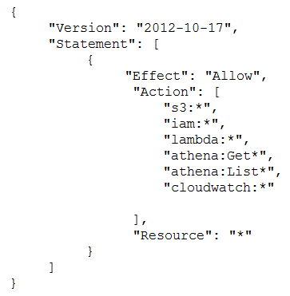
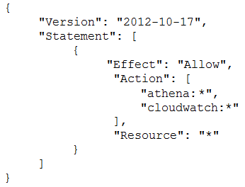

# Practice Exam 5

Click on the **Answer** button for the correct answer and its explanation.

If this practice exam has been helpful to you please share it with others and react to this below.

---

1. A company has decided to use encryption in its AWS account to secure the objects in Amazon S3 using server-side encryption. Object sizes range from 16.000 B to 5 MB. The requirements are as follows. The key material must be generated and stored in a certified Federal Information Processing Standard (FIPS) 140-2 Level 3 machine. The key material must be available in multiple Regions. Which option meets these requirements?

    - A) Use an AWS KMS customer managed key and store the key material in AWS with replication across Regions.
    - B) Use an AWS customer managed key, import the key material into AWS KMS using in-house AWS CloudHSM. and store the key material securely in Amazon S3.
    - C) Use an AWS KMS custom key store backed by AWS CloudHSM clusters, and copy backups across Regions.
    - D) Use AWS CloudHSM to generate the key material and backup keys across Regions Use the Java Cryptography Extension (JCE) and Public Key Cryptography Standards #11 (PKCS #11) encryption libraries to encrypt and decrypt the data.

<b>Answer</b>
 Correct Answer(s): A

2. A global company that deals with International finance is investing heavily in cryptocurrencies and wants to experiment with mining technologies using AWS. The company's security team has enabled Amazon GuardDuty and is concerned by the number of findings being generated by the accounts. The security team wants to minimize the possibility of GuardDuty finding false negatives for compromised instances that are performing mining How can the security team continue using GuardDuty while meeting these requirements?

    - A) In the GuardDuty console, select the CryptoCurrency:EC2/BitcoinTool B'DNS finding and use the suppress findings option.
    - B) Create a custom AWS Lambda function to process newly detected GuardDuty alerts Process the CryptoCurrency EC2/BitcoinTool BIDNS alert and filter out the high-severity finding types only.
    - C) When creating a new Amazon EC2 Instance, provide the instance with a specific tag that indicates it is performing mining operations Create a custom AWS Lambda function to process newly detected GuardDuty alerts and filter for the presence of this tag.
    - D) When GuardDuty produces a cryptocurrency finding, process the finding with a custom AWS Lambda function to extract the instance ID from the finding Then use the AWS Systems Manager Run Command to check for a running process performing mining operations.

<b>Answer</b>
 Correct Answer(s): D

3. A security engineer must use AWS Key Management Service (AWS KMS) to design a key management solution for a set of Amazon Elastic Block Store (Amazon EBS) volumes that contain sensitive data. The solution needs to ensure that the key material automatically expires in 90 days. Which solution meets these criteria?

    - A) A customer managed CMK that uses customer provided key material.
    - B) A customer managed CMK that uses AWS provided key material.
    - C) An AWS managed CMK.
    - D) Operating system-native encryption that uses GnuPG.

<b>Answer</b>
 Correct Answer(s): A

4. A company's application runs on Amazon EC2 and stores data in an Amazon S3 bucket. The company wants additional security controls in place to limit the likelihood of accidental exposure of data to external parties. Which combination of actions will meet this requirement? (Select THREE)

    - A) Encrypt the data in Amazon S3 using server-side encryption with Amazon S3 managed encryption keys (SSE-S3)
    - B) Encrypt the data in Amazon S3 using server-side encryption with AWS KMS managed encryption keys (SSE-KMS)
    - C) Create a new Amazon S3 VPC endpoint and modify the VPC's routing tables to use the new endpoint.
    - D) Use the Amazon S3 Block Public Access feature.
    - E) Configure the bucket policy to allow access from the application instances only.
    - F) Use a NACL to filter traffic to Amazon S3.

<b>Answer</b>
 Correct Answer(s): B, D, E

5. A company's application runs on an Amazon EC2 instance and stores objects in an Amazon S3 bucket. The EC2 instance is using an instance profile that provides access to read and write objects in the S3 bucket. The S3 bucket contains objects and has not been configured for any encryption at rest. The company is adopting a new security policy that mandates encryption at rest for all S3 buckets, encryption at rest for all objects in S3 buckets, and key rotation once every year. What should a security engineer do to meet these requirements?

    - A) Enable server-side encryption with Amazon S3 managed encryption keys (SSE-S3) for the S3 bucket. Configure annual automatic key rotation. Use an S3 Batch Operations job with the COPY command to change all the objects in the S3 bucket to use the SSE-S3 key. Configure the EC2 instance profile with permissions to use the SSE-S3 key. Configure S3 data events to encrypt an object during a write operation.
    - B) Create a new AWS Key Management Service (AWS KMS) customer managed key. Configure annual automatic key rotation. Enable server-side encryption with AWS KMS keys (SSE-KMS) for the S3 bucket. Add a bucket policy to the S3 bucket to enforce SSE-KMS encryption. Configure the EC2 instance profile with permissions to use the customer managed key.
    - C) Create a new AWS Key Management Service (AWS KMS) customer managed key. Configure annual automatic key rotation. Enable server-side encryption with AWS KMS keys (SSE-KMS) for the S3 bucket. Use an S3 Batch Operations job with the COPY command to change all the objects in the S3 bucket to use the customer managed key. Configure the EC2 instance profile with permissions to use the customer managed key.
    - D) Enable server-side encryption with Amazon S3 managed encryption keys (SSE-S3) for the S3 bucket. Configure annual automatic key rotation. Configure the EC2 instance profile with permissions to use the SSE-S3 key. Use the AWS CLI to copy the S3 objects in place by specifying the SSE-S3 key as the encryption key. Configure S3 data events to encrypt an object during a write operation.

<b>Answer</b>
 Correct Answer(s): C

6. A Security Administrator at a university is configuring a fleet of Amazon EC2 instances. The EC2 instances are shared among students, and non-root SSH access is allowed. The Administrator is concerned about students attacking other AWS account resources by using the EC2 instance metadata service. What can the Administrator do to protect against this potential attack?

    - A) Disable the EC2 instance metadata service.
    - B) Log all student SSH interactive session activity.
    - C) Implement iptables-based restrictions on the instances.
    - D) Install the Amazon Inspector agent on the instances.

<b>Answer</b>
 Correct Answer(s): C

7. An employee accidentally exposed an AWS access key and secret access key during a public presentation. The company Security Engineer immediately disabled the key. How can the Engineer assess the impact of the key exposure and ensure that the credentials were not misused? (Choose TWO)

    - A) Analyze AWS CloudTrail for activity.
    - B) Analyze Amazon CloudWatch Logs for activity.
    - C) Download and analyze the IAM Use report from AWS Trusted Advisor.
    - D) Analyze the resource inventory in AWS Config for IAM user activity.
    - E) Download and analyze a credential report from IAM.

<b>Answer</b>
 Correct Answer(s): A, E

8. A company has several production AWS accounts and a central security AWS account. The security account is used for centralized monitoring and has IAM privileges to all resources in every corporate account. All of the company's Amazon S3 buckets are tagged with a value denoting the data classification of their contents. A Security Engineer is deploying a monitoring solution in the security account that will enforce bucket policy compliance. The system must monitor S3 buckets in all production accounts and confirm that any policy change is in accordance with the bucket's data classification. If any change is out of compliance; the Security team must be notified quickly. Which combination of actions would build the required solution? (Choose THREE)

    - A) Configure Amazon CloudWatch Events in the production accounts to send all S3 events to the security account event bus.
    - B) Enable Amazon GuardDuty in the security account. and join the production accounts as members.
    - C) Configure an Amazon CloudWatch Events rule in the security account to detect S3 bucket creation or modification events.
    - D) Enable AWS Trusted Advisor and activate email notifications for an email address assigned to the security contact.
    - E) Invoke an AWS Lambda function in the security account to analyze S3 bucket settings in response to S3 events, and send non-compliance notifications to the Security team.
    - F) Configure event notifications on S3 buckets for PUT; POST, and DELETE events.

<b>Answer</b>
 Correct Answer(s): A, C, E

9. A security engineer is auditing a production system and discovers several additional IAM roles that are not required and were not previously documented during the last audit 90 days ago. The engineer is trying to find out who created these IAM roles and when they were created. The solution must have the lowest operational overhead. Which solution will meet this requirement?

    - A) Import AWS CloudTrail logs from Amazon S3 into an Amazon Elasticsearch Service cluster, and search through the combined logs for CreateRole events.
    - B) Create a table in Amazon Athena for AWS CloudTrail events. Query the table in Amazon Athena for CreateRole events.
    - C) Use AWS Config to look up the configuration timeline for the additional IAM roles and view the linked AWS CloudTrail event.
    - D) Download the credentials report from the IAM console to view the details for each IAM entity, including the creation dates.

<b>Answer</b>
 Correct Answer(s): C

10. A company has a new AWS account that does not have AWS CloudTrail configured. The account has an IAM access key that was issued by AWS Security Token Service (AWS STS). A security engineer discovers that the IAM access key has been compromised within the last 24 hours. The security engineer must stop the compromised IAM access key from being used. The security engineer also must determine which activities the key has been used for so far. What should the security engineer do to meet these requirements?

    - A) In the CloudTrail console, under CloudTrail event history, search by access key for the compromised key, with the correlated events, and identify which IAM user the key belongs to. In the IAM console, revoke all active sessions for that IAM user.
    - B) Create a new CloudTrail trail. In the CloudTrail console, under CloudTrail event history, search by access key for the compromised key, view the correlated events, and identify which IAM user the key belongs to. In the IAM console, revoke all active sessions for that IAM user.
    - C) Create a new CloudTrail trail. In the CloudTrail console, under CloudTrail event history, search by access key for the compromised key, view the correlated events, and identify which IAM role the key belongs to. In the IAM console, delete that IAM role.
    - D) In the CloudTrail console, under CloudTrail event history, search by access key for the compromised key, view the correlated events, and identify which IAM role the key belongs to. In the IAM console, revoke all active sessions for that IAM role.

<b>Answer</b>
 Correct Answer(s): D

11. After multiple compromises of its Amazon EC2 instances, a company's Security Officer is mandating that memory dumps of compromised instances be captured for further analysis. A Security Engineer just received an EC2 abuse notification report from AWS stating that an EC2 instance running the most recent. Windows Server 2019 Base AMI is compromised. How should the Security Engineer collect a memory dump of the EC2 instance for forensic analysis?

    - A) Give consent to the AWS Security team to dump the memory core on the compromised instance and provide it to AWS Support for analysis.
    - B) Review memory dump data that the AWS Systems Manager Agent sent to Amazon CloudWatch Logs.
    - C) Download and run the EC2Rescue for Windows Server utility from AWS.
    - D) Reboot the EC2 Windows Server, enter safe mode, and select memory dump.

<b>Answer</b>
 Correct Answer(s): C

12. A Security Engineer received an AWS Abuse Notice listing EC2 instance IDs that are reportedly abusing other hosts. Which action should the Engineer take based on this situation? (Choose THREE)

    - A) Use AWS Artifact to capture an exact image of the state of each instance.
    - B) Create EBS Snapshots of each of the volumes attached to the compromised instances.
    - C) Capture a memory dump.
    - D) Log in to each instance with administrative credentials to restart the instance.
    - E) Revoke all network ingress and egress except for to/from a forensics workstation.
    - F) Run Auto Recovery for Amazon EC2.

<b>Answer</b>
 Correct Answer(s): B, C, E

13. A company had one of its Amazon EC2 key pairs compromised. A Security Engineer must identify which current Linux EC2 instances were deployed and used the compromised key pair. How can this task be accomplished?

    - A) Obtain the list of instances by directly querying Amazon EC2 using: `aws ec2 describe-instances –fi1ters "Name=key-name,Values=KEYNAMEHERE"`.
    - B) Obtain the fingerprint for the key pair from the AWS Management Console, then search for the fingerprint in the Amazon Inspector logs.
    - C) Obtain the output from the EC2 instance metadata using: `curl http: //169.254.169.254/latest/meta-data/public- keys/0/`.
    - D) Obtain the fingerprint for the key pair from the AWS Management Console, then search for the fingerprint in Amazon CloudWatch Logs using: `aws logs filter-log-events`.

<b>Answer</b>
 Correct Answer(s): A

14. A security engineer must develop an encryption tool for a company. The company requires a cryptographic solution that supports the ability to perform cryptographic erasure on all resources protected by the key material in 15 minutes or less. Which AWS Key Management Service (AWS KMS) key solution will allow the security engineer to meet these requirements?

    - A) Use imported key material with CMK.
    - B) Use an AWS KMS CMK.
    - C) Use an AWS managed CMK.
    - D) Use an AWS KMS customer managed CMK.

<b>Answer</b>
 Correct Answer(s): A

15. A company plans to use AWS Key Management Service (AWS KMS) to implement an encryption strategy to protect data at rest. The company requires client-side encryption for company projects. The company is currently conducting multiple projects to test the company's use of AWS KMS. These tests have led to a sudden increase in the company's AWS resource consumption. The test projects include applications that issue multiple requests each second to KMS endpoints for encryption activities. The company needs to develop a solution that does not throttle the company's ability to use AWS KMS. The solution must improve key usage for client-side encryption and must be cost optimized. Which solution will meet these requirements?

    - A) Use keyrings with the AWS Encryption SDK. Use each keyring individually or combine keyrings into a multi-keyring. Decrypt the data by using a keyring that has the primary key in the multi-keyring.
    - B) Use data key caching. Use the local cache that the AWS Encryption SDK provides with a caching cryptographic materials manager.
    - C) Use KMS key rotation. Use a local cache in the AWS Encryption SDK with a caching cryptographic materials manager.
    - D) Use keyrings with the AWS Encryption SDK. Use each keyring individually or combine keyrings into a multi-keyring. Use any of the wrapping keys in the multi-keyring to decrypt the data.

<b>Answer</b>
 Correct Answer(s): B

16. A company is using AWS Organizations to manage multiple AWS member accounts. All of these accounts have Amazon GuardDuty enabled in all Regions. The company's AW5 Security Operations Center has a centralized security account for logging and monitoring. One of the member accounts has received an excessively high bill A security engineer discovers that a compromised Amazon EC2 instance is being used to mine crypto currency. The Security Operations Center did not receive a GuardDuty finding in the central security account. but there was a GuardDuty finding in the account containing the compromised EC2 instance. The security engineer needs to ensure an GuardDuty finding are available in the security account. What should the security engineer do to resolve this issue?

    - A) Set up an Amazon CloudWatch Event rule to forward ail GuardDuty findings to the security account Use an AWS Lambda function as a target to raise findings.
    - B) Set up an Amazon CloudWatch Events rule to forward all GuardDuty findings to the security account Use an AWS Lambda function as a target to raise findings in AWS Security Hub.
    - C) Check that GuardDuty in the security account is able to assume a role in the compromised account using the GuardDuty fast findings permission Schedule an Amazon CloudWatch Events rule and an AWS Lambda function to periodically check for GuardDuty findings.
    - D) Use the aws GuardDuty `get-members` AWS CLI command m the security account to see if the account is listed Send an invitation from GuardDuty m the security account to GuardDuty in the compromised account Accept the invitation to forward all future GuardDuty findings.

<b>Answer</b>
 Correct Answer(s): D

17. A company's on-premises data center forwards DNS logs to a third-party security incident events management (SIEM) solution that alerts on suspicious behavior. The company wants to introduce a similar capability to its AWS accounts that includes automatic remediation. The company expects to double in size within the next few months. Which solution meets the company's current and future logging requirements?

    - A) Enable Amazon GuardDuty and AWS Security Hub in all Regions and all accounts. Designate a master security account to receive all alerts from the child accounts. Set up specific rules within Amazon EventBridge to trigger an AWS Lambda function for remediation steps.
    - B) Ingest all AWS CloudTrail logs, VPC Flow Logs, and DNS logs into a single Amazon S3 bucket in a designated security account. Use the current on-premises SIEM to monitor the logs and send a notification to an Amazon SNS topic to alert the security team of remediation steps.
    - C) Ingest all AWS CloudTrail logs, VPC Flow Logs, and DNS logs into a single Amazon S3 bucket in a designated security account. Launch an Amazon EC2 instance and install the current SIEM to monitor the logs and send a notification to an Amazon SNS topic to alert the security team of remediation steps.
    - D) Enable Amazon GuardDuty and AWS Security Hub in all Regions and all accounts. Designate a master security account to receive all alerts from the child accounts. Create an AWS Organizations SCP that denies access to certain API calls that are on an ignore list.

<b>Answer</b>
 Correct Answer(s): A

18. An external auditor finds that a company's user passwords have no minimum length. The company is currently using two identity providers: AWS IAM federated with on-premises Active Directory. Amazon Cognito user pools to accessing an AWS Cloud application developed by the company. Which combination o1 actions should the Security Engineer take to solve this issue? (Select TWO)

    - A) Update the password length policy in the on-premises Active Directory configuration.
    - B) Update the password length policy in the IAM configuration.
    - C) Enforce an IAM policy in Amazon Cognito and AWS IAM with a minimum password length condition.
    - D) Update the password length policy in the Amazon Cognito configuration.
    - E) Create an SCP with AWS Organizations that enforces a minimum password length for AWS IAM and Amazon Cognito.

<b>Answer</b>
 Correct Answer(s): A, D

19. A Developer signed in to a new account within an AWS Organizations organizations unit (OU) containing multiple accounts. Access to the Amazon S3 service is restricted with the following SCP: How can the Security Engineer provide the Developer with Amazon S3 access without affecting other accounts?

    - A) Move the SCP to the root OU of Organizations to remove the restriction to access Amazon S3.
    - B) Add an IAM policy for the Developer, which grants S3 access.
    - C) Create a new OU without applying the SCP restricting S3 access. Move the Developer account to this new OU.
    - D) Add an allow list for the Developer account for the S3 service.

<b>Answer</b>
 Correct Answer(s): C

20. A company's development team is designing an application using AWS Lambda and Amazon Elastic Container Service (Amazon ECS). The development team needs to create IAM roles to support these systems. The company's security team wants to allow the developers to build IAM roles directly, but the security team wants to retain control over the permissions the developers can delegate to those roles. The development team needs access to more permissions than those required for the application's AWS services. The solution must minimize management overhead. How should the security team prevent privilege escalation for both teams?

    - A) Enable AWS CloudTrail. Create a Lambda function that monitors the event history for privilege escalation events and notifies the security team.
    - B) Create a managed IAM policy for the permissions required. Reference the IAM policy as a permissions boundary within the development team's IAM role.
    - C) Enable AWS Organizations Create an SCP that allows the IAM CreateUser action but that has a condition that prevents API calls other than those required by the development team.
    - D) Create an IAM policy with a deny on the IAMCreateUser action and assign the policy to the development team. Use a ticket system to allow the developers to request new IAM roles for their applications. The IAM roles will then be created by the security team.

<b>Answer</b>
 Correct Answer(s): B

21. A company that uses AWS Organizations is migrating workloads to AWS. The company's application team determines that the workloads will use Amazon EC2 instances, Amazon S3 buckets, Amazon DynamoDB tables, and Application Load Balancers. For each resource type, the company mandates that deployments must comply with the following requirements: All EC2 instances must be launched from approved AWS accounts. All DynamoDB tables must be provisioned with a standardized naming convention. All infrastructure that is provisioned in any accounts in the organization must be deployed by AWS CloudFormation templates. Which combination of steps should the application team take to meet these requirements? (Choose TWO)

    - A) Create CloudFormation templates in an administrator AWS account. Share the stack sets with an application AWS account. Restrict the template to be used specifically by the application AWS account.
    - B) Create CloudFormation templates in an application AWS account. Share the output with an administrator AWS account ta review compliant resources. Restrict output to only the administrator AWS account.
    - C) Use permissions boundaries to prevent the application AWS account from provisioning specific resources unless conditions for the internal compliance requirements are met.
    - D) Use SCPs to prevent the application AWS account from provisioning specific resources unless conditions for the internal compliance requirements are met.
    - E) Activate AWS Config managed rules for each service in the application AWS account.

<b>Answer</b>
 Correct Answer(s): A, D

22. A Developer reported that AWS CloudTrail was disabled on their account. A Security Engineer investigated the account and discovered the event was undetected by the current security solution. The Security Engineer must recommend a solution that will detect future changes to the CloudTrail configuration and send alerts when changes occur. What should the Security Engineer do to meet these requirements?

    - A) Use AWS Resource Access Manager (AWS RAM) to monitor the AWS CloudTrail configuration. Send notifications using Amazon SNS.
    - B) Create an Amazon CloudWatch Events rule to monitor Amazon GuardDuty findings.
Send email notifications using Amazon SNS.
    - C) Update security contact details in AWS account settings for AWS Support to send alerts when suspicious activity is detected.
    - D) Use Amazon Inspector to automatically detect security issues. Send alerts using Amazon SNS.

<b>Answer</b>
 Correct Answer(s): B

23. A company suspects that an attacker has exploited an overly permissive role to export credentials from Amazon EC2 instance metadata. The company uses Amazon GuardDuty and AWS Audit Manager. The company has enabled AWS CloudTrail logging and Amazon CloudWatch logging for all of its AWS accounts. A security engineer must determine if the credentials were used to access the company's resources from an external account. Which solution will provide this information?

    - A) Review GuardDuty findings to find `InstanceCredentialExfiltration` events.
    - B) Review assessment reports in the Audit Manager console to find `InstanceCredentialExfiltration` events.
    - C) Review CloudTrail logs for `GetSessionToken` API calls to AWS Security Token Service (AWS STS) that come from an account ID from outside the company.
    - D) Review CloudWatch logs for `GetSessionToken` API calls to AWS Security Token Service (AWS STS) that come from an account ID from outside the company.

<b>Answer</b>
 Correct Answer(s): A

24. A security engineer need to ensure their company's uses of AWS meets AWS security best practices. As part of this, the AWS account root user must not be used for daily work. The root user must be monitored for use, and the Security team must be alerted as quickly as possible if the root user is used. Which solution meets these requirements?

    - A) Set up an Amazon CloudWatch Events rule that triggers an Amazon SNS notification.
    - B) Set up an Amazon CloudWatch Events rule that triggers an Amazon SNS notification logs from S3 and generate notifications using Amazon SNS.
    - C) Set up a rule in AWS config to trigger root user events. Trigger an AWS Lambda function and generate notifications using Amazon SNS.
    - D) Use Amazon Inspector to monitor the usage of the root user and generate notifications using Amazon SNS.

<b>Answer</b>
 Correct Answer(s): A

25. A security engineer has enabled AWS Security Hub in their AWS account, and has enabled the Center for Internet Security (CIS) AWS Foundations compliance standard. No evaluation results on compliance are returned in the Security Hub console after several hours. The engineer wants to ensure that Security Hub can evaluate their resources for CIS AWS Foundations compliance. Which steps should the security engineer take to meet these requirements?

    - A) Add full Amazon Inspector IAM permissions to the Security Hub service role to allow it to perform the CIS compliance evaluation.
    - B) Ensure that AWS Trusted Advisor is enabled in the account, and that the Security Hub service role has permissions to retrieve the Trusted Advisor security- related recommended actions.
    - C) Ensure that AWS Config is enabled in the account, and that the required AWS Config rules have been created for the CIS compliance evaluation.
    - D) Ensure that the correct trail in AWS CloudTrail has been configured for monitoring by Security Hub, and that the Security Hub service role has permissions to perform the GetObject operation on CloudTrail's Amazon S3 bucket.

<b>Answer</b>
 Correct Answer(s): C

26. A company has secured the AWS account root user for its AWS account by following AWS best practices. The company also has enabled AWS CloudTrail, which is sending its logs to Amazon S3. A security engineer wants to receive notification in near-real time if a user uses the AWS account root user credentials to sign in to the AWS Management Console. Which solutions will provide this notification? (Choose TWO)

    - A) Use AWS Trusted Advisor and its security evaluations for the root account. Configure an Amazon EventBridge event rule that is invoked by the Trusted Advisor API. Configure the rule to target an Amazon Simple Notification Service (Amazon SNS) topic. Subscribe any required endpoints to the SNS topic so that these endpoints can receive notification.
    - B) Use AWS IAM Access Analyzer. Create an Amazon Cloud Watch Logs metric filter to evaluate log entries from Access Analyzer that detect a successful root account login. Create an Amazon CloudWatch alarm that monitors whether a root login has occurred. Configure the CloudWatch alarm to notify an Amazon Simple Notification Service (Amazon SNS) topic when the alarm enters the ALARM state. Subscribe any required endpoints to this SNS topic so that these endpoints can receive notification.
    - C) Configure AWS CloudTrail to send its logs to Amazon CloudWatch Logs. Configure a metric filter on the CloudWatch Logs log group used by CloudTrail to evaluate log entries for successful root account logins. Create an Amazon CloudWatch alarm that monitors whether a root login has occurred. Configure the CloudWatch alarm to notify an Amazon Simple Notification Service (Amazon SNS) topic when the alarm enters the ALARM state. Subscribe any required endpoints to this SNS topic so that these endpoints can receive notification.
    - D) Configure AWS CloudTrail to send log notifications to an Amazon Simple Notification Service (Amazon SNS) topic. Create an AWS Lambda function that parses the CloudTrail notification for root login activity and notifies a separate SNS topic that contains the endpoints that should receive notification. Subscribe the Lambda function to the SNS topic that is receiving log notifications from CloudTrail.
    - E) Configure an Amazon EventBridge event rule that runs when Amazon CloudWatch API calls are recorded for a successful root login. Configure the rule to target an Amazon Simple Notification Service (Amazon SNS) topic. Subscribe any required endpoints to the SNS topic so that these endpoints can receive notification.

<b>Answer</b>
 Correct Answer(s): C, E

27. A company always needs its Amazon Elastic Block Store (Amazon EBS) volumes to be encrypted During a security incident. EBS snapshots of suspicious instances are shared to a forensics account for analysis A security engineer attempting to share a suspicious EBS snapshot to the forensics account receives the following error `"Unable to share snapshot: An error occurred (OperationNotPermitted) when calling the ModifySnapshotAttribute operation: Encrypted snapshots with EBS default key cannot be shared`. Which combination of steps should the security engineer take in the incident account to complete the sharing operation? (Select THREE)

    - A) Create a customer managed CMK Copy the EBS snapshot encrypting the destination snapshot using the new CMK.
    - B) Allow forensics accounting principals to use the CMK by modifying its policy.
    - C) Create an Amazon EC2 instance. Attach the encrypted and suspicious EBS volume. Copy data from the suspicious volume to an unencrypted volume. Snapshot the unencrypted volume.
    - D) Copy the EBS snapshot to the new decrypted snapshot.
    - E) Restore a volume from the suspicious EBS snapshot. Create an unencrypted EBS volume of the same size.
    - F) Share the target EBS snapshot with the forensics account.

<b>Answer</b>
 Correct Answer(s): A, B, F

28. A company is testing an application that runs on an Amazon EC2 Linux instance. A single 500 GB Amazon Elastic Block Store (Amazon EBS) General Purpose SSO (gp2) volume is attached to the EC2 instance. The company will deploy the application on multiple EC2 instances in an Auto Scaling group. All instances require access to the data that is stored in the EBS volume. The company needs a highly available and resilient solution that does not introduce significant changes to the application's code. Which solution will meet these requirements?

    - A) Provision an EC2 instance that uses NFS server software. Attach a single 500 GB gp2 EBS volume to the instance.
    - B) Provision an Amazon FSx for Windows File Server file system. Configure the file system as an SMB file store within a single Availability Zone.
    - C) Provision an EC2 instance with two 250 GB Provisioned IOPS SSD EBS volumes.
    - D) Provision an Amazon Elastic File System (Amazon EFS) file system. Configure the file system to use General Purpose performance mode.

<b>Answer</b>
 Correct Answer(s): D

29. A Security Engineer has launched multiple Amazon EC2 instances from a private AMI using an AWS CloudFormation template. The Engineer notices instances terminating right after they are launched. What could be causing these terminations?

    - A) The IAM user launching those instances is missing `ec2:Runinstances` permission.
    - B) The AMI used as encrypted and the IAM does not have the required AWS KMS permissions.
    - C) The instance profile used with the EC2 instances in unable to query instance metadata.
    - D) AWS currently does not have sufficient capacity in the Region.

<b>Answer</b>
 Correct Answer(s): B

30. A Security Engineer has discovered that, although encryption was enabled on the Amazon S3 bucket example bucket, anyone who has access to the bucket has the ability to retrieve the files. The Engineer wants to limit access to each IAM user can access an assigned folder only. What should the Security Engineer do to achieve this?

    - A) Use envelope encryption with the AWS-managed CMK aws/s3.
    - B) Create a customer-managed CMK with a key policy granting `kms:Decrypt` based on the `'${aws:username}'` variable.
    - C) Create a customer-managed CMK for each user. Add each user as a key user in their corresponding key policy.
    - D) Change the applicable IAM policy to grant S3 access to `'Resource': 'arn:aws:s3:::examplebucket/${aws:username}/*'`.

<b>Answer</b>
 Correct Answer(s): D

31. Users report intermittent availability of a web application hosted on AWS. Monitoring systems report an excess of abnormal network traffic followed by high CPU utilization on the application web tier. Which of the following techniques will improve the availability of the application? (Select TWO)

    - A) Deploy AWS WAF to block all unsecured web applications from accessing the internet.
    - B) Deploy an Intrusion Detection/Prevention System (IDS/IPS) to monitor or block unusual incoming network traffic.
    - C) Configure security groups to allow outgoing network traffic only from hosts that are protected with up-to-date antivirus software.
    - D) Create Amazon CloudFront distribution and configure AWS WAF rules to protect the Web applications from malicious traffic.
    - E) Use the default Amazon VPC for externakfacing systems to allow AWS to actively block malicious network traffic affecting Amazon EC2 instances.

<b>Answer</b>
 Correct Answer(s): B, D

32. An AWS account administrator created an IAM group and applied the following managed policy to require that each individual user authenticate using multi-factor authentication: After implementing the policy, the administrator receives reports that users are unable to perform Amazon EC2 commands using the AWS CLI. What should the administrator do to resolve this problem while still enforcing multi-factor authentication?

    - A) Change the value of `aws:MultiFactorAuthPresent` to `true`.
    - B) Instruct users to run the `aws sts get-session-token` CLI command and pass the multi-factor authentication `―-serial-number` and `-―token-code` parameters. Use these resulting values to make API/CLI calls.
    - C) Implement federated API/CLI access using SAML 2.0, then configure the identity provider to enforce multi-factor authentication.
    - D) Create a role and enforce multi-factor authentication in the role trust policy Instruct users to run the `aws sts assume-role` CLI command and pass `–-serial-number` and `―-token-code` parameters Store the resulting values in environment variables. Add `sts:AssumeRole` to NotAction in the policy.

<b>Answer</b>
 Correct Answer(s): B

33. The Security Engineer is managing a traditional three-tier web application that is running on Amazon EC2 instances. The application has become the target of increasing numbers of malicious attacks from the Internet. What steps should the Security Engineer take to check for known vulnerabilities and limit the attack surface? (Choose TWO)

    - A) Use AWS Certificate Manager to encrypt all traffic between the client and application servers.
    - B) Review the application security groups to ensure that only the necessary ports are open.
    - C) Use Elastic Load Balancing to offload Secure Sockets Layer encryption.
    - D) Use Amazon Inspector to periodically scan the backend instances.
    - E) Use AWS Key Management Services to encrypt all the traffic between the client and application servers.

<b>Answer</b>
 Correct Answer(s): B, D

34. A Security Engineer discovered a vulnerability in an application running on Amazon ECS. The vulnerability allowed attackers to install malicious code. Analysis of the code shows it exfiltrates data on port 5353 in batches at random time intervals. While the code of the containers is being patched, how can Engineers quickly identify all compromised hosts and stop the egress of data on port 5353?

    - A) Enable AWS Shield Advanced and AWS WAF. Configure an AWS WAF custom filter for egress traffic on port 5353
    - B) Enable Amazon Inspector on Amazon ECS and configure a custom assessment to evaluate containers that have port 5353 open. Update the NACLs to block port 5353 outbound.
    - C) Create an Amazon CloudWatch custom metric on the VPC Flow Logs identifying egress traffic on port 5353. Update the NACLs to block port 5353 outbound.
    - D) Use Amazon Athena to query AWS CloudTrail logs in Amazon S3 and look for any traffic on port 5353. Update the security groups to block port 5353 outbound.

<b>Answer</b>
 Correct Answer(s): C

35. A company's Director of information Security wants a daily email report from AWS that contains recommendations for each company account to meet AWS Security best practices. Which solution would meet these requirements?

    - A) In every AWS account, configure AWS Lambda to query me AWS Support API for AWS Trusted Advisor security checks Send the results from Lambda to an Amazon SNS topic to send reports.
    - B) Configure Amazon GuardDuty in a master account and invite all other accounts to be managed by the master account Use GuardDuty's integration with Amazon SNS to report on findings.
    - C) Use Amazon Athena and Amazon QuickSight to build reports off of AWS CloudTrail Create a daily Amazon CloudWatch trigger to run the report dally and email It using Amazon SNS.
    - D) Use AWS Artifact's prebuilt reports and subscriptions Subscribe the Director of Information Security to the reports by adding the Director as the security alternate contact for each account.

<b>Answer</b>
 Correct Answer(s): A

36. A company wants to deploy a continuous security threat-detection service at scale to automatically analyze all the company's member accounts in AWS Organizations within the `ap-east-1` Region. The company's organization includes a management account, a security account, and many member accounts. When the company creates a new member account, the threat-detection service should automatically analyze the new account so that the company can review any findings from the security account. Which solution uses AWS security best practices and meets these requirements with the LEAST effort?

    - A) Activate Amazon GuardDuty in `ap-east-1`. Designate the security account as the GuardDuty delegated administrator by using the console.
    - B) Activate Amazon GuardDuty in `ap-east-1` with trusted access to AWS Organizations. Designate the management account as the GuardDuty organization administrator.
    - C) Activate AWS Security Hub in `ap-east-1`. Designate the management account as the Security Hub delegated administrator by using the console.
    - D) Activate AWS Control Tower in `ap-east-1` with trusted access to AWS Organizations. Designate the security account as the organization administrator.

<b>Answer</b>
 Correct Answer(s): A

37. Two Amazon EC2 instances in different subnets should be able to connect to each other but cannot. It has been confirmed that other hosts in the same subnets are able to communicate successfully, and that security groups have valid ALLOW rules in place to permit this traffic. Which of the following troubleshooting steps should be performed?

    - A) Check inbound and outbound security groups, looking for `DENY` rules.
    - B) Check inbound and outbound Network ACL rules, looking for `DENY` rules.
    - C) Review the rejected packet reason codes in the VPC Flow Logs.
    - D) Use AWS X-Ray to trace the end-to-end application flow.

<b>Answer</b>
 Correct Answer(s): B

38. A company's Security Officer is concerned about the risk of AWS account root user logins and has assigned a Security Engineer to implement a notification solution for near-real-time alerts upon account root user logins. How should the Security Engineer meet these requirements?

    - A) Create a cron job that runs a script to download the AWS IAM security credentials. We parse the file for account root user logins and email the Security team's distribution list.
    - B) Run AWS CloudTrail logs through Amazon CloudWatch Events to detect account roo4 user logins and trigger an AWS Lambda function to send an Amazon SNS notification to the Security team's distribution list.
    - C) Save AWS CloudTrail logs to an Amazon S3 bucket in the Security team's account Process the CloudTrail logs with the Security Engineer's logging solution for account root user logins Send an Amazon SNS notification to the Security team upon encountering the account root user login events.
    - D) Save VPC Plow Logs to an Amazon S3 bucket in the Security team's account and process the VPC Flow Logs with their logging solutions for account root user logins Send an Amazon SNS notification to the Security team upon encountering the account root user login events.

<b>Answer</b>
 Correct Answer(s): B

39. A company has many member accounts in an organization in AWS Organizations. The company is concerned about the potential for misuse of the AWS account root user credentials for member accounts in the organization. To address this potential misuse, the company wants to ensure that even if the account root user credentials are compromised, the account is still protected. Which solution will meet this requirement?

    - A) Block service access by using SCPs for the root user.
    - B) Remove the password for the root user.
    - C) Delete access keys for the root user.
    - D) Create an Amazon CloudWatch Events rule to detect any AWS account root user API events.

<b>Answer</b>
 Correct Answer(s): A

40. A company's Chief Security Officer has requested that a Security Analyst review and improve the security posture of each company AWS account. The Security Analyst decides to do this by improving AWS account root user security. Which actions should the Security Analyst take to meet these requirements? (Choose THREE)

    - A) Delete the access keys for the account root user in every account.
    - B) Create an admin IAM user with administrative privileges and delete the account root user in every account.
    - C) Implement a strong password to help protect account-level access to the AWS Management Console by the account root user.
    - D) Enable multi-factor authentication (MFA) on every account root user in all accounts.
    - E) Create a custom IAM policy to limit permissions to required actions for the account root user and attach the policy to the account root user.
    - F) Attach an IAM role to the account root user to make use of the automated credential rotation in AWS STS.

<b>Answer</b>
 Correct Answer(s): A, C, D

41. A Security engineer needs to ensure their company's use of AWS meets AWS security best practices. As part of this, the AWS account root user must not be used for daily work. The root user must be monitored for use, and the Security team must be alerted as quickly as possible if the root user is used. Which solution meets these requirements?

    - A) Set up an Amazon CloudWatch Events rule that triggers an Amazon SNS notification.
    - B) Create root user access keys. Use an AWS Lambda function to parse AWS CloudTrail logs from Amazon S3 and generate notifications using Amazon SNS.
    - C) Set up a rule in AWS Config to trigger root user events. Trigger an AWS Lambda function and generate notifications using Amazon SNS.
    - D) Use Amazon Inspector to monitor the usage of the root user and generate notifications using Amazon SNS.

<b>Answer</b>
 Correct Answer(s): A

42. A company has multiple AWS accounts that are part of AW5 Organizations. The company's Security team wants to ensure that even those Administrators with full access to the company's AWS accounts are unable to access the company's Amazon S3 buckets How should this be accomplished?

    - A) UseSCPs.
    - B) Add a permissions boundary to deny access to Amazon S3 and attach it to all roles.
    - C) Use an S3 bucket policy.
    - D) Create a VPC endpoint for Amazon S3 and deny statements for access to Amazon S3.

<b>Answer</b>
 Correct Answer(s): A

43. A company uses HTTP Live Streaming (HLS) to stream live video content to paying subscribers by using Amazon CloudFront. HLS splits the video content into chunks so that the user can request the right chunk based on different conditions Because the video events last for several hours, the total video is made up of thousands of chunks The origin URL is not disclosed and every user is forced to access the CloudFront URL The company has a web application that authenticates the paying users against an internal repository and a CloudFront key pair that is already issued. What is the simplest and MOST effective way to protect the content?

    - A) Develop the application to use the CloudFront key pair to create signed URLs that users will use to access the content.
    - B) Develop the application to use the CloudFront key pair to set the signed cookies that users will use to access the content.
    - C) Develop the application to issue a security token that Lambda@Edge will receive to authenticate and authorize access to the content.
    - D) Keep the CloudFront URL encrypted inside the application, and use AWS KMS to resolve the URL on-the-fly after the user is authenticated.

<b>Answer</b>
 Correct Answer(s): B

44. An organization policy states that all encryption keys must be automatically rotated every 12 months. Which AWS Key Management Service (KMS) key type should be used to meet this requirement?

    - A) AWS managed Customer Master Key (CMK)
    - B) Customer managed CMK with AWS generated key material.
    - C) Customer managed CMK with imported key material.
    - D) AWS managed data key.

<b>Answer</b>
 Correct Answer(s): A

45. A company has decided to use AWS Key Management Service (AWS KMS) for all of its encryption keys. The company plans to create all of its keys as customer managed CMKs and will not import any encryption keys. The company must rotate its encryption keys once every 12 months. Which solution will meet these requirements?

    - A) Change the customer managed CMK key policy to enable automatic key rotation.
    - B) Use AWS managed CMKs instead of customer managed CMKs so that AWS will rotate the keys automatically.
    - C) Invoke an AWS Lambda function regularly to rotate the backing key of each customer managed CMK.
    - D) Enable automatic key rotation for each customer managed CMK after it has been created in AWS KMS.

<b>Answer</b>
 Correct Answer(s): D

46. A company has a customer master key (CMK) with imported key materials. Company policy requires that all encryption keys must be rotated every year. What can be done to implement the above policy?

    - A) Enable automatic key rotation annually for the CMK.
    - B) Use AWS Command Line Interface to create an AWS Lambda function to rotate the existing CMK annually.
    - C) Import new key material to the existing CMK and manually rotate the CMK.
    - D) Create a new CMK, import new key material to it, and point the key alias to the new CMK.

<b>Answer</b>
 Correct Answer(s): D

47. A security engineer is responsible for providing secure access to AWS resources for thousands of developer in a company's corporate identity provider (idp). The developers access a set of AWS services from the corporate premises using IAM credential. Due to the velum of require for provisioning new IAM users, it is taking a long time to grant access permissions. The security engineer receives reports that developer are sharing their IAM credentials with others to avoid provisioning delays. The causes concern about overall security for the security engineer. Which actions will meet the program requirements that address security?

    - A) Create an Amazon CloudWatch alarm for AWS CloudTrail Events. Create a metric filter to send a notification when me same set of IAM credentials is used by multiple developer.
    - B) Create a federation between AWS and the existing corporate IdP. Leverage IAM roles to provide federated access to AWS resources
    - C) Create a VPN tunnel between the corporate premises and the VPC. Allow permissions to all AWS services only if it originates from corporate premises.
    - D) Create multiple IAM rotes for each IAM user. Ensure that users who use the same IAM credentials cannot assume the same IAM role at the same time.

<b>Answer</b>
 Correct Answer(s): B

48. A company requires that SSH commands used to access its AWS instance be traceable to the user who executed each command. How should a Security Engineer accomplish this?

    - A) Allow inbound access on port 22 at the security group attached to the instance. Use AWS Systems Manager Session Manager for shell access to Amazon EC2 instances with the user tag defined. Enable Amazon CloudWatch togging for Systems Manager sessions.
    - B) Use Amazon S3 to securely store one Privacy Enhanced Mail Certificate (PEM file) for each user. Allow Amazon EC2 to read from Amazon S3 and import every user that wants to use SSH to access EC2 instances. Allow inbound access on port 22 at the security group attached to the instance. Install the Amazon CloudWatch agent on the EC2 instance and configure it to ingest audit logs for the instance.
    - C) Deny inbound access on port 22 at the security group attached to the instance. Use AWS Systems Manager Session Manager for shell access to Amazon EC2 instances with the user tag defined. Enable Amazon CloudWatch togging for Systems Manager sessions.
    - D) Use Amazon S3 to securely store one Privacy Enhanced Mall Certificate (PEM file) for each team or group. Allow Amazon EC2 to read from Amazon S3 and import every user that wants to use SSH to access EC2 instances. Allow inbound access on pod 22 at the security group attached to the instance. Install the Amazon CloudWatch agent on the EC2 instance and configure it to ingest audit logs for the instance.

<b>Answer</b>
 Correct Answer(s): C

49. A company has a requirement that no Amazon EC2 security group can allow SSH access from the CIDR block 0.0.0.0/0. The company wants to monitor compliance with this requirement at all times and wants to receive a near-real-time notification if any security group is noncompliant. A security engineer has configured AWS Config and will use the restricted-ssh managed rule to monitor the security groups. What should the security engineer do next to meet these requirements?

    - A) Configure AWS Config to send its configuration snapshots to an Amazon S3 bucket. Create an AWS Lambda function to run on a PutEvent to the S3 bucket. Configure the Lambda function to parse the snapshot for a compliance change to the restricted-ssh managed rule. Configure the Lambda function to send a notification to an Amazon Simple Notification Service (Amazon SNS) topic if a change is discovered.
    - B) Configure an Amazon EventBridge (Amazon CloudWatch Events) event rule that is invoked by a compliance change event from AWS Config for the restricted-ssh managed rule. Configure the event rule to target an Amazon Simple Notification Service (Amazon SNS) topic that will provide a notification.
    - C) Configure AWS Config to push all its compliance notifications to Amazon CloudWatch Logs. Configure a CloudWatch Logs metric filter on the AWS Config log group to look for a compliance notification change on the restricted-ssh managed rule. Create an Amazon CloudWatch alarm on the metric filter to send a notification to an Amazon Simple Notification Service (Amazon SNS) topic if the alarm is in the ALARM state.
    - D) Configure an Amazon CloudWatch alarm on the CloudWatch metric for the restricted-ssh managed rule. Configure the CloudWatch alarm to send a notification to an Amazon Simple Notification Service (Amazon SNS) topic if the alarm is in the ALARM state.

<b>Answer</b>
 Correct Answer(s): B

50. A company's information security team wants to analyze Amazon EC2 performance and utilization data in the near-real time for anomalies. A Sec Engineer is responsible for log aggregation. The Engineer must collect logs from all of the company's AWS accounts in centralized location to perform the analysis. How should the Security Engineer do this?

    - A) Log in to each account four te a day and filter the AWS CloudTrail log data, then copy and paste the logs in to the Amazon S3 bucket in the destination account.
    - B) Set up Amazon CloudWatch to stream data to an Amazon S3 bucket in each source account. Set up bucket replication for each source account into a centralized bucket owned by the security Engineer.
    - C) Set up an AWS Config aggregator to collect AWS configuration data from multiple sources.
    - D) Set up Amazon CloudWatch cross-account log data sharing with subscriptions in each account. Send the logs to Amazon Kinesis Data Firehose in the Security Engineer's account.

<b>Answer</b>
 Correct Answer(s): D

51. A Security Engineer is setting up an AWS CloudTrail trail for all regions in an AWS account. For added security, the logs are stored using server-side encryption with AWS KMS-managed keys (SSE-KMS) and have log integrity validation enabled. While testing the solution, the Security Engineer discovers that the digest files are readable, but the log files are not. What is the MOST likely cause?

    - A) The log files fail integrity validation and automatically are marked as unavailable.
    - B) The KMS key policy does not grant the Security Engineer's IAM user or role permissions to decrypt with it.
    - C) The bucket is set up to use server-side encryption with Amazon S3-managed keys (SSE-S3) as the default and does not allow SSE-KMS-encrypted files.
    - D) An IAM policy applicable to the Security Engineer's IAM user or role denies access to the `CloudTrail/` prefix in the Amazon S3 bucket.

<b>Answer</b>
 Correct Answer(s): B

52. A security engineer has created an Amazon Cognito user pool. The engineer needs to manually verify the ID and access token sent by the application for troubleshooting purposes. What is the MOST secure way to accomplish this?

    - A) Extract the subject (sub), audience (aud), and cognito:username from the ID token payload Manually check the subject and audience for the user name In the user pool.
    - B) Search for the public key with a key ID that matches the key ID In the header of the token. Then use a JSON Web Token (JWT) library to validate the signature of the token and extract values, such as the expiry date.
    - C) Verify that the token is not expired. Then use the token_use claim function In Amazon Cognito to validate the key IDs.
    - D) Copy the JSON Web Token (JWT) as a JSON document Obtain the public JSON Web Key (JWK) and convert It to a pem file. Then use the file to validate the original JWT.

<b>Answer</b>
 Correct Answer(s): B

53. A Security Engineer launches two Amazon EC2 instances in the same Amazon VPC but in separate Availability Zones. Each instance has a public IP address and is able to connect to external hosts on the internet. The two instances are able to communicate with each other by using their private IP addresses, but they are not able to communicate with each other when using their public IP addresses. Which action should the Security Engineer take to allow communication over the public IP addresses?

    - A) Associate the instances to the same security groups.
    - B) Add 0.0.0.0/0 to the egress rules of the instance security groups.
    - C) Add the instance IDs to the ingress rules of the instance security groups.
    - D) Add the public IP addresses to the ingress rules of the instance security groups.

<b>Answer</b>
 Correct Answer(s): D

54. A company uses multiple AWS accounts managed with AWS Organizations Security engineers have created a standard set of security groups for all these accounts. The security policy requires that these security groups be used for all applications and delegates modification authority to the security team only. A recent security audit found that the security groups are inconsistency implemented across accounts and that unauthorized changes have been made to the security groups. A security engineer needs to recommend a solution to improve consistency and to prevent unauthorized changes in the individual accounts in the future. Which solution should the security engineer recommend?

    - A) Use AWS Resource Access Manager to create shared resources for each requited security group and apply an IAM policy that permits read-only access to the security groups only.
    - B) Create an AWS CloudFormation template that creates the required security groups Execute the template as part of configuring new accounts Enable Amazon Simple Notification Service (Amazon SNS) notifications when changes occur.
    - C) Use AWS Firewall Manager to create a security group policy, enable the policy feature to identify and revert local changes, and enable automatic remediation.
    - D) Use AWS Control Tower to edit the account factory template to enable the snare security groups option Apply an SCP to the OU or individual accounts that prohibits security group modifications from local account users.

<b>Answer</b>
 Correct Answer(s): C

55. A company's security information events management (SIEM) tool receives new AWS CloudTrail logs from an Amazon S3 bucket that is configured to send all object created event notification to an Amazon SNS topic An Amazon SQS queue is subscribed to this SNS topic. The company's SEM tool then ports this SQS queue for new messages using an IAM role and fetches new log events from the S3 bucket based on the SQS messages. After a recent security review that resulted m restricted permissions, the SEM tool has stopped receiving new CloudTral logs. Which of the following are possible causes of this issue? (Select THREE)

    - A) The SQS queue does not allow the SQS SendMessage action from the SNS topic.
    - B) The SNS topic does not allow the SNS Publish action from Amazon S3.
    - C) The SNS topic is not delivering raw messages to the SQS queue.
    - D) The S3 bucket policy does not allow CloudTrail to perform the PutObject action.
    - E) The IAM role used by the SEM tool does not have permission to subscribe to the SNS topic.
    - F) The IAM role used by the SEM tool does not allow the SQS DeleteMessage action.

<b>Answer</b>
 Correct Answer(s): A, B, D

56. A city is implementing an election results reporting website that will use Amazon GoudFront. The website runs on a fleet of Amazon EC2 instances behind an Application Load Balancer (ALB) in an Auto Scaling group. Election results are updated hourly and are stored as .pdf tiles in an Amazon S3 bucket. A Security Engineer needs to ensure that all external access to the website goes through CloudFront. Which solution meets these requirements?

    - A) Create an IAM role that allows CloudFront to access the specific S3 bucket. Modify the S3 bucket policy to allow only the new IAM role to access its contents. Create an interface VPC endpoint for CloudFront to securely communicate with the ALB.
    - B) Create an IAM role that allows CloudFront to access the specific S3 bucket. Modify the S3 bucket policy to allow only the new IAM role to access its contents. Associate the ALB with a security group that allows only incoming traffic from the CloudFront service to communicate with the ALB.
    - C) Create an origin access identity (OAI) in CloudFront. Modify the S3 bucket policy to allow only the new OAI to access the bucket contents. Create an interface VPC endpoint for CloudFront to securely communicate with the ALB.
    - D) Create an origin access identity (OAI) in CloudFront. Modify the S3 bucket policy to allow only the new OAI to access the bucket contents. Associate the ALB with a security group that allows only incoming traffic from the CloudFront service to communicate with the ALB.

<b>Answer</b>
 Correct Answer(s): D

57. An company is using AWS Secrets Manager to store secrets that are encrypted using a CMK and are stored in the security account 111122223333. One of the company's production accounts. 444455556666, must to retrieve the secret values from the security account 111122223333. A security engineer needs to apply a policy to the secret in the security account based on least privilege access so the production account can retrieve the secret value only. Which policy should the security engineer apply?

    - A) Option A.

    - B) Option B.

    - C) Option C.

    - D) Option D.

<b>Answer</b>
 Correct Answer(s): A

58. A company's policy requires that all API keys be encrypted and stored separately from source code in a centralized security account. This security account is managed by the company's security team. However, an audit revealed that an API key is stored with the source code of an AWS Lambda function in an AWS CodeCommit repository in the DevOps account. How should the security team securely store the API key?

    - A) Create a CodeCommit repository in the security account using AWS Key Management Service (AWS KMS) for encryption. Require the development team to migrate the Lambda source code to this repository.
    - B) Store the API key in an Amazon S3 bucket in the security account using server-side encryption with Amazon S3 managed encryption keys (SSE-S3) to encrypt the key. Create a presigned URL for the S3 key, and specify the URL in a Lambda environmental variable in the AWS CloudFormation template. Update the Lambda function code to retrieve the key using the URL and call the API.
    - C) Create a secret in AWS Secrets Manager in the security account to store the API key using AWS Key Management Service (AWS KMS) for encryption. Grant access to the IAM role used by the Lambda function so that the function can retrieve the key from Secrets Manager and call the API.
    - D) Create an encrypted environment variable for the Lambda function to store the API key using AWS Key Management Service (AWS KMS) for encryption. Grant access to the IAM role used by the Lambda function so that the function can decrypt the key at runtime.

<b>Answer</b>
 Correct Answer(s): C

59. A company has a forensic logging use case whereby several hundred applications running on Docker on EC2 need to send logs to a central location. The Security Engineer must create a logging solution that is able to perform real-time analytics on the log files, grants the ability to replay events, and persists data. Which AWS Services, together, can satisfy this use case? (Choose TWO)

    - A) Amazon Elasticsearch.
    - B) Amazon Kinesis.
    - C) Amazon SQS.
    - D) Amazon CloudWatch.
    - E) Amazon Athena.

<b>Answer</b>
 Correct Answer(s): A, B

60. A Security Engineer is troubleshooting a connectivity issue between a web server that is writing log files to the logging server in another VPC. The Engineer has confirmed that a peering relationship exists between the two VPCs. VPC flow logs show that requests sent from the Web server are accepted by the logging server, but the Web server never receives a reply. Which of the following actions could fix this issue?

    - A) Add an inbound rule to the security group associated with the logging server that allows requests from the Web server.
    - B) Add an outbound rule to the security group associated with the Web server that allows requests to the logging server.
    - C) Add a route to the route table associated with the subnet that hosts the logging server that targets the peering connection.
    - D) Add a route to the route table associated with the subnet that hosts the Web server that targets the peering connection.

<b>Answer</b>
 Correct Answer(s): C

61. A Systems Engineer is troubleshooting the connectivity of a test environment that includes a virtual security appliance deployed inline. In addition to using the virtual security appliance, the Development team wants to use security groups and network ACLs to accomplish various security requirements in the environment. What configuration is necessary to allow the virtual security appliance to route the traffic?

    - A) Disable network ACLs.
    - B) Configure the security appliance's elastic network interface for promiscuous mode.
    - C) Disable the Network Source/Destination check on the security appliance's elastic network interface.
    - D) Place the security appliance in the public subnet with the internet gateway.

<b>Answer</b>
 Correct Answer(s): C

62. A company's Security Engineer is copying all application logs to centralized Amazon S3 buckets. Currently, each of the company's application is in its own AWS account, and logs are pushed into S3 buckets associated with each account. The Engineer will deploy an AWS Lambda function into each account that copies the relevant log files to the centralized S3 bucket. The Security Engineer is unable to access the log files in the centralized S3 bucket. The Engineer's IAM user policy from the centralized account looks like this. The centralized S3 bucket policy looks like this. Why is the Security Engineer unable to access the log files?

 

    - A) The S3 bucket policy does not explicitly allow the Security Engineer access to the objects in the bucket.
    - B) The object ACLs are not being updated to allow the users within the centralized account to access the objects.
    - C) The Security Engineer's IAM policy does not grant permissions to read objects in the S3 bucket.
    - D) The `s3:PutObject` and `s3:PutObjectAcl` permissions should be applied at the S3 bucket level.

<b>Answer</b>
 Correct Answer(s): B

63. A Security Engineer has created an Amazon CloudWatch event that invokes an AWS Lambda function daily. The Lambda function runs an Amazon Athena query that checks AWS CloudTrail logs in Amazon S3 to detect whether any IAM user accounts or credentials have been created in the past 30 days. The results of the Athena query are created in the same S3 bucket. The Engineer runs a test execution of the Lambda function via the AWS Console, and the function runs successfully. After several minutes, the Engineer finds that his Athena query has failed with the error message: `Insufficient Permissions`. The IAM permissions of the Security Engineer and the Lambda function are shown below. Security Engineer. Lambda function execution role. What is causing the error?

 

    - A) The Lambda function does not have permissions to start the Athena query execution.
    - B) The Security Engineer does not have permissions to start the Athena query execution.
    - C) The Athena service does not support invocation through Lambda.
    - D) The Lambda function does not have permissions to access the CloudTrail S3 bucket.

<b>Answer</b>
 Correct Answer(s): D

64. A startup company hosts a fleet of Amazon EC2 instances in private subnets using the latest Amazon Linux 2 AMI. The company's engineers rely heavily on SSH access to the instances for troubleshooting. The company's existing architecture includes the following: A VPC with private and public subnets, and a NAT gateway. Site-to-Site VPN for connectivity with the on-premises environment. EC2 security groups with direct SSH access from the on-premises environment. The company needs to increase security controls around SSH access and provide auditing of commands run by the engineers. Which strategy should a solutions architect use?

    - A) Install and configure EC2 Instance Connect on the fleet of EC2 instances. Remove all security group rules attached to EC2 instances that allow inbound TCP on port 22. Advise the engineers to remotely access the instances by using the EC2 Instance Connect CLI.
    - B) Update the EC2 security groups to only allow inbound TCP on port 22 to the IP addresses of the engineer's devices. Install the Amazon CloudWatch agent on all EC2 instances and send operating system audit logs to CloudWatch Logs.
    - C) Update the EC2 security groups to only allow inbound TCP on port 22 to the IP addresses of the engineer's devices. Enable AWS Config for EC2 security group resource changes. Enable AWS Firewall Manager and apply a security group policy that automatically remediates changes to rules.
    - D) Create an IAM role with the AmazonSSMManagedInstanceCore managed policy attached. Attach the IAM role to all the EC2 instances. Remove all security group rules attached to the EC2 instances that allow inbound TCP on port 22. Have the engineers install the AWS Systems Manager Session Manager plugin for their devices and remotely access the instances by using the start-session API call from Systems Manager.

<b>Answer</b>
 Correct Answer(s): D

65. A company has an AWS Lambda function that needs read access to an Amazon S3 bucket that is located in the same AWS account. Which solution will meet these requirements in the MOST secure manner?

    - A) Apply an S3 bucket policy that grants read access to the S3 bucket.
    - B) Apply an IAM role to the Lambda function. Apply an IAM policy to the role to grant read access to the S3 bucket.
    - C) Embed an access key and a secret key in the Lambda function's code to grant the required IAM permissions for read access to the S3 bucket.
    - D) Apply an IAM role to the Lambda function. Apply an IAM policy to the role to grant read access to all S3 buckets in the account.

<b>Answer</b>
 Correct Answer(s): B

