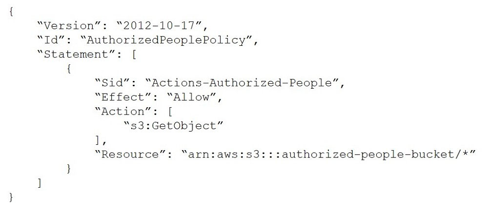
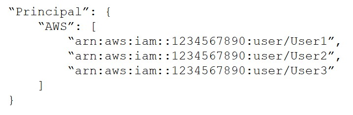
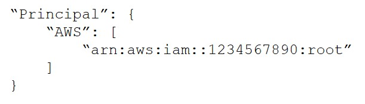
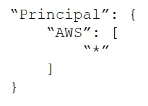
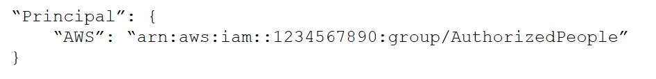
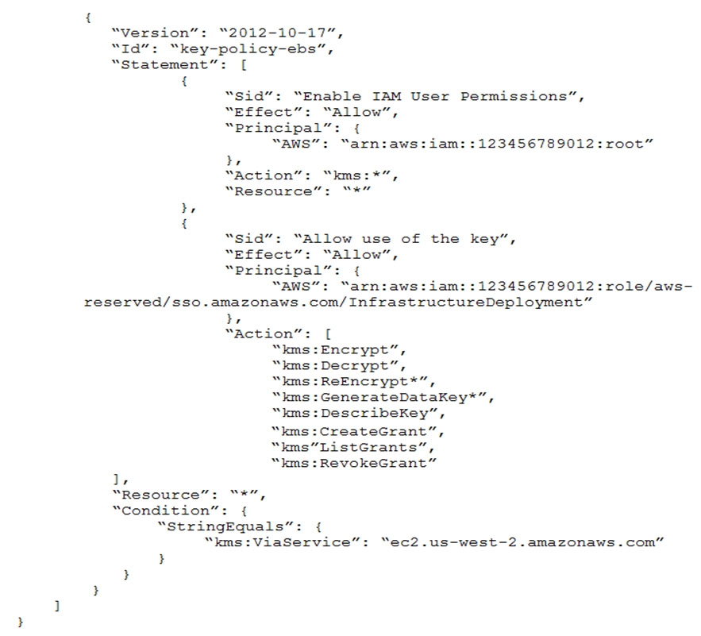
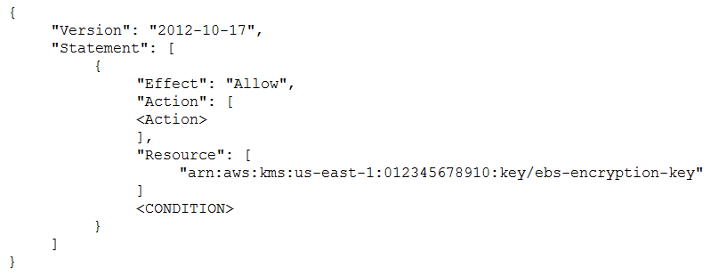
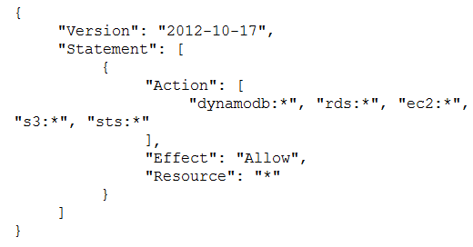
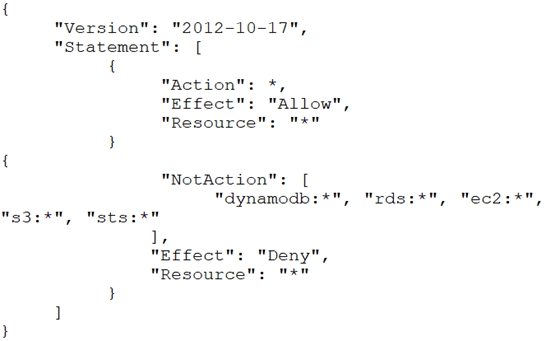
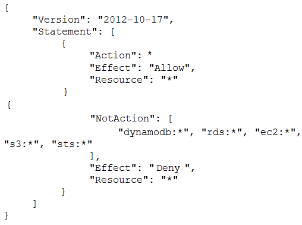

# Practice Exam 6

Click on the **Answer** button for the correct answer and its explanation.

If this practice exam has been helpful to you please share it with others and react to this below.

---

1. A security engineer needs to create an Amazon S3 bucket policy to grant least privilege read access to IAM user accounts that are named User1, User2 and User3. These IAM user accounts are members of the AuthorizedPeople IAM group. The security engineer drafts the following S3 bucket policy. When the security engineer tries to add the policy to the S3 bucket, the following message appears: `Missing required field Principal.` The security engineer is adding a Principal element to the policy. The addition must provide read access to only User1, User2 and User3. Which solution meets these requirements?

    - A) Option A.

    - B) Option B.

    - C) Option C.

    - D) Option D.

<b>Answer</b>
 Correct Answer(s): A

2. A company has decided to move its fleet of Linux-based web server instances to an Amazon EC2 Auto Scaling group. Currently, the instances are static and are launched manually. When an administrator needs to view log files, the administrator uses SSH to establish a connection to the instances and retrieves the logs manually. The company often needs to query the logs to produce results about application sessions and user issues. The company does not want its new automatically scaling architecture to result in the loss of any log files when instances are scaled in. Which combination of steps should a security engineer take to meet these requirements MOST cost-effectively? (Choose TWO)

    - A) Configure a cron job on the instances to forward the log files to Amazon S3 periodically.
    - B) Configure AWS Glue and Amazon Athena to query the log files.
    - C) Configure the Amazon CloudWatch agent on the instances to forward the logs to Amazon CloudWatch Logs.
    - D) Configure Amazon CloudWatch Logs Insights to query the log files.
    - E) Configure the instances to write the logs to an Amazon Elastic File System (Amazon EFS) volume.

<b>Answer</b>
 Correct Answer(s): C, D

3. A company maintains sensitive data in an Amazon S3 bucket that must be protected using an AWS KMS CMK. The company requires that keys be rotated automatically every year. How should the bucket be configured?

    - A) Select server-side encryption with Amazon S3-managed keys (SSE-S3) and select an AWS-managed CMK.
    - B) Select Amazon S3-AWS KMS managed encryption keys (S3-KMS) and select a customer-managed CMK with key rotation enabled.
    - C) Select server-side encryption with Amazon S3-managed keys (SSE-S3) and select a customer-managed CMK that has imported key material.
    - D) Select server-side encryption with AWS KMS-managed keys (SSE-KMS) and select an alias to an AWS-managed CMK.

<b>Answer</b>
 Correct Answer(s): D

4. A company maintains an open-source application that is hosted on a public GitHub repository. While creating a new commit to the repository, an engineer uploaded their AWS access key and secret access keys. The engineer reported the mistake to a manager, and the manager immediately disabled the access key. The company needs to assess the impact of the exposed access key. A security engineer must recommend a solution that requires the least possible managerial overhead. Which solution meets these requirements?

    - A) Analyze an AWS Identity and Access Management (IAM) use report from AWS Trusted Advisor to see. When the access key was last used.
    - B) Analyze Amazon CloudWatch Logs for activity by searching for the access key.
    - C) Analyze VPC flow logs for activity by searching for the access key.
    - D) Analyze a credential report in AWS Identity and Access Management (IAM) to see. When the access key was last used.

<b>Answer</b>
 Correct Answer(s): D

5. A Solutions Architect is designing a web application that uses Amazon CloudFront, an Elastic Load Balancing Application Load Balancer, and an Auto Scaling group of Amazon EC2 instances. The load balancer and EC2 instances are in the US West (Oregon) region. It has been decided that encryption in transit is necessary by using a customer-branded domain name from the client to CloudFront and from CloudFront to the load balancer. Assuming that AWS Certificate Manager is used, how many certificates will need to be generated?

    - A) One in the US West (Oregon) region and one in the US East (Virginia) region.
    - B) Two in the US West (Oregon) region and none in the US East (Virginia) region.
    - C) One in the US West (Oregon) region and none in the US East (Virginia) region.
    - D) Two in the US East (Virginia) region and none in the US West (Oregon) region.

<b>Answer</b>
 Correct Answer(s): A

6. A large company has hundreds of AWS accounts. The company needs to provide its employees with access to these accounts. The solution must maximize scalability and operational efficiency. Which solution meets these requirements?

    - A) With each AWS account, create dedicated IAM users that employees can assume through federation based upon group membership in their existing identity provider.
    - B) Use a centralized account with IAM roles that employees can assume through federation with their existing identity provider. Create a custom authorizer by using AWS SDK to give federated users the ability to assume their target role in the resource accounts.
    - C) Implement AWS Control Tower for multi-account management by integrating AWS Single Sign-On with the company's existing identity provider. Create IAM roles for the identity provider to assume.
    - D) Configure the IAM trust policies within each account's role to set up a trust back to the company's existing identity provider. Allow users to assume the role based on their SAML token.

<b>Answer</b>
 Correct Answer(s): C

7. A company is running an Amazon RDS Multi-AZ DB instance inside a VPC. The DB instance is using two subnets that provide a default route to the internet through a NAT gateway. The company also has application servers that run on Amazon EC2 instances that use the RDS database. The company has deployed these EC2 instances into two other private subnets within the same VPC. These EC2 instances use a default route to access the internet through the same NAT gateway. Each subnet in the VPC uses its own unique route table. After a recent security audit, the company added a new security requirement. The DB instance must never be able to connect to the internet. A security engineer must make this change immediately without disrupting the application servers' network traffic. How can the security engineer meet these requirements?

    - A) Remove the existing NAT gateway. Create a new NAT gateway that only the application server subnets can use.
    - B) Configure the DB instance's inbound network ACL to deny traffic from the security group ID of the NAT gateway.
    - C) Modify the route tables of the DB instance subnets to remove the default route to the NAT gateway.
    - D) Configure the route table of the NAT gateway to deny connections to the DB instance subnets.

<b>Answer</b>
 Correct Answer(s): C

8. A company has a group of Amazon EC2 instances in a single private subnet of a VPC with no internet gateway attached. A security engineer has installed the Amazon CloudWatch agent on all instances in that subnet to capture logs from a specific application. To ensure that the logs flow securely, the company's networking team has created VPC endpoints for CloudWatch monitoring and CloudWatch logs. The networking team has attached the endpoints to the VPC. The application is generating logs. However, when the security engineer queries CloudWatch, the logs do not appear. Which combination of steps should the security engineer take to troubleshoot this issue? (Choose THREE)

    - A) Ensure that the EC2 instance profile that is attached to the EC2 instances has permissions to create log streams and write logs.
    - B) Create a metric filter on the logs so that they can be viewed in the AWS Management Console.
    - C) Check the CloudWatch agent configuration file on each EC2 instance to make sure that the CloudWatch agent is collecting the proper log files.
    - D) Check the VPC endpoint policies of both VPC endpoints to ensure that the EC2 instances have permissions to use them.
    - E) Create a NAT gateway in the subnet so that the EC2 instances can communicate with CloudWatch.
    - F) Ensure that the security groups allow all the EC2 instances to communicate with each other to aggregate logs before sending.

<b>Answer</b>
 Correct Answer(s): A, C, D

9. A company is using Amazon Elastic Container Service (Amazon ECS) to run its container-based application on AWS. The company needs to ensure that the container images contain no severe vulnerabilities. The company also must ensure that only specific IAM roles and specific AWS accounts can access the container images. Which solution will meet these requirements with the LEAST management overhead?

    - A) Pull images from the public container registry. Publish the images to Amazon Elastic Container Registry (Amazon ECR) repositories with scan on push configured in a centralized AWS account. Use a CI/CD pipeline to deploy the images to different AWS accounts. Use identity-based policies to restrict access to which IAM principals can access the images.
    - B) Pull images from the public container registry. Publish the images to a private container registry that is hosted on Amazon EC2 instances in a centralized AWS account. Deploy host-based container scanning tools to EC2 instances that run Amazon ECS. Restrict access to the container images by using basic authentication over HTTPS.
    - C) Pull images from the public container registry. Publish the images to Amazon Elastic Container Registry (Amazon ECR) repositories with scan on push configured in a centralized AWS account. Use a CI/CD pipeline to deploy the images to different AWS accounts. Use repository policies and identity-based policies to restrict access to which IAM principals and accounts can access the images.
    - D) Pull images from the public container registry. Publish the images to AWS CodeArtifact repositories in a centralized AWS account. Use a CI/CD pipeline to deploy the images to different AWS accounts. Use repository policies and identity-based policies to restrict access to which IAM principals and accounts can access the images.

<b>Answer</b>
 Correct Answer(s): C

10. A company wants to establish separate AWS Key Management Service (AWS KMS) keys to use for different AWS services. The company's security engineer created the following key policy to allow the infrastructure deployment team to create encrypted Amazon Elastic Block Store (Amazon EBS) volumes by assuming the InfrastructueDeployment IAM role. The security engineer recently discovered that IAM roles other than the InfrastructureDeployment role used this key for other services. Which change to the policy should the security engineer make to resolve these issues?

    - A) In the statement block that contains the Sid Allow use of the key, under the Condition block, change StringEquals to StringLike.
    - B) In the policy document, remove the statement block that contains the Sid Enable IAM User Permissions. Add key management policies to the KMS policy.
    - C) In the statement block that contains the Sid Allow use of the key, under the Condition block, change the `kms:ViaService` value to ec2.`us-east-1`.amazonaws.com.
    - D) In the policy document, add a new statement block that grants the `kms:Disable*` permission to the security engineer's IAM role.

<b>Answer</b>
 Correct Answer(s): B

11. A company has enabled Amazon GuardDuty in all Regions as part of its security monitoring strategy. In one of the VPCs, the company hosts an Amazon EC2 instance working as an FTP server that is contacted by a high number of clients from multiple locations. This is identified by GuardDuty as a brute force attack due to the high number of connections that happen every hour. The finding has been flagged as a false positive. However, GuardDuty keeps raising the issue. A Security Engineer has been asked to improve the signal-to-noise ratio. The Engineer needs to ensure that changes do not compromise the visibility of potential anomalous behavior. How can the Security Engineer address the issue?

    - A) Disable the FTP rule in GuardDuty in the Region where the FTP server is deployed.
    - B) Add the FTP server to a trusted IP list and deploy it to GuardDuty to stop receiving the notifications.
    - C) Use GuardDuty filters with auto archiving enabled to close the findings.
    - D) Create an AWS Lambda function that closes the finding whenever a new occurrence is reported.

<b>Answer</b>
 Correct Answer(s): C

12. A company uses Amazon GuardDuty to detect threats and malicious activities in AWS accounts. The company has subscribed to a third-party threat intelligence list uploaded to an Amazon S3 bucket. How should the security engineer efficiently use the threat list across all company AWS accounts?

    - A) Ensure the S3 bucket policy allows all company AWS accounts access to the threat list. Use an AWS Lambda function to automatically add the threat list to all company AWS accounts.
    - B) Ensure GuardDuty is in master-member configuration. Add the threat list to the master account referencing the S3 object that contains the threat list.
    - C) Ensure all accounts are part of the same organization in AWS Organizations. Add the threat list to any company account within AWS Organizations.
    - D) Ensure the threat list in the S3 bucket is publicly accessible. Use an Amazon CloudWatch Events event on GuardDuty findings to match IPs against the threat list.

<b>Answer</b>
 Correct Answer(s): B

13. A company is hosting multiple applications within a single VPC in its AWS account. The applications are running behind an Application Load Balancer that is associated with an AWS WAF web ACL. The company's security team has identified that multiple port scans are originating from a specific range of IP addresses on the internet. A security engineer needs to deny access from the offending IP addresses. Which solution will meet these requirements?

    - A) Modify the AWS WAF web ACL with an IP set match rule statement to deny incoming requests from the IP address range.
    - B) Add a rule to all security groups to deny the incoming requests from the IP address range.
    - C) Modify the AWS WAF web ACL with a rate-based rule statement to deny incoming requests from the IP address range.
    - D) Configure the AWS WAF web ACL with regex match conditions. Specify a pattern set to deny the incoming requests based on the match condition.

<b>Answer</b>
 Correct Answer(s): A

14. A company has two software development teams that are creating applications that store sensitive data in Amazon S3. Each team's data must always be separate. The company's security team must design a data encryption strategy for both teams that provides the ability to audit key usage. The solution must also minimize operational overhead. What should the security team recommend?

    - A) Tell the application teams to use two different S3 buckets with separate AWS Key Management Service (AWS KMS) AWS managed CMKs. Limit the key policies to allow encryption and decryption of the CMKs to their respective teams only. Force the teams to use encryption context to encrypt and decrypt.
    - B) Tell the application teams to use two different S3 buckets with a single AWS Key Management Service (AWS KMS) AWS managed CMK. Limit the key policy to allow encryption and decryption of the CMK only. Do not allow the teams to use encryption context to encrypt and decrypt.
    - C) Tell the application teams to use two different S3 buckets with separate AWS Key Management Service (AWS KMS) customer managed CMKs. Limit the key policies to allow encryption and decryption of the CMKs to their respective teams only. Force the teams to use encryption context to encrypt and decrypt.
    - D) Tell the application teams to use two different S3 buckets with a single AWS Key Management Service (AWS KMS) customer managed CMK. Limit the key policy to allow encryption and decryption of the CMK only. Do not allow the teams to use encryption context to encrypt and decrypt.

<b>Answer</b>
 Correct Answer(s): C

15. An Amazon EC2 Auto Scaling group launches Amazon Linux EC2 instances and installs the Amazon CloudWatch agent to publish logs to Amazon CloudWatch Logs. The EC2 instances launch with an IAM role that has an IAM policy attached. The policy provides access to publish custom metrics to CloudWatch. The EC2 instances run in a private subnet inside a VPC The VPC provides access to the internet for private subnets through a NAT gateway. A security engineer notices that no logs are being published to CloudWatch Logs for the EC2 instances that the Auto Scaling group launches. The security engineer validates that the CloudWatch Logs agent is running and is configured properly on the EC2 instances. In addition, the security engineer validates that network communications are working properly to AWS services. What can the security engineer do to ensure that the logs are published to CloudWatch Logs?

    - A) Configure the IAM policy in use by the IAM role to have access to the required `cloudwatch: API` actions that will publish logs.
    - B) Adjust the Amazon EC2 Auto Scaling service-linked role to have permissions to write to CloudWatch Logs.
    - C) Configure the IAM policy in use by the IAM role to have access to the required AWS logs: API actions that will publish logs.
    - D) Add an interface VPC endpoint to provide a route to CloudWatch Logs.

<b>Answer</b>
 Correct Answer(s): A

16. A company has a web-based application that runs behind an Application Load Balancer (ALB). The application is experiencing a credential stuffing attack that is producing many failed login attempts. The attack is coming from many IP addresses. The login attempts are using a user agent string of a known mobile device emulator. A security engineer needs to implement a solution to mitigate the credential stuffing attack. The solution must still allow legitimate logins to the application. Which solution will meet these requirements?

    - A) Create an Amazon CloudWatch alarm that reacts to login attempts that contain the specified user agent string Add an Amazon Simple Notification Service (Amazon SNS) topic to the alarm.
    - B) Modify the inbound security group on the ALB to deny traffic from the IP addresses that are involved in the attack.
    - C) Create an AWS WAF web ACL for the ALB Create a custom rule that blocks requests that contain the user agent string of the device emulator.
    - D) Create an AWS WAF web ACL for the ALB. Create a custom rule that allows requests from legitimate user agent strings.

<b>Answer</b>
 Correct Answer(s): C

17. A DevOps team is planning to deploy a containerized application on Amazon Elastic Container Service (Amazon ECS). The team will use an Application Load Balancer (ALB) to distribute the incoming traffic for the ECS application. A security engineer needs to terminate the TLS traffic at the ALB to ensure security of data in transit. Which solutions can the security engineer use to create a certificate and deploy the certificate at the ALB to meet these requirements? (Choose TWO)

    - A) Use TLS tools to create a certificate signing request (CSR). Get the CSR signed by a certificate authority (CA) to produce a certificate. Import the certificate into AWS Certificate Manager (ACM).
Specify the certificate for the TLS listener on the ALB.
    - B) Use AWS Certificate Manager (ACM) to request a certificate. Specify the certificate fort the TLS listener on the ALB.
    - C) Use AWS Key Management Service (AWS KMS) tools to create a certificate signing request (CSR). Get the CSR signed by a certificate authority (CA) to produce a certificate. Import the certificate into AWS Certificate Manager (ACM). Specify the certificate for the TLS listener on the ALB.
    - D) Configure automatic TLS support in the ECS cluster. Configure the ALB to pass the TLS connection to the containers in the cluster.
    - E) Generate a certificate while creating the ECS cluster. Import the certificate into AWS Certificate Manager (ACM). Specify the certificate for the TLS listener on the ALB.

<b>Answer</b>
 Correct Answer(s): A, B

18. A company is running an Amazon RDS for MySQL DB instance in a VPC. The VPC must not send or receive network traffic through the internet. A security engineer wants to use AWS Secrets Manager to rotate the DB instance credentials automatically. Because of a security policy, the security engineer cannot use the standard AWS Lambda function that Secrets Manager provides to rotate the credentials. The security engineer deploys a custom Lambda function in the VPC. The custom Lambda function will be responsible for rotating the secret in Secrets Manager. The security engineer edits the DB instance's security group to allow connections from this function. When the function is invoked, the function cannot communicate with Secrets Manager to rotate the secret properly. What should the security engineer do so that the function can rotate the secret?

    - A) Add an egress-only internet gateway to the VPC. Allow only the Lambda function's subnet to route traffic through the egress-only internet gateway.
    - B) Add a NAT gateway to the VPC. Configure only the Lambda function's subnet with a default route through the NAT gateway.
    - C) Configure a VPC peering connection to the default VPC for Secrets Manager. Configure the Lambda function's subnet to use the peering connection for routes.
    - D) Configure a Secrets Manager interface VPC endpoint. Include the Lambda function's private subnet during the configuration process.

<b>Answer</b>
 Correct Answer(s): D

19. A security engineer needs to build a solution to turn AWS CloudTrail back on in multiple AWS Regions in case it is ever turned off. What is the MOST efficient way to implement this solution?

    - A) Use AWS Config with a managed rule to initiate the AWS-EnableCloudTrail remediation.
    - B) Create an Amazon EventBridge event with a cloudtrail.amazonaws.com event source and a StartLogging event name to invoke an AWS Lambda function to call the StartLogging
API.
    - C) Create an Amazon CloudWatch alarm with a cloudtrail.amazonaws.com event source and a StopLoggmg event name to invoke an AWS Lambda function to call the StartLogging API.
    - D) Monitor AWS Trusted Advisor to ensure CloudTrail logging is enabled.

<b>Answer</b>
 Correct Answer(s): A

20. A public subnet contains two Amazon EC2 instances. The subnet has a custom network ACL. A security engineer is designing a solution to improve the subnet security. The solution must allow outbound traffic to an internet service that uses TLS through port 443. The solution also must deny inbound traffic that is destined for MySQL port 3306. Which network ACL rule set meets these requirements?

    - A) Use inbound rule 100 to allow traffic on TCP port 443. Use inbound rule 200 to deny traffic on TCP port 3306. Use outbound rule 100 to allow traffic on TCP port 443.
    - B) Use inbound rule 100 to deny traffic on TCP port 3306. Use inbound rule 200 to allow traffic on TCP port range 1024-65535. Use outbound rule 100 to allow traffic on TCP port 443.
    - C) Use inbound rule 100 to allow traffic on TCP port range 1024-65535. Use inbound rule 200 to deny traffic on TCP port 3306. Use outbound rule 100 to allow traffic on TCP port 443.
    - D) Use inbound rule 100 to deny traffic on TCP port 3306. Use inbound rule 200 to allow traffic on TCP port 443. Use outbound rule 100 to allow traffic on TCP port 443.

<b>Answer</b>
 Correct Answer(s): A

21. A security engineer is configuring a mechanism to send an alert when three or more failed sign-in attempts to the AWS Management Console occur during a 5-minute period. The security engineer creates a trail in AWS CloudTrail to assist in this work. Which solution will meet these requirements?

    - A) In CloudTrail, turn on Insights events on the trail. Configure an alarm on the insight with eventName matching ConsoleLogin and errorMessage matching `Failed authentication`. Configure a threshold of 3 and a period of 5 minutes.
    - B) Configure CloudTrail to send events to Amazon CloudWatch Logs. Create a metric filter for the relevant log group. Create a filter pattern with eventName matching ConsoleLogin and errorMessage matching `Failed authentication`. Create a CloudWatch alarm with a threshold of 3 and a period of 5 minutes.
    - C) Create an Amazon Athena table from the CloudTrail events. Run a query for eventName matching ConsoleLogin and for errorMessage matching `Failed authentication`. Create a notification action from the query to send an Amazon Simple Notification Service (Amazon SNS) notification when the count equals 3 within a period of 5 minutes.
    - D) In AWS Identity and Access Management Access Analyzer, create a new analyzer. Configure the analyzer to send an Amazon Simple Notification Service (Amazon SNS) notification when a failed sign-in event occurs 3 times for any IAM user within a period of 5 minutes.

<b>Answer</b>
 Correct Answer(s): B

22. A company's security engineer receives an abuse notification from AWS. The notification indicates that someone is hosting malware from the company's AWS account. After investigation, the security engineer finds a new Amazon S3 bucket that an IAM user created without authorization. Which combination of steps should the security engineer take to MINIMIZE the consequences of this compromise? (Choose THREE)

    - A) Encrypt all AWS CloudTrail logs.
    - B) Turn on Amazon GuardDuty.
    - C) Change the password for all IAM users.
    - D) Rotate or delete all AWS access keys.
    - E) Take snapshots of all Amazon Elastic Block Store (Amazon EBS) volumes.
    - F) Delete any resources that are unrecognized or unauthorized.

<b>Answer</b>
 Correct Answer(s): C, D, F

23. A company has a web server in the AWS Cloud. The company will store the content for the web server in an Amazon S3 bucket. A security engineer must use an Amazon CloudFront distribution to speed up delivery of the content. None of the files can be publicly accessible from the S3 bucket directly. Which solution will meet these requirements?

    - A) Configure the permissions on the individual files in the S3 bucket so that only the CloudFront distribution has access to them.
    - B) Create an origin access control (OAC). Associate the OAC with the CloudFront distribution. Configure the S3 bucket permissions so that only the OAC can access the files in the S3 bucket.
    - C) Create an S3 role in AWS Identity and Access Management (IAM). Allow only the CloudFront distribution to assume the role to access the files in the S3 bucket.
    - D) Create an S3 bucket policy that uses only the CloudFront distribution ID as the principal and the Amazon Resource Name (ARN) as the target.

<b>Answer</b>
 Correct Answer(s): B

24. A company does not allow the permanent installation of SSH keys onto an Amazon Linux 2 EC2 instance. However, three employees who have IAM user accounts require access to the EC2 instance. The employees must use an SSH session to perform critical duties. How can a security engineer provide the appropriate access to the EC2 instance to meet these requirements?

    - A) Use AWS Systems Manager Inventory to select the EC2 instance and connect. Provide the IAM user accounts with the permissions to use Systems Manager Inventory.
    - B) Use AWS Systems Manager Run Command to open an SSH connection to the EC2 instance. Provide the IAM user accounts with the permissions to use Run Command.
    - C) Use AWS Systems Manager Session Manager. Provide the IAM user accounts with the permissions to use Systems Manager Session Manager.
    - D) Connect to the EC2 instance as the ec2-user through the AWS Management Console's EC2 SSH client method. Provide the IAM user accounts with access to use the EC2 service in the AWS Management Console.

<b>Answer</b>
 Correct Answer(s): C

25. A company wants to prevent SSH access through the use of SSH key pairs for any Amazon Linux 2 Amazon EC2 instances in its AWS account. However, a system administrator occasionally will need to access these EC2 instances through SSH in an emergency. For auditing purposes, the company needs to record any commands that a user runs in an EC2 instance. What should a security engineer do to configure access to these EC2 instances to meet these requirements?

    - A) Use the EC2 serial console. Configure the EC2 serial console to save all commands that are entered to an Amazon S3 bucket. Provide the EC2 instances with an IAM role that allows the EC2 serial console to access Amazon S3. Configure an IAM account for the system administrator. Provide an IAM policy that allows the IAM account to use the EC2 serial console.
    - B) Use EC2 Instance Connect. Configure EC2 Instance Connect to save all commands that are entered to Amazon CloudWatch Logs. Provide the EC2 instances with an IAM role that allows the EC2 Instances to access CloudWatch Logs. Configure an IAM account for the system administrator. Provide an IAM policy that allows the IAM account to use EC2 Instance Connect.
    - C) Use an EC2 key pair with an EC2 instance that needs SSH access. Access the EC2 instance with this key pair by using SSH. Configure the EC2 instance to save all commands that are entered to Amazon CloudWatch Logs. Provide the EC2 instance with an IAM role that allows the EC2 instance to access Amazon S3 and CloudWatch Logs.
    - D) Use AWS Systems Manager Session Manager. Configure Session Manager to save all commands that are entered in a session to an Amazon S3 bucket. Provide the EC2 instances with an IAM role that allows Systems Manager to manage the EC2 instances. Configure an IAM account for the system administrator. Provide an IAM policy that allows the IAM account to use Session Manager.

<b>Answer</b>
 Correct Answer(s): D

26. A company is using AWS Organizations to manage multiple AWS accounts. The company has an application that allows users to assume the AppUser IAM role to download files from an Amazon S3 bucket that is encrypted with an AWS KMS CMK. However, when users try to access the files in the S3 bucket, they get an access denied error. What should a security engineer do to troubleshoot this error? (Choose THREE)

    - A) Ensure the KMS policy allows the AppUser role to have permission to decrypt for the CMK.
    - B) Ensure the S3 bucket policy allows the AppUser role to have permission to get objects for the S3 bucket.
    - C) Ensure the CMK was created before the S3 bucket.
    - D) Ensure the S3 block public access feature is enabled for the S3 bucket.
    - E) Ensure that automatic key rotation is disabled for the CMK.
    - F) Ensure the SCPs within Organizations allow access to the S3 bucket.

<b>Answer</b>
 Correct Answer(s): A, B, F

27. A company is building applications in containers. The company wants to migrate its on-premises development and operations services from its on-premises data center to AWS. Management states that production systems must be cloud agnostic and use the same configuration and administrator tools across production systems. A solutions architect needs to design a managed solution that will align open-source software. Which solution meets these requirements?

    - A) Launch the containers on Amazon EC2 with EC2 instance worker nodes.
    - B) Launch the containers on Amazon Elastic Kubernetes Service (Amazon EKS) and EKS worker nodes.
    - C) Launch the containers on Amazon Elastic Containers service (Amazon ECS) with AWS Fargate instances.
    - D) Launch the containers on Amazon Elastic Container Service (Amazon ECS) with Amazon EC2 instance worker nodes.

<b>Answer</b>
 Correct Answer(s): B

28. A company uses infrastructure as code (IaC) to create AWS infrastructure. The company writes the code as AWS CloudFormation templates to deploy the infrastructure. The company has an existing CI/CD pipeline that the company can use to deploy these templates. After a recent security audit, the company decides to adopt a policy-as-code approach to improve the company's security posture on AWS. The company must prevent the deployment of any infrastructure that would violate a security policy, such as an unencrypted Amazon Elastic Block Store (Amazon EBS) volume. Which solution will meet these requirements?

    - A) Turn on AWS Trusted Advisor. Configure security notifications as webhooks in the preferences section of the CI/CD pipeline.
    - B) Turn on AWS Config. Use the prebuilt rules or customized rules. Subscribe tile CI/CD pipeline to an Amazon Simple Notification Service (Amazon SNS) topic that receives notifications from AWS Config.
    - C) Create rule sets in AWS CloudFormation Guard. Run validation checks for CloudFormation templates as a phase of the CI/CD process.
    - D) Create rule sets as SCPs. Integrate the SCPs as a part of validation control in a phase of the CI/CD process.

<b>Answer</b>
 Correct Answer(s): C

29. A security engineer is setting up a new AWS account. The engineer has been asked to continuously monitor the company's AWS account using automated compliance checks based on AWS best practices and Center for Internet Security (CIS) AWS Foundations Benchmarks. How can the security engineer accomplish this using AWS services?

    - A) Enable AWS Config and set it to record all resources in all Regions and global resources. Then enable AWS Security Hub and confirm that the CIS AWS Foundations compliance standard is enabled.
    - B) Enable Amazon Inspector and configure it to scan all Regions for the CIS AWS Foundations Benchmarks. Then enable AWS Security Hub and configure it to ingest the Amazon Inspector findings.
    - C) Enable Amazon Inspector and configure it to scan all Regions for the CIS AWS Foundations Benchmarks. Then enable AWS Shield in all Regions to protect the account from DDoS attacks.
    - D) Enable AWS Config and set it to record all resources in all Regions and global resources. Then enable Amazon Inspector and configure it to enforce CIS AWS Foundations Benchmarks using AWS Config rules.

<b>Answer</b>
 Correct Answer(s): A

30. A company uses AWS Organizations to manage several AWs accounts. The company processes a large volume of sensitive data. The company uses a serverless approach to microservices. The company stores all the data in either Amazon S3 or Amazon DynamoDB. The company reads the data by using either AWS Lambda functions or container-based services that the company hosts on Amazon Elastic Kubernetes Service (Amazon EKS) on AWS Fargate. The company must implement a solution to encrypt all the data at rest and enforce least privilege data access controls. The company creates an AWS Key Management Service (AWS KMS) customer managed key. What should the company do next to meet these requirements?

    - A) Create a key policy that allows the `kms:Decrypt` action only for Amazon S3 and DynamoDB. Create an SCP that denies the creation of S3 buckets and DynamoDB tables that are not encrypted with the key.
    - B) Create an IAM policy that denies the `kms:Decrypt` action for the key. Create a Lambda function than runs on a schedule to attach the policy to any new roles. Create an AWS Config rule to send alerts for resources that are not encrypted with the key.
    - C) Create a key policy that allows the `kms:Decrypt` action only for Amazon S3, DynamoDB, Lambda, and Amazon EKS. Create an SCP that denies the creation of S3 buckets and DynamoDB tables that are not encrypted with the key.
    - D) Create a key policy that allows the `kms:Decrypt` action only for Amazon S3, DynamoDB, Lambda, and Amazon EKS. Create an AWS Config rule to send alerts for resources that are not encrypted with the key.

<b>Answer</b>
 Correct Answer(s): C

31. A security engineer is configuring AWS Config for an AWS account that uses a new IAM entity. When the security engineer tries to configure AWS Config rules and automatic remediation options, errors occur. In the AWS CloudTrail logs, the security engineer sees the following error message: `Insufficient delivery policy to s3 bucket: DOC-EXAMPLE-BUCKET, unable to write to bucket, provided s3 key prefix is 'null'.` Which combination of steps should the security engineer take to remediate this issue? (Choose TWO)

    - A) Check the Amazon S3 bucket policy. Verify that the policy allows the config amazonaws,com service to write to the target bucket.
    - B) Verify that the IAM entity has the permissions necessary to perform the `s3:GetBucketAcl and s3:PutObject*` operations to write to the target bucket.
    - C) Verify that the Amazon S3 bucket policy has the permissions necessary to perform the `s3:GetBucketAcl and s3:PutObject*` operations to write to the target bucket.
    - D) Check the policy that is associated with the IAM entity. Verify that the policy allows the config.amazonaws.com service to write to the target bucket.
    - E) Verify that the AWS Config service role has permissions to invoke the BatchGetResourceConfig action instead of the GetResourceConfigHistory action and `s3:PutObject*` operation.

<b>Answer</b>
 Correct Answer(s): A, B

32. A company is running a legacy application on Amazon EC2 instances in multiple Availability Zones behind a software load balancer that runs on an active/standby set of EC2 instances. For disaster recovery, the company has created a warm standby version of the application environment that is deployed in another AWS Region. The domain for the application uses a hosted zone from Amazon Route 53. The company needs the application to use static IP addresses, even in the case of a failover event to the secondary Region. The company also requires the client's source IP address to be available for auditing purposes. Which solution meets these requirements with the LEAST amount of operational overhead?

    - A) Replace the software load balancer with an AWS Application Load Balancer. Create an AWS Global Accelerator accelerator. Add an endpoint group for each Region. Configure Route 53 health checks. Add an alias record that points to the accelerator.
    - B) Replace the software load balancer with an AWS Network Load Balancer. Create an AWS Global Accelerator accelerator. Add an endpoint group for each Region. Configure Route 53 health checks. Add a CNAME record that points to the DNS name of the accelerator.
    - C) Replace the software load balancer with an AWS Application Load Balancer. Use AWS Global Accelerator to create two separate accelerators. Add an endpoint group for each Region. Configure Route 53 health checks. Add a record set that is configured for active-passive DNS failover. Point the record set to the DNS names of the two accelerators.
    - D) Replace the software load balancer with an AWS Network Load Balancer. Use AWS Global Accelerator to create two separate accelerators. Add an endpoint group for each Region. Configure Route 53 health checks. Add a record set that is configured for weighted round-robin DNS failover. Point the record set to the DNS names of the two accelerators.

<b>Answer</b>
 Correct Answer(s): A

33. An online media company has an application that customers use to watch events around the world. The application is hosted on a fleet of Amazon EC2 instances that run Amazon Linux 2. The company uses AWS Systems Manager to manage the EC2 instances. The company applies patches and application updates by using the AWS-AmazonLinux2DefaultPatchBaseline patching baseline in Systems Manager Patch Manager. The company is concerned about potential attacks on the application during the week of an upcoming event. The company needs a solution that can immediately deploy patches to all the EC2 instances in response to a security incident or vulnerability. The solution also must provide centralized evidence that the patches were applied successfully. Which combination of steps will meet these requirements? (Choose TWO)

    - A) Create a new patching baseline in Patch Manager. Specify Amazon Linux 2 as the product. Specify Security as the classification. Set the automatic approval for patches to 0 days. Ensure that the new patching baseline is the designated default for Amazon Linux 2.
    - B) Use the Patch Now option with the scan and install operation in the Patch Manager console to apply patches against the baseline to all nodes. Specify an Amazon S3 bucket as the patching log storage option.
    - C) Use the Clone function of Patch Manager to create a copy of the AWS-AmazonLmux2DefaultPatchBaseline built-in baseline. Set the automatic approval for patches to 1 day.
    - D) Create a patch policy that patches all managed nodes and sends a patch operation log output to an Amazon S3 bucket. Use a custom scan schedule to set Patch Manager to check every hour for new patches. Assign the baseline to the patch policy.
    - E) Use Systems Manager Application Manager to inspect the package versions that were installed on the EC2 instances. Additionally use Application Manager to validate that the patches were correctly installed.

<b>Answer</b>
 Correct Answer(s): A, B

34. A company's data lake uses Amazon S3 and Amazon Athena. The company's security engineer has been asked to design an encryption solution that meets the company's data protection requirements. The encryption solution must work with Amazon S3 and keys managed by the company. The encryption solution must be protected in a hardware security module that is validated to Federal Information Processing Standards (FIPS) 140-2 Level 3. Which solution meets these requirements?

    - A) Use client-side encryption with an AWS KMS customer-managed key implemented with the AWS Encryption SDK.
    - B) Use AWS CloudHSM to store the keys and perform cryptographic operations. Save the encrypted text in Amazon S3.
    - C) Use an AWS KMS customer-managed key that is backed by a custom key store using AWS CloudHSM.
    - D) Use an AWS KMS customer-managed key with the bring your own key (BYOK) feature to import a key stored in AWS CloudHSM.

<b>Answer</b>
 Correct Answer(s): C

35. A company has a serverless application that uses AWS Lambda functions and AWS Systems Manager parameters to store configuration data. The company moves the Lambda functions inside the VPC and into private subnets. The Lambda functions are now producing errors in their attempts to access Systems Manager parameters. Which solution will allow the Lambda functions to access Systems Manager parameters inside the VPC?

    - A) Configure security groups to allow access to Systems Manager.
    - B) Create an interface VPC endpoint for Systems Manager.
    - C) Use an Internet gateway from inside the VPC.
    - D) Create a gateway VPC endpoint for Systems Manager.

<b>Answer</b>
 Correct Answer(s): B

36. A company has an application on Amazon EC2 instances that store confidential customer data. The company must restrict access to customer data. A security engineer requires secure access to the instances that host the application. According to company policy, users must not open any inbound ports, maintain bastion hosts, or manage SSH keys for the EC2 instances. The security engineer wants to monitor, store, and access all session activity logs. The logs must be encrypted. Which solution will meet these requirements?

    - A) Use AWS Control Tower to connect to the EC2 instances. Configure Amazon CloudWatch logging for the sessions. Select the upload session logs option and allow only encrypted CloudWatch Logs log groups.
    - B) Use AWS Security Hub to connect to the EC2 instances. Configure Amazon CloudWatch logging for the sessions. Select the upload session logs option and allow only encrypted CloudWatch Logs log groups.
    - C) Use AWS Systems Manager Session Manager to connect to the EC2 instances. Configure Amazon CloudWatch monitoring to record the sessions. Select the store session logs option for the desired CloudWatch Logs log groups.
    - D) Use AWS Systems Manager Session Manager to connect to the EC2 instances. Configure Amazon CloudWatch logging. Select the upload session logs option and allow only encrypted CloudWatch Logs log groups.

<b>Answer</b>
 Correct Answer(s): D

37. A company's security policy requires that VPC Flow Logs are enabled on all VPCs. A Security Engineer is looking to automate the process of auditing the VPC resources for compliance. What combination of actions should the Engineer take? (Choose TWO)

    - A) Create an AWS Lambda function that determines whether Flow Logs are enabled for a given VPC.
    - B) Create an AWS Config configuration item for each VPC in the company AWS account.
    - C) Create an AWS Config managed rule with a resource type of AWS:: Lambda:: Function.
    - D) Create an Amazon CloudWatch Event rule that triggers on events emitted by AWS Config.
    - E) Create an AWS Config custom rule, and associate it with an AWS Lambda function that contains the evaluating logic.

<b>Answer</b>
 Correct Answer(s): A, E

38. A security engineer is creating an AWS Lambda function. The Lambda function needs to use a role that is named LambdaAuditRole to assume a role that is named AcmeAuditFactoryRole in a different AWS account. When the code is processed, the following error message appears: `An error occurred (AccessDenied) when calling the AssumeRole operation.` Which combination of steps should the security engineer take to resolve this error? (Choose TWO)

    - A) Ensure that LambdaAuditRole has the `sts:AssumeRole` permission for AcmeAuditFactoryRole.
    - B) Ensure that LambdaAuditRole has the AWSLambdaBasicExecutionRole managed policy attached.
    - C) Ensure that the trust policy for AcmeAuditFactoryRole allows the `sts:AssumeRole` action from LambdaAuditRole.
    - D) Ensure that the trust policy for LambdaAuditRole allows the `sts:AssumeRole` action from the lambda.amazonaws.com service.
    - E) Ensure that the `sts:AssumeRole` API call is being issued to the us-east-1 Region endpoint.

<b>Answer</b>
 Correct Answer(s): A, C

39. A company's application uses Amazon DynamoDB to store data. The company's security policy requires all data to be encrypted at rest. The security policy also requires the company to use an on-premises hardware security module (HSM) to generate and manage the company's encryption keys. A security engineer uses the on-premises HSM to generate an encryption key. What should the security engineer do next to meet these requirements?

    - A) Generate a new AWS Key Management Service (AWS KMS) customer managed key. Import the new key material. Grant DynamoDB access to use the key. Create a new DynamoDB table, and select the new key as the encryption key. Import the data into DynamoDB.
    - B) Generate a new AWS Key Management Service (AWS KMS) customer managed key. Import the new key material. Create a new DynamoDB table, and select the new key as the encryption key. Disable the KMS key after table creation. Import the data into DynamoDB.
    - C) Generate a new AWS Key Management Service (AWS KMS) AWS managed key. Import the new key material. Grant DynamoDB access to use the key. Create a new DynamoDB table, and select the new key as the encryption key. Import the data into DynamoDB.
    - D) Generate a new AWS Key Management Service (AWS KMS) AWS managed key. Import the new key material. Use the AWS SDK integration with AWS KMS to encrypt the data locally by using the new KMS key. Create a new DynamoDB table, and select the new key as the encryption key. Disable the KMS key after table creation. Import the data into DynamoDB.

<b>Answer</b>
 Correct Answer(s): A

40. A security engineer has noticed that VPC Flow Logs are getting a lot of REJECT traffic originating from a single Amazon EC2 instance in an Auto Scaling group. The security engineer is concerned that this EC2 instance may be compromised. What immediate action should the security engineer take?

    - A) Remove the instance from the Auto Scaling group. Close the security group with ingress only from a single forensic IP address to perform an analysis.
    - B) Remove the instance from the Auto Scaling group. Change the network ACL rules to allow traffic only from a single forensic IP address to perform an analysis. Add a rule to deny all other traffic.
    - C) Remove the instance from the Auto Scaling group. Enable Amazon GuardDuty in that AWS account. Install the Amazon Inspector agent on the suspicious EC2 instance to perform a scan.
    - D) Take a snapshot of the suspicious EC2 instance. Create a new EC2 instance from the snapshot in a closed security group with ingress only from a single forensic IP address to perform an analysis.

<b>Answer</b>
 Correct Answer(s): A

41. A company is running its workloads in a single AWS Region and uses AWS Organizations. A security engineer must implement a solution to prevent users from launching resources in other Regions. Which solution will meet these requirements with the LEAST operational overhead?

    - A) Create an IAM policy that has an `aws:RequestedRegion` condition that allows actions only in the designated Region. Attach the policy to all users.
    - B) Create an IAM policy that has an `aws:RequestedRegion` condition that denies actions that are not in the designated Region. Attach the policy to the AWS account in AWS Organizations.
    - C) Create an IAM policy that has an `aws:RequestedRegion` condition that allows the desired actions. Attach the policy only to the users who are in the designated Region.
    - D) Create an SCP that has an `aws:RequestedRegion` condition that denies actions that are not in the designated Region. Attach the SCP to the AWS account in AWS Organizations.

<b>Answer</b>
 Correct Answer(s): D

42. A security engineer is evaluating a company's use of AWS Key Management Service (AWS KMS). The security engineer must implement a hybrid solution with two sets of keys to meet the following requirements: Set 1: The company needs granular control over the keys so that the company can maintain a copy of the keys in the key management infrastructure and reimport the keys at any time. The company needs the ability to set the expiration period to 3 days for the keys. Set 2: No restrictions exist regarding immediate key deletion. A waiting period of 14 days is acceptable for keys to be marked deleted. Which solution will meet these requirements?

    - A) Use imported keys for Set 1. Use AWS managed keys for Set 2. For Set 1, set an expiration period and manually delete the keys after the expiration period has elapsed.
    - B) Use imported keys for Set 1. Use AWS managed keys for Set 2. For Set 1, set an expiration period. AWS will automatically delete the keys after the expiration period has elapsed.
    - C) Use AWS managed keys for Set 1. Use imported keys for Set 2. For Set 1, set an expiration period and manually delete the keys after the expiration period has elapsed.
    - D) Use AWS managed keys for Set 1. Use imported keys for Set 2. For Set 1, set an expiration period. AWS will automatically delete the keys after the expiration period has elapsed.

<b>Answer</b>
 Correct Answer(s): B

43. A company operates a web application that runs on Amazon EC2 instances. The application listens on port 80 and port 443. The company uses an Application Load Balancer (ALB) with AWS WAF to terminate SSL and to forward traffic to the application instances only on port 80. The ALB is in public subnets that are associated with a network ACL that is named NACL. The application instances are in dedicated private subnets that are associated with a network ACL that is named NACL2. An Amazon RDS for PostgreSQL DB instance that uses port 5432 is in a dedicated private subnet that is associated with a network ACL that is named NACL3. All the network ACLs currently allow all inbound and outbound traffic. Which set of network ACL changes will increase the security of the application while ensuring functionality?

    - A) Make the following changes to NACL3: Add a rule that allows inbound traffic on port 5432 from NACL2. Add a rule that allows outbound traffic on ports 1024-65536 to NACL2. Remove the default rules that allow all inbound and outbound traffic.
    - B) Make the following changes to NACL3: Add a rule that allows inbound traffic on port 5432 from the CIDR blocks of the application instance subnets. Add a rule that allows outbound traffic on ports 1024-65536 to the application instance subnets. Remove the default rules that allow all inbound and outbound traffic.
    - C) Make the following changes to NACL2: Add a rule that allows outbound traffic on port 5432 to the CIDR blocks of the RDS subnets. Remove the default rules that allow all inbound and outbound traffic.
    - D) Make the following changes to NACL2: Add a rule that allows inbound traffic on port 5432 from the CIDR blocks of the RDS subnets. Add a rule that allows outbound traffic on port 5432 to the RDS subnets.

<b>Answer</b>
 Correct Answer(s): B

44. The Security team believes that a former employee may have gained unauthorized access to AWS resources sometime in the past 3 months by using an identified access key. What approach would enable the Security team to find out what the former employee may have done within AWS?

    - A) Use the AWS CloudTrail console to search for user activity.
    - B) Use the Amazon CloudWatch Logs console to filter CloudTrail data by user.
    - C) Use AWS Config to see what actions were taken by the user.
    - D) Use Amazon Athena to query CloudTrail logs stored in Amazon S3.

<b>Answer</b>
 Correct Answer(s): A

45. A company is storing data in Amazon S3 Glacier. The security engineer implemented a new vault lock policy for 10TB of data and called initiate-vault-lock operation 12 hours ago. The audit team identified a typo in the policy that is allowing unintended access to the vault. What is the MOST cost-effective way to correct this?

    - A) Call the abort-vault-lock operation. Update the policy. Call the initiate-vault-lock operation again.
    - B) Copy the vault data to a new S3 bucket. Delete the vault. Create a new vault with the data.
    - C) Update the policy to keep the vault lock in place.
    - D) Update the policy. Call initiate-vault-lock operation again to apply the new policy.

<b>Answer</b>
 Correct Answer(s): A

46. A company wants to control access to its AWS resources by using identities and groups that are defined in its existing Microsoft Active Directory.What must the company create in its AWS account to map permissions for AWS services to Active Directory user attributes?

    - A) AWS IAM groups.
    - B) AWS IAM users.
    - C) AWS IAM roles.
    - D) AWS IAM access keys.

<b>Answer</b>
 Correct Answer(s): C

47. A company has contracted with a third party to audit several AWS accounts. To enable the audit, cross-account IAM roles have been created in each account targeted for audit. The auditor is having trouble accessing some of the accounts. Which of the following may be causing this problem? (Choose THREE)

    - A) The external ID used by the auditor is missing or incorrect.
    - B) The auditor is using the incorrect password.
    - C) The auditor has not been granted `sts:AssumeRole` for the role in the destination account.
    - D) The Amazon EC2 role used by the auditor must be set to the destination account role.
    - E) The secret key used by the auditor is missing or incorrect.
    - F) The role ARN used by the auditor is missing or incorrect.

<b>Answer</b>
 Correct Answer(s): A, C, F

48. Compliance requirements state that all communications between company on-premises hosts and EC2 instances be encrypted in transit. Hosts use custom proprietary protocols for their communication, and EC2 instances need to be fronted by a load balancer for increased availability. Which of the following solutions will meet these requirements?

    - A) Offload SSL termination onto an SSL listener on a Classic Load Balancer, and use a TCP connection between the load balancer and the EC2 instances.
    - B) Route all traffic through a TCP listener on a Classic Load Balancer, and terminate the TLS connection on the EC2 instances.
    - C) Create an HTTPS listener using an Application Load Balancer, and route all of the communication through that load balancer.
    - D) Offload SSL termination onto an SSL listener using an Application Load Balancer, and re-spawn and SSL connection between the load balancer and the EC2 instances.

<b>Answer</b>
 Correct Answer(s): B

49. A Security Administrator is restricting the capabilities of company root user accounts. The company uses AWS Organizations and has enabled it for all feature sets, including consolidated billing. The top-level account is used for billing and administrative purposes, not for operational AWS resource purposes. How can the Administrator restrict usage of member root user accounts across the organization?

    - A) Disable the use of the root user account at the organizational root. Enable multi-factor authentication of the root user account for each organizational member account.
    - B) Configure IAM user policies to restrict root account capabilities for each Organizations member account.
    - C) Create an organizational unit (OU) in Organizations with a service control policy that controls usage of the root user. Add all operational accounts to the new OU.
    - D) Configure AWS CloudTrail to integrate with Amazon CloudWatch Logs and then create a metric filter for RootAccountUsage.

<b>Answer</b>
 Correct Answer(s): C

50. A Systems Engineer has been tasked with configuring outbound mail through Simple Email Service (SES) and requires compliance with current TLS standards. The mail application should be configured to connect to which of the following endpoints and corresponding ports?

    - A) `email.us-east-1.amazonaws.com` over port 8080.
    - B) `email-pop3.us-east-1.amazonaws.com` over port 995.
    - C) `email-smtp.us-east-1.amazonaws.com` over port 587.
    - D) `email-imap.us-east-1.amazonaws.com` over port 993.

<b>Answer</b>
 Correct Answer(s): C

51. A threat assessment has identified a risk whereby an internal employee could exfiltrate sensitive data from production host running inside AWS (Account 1). The threat was documented as follows: Threat description: A malicious actor could upload sensitive data from Server X by configuring credentials for an AWS account (Account 2) they control and uploading data to an Amazon S3 bucket within their control. Server X has outbound internet access configured via a proxy server. Legitimate access to S3 is required so that the application can upload encrypted files to an S3 bucket. Server X is currently using an IAM instance role. The proxy server is not able to inspect any of the server communication due to TLS encryption. Which of the following options will mitigate the threat? (Choose TWO)

    - A) Bypass the proxy and use an S3 VPC endpoint with a policy that whitelists only certain S3 buckets within Account 1.
    - B) Block outbound access to public S3 endpoints on the proxy server.
    - C) Configure Network ACLs on Server X to deny access to S3 endpoints.
    - D) Modify the S3 bucket policy for the legitimate bucket to allow access only from the public IP addresses associated with the application server.
    - E) Remove the IAM instance role from the application server and save API access keys in a trusted and encrypted application config file.

<b>Answer</b>
 Correct Answer(s): A, B

52. A company will store sensitive documents in three Amazon S3 buckets based on a data classification scheme of `Sensitive,` `Confidential,` and `Restricted.` The security solution must meet all of the following requirements:  Each object must be encrypted using a unique key. Items that are stored in the `Restricted` bucket require two-factor authentication for decryption. AWS KMS must automatically rotate encryption keys annually. Which of the following meets these requirements?

    - A) Create a Customer Master Key (CMK) for each data classification type, and enable the rotation of it annually. For the `Restricted` CMK, define the MFA policy within the key policy. Use S3 SSE-KMS to encrypt the objects.
    - B) Create a CMK grant for each data classification type with EnableKeyRotation and MultiFactorAuthPresent set to `true`. S3 can then use the grants to encrypt each object with a unique CMK.
    - C) Create a CMK for each data classification type, and within the CMK policy, enable rotation of it annually, and define the MFA policy. S3 can then create DEK grants to uniquely encrypt each object within the S3 bucket.
    - D) Create a CMK with unique imported key material for each data classification type, and rotate them annually. For the `Restricted` key material, define the MFA policy in the key policy. Use S3 SSE-KMS to encrypt the objects.

<b>Answer</b>
 Correct Answer(s): A

53. An organization wants to deploy a three-tier web application whereby the application servers run on Amazon EC2 instances. These EC2 instances need access to credentials that they will use to authenticate their SQL connections to an Amazon RDS DB instance. Also, AWS Lambda functions must issue queries to the RDS database by using the same database credentials. The credentials must be stored so that the EC2 instances and the Lambda functions can access them. No other access is allowed. The access logs must record when the credentials were accessed and by whom. What should the Security Engineer do to meet these requirements?

    - A) Store the database credentials in AWS Key Management Service (AWS KMS). Create an IAM role with access to AWS KMS by using the EC2 and Lambda service principals in the role's trust policy. Add the role to an EC2 instance profile. Attach the instance profile to the EC2 instances. Set up Lambda to use the new role for execution.
    - B) Store the database credentials in AWS KMS. Create an IAM role with access to KMS by using the EC2 and Lambda service principals in the role's trust policy. Add the role to an EC2 instance profile. Attach the instance profile to the EC2 instances and the Lambda function.
    - C) Store the database credentials in AWS Secrets Manager. Create an IAM role with access to Secrets Manager by using the EC2 and Lambda service principals in the role's trust policy. Add the role to an EC2 instance profile. Attach the instance profile to the EC2 instances and the Lambda function.
    - D) Store the database credentials in AWS Secrets Manager. Create an IAM role with access to Secrets Manager by using the EC2 and Lambda service principals in the role's trust policy. Add the role to an EC2 instance profile. Attach the instance profile to the EC2 instances. Set up Lambda to use the new role for execution.

<b>Answer</b>
 Correct Answer(s): D

54. A water utility company uses a number of Amazon EC2 instances to manage updates to a fleet of 2,000 Internet of Things (IoT) field devices that monitor water quality. These devices each have unique access credentials. An operational safety policy requires that access to specific credentials is independently auditable. What is the MOST cost-effective way to manage the storage of credentials?

    - A) Use AWS Systems Manager to store the credentials as Secure Strings Parameters. Secure by using an AWS KMS key.
    - B) Use AWS Key Management System to store a master key, which is used to encrypt the credentials. The encrypted credentials are stored in an Amazon RDS instance.
    - C) Use AWS Secrets Manager to store the credentials.
    - D) Store the credentials in a JSON file on Amazon S3 with server-side encryption.

<b>Answer</b>
 Correct Answer(s): A

55. An organization is using Amazon CloudWatch Logs with agents deployed on its Linux Amazon EC2 instances. The agent configuration files have been checked and the application log files to be pushed are configured correctly. A review has identified that logging from specific instances is missing. Which steps should be taken to troubleshoot the issue? (Choose TWO)

    - A) Use an EC2 run command to confirm that the `awslogs` service is running on all instances.
    - B) Verify that the permissions used by the agent allow creation of log groups/streams and to put log events.
    - C) Check whether any application log entries were rejected because of invalid time stamps by reviewing /var/cwlogs/rejects.log.
    - D) Check that the trust relationship grants the service `cwlogs.amazonaws.com` permission to write objects to the Amazon S3 staging bucket.
    - E) Verify that the time zone on the application servers is in UTC.

<b>Answer</b>
 Correct Answer(s): A, B

56. A Security Engineer must design a solution that enables the incident Response team to audit for changes to a user's IAM permissions in the case of a security incident. How can this be accomplished?

    - A) Use AWS Config to review the IAM policy assigned to users before and after the incident.
    - B) Run the GenerateCredentialReport via the AWS CLI, and copy the output to Amazon S3 daily for auditing purposes.
    - C) Copy AWS CloudFormation templates to S3, and audit for changes from the template.
    - D) Use Amazon EC2 Systems Manager to deploy images, and review AWS CloudTrail logs for changes.

<b>Answer</b>
 Correct Answer(s): A

57. A company has complex connectivity rules governing ingress, egress, and communications between Amazon EC2 instances. The rules are so complex that they cannot be implemented within the limits of the maximum number of security groups and network access control lists (network ACLs). What mechanism will allow the company to implement all required network rules without incurring additional cost?

    - A) Configure AWS WAF rules to implement the required rules.
    - B) Use the operating system built-in, host-based firewall to implement the required rules.
    - C) Use a NAT gateway to control ingress and egress according to the requirements.
    - D) Launch an EC2-based firewall product from the AWS Marketplace, and implement the required rules in that product.

<b>Answer</b>
 Correct Answer(s): B

58. An IAM user with fill EC2 permissions could bot start an Amazon EC2 instance after it was stopped for a maintenance task. Upon starting the instance, the instance state would change to `Pending`, but after a few seconds, it would switch back to `Stopped`. An inspection revealed that the instance has attached Amazon EBS volumes that were encrypted by using a Customer Master Key (CMK). When these encrypted volumes were detached, the IAM user was able to start the EC2 instances. The IAM user policy is as follows. What additional items need to be added to the IAM user policy? (Choose TWO)

    - A) `kms:GenerateDataKey`.
    - B) `kms:Decrypt`.
    - C) `kms:CreateGrant`.
    - D) `"Condition": { "Bool": { "kms:ViaService": "ec2.us-west-2.amazonaws.com" } }`.
    - E) `"Condition": { "Bool": { "kms:GrantIsForAWSResource": true } }`.

<b>Answer</b>
 Correct Answer(s): C, E

59. A Security Administrator has a website hosted in Amazon S3. The Administrator has been given the following requirements: Users may access the website by using an Amazon CloudFront distribution. Users may not access the website directly by using an Amazon S3 URL. Which configurations will support these requirements? (Choose TWO)

    - A) Associate an origin access identity with the CloudFront distribution.
    - B) Implement a `"Principal": "cloudfront.amazonaws.com"` condition in the S3 bucket policy.
    - C) Modify the S3 bucket permissions so that only the origin access identity can access the bucket contents.
    - D) Implement security groups so that the S3 bucket can be accessed only by using the intended CloudFront distribution.
    - E) Configure the S3 bucket policy so that it is accessible only through VPC endpoints, and place the CloudFront distribution into the specified VPC.

<b>Answer</b>
 Correct Answer(s): A, C

60. A company requires that IP packet data be inspected for invalid or malicious content. Which of the following approaches achieve this requirement? (Choose TWO)

    - A) Configure a proxy solution on Amazon EC2 and route all outbound VPC traffic through it. Perform inspection within proxy software on the EC2 instance.
    - B) Configure the host-based agent on each EC2 instance within the VPC. Perform inspection within the host-based agent.
    - C) Enable VPC Flow Logs for all subnets in the VPC. Perform inspection from the Flow Log data within Amazon CloudWatch Logs.
    - D) Configure Elastic Load Balancing (ELB) access logs. Perform inspection from the log data within the ELB access log files.
    - E) Configure the CloudWatch Logs agent on each EC2 instance within the VPC. Perform inspection from the log data within CloudWatch Logs.

<b>Answer</b>
 Correct Answer(s): A, B

61. An organization has a system in AWS that allows a large number of remote workers to submit data files. File sizes vary from a few kilobytes to several megabytes. A recent audit highlighted a concern that data files are not encrypted while in transit over untrusted networks. Which solution would remediate the audit finding while minimizing the effort required?

    - A) Upload an SSL certificate to IAM, and configure Amazon CloudFront with the passphrase for the private key.
    - B) Call `KMS.Encrypt()` in the client, passing in the data file contents, and call `KMS.Decrypt()` server-side.
    - C) Use AWS Certificate Manager to provision a certificate on an Elastic Load Balancing in front of the web service's servers.
    - D) Create a new VPC with an Amazon VPC VPN endpoint, and update the web service's DNS record.

<b>Answer</b>
 Correct Answer(s): C

62. Which option for the use of the AWS Key Management Service (KMS) supports key management best practices that focus on minimizing the potential scope of data exposed by a possible future key compromise?

    - A) Use KMS automatic key rotation to replace the master key, and use this new master key for future encryption operations without re-encrypting previously encrypted data.
    - B) Generate a new Customer Master Key (CMK), re-encrypt all existing data with the new CMK, and use it for all future encryption operations.
    - C) Change the CMK alias every 90 days, and update key-calling applications with the new key alias.
    - D) Change the CMK permissions to ensure that individuals who can provision keys are not the same individuals who can use the keys.

<b>Answer</b>
 Correct Answer(s): A

63. A Security Engineer must enforce the use of only Amazon EC2, Amazon S3, Amazon RDS, Amazon DynamoDB, and AWS STS in specific accounts. What is a scalable and efficient approach to meet this requirement?

    - A) Set up an AWS Organizations hierarchy, and replace the FullAWSAccess policy with the following Service Control Policy for the governed organization units.

    - B) Create multiple IAM users for the regulated accounts, and attach the following policy statement to restrict services as required.

    - C) Set up an Organizations hierarchy, replace the global FullAWSAccess with the following Service Control Policy at the top level.

    - D) Set up all users in the Active Directory for federated access to all accounts in the company. Associate Active Directory groups with IAM groups, and attach the following policy statement to restrict services as required.

<b>Answer</b>
 Correct Answer(s): A

64. A company's database developer has just migrated an Amazon RDS database credential to be stored and managed by AWS Secrets Manager. The developer has also enabled rotation of the credential within the Secrets Manager console and set the rotation to change every 30 days. After a short period of time, a number of existing applications have failed with authentication errors. What is the MOST likely cause of the authentication errors?

    - A) Migrating the credential to RDS requires that all access come through requests to the Secrets Manager.
    - B) Enabling rotation in Secrets Manager causes the secret to rotate immediately, and the applications are using the earlier credential.
    - C) The Secrets Manager IAM policy does not allow access to the RDS database.
    - D) The Secrets Manager IAM policy does not allow access for the applications.

<b>Answer</b>
 Correct Answer(s): B

65. The Security Engineer is managing a web application that processes highly sensitive personal information. The application runs on Amazon EC2. The application has strict compliance requirements, which instruct that all incoming traffic to the application is protected from common web exploits and that all outgoing traffic from the EC2 instances is restricted to specific whitelisted URLs. Which architecture should the Security Engineer use to meet these requirements?

    - A) Use AWS Shield to scan inbound traffic for web exploits. Use VPC Flow Logs and AWS Lambda to restrict egress traffic to specific whitelisted URLs.
    - B) Use AWS Shield to scan inbound traffic for web exploits. Use a third-party AWS Marketplace solution to restrict egress traffic to specific whitelisted URLs.
    - C) Use AWS WAF to scan inbound traffic for web exploits. Use VPC Flow Logs and AWS Lambda to restrict egress traffic to specific whitelisted URLs.
    - D) Use AWS WAF to scan inbound traffic for web exploits. Use a third-party AWS Marketplace solution to restrict egress traffic to specific whitelisted URLs.

<b>Answer</b>
 Correct Answer(s): D

