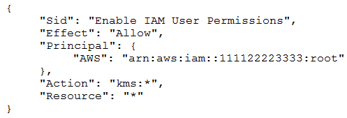
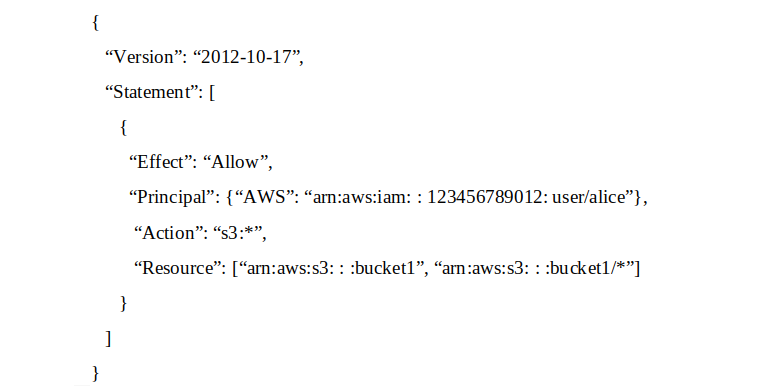
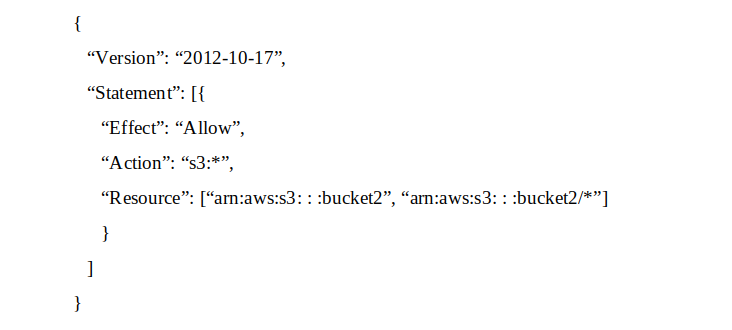
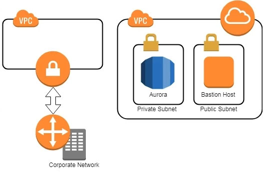

# Practice Exam 6

Click on the **Answer** button for the correct answer and its explanation.

If this practice exam has been helpful to you please share it with others and react to this below.

---

1. A security engineer needs to create an Amazon S3 bucket policy to grant least privilege read access to IAM user accounts that are named User1, User2 and User3. These IAM user accounts are members of the AuthorizedPeople IAM group. The security engineer drafts the following S3 bucket policy. When the security engineer tries to add the policy to the S3 bucket, the following message appears: `Missing required field Principal.` The security engineer is adding a Principal element to the policy. The addition must provide read access to only User1, User2 and User3. Which solution meets these requirements?

    - A) Option A.

    - B) Option B.

    - C) Option C.

    - D) Option D.

<b>Answer</b>
 Correct Answer(s): A

2. A company has decided to move its fleet of Linux-based web server instances to an Amazon EC2 Auto Scaling group. Currently, the instances are static and are launched manually. When an administrator needs to view log files, the administrator uses SSH to establish a connection to the instances and retrieves the logs manually. The company often needs to query the logs to produce results about application sessions and user issues. The company does not want its new automatically scaling architecture to result in the loss of any log files when instances are scaled in. Which combination of steps should a security engineer take to meet these requirements MOST cost-effectively? (Choose TWO)

    - A) Configure a cron job on the instances to forward the log files to Amazon S3 periodically.
    - B) Configure AWS Glue and Amazon Athena to query the log files.
    - C) Configure the Amazon CloudWatch agent on the instances to forward the logs to Amazon CloudWatch Logs.
    - D) Configure Amazon CloudWatch Logs Insights to query the log files.
    - E) Configure the instances to write the logs to an Amazon Elastic File System (Amazon EFS) volume.

<b>Answer</b>
 Correct Answer(s): C, D

3. A company maintains sensitive data in an Amazon S3 bucket that must be protected using an AWS KMS CMK. The company requires that keys be rotated automatically every year. How should the bucket be configured?

    - A) Select server-side encryption with Amazon S3-managed keys (SSE-S3) and select an AWS-managed CMK.
    - B) Select Amazon S3-AWS KMS managed encryption keys (S3-KMS) and select a customer-managed CMK with key rotation enabled.
    - C) Select server-side encryption with Amazon S3-managed keys (SSE-S3) and select a customer-managed CMK that has imported key material.
    - D) Select server-side encryption with AWS KMS-managed keys (SSE-KMS) and select an alias to an AWS-managed CMK.

<b>Answer</b>
 Correct Answer(s): D

4. A company maintains an open-source application that is hosted on a public GitHub repository. While creating a new commit to the repository, an engineer uploaded their AWS access key and secret access keys. The engineer reported the mistake to a manager, and the manager immediately disabled the access key. The company needs to assess the impact of the exposed access key. A security engineer must recommend a solution that requires the least possible managerial overhead. Which solution meets these requirements?

    - A) Analyze an AWS Identity and Access Management (IAM) use report from AWS Trusted Advisor to see. When the access key was last used.
    - B) Analyze Amazon CloudWatch Logs for activity by searching for the access key.
    - C) Analyze VPC flow logs for activity by searching for the access key.
    - D) Analyze a credential report in AWS Identity and Access Management (IAM) to see. When the access key was last used.

<b>Answer</b>
 Correct Answer(s): D

5. A Solutions Architect is designing a web application that uses Amazon CloudFront, an Elastic Load Balancing Application Load Balancer, and an Auto Scaling group of Amazon EC2 instances. The load balancer and EC2 instances are in the US West (Oregon) region. It has been decided that encryption in transit is necessary by using a customer-branded domain name from the client to CloudFront and from CloudFront to the load balancer. Assuming that AWS Certificate Manager is used, how many certificates will need to be generated?

    - A) One in the US West (Oregon) region and one in the US East (Virginia) region.
    - B) Two in the US West (Oregon) region and none in the US East (Virginia) region.
    - C) One in the US West (Oregon) region and none in the US East (Virginia) region.
    - D) Two in the US East (Virginia) region and none in the US West (Oregon) region.

<b>Answer</b>
 Correct Answer(s): A

6. A large company has hundreds of AWS accounts. The company needs to provide its employees with access to these accounts. The solution must maximize scalability and operational efficiency. Which solution meets these requirements?

    - A) With each AWS account, create dedicated IAM users that employees can assume through federation based upon group membership in their existing identity provider.
    - B) Use a centralized account with IAM roles that employees can assume through federation with their existing identity provider. Create a custom authorizer by using AWS SDK to give federated users the ability to assume their target role in the resource accounts.
    - C) Implement AWS Control Tower for multi-account management by integrating AWS Single Sign-On with the company's existing identity provider. Create IAM roles for the identity provider to assume.
    - D) Configure the IAM trust policies within each account's role to set up a trust back to the company's existing identity provider. Allow users to assume the role based on their SAML token.

<b>Answer</b>
 Correct Answer(s): C

7. A company is running an Amazon RDS Multi-AZ DB instance inside a VPC. The DB instance is using two subnets that provide a default route to the internet through a NAT gateway. The company also has application servers that run on Amazon EC2 instances that use the RDS database. The company has deployed these EC2 instances into two other private subnets within the same VPC. These EC2 instances use a default route to access the internet through the same NAT gateway. Each subnet in the VPC uses its own unique route table. After a recent security audit, the company added a new security requirement. The DB instance must never be able to connect to the internet. A security engineer must make this change immediately without disrupting the application servers' network traffic. How can the security engineer meet these requirements?

    - A) Remove the existing NAT gateway. Create a new NAT gateway that only the application server subnets can use.
    - B) Configure the DB instance's inbound network ACL to deny traffic from the security group ID of the NAT gateway.
    - C) Modify the route tables of the DB instance subnets to remove the default route to the NAT gateway.
    - D) Configure the route table of the NAT gateway to deny connections to the DB instance subnets.

<b>Answer</b>
 Correct Answer(s): C

8. A company has a group of Amazon EC2 instances in a single private subnet of a VPC with no internet gateway attached. A security engineer has installed the Amazon CloudWatch agent on all instances in that subnet to capture logs from a specific application. To ensure that the logs flow securely, the company's networking team has created VPC endpoints for CloudWatch monitoring and CloudWatch logs. The networking team has attached the endpoints to the VPC. The application is generating logs. However, when the security engineer queries CloudWatch, the logs do not appear. Which combination of steps should the security engineer take to troubleshoot this issue? (Choose THREE)

    - A) Ensure that the EC2 instance profile that is attached to the EC2 instances has permissions to create log streams and write logs.
    - B) Create a metric filter on the logs so that they can be viewed in the AWS Management Console.
    - C) Check the CloudWatch agent configuration file on each EC2 instance to make sure that the CloudWatch agent is collecting the proper log files.
    - D) Check the VPC endpoint policies of both VPC endpoints to ensure that the EC2 instances have permissions to use them.
    - E) Create a NAT gateway in the subnet so that the EC2 instances can communicate with CloudWatch.
    - F) Ensure that the security groups allow all the EC2 instances to communicate with each other to aggregate logs before sending.

<b>Answer</b>
 Correct Answer(s): A, C, D

9. A company is using Amazon Elastic Container Service (Amazon ECS) to run its container-based application on AWS. The company needs to ensure that the container images contain no severe vulnerabilities. The company also must ensure that only specific IAM roles and specific AWS accounts can access the container images. Which solution will meet these requirements with the LEAST management overhead?

    - A) Pull images from the public container registry. Publish the images to Amazon Elastic Container Registry (Amazon ECR) repositories with scan on push configured in a centralized AWS account. Use a CI/CD pipeline to deploy the images to different AWS accounts. Use identity-based policies to restrict access to which IAM principals can access the images.
    - B) Pull images from the public container registry. Publish the images to a private container registry that is hosted on Amazon EC2 instances in a centralized AWS account. Deploy host-based container scanning tools to EC2 instances that run Amazon ECS. Restrict access to the container images by using basic authentication over HTTPS.
    - C) Pull images from the public container registry. Publish the images to Amazon Elastic Container Registry (Amazon ECR) repositories with scan on push configured in a centralized AWS account. Use a CI/CD pipeline to deploy the images to different AWS accounts. Use repository policies and identity-based policies to restrict access to which IAM principals and accounts can access the images.
    - D) Pull images from the public container registry. Publish the images to AWS CodeArtifact repositories in a centralized AWS account. Use a CI/CD pipeline to deploy the images to different AWS accounts. Use repository policies and identity-based policies to restrict access to which IAM principals and accounts can access the images.

<b>Answer</b>
 Correct Answer(s): C

10. A company wants to establish separate AWS Key Management Service (AWS KMS) keys to use for different AWS services. The company's security engineer created the following key policy to allow the infrastructure deployment team to create encrypted Amazon Elastic Block Store (Amazon EBS) volumes by assuming the InfrastructueDeployment IAM role. The security engineer recently discovered that IAM roles other than the InfrastructureDeployment role used this key for other services. Which change to the policy should the security engineer make to resolve these issues?

    - A) In the statement block that contains the Sid Allow use of the key, under the Condition block, change StringEquals to StringLike.
    - B) In the policy document, remove the statement block that contains the Sid Enable IAM User Permissions. Add key management policies to the KMS policy.
    - C) In the statement block that contains the Sid Allow use of the key, under the Condition block, change the `kms:ViaService` value to ec2.`us-east-1`.amazonaws.com.
    - D) In the policy document, add a new statement block that grants the `kms:Disable*` permission to the security engineer's IAM role.

<b>Answer</b>
 Correct Answer(s): B

11. A company has enabled Amazon GuardDuty in all Regions as part of its security monitoring strategy. In one of the VPCs, the company hosts an Amazon EC2 instance working as an FTP server that is contacted by a high number of clients from multiple locations. This is identified by GuardDuty as a brute force attack due to the high number of connections that happen every hour. The finding has been flagged as a false positive. However, GuardDuty keeps raising the issue. A Security Engineer has been asked to improve the signal-to-noise ratio. The Engineer needs to ensure that changes do not compromise the visibility of potential anomalous behavior. How can the Security Engineer address the issue?

    - A) Disable the FTP rule in GuardDuty in the Region where the FTP server is deployed.
    - B) Add the FTP server to a trusted IP list and deploy it to GuardDuty to stop receiving the notifications.
    - C) Use GuardDuty filters with auto archiving enabled to close the findings.
    - D) Create an AWS Lambda function that closes the finding whenever a new occurrence is reported.

<b>Answer</b>
 Correct Answer(s): C

12. A company uses Amazon GuardDuty to detect threats and malicious activities in AWS accounts. The company has subscribed to a third-party threat intelligence list uploaded to an Amazon S3 bucket. How should the security engineer efficiently use the threat list across all company AWS accounts?

    - A) Ensure the S3 bucket policy allows all company AWS accounts access to the threat list. Use an AWS Lambda function to automatically add the threat list to all company AWS accounts.
    - B) Ensure GuardDuty is in master-member configuration. Add the threat list to the master account referencing the S3 object that contains the threat list.
    - C) Ensure all accounts are part of the same organization in AWS Organizations. Add the threat list to any company account within AWS Organizations.
    - D) Ensure the threat list in the S3 bucket is publicly accessible. Use an Amazon CloudWatch Events event on GuardDuty findings to match IPs against the threat list.

<b>Answer</b>
 Correct Answer(s): B

13. A company is hosting multiple applications within a single VPC in its AWS account. The applications are running behind an Application Load Balancer that is associated with an AWS WAF web ACL. The company's security team has identified that multiple port scans are originating from a specific range of IP addresses on the internet. A security engineer needs to deny access from the offending IP addresses. Which solution will meet these requirements?

    - A) Modify the AWS WAF web ACL with an IP set match rule statement to deny incoming requests from the IP address range.
    - B) Add a rule to all security groups to deny the incoming requests from the IP address range.
    - C) Modify the AWS WAF web ACL with a rate-based rule statement to deny incoming requests from the IP address range.
    - D) Configure the AWS WAF web ACL with regex match conditions. Specify a pattern set to deny the incoming requests based on the match condition.

<b>Answer</b>
 Correct Answer(s): A

14. A company has two software development teams that are creating applications that store sensitive data in Amazon S3. Each team's data must always be separate. The company's security team must design a data encryption strategy for both teams that provides the ability to audit key usage. The solution must also minimize operational overhead. What should the security team recommend?

    - A) Tell the application teams to use two different S3 buckets with separate AWS Key Management Service (AWS KMS) AWS managed CMKs. Limit the key policies to allow encryption and decryption of the CMKs to their respective teams only. Force the teams to use encryption context to encrypt and decrypt.
    - B) Tell the application teams to use two different S3 buckets with a single AWS Key Management Service (AWS KMS) AWS managed CMK. Limit the key policy to allow encryption and decryption of the CMK only. Do not allow the teams to use encryption context to encrypt and decrypt.
    - C) Tell the application teams to use two different S3 buckets with separate AWS Key Management Service (AWS KMS) customer managed CMKs. Limit the key policies to allow encryption and decryption of the CMKs to their respective teams only. Force the teams to use encryption context to encrypt and decrypt.
    - D) Tell the application teams to use two different S3 buckets with a single AWS Key Management Service (AWS KMS) customer managed CMK. Limit the key policy to allow encryption and decryption of the CMK only. Do not allow the teams to use encryption context to encrypt and decrypt.

<b>Answer</b>
 Correct Answer(s): C

15. An Amazon EC2 Auto Scaling group launches Amazon Linux EC2 instances and installs the Amazon CloudWatch agent to publish logs to Amazon CloudWatch Logs. The EC2 instances launch with an IAM role that has an IAM policy attached. The policy provides access to publish custom metrics to CloudWatch. The EC2 instances run in a private subnet inside a VPC The VPC provides access to the internet for private subnets through a NAT gateway. A security engineer notices that no logs are being published to CloudWatch Logs for the EC2 instances that the Auto Scaling group launches. The security engineer validates that the CloudWatch Logs agent is running and is configured properly on the EC2 instances. In addition, the security engineer validates that network communications are working properly to AWS services. What can the security engineer do to ensure that the logs are published to CloudWatch Logs?

    - A) Configure the IAM policy in use by the IAM role to have access to the required `cloudwatch: API` actions that will publish logs.
    - B) Adjust the Amazon EC2 Auto Scaling service-linked role to have permissions to write to CloudWatch Logs.
    - C) Configure the IAM policy in use by the IAM role to have access to the required AWS logs: API actions that will publish logs.
    - D) Add an interface VPC endpoint to provide a route to CloudWatch Logs.

<b>Answer</b>
 Correct Answer(s): A

16. A company has a web-based application that runs behind an Application Load Balancer (ALB). The application is experiencing a credential stuffing attack that is producing many failed login attempts. The attack is coming from many IP addresses. The login attempts are using a user agent string of a known mobile device emulator. A security engineer needs to implement a solution to mitigate the credential stuffing attack. The solution must still allow legitimate logins to the application. Which solution will meet these requirements?

    - A) Create an Amazon CloudWatch alarm that reacts to login attempts that contain the specified user agent string Add an Amazon Simple Notification Service (Amazon SNS) topic to the alarm.
    - B) Modify the inbound security group on the ALB to deny traffic from the IP addresses that are involved in the attack.
    - C) Create an AWS WAF web ACL for the ALB Create a custom rule that blocks requests that contain the user agent string of the device emulator.
    - D) Create an AWS WAF web ACL for the ALB. Create a custom rule that allows requests from legitimate user agent strings.

<b>Answer</b>
 Correct Answer(s): C

17. A DevOps team is planning to deploy a containerized application on Amazon Elastic Container Service (Amazon ECS). The team will use an Application Load Balancer (ALB) to distribute the incoming traffic for the ECS application. A security engineer needs to terminate the TLS traffic at the ALB to ensure security of data in transit. Which solutions can the security engineer use to create a certificate and deploy the certificate at the ALB to meet these requirements? (Choose TWO)

    - A) Use TLS tools to create a certificate signing request (CSR). Get the CSR signed by a certificate authority (CA) to produce a certificate. Import the certificate into AWS Certificate Manager (ACM).
Specify the certificate for the TLS listener on the ALB.
    - B) Use AWS Certificate Manager (ACM) to request a certificate. Specify the certificate fort the TLS listener on the ALB.
    - C) Use AWS Key Management Service (AWS KMS) tools to create a certificate signing request (CSR). Get the CSR signed by a certificate authority (CA) to produce a certificate. Import the certificate into AWS Certificate Manager (ACM). Specify the certificate for the TLS listener on the ALB.
    - D) Configure automatic TLS support in the ECS cluster. Configure the ALB to pass the TLS connection to the containers in the cluster.
    - E) Generate a certificate while creating the ECS cluster. Import the certificate into AWS Certificate Manager (ACM). Specify the certificate for the TLS listener on the ALB.

<b>Answer</b>
 Correct Answer(s): A, B

18. A company is running an Amazon RDS for MySQL DB instance in a VPC. The VPC must not send or receive network traffic through the internet. A security engineer wants to use AWS Secrets Manager to rotate the DB instance credentials automatically. Because of a security policy, the security engineer cannot use the standard AWS Lambda function that Secrets Manager provides to rotate the credentials. The security engineer deploys a custom Lambda function in the VPC. The custom Lambda function will be responsible for rotating the secret in Secrets Manager. The security engineer edits the DB instance's security group to allow connections from this function. When the function is invoked, the function cannot communicate with Secrets Manager to rotate the secret properly. What should the security engineer do so that the function can rotate the secret?

    - A) Add an egress-only internet gateway to the VPC. Allow only the Lambda function's subnet to route traffic through the egress-only internet gateway.
    - B) Add a NAT gateway to the VPC. Configure only the Lambda function's subnet with a default route through the NAT gateway.
    - C) Configure a VPC peering connection to the default VPC for Secrets Manager. Configure the Lambda function's subnet to use the peering connection for routes.
    - D) Configure a Secrets Manager interface VPC endpoint. Include the Lambda function's private subnet during the configuration process.

<b>Answer</b>
 Correct Answer(s): D

19. A security engineer needs to build a solution to turn AWS CloudTrail back on in multiple AWS Regions in case it is ever turned off. What is the MOST efficient way to implement this solution?

    - A) Use AWS Config with a managed rule to initiate the AWS-EnableCloudTrail remediation.
    - B) Create an Amazon EventBridge event with a cloudtrail.amazonaws.com event source and a StartLogging event name to invoke an AWS Lambda function to call the StartLogging
API.
    - C) Create an Amazon CloudWatch alarm with a cloudtrail.amazonaws.com event source and a StopLoggmg event name to invoke an AWS Lambda function to call the StartLogging API.
    - D) Monitor AWS Trusted Advisor to ensure CloudTrail logging is enabled.

<b>Answer</b>
 Correct Answer(s): A

20. A public subnet contains two Amazon EC2 instances. The subnet has a custom network ACL. A security engineer is designing a solution to improve the subnet security. The solution must allow outbound traffic to an internet service that uses TLS through port 443. The solution also must deny inbound traffic that is destined for MySQL port 3306. Which network ACL rule set meets these requirements?

    - A) Use inbound rule 100 to allow traffic on TCP port 443. Use inbound rule 200 to deny traffic on TCP port 3306. Use outbound rule 100 to allow traffic on TCP port 443.
    - B) Use inbound rule 100 to deny traffic on TCP port 3306. Use inbound rule 200 to allow traffic on TCP port range 1024-65535. Use outbound rule 100 to allow traffic on TCP port 443.
    - C) Use inbound rule 100 to allow traffic on TCP port range 1024-65535. Use inbound rule 200 to deny traffic on TCP port 3306. Use outbound rule 100 to allow traffic on TCP port 443.
    - D) Use inbound rule 100 to deny traffic on TCP port 3306. Use inbound rule 200 to allow traffic on TCP port 443. Use outbound rule 100 to allow traffic on TCP port 443.

<b>Answer</b>
 Correct Answer(s): A

21. A security engineer is configuring a mechanism to send an alert when three or more failed sign-in attempts to the AWS Management Console occur during a 5-minute period. The security engineer creates a trail in AWS CloudTrail to assist in this work. Which solution will meet these requirements?

    - A) In CloudTrail, turn on Insights events on the trail. Configure an alarm on the insight with eventName matching ConsoleLogin and errorMessage matching `Failed authentication`. Configure a threshold of 3 and a period of 5 minutes.
    - B) Configure CloudTrail to send events to Amazon CloudWatch Logs. Create a metric filter for the relevant log group. Create a filter pattern with eventName matching ConsoleLogin and errorMessage matching `Failed authentication`. Create a CloudWatch alarm with a threshold of 3 and a period of 5 minutes.
    - C) Create an Amazon Athena table from the CloudTrail events. Run a query for eventName matching ConsoleLogin and for errorMessage matching `Failed authentication`. Create a notification action from the query to send an Amazon Simple Notification Service (Amazon SNS) notification when the count equals 3 within a period of 5 minutes.
    - D) In AWS Identity and Access Management Access Analyzer, create a new analyzer. Configure the analyzer to send an Amazon Simple Notification Service (Amazon SNS) notification when a failed sign-in event occurs 3 times for any IAM user within a period of 5 minutes.

<b>Answer</b>
 Correct Answer(s): B

22. A company's security engineer receives an abuse notification from AWS. The notification indicates that someone is hosting malware from the company's AWS account. After investigation, the security engineer finds a new Amazon S3 bucket that an IAM user created without authorization. Which combination of steps should the security engineer take to MINIMIZE the consequences of this compromise? (Choose THREE)

    - A) Encrypt all AWS CloudTrail logs.
    - B) Turn on Amazon GuardDuty.
    - C) Change the password for all IAM users.
    - D) Rotate or delete all AWS access keys.
    - E) Take snapshots of all Amazon Elastic Block Store (Amazon EBS) volumes.
    - F) Delete any resources that are unrecognized or unauthorized.

<b>Answer</b>
 Correct Answer(s): C, D, F

23. A company has a web server in the AWS Cloud. The company will store the content for the web server in an Amazon S3 bucket. A security engineer must use an Amazon CloudFront distribution to speed up delivery of the content. None of the files can be publicly accessible from the S3 bucket directly. Which solution will meet these requirements?

    - A) Configure the permissions on the individual files in the S3 bucket so that only the CloudFront distribution has access to them.
    - B) Create an origin access control (OAC). Associate the OAC with the CloudFront distribution. Configure the S3 bucket permissions so that only the OAC can access the files in the S3 bucket.
    - C) Create an S3 role in AWS Identity and Access Management (IAM). Allow only the CloudFront distribution to assume the role to access the files in the S3 bucket.
    - D) Create an S3 bucket policy that uses only the CloudFront distribution ID as the principal and the Amazon Resource Name (ARN) as the target.

<b>Answer</b>
 Correct Answer(s): B

24. A company does not allow the permanent installation of SSH keys onto an Amazon Linux 2 EC2 instance. However, three employees who have IAM user accounts require access to the EC2 instance. The employees must use an SSH session to perform critical duties. How can a security engineer provide the appropriate access to the EC2 instance to meet these requirements?

    - A) Use AWS Systems Manager Inventory to select the EC2 instance and connect. Provide the IAM user accounts with the permissions to use Systems Manager Inventory.
    - B) Use AWS Systems Manager Run Command to open an SSH connection to the EC2 instance. Provide the IAM user accounts with the permissions to use Run Command.
    - C) Use AWS Systems Manager Session Manager. Provide the IAM user accounts with the permissions to use Systems Manager Session Manager.
    - D) Connect to the EC2 instance as the ec2-user through the AWS Management Console's EC2 SSH client method. Provide the IAM user accounts with access to use the EC2 service in the AWS Management Console.

<b>Answer</b>
 Correct Answer(s): C

25. A company wants to prevent SSH access through the use of SSH key pairs for any Amazon Linux 2 Amazon EC2 instances in its AWS account. However, a system administrator occasionally will need to access these EC2 instances through SSH in an emergency. For auditing purposes, the company needs to record any commands that a user runs in an EC2 instance. What should a security engineer do to configure access to these EC2 instances to meet these requirements?

    - A) Use the EC2 serial console. Configure the EC2 serial console to save all commands that are entered to an Amazon S3 bucket. Provide the EC2 instances with an IAM role that allows the EC2 serial console to access Amazon S3. Configure an IAM account for the system administrator. Provide an IAM policy that allows the IAM account to use the EC2 serial console.
    - B) Use EC2 Instance Connect. Configure EC2 Instance Connect to save all commands that are entered to Amazon CloudWatch Logs. Provide the EC2 instances with an IAM role that allows the EC2 Instances to access CloudWatch Logs. Configure an IAM account for the system administrator. Provide an IAM policy that allows the IAM account to use EC2 Instance Connect.
    - C) Use an EC2 key pair with an EC2 instance that needs SSH access. Access the EC2 instance with this key pair by using SSH. Configure the EC2 instance to save all commands that are entered to Amazon CloudWatch Logs. Provide the EC2 instance with an IAM role that allows the EC2 instance to access Amazon S3 and CloudWatch Logs.
    - D) Use AWS Systems Manager Session Manager. Configure Session Manager to save all commands that are entered in a session to an Amazon S3 bucket. Provide the EC2 instances with an IAM role that allows Systems Manager to manage the EC2 instances. Configure an IAM account for the system administrator. Provide an IAM policy that allows the IAM account to use Session Manager.

<b>Answer</b>
 Correct Answer(s): D

26. A company is using AWS Organizations to manage multiple AWS accounts. The company has an application that allows users to assume the AppUser IAM role to download files from an Amazon S3 bucket that is encrypted with an AWS KMS CMK. However, when users try to access the files in the S3 bucket, they get an access denied error. What should a security engineer do to troubleshoot this error? (Choose THREE)

    - A) Ensure the KMS policy allows the AppUser role to have permission to decrypt for the CMK.
    - B) Ensure the S3 bucket policy allows the AppUser role to have permission to get objects for the S3 bucket.
    - C) Ensure the CMK was created before the S3 bucket.
    - D) Ensure the S3 block public access feature is enabled for the S3 bucket.
    - E) Ensure that automatic key rotation is disabled for the CMK.
    - F) Ensure the SCPs within Organizations allow access to the S3 bucket.

<b>Answer</b>
 Correct Answer(s): A, B, F

27. A company is building applications in containers. The company wants to migrate its on-premises development and operations services from its on-premises data center to AWS. Management states that production systems must be cloud agnostic and use the same configuration and administrator tools across production systems. A solutions architect needs to design a managed solution that will align open-source software. Which solution meets these requirements?

    - A) Launch the containers on Amazon EC2 with EC2 instance worker nodes.
    - B) Launch the containers on Amazon Elastic Kubernetes Service (Amazon EKS) and EKS worker nodes.
    - C) Launch the containers on Amazon Elastic Containers service (Amazon ECS) with AWS Fargate instances.
    - D) Launch the containers on Amazon Elastic Container Service (Amazon ECS) with Amazon EC2 instance worker nodes.

<b>Answer</b>
 Correct Answer(s): B

28. A company uses infrastructure as code (IaC) to create AWS infrastructure. The company writes the code as AWS CloudFormation templates to deploy the infrastructure. The company has an existing CI/CD pipeline that the company can use to deploy these templates. After a recent security audit, the company decides to adopt a policy-as-code approach to improve the company's security posture on AWS. The company must prevent the deployment of any infrastructure that would violate a security policy, such as an unencrypted Amazon Elastic Block Store (Amazon EBS) volume. Which solution will meet these requirements?

    - A) Turn on AWS Trusted Advisor. Configure security notifications as webhooks in the preferences section of the CI/CD pipeline.
    - B) Turn on AWS Config. Use the prebuilt rules or customized rules. Subscribe tile CI/CD pipeline to an Amazon Simple Notification Service (Amazon SNS) topic that receives notifications from AWS Config.
    - C) Create rule sets in AWS CloudFormation Guard. Run validation checks for CloudFormation templates as a phase of the CI/CD process.
    - D) Create rule sets as SCPs. Integrate the SCPs as a part of validation control in a phase of the CI/CD process.

<b>Answer</b>
 Correct Answer(s): C

29. A security engineer is setting up a new AWS account. The engineer has been asked to continuously monitor the company's AWS account using automated compliance checks based on AWS best practices and Center for Internet Security (CIS) AWS Foundations Benchmarks. How can the security engineer accomplish this using AWS services?

    - A) Enable AWS Config and set it to record all resources in all Regions and global resources. Then enable AWS Security Hub and confirm that the CIS AWS Foundations compliance standard is enabled.
    - B) Enable Amazon Inspector and configure it to scan all Regions for the CIS AWS Foundations Benchmarks. Then enable AWS Security Hub and configure it to ingest the Amazon Inspector findings.
    - C) Enable Amazon Inspector and configure it to scan all Regions for the CIS AWS Foundations Benchmarks. Then enable AWS Shield in all Regions to protect the account from DDoS attacks.
    - D) Enable AWS Config and set it to record all resources in all Regions and global resources. Then enable Amazon Inspector and configure it to enforce CIS AWS Foundations Benchmarks using AWS Config rules.

<b>Answer</b>
 Correct Answer(s): A

30. A company uses AWS Organizations to manage several AWs accounts. The company processes a large volume of sensitive data. The company uses a serverless approach to microservices. The company stores all the data in either Amazon S3 or Amazon DynamoDB. The company reads the data by using either AWS Lambda functions or container-based services that the company hosts on Amazon Elastic Kubernetes Service (Amazon EKS) on AWS Fargate. The company must implement a solution to encrypt all the data at rest and enforce least privilege data access controls. The company creates an AWS Key Management Service (AWS KMS) customer managed key. What should the company do next to meet these requirements?

    - A) Create a key policy that allows the `kms:Decrypt` action only for Amazon S3 and DynamoDB. Create an SCP that denies the creation of S3 buckets and DynamoDB tables that are not encrypted with the key.
    - B) Create an IAM policy that denies the `kms:Decrypt` action for the key. Create a Lambda function than runs on a schedule to attach the policy to any new roles. Create an AWS Config rule to send alerts for resources that are not encrypted with the key.
    - C) Create a key policy that allows the `kms:Decrypt` action only for Amazon S3, DynamoDB, Lambda, and Amazon EKS. Create an SCP that denies the creation of S3 buckets and DynamoDB tables that are not encrypted with the key.
    - D) Create a key policy that allows the `kms:Decrypt` action only for Amazon S3, DynamoDB, Lambda, and Amazon EKS. Create an AWS Config rule to send alerts for resources that are not encrypted with the key.

<b>Answer</b>
 Correct Answer(s): C

31. A security engineer is configuring AWS Config for an AWS account that uses a new IAM entity. When the security engineer tries to configure AWS Config rules and automatic remediation options, errors occur. In the AWS CloudTrail logs, the security engineer sees the following error message: `Insufficient delivery policy to s3 bucket: DOC-EXAMPLE-BUCKET, unable to write to bucket, provided s3 key prefix is 'null'.` Which combination of steps should the security engineer take to remediate this issue? (Choose TWO)

    - A) Check the Amazon S3 bucket policy. Verify that the policy allows the config amazonaws,com service to write to the target bucket.
    - B) Verify that the IAM entity has the permissions necessary to perform the `s3:GetBucketAcl and s3:PutObject*` operations to write to the target bucket.
    - C) Verify that the Amazon S3 bucket policy has the permissions necessary to perform the `s3:GetBucketAcl and s3:PutObject*` operations to write to the target bucket.
    - D) Check the policy that is associated with the IAM entity. Verify that the policy allows the config.amazonaws.com service to write to the target bucket.
    - E) Verify that the AWS Config service role has permissions to invoke the BatchGetResourceConfig action instead of the GetResourceConfigHistory action and `s3:PutObject*` operation.

<b>Answer</b>
 Correct Answer(s): A, B

32. A company is running a legacy application on Amazon EC2 instances in multiple Availability Zones behind a software load balancer that runs on an active/standby set of EC2 instances. For disaster recovery, the company has created a warm standby version of the application environment that is deployed in another AWS Region. The domain for the application uses a hosted zone from Amazon Route 53. The company needs the application to use static IP addresses, even in the case of a failover event to the secondary Region. The company also requires the client's source IP address to be available for auditing purposes. Which solution meets these requirements with the LEAST amount of operational overhead?

    - A) Replace the software load balancer with an AWS Application Load Balancer. Create an AWS Global Accelerator accelerator. Add an endpoint group for each Region. Configure Route 53 health checks. Add an alias record that points to the accelerator.
    - B) Replace the software load balancer with an AWS Network Load Balancer. Create an AWS Global Accelerator accelerator. Add an endpoint group for each Region. Configure Route 53 health checks. Add a CNAME record that points to the DNS name of the accelerator.
    - C) Replace the software load balancer with an AWS Application Load Balancer. Use AWS Global Accelerator to create two separate accelerators. Add an endpoint group for each Region. Configure Route 53 health checks. Add a record set that is configured for active-passive DNS failover. Point the record set to the DNS names of the two accelerators.
    - D) Replace the software load balancer with an AWS Network Load Balancer. Use AWS Global Accelerator to create two separate accelerators. Add an endpoint group for each Region. Configure Route 53 health checks. Add a record set that is configured for weighted round-robin DNS failover. Point the record set to the DNS names of the two accelerators.

<b>Answer</b>
 Correct Answer(s): A

33. An online media company has an application that customers use to watch events around the world. The application is hosted on a fleet of Amazon EC2 instances that run Amazon Linux 2. The company uses AWS Systems Manager to manage the EC2 instances. The company applies patches and application updates by using the AWS-AmazonLinux2DefaultPatchBaseline patching baseline in Systems Manager Patch Manager. The company is concerned about potential attacks on the application during the week of an upcoming event. The company needs a solution that can immediately deploy patches to all the EC2 instances in response to a security incident or vulnerability. The solution also must provide centralized evidence that the patches were applied successfully. Which combination of steps will meet these requirements? (Choose TWO)

    - A) Create a new patching baseline in Patch Manager. Specify Amazon Linux 2 as the product. Specify Security as the classification. Set the automatic approval for patches to 0 days. Ensure that the new patching baseline is the designated default for Amazon Linux 2.
    - B) Use the Patch Now option with the scan and install operation in the Patch Manager console to apply patches against the baseline to all nodes. Specify an Amazon S3 bucket as the patching log storage option.
    - C) Use the Clone function of Patch Manager to create a copy of the AWS-AmazonLmux2DefaultPatchBaseline built-in baseline. Set the automatic approval for patches to 1 day.
    - D) Create a patch policy that patches all managed nodes and sends a patch operation log output to an Amazon S3 bucket. Use a custom scan schedule to set Patch Manager to check every hour for new patches. Assign the baseline to the patch policy.
    - E) Use Systems Manager Application Manager to inspect the package versions that were installed on the EC2 instances. Additionally use Application Manager to validate that the patches were correctly installed.

<b>Answer</b>
 Correct Answer(s): A, B

34. A company's data lake uses Amazon S3 and Amazon Athena. The company's security engineer has been asked to design an encryption solution that meets the company's data protection requirements. The encryption solution must work with Amazon S3 and keys managed by the company. The encryption solution must be protected in a hardware security module that is validated to Federal Information Processing Standards (FIPS) 140-2 Level 3. Which solution meets these requirements?

    - A) Use client-side encryption with an AWS KMS customer-managed key implemented with the AWS Encryption SDK.
    - B) Use AWS CloudHSM to store the keys and perform cryptographic operations. Save the encrypted text in Amazon S3.
    - C) Use an AWS KMS customer-managed key that is backed by a custom key store using AWS CloudHSM.
    - D) Use an AWS KMS customer-managed key with the bring your own key (BYOK) feature to import a key stored in AWS CloudHSM.

<b>Answer</b>
 Correct Answer(s): C

35. A company has a serverless application that uses AWS Lambda functions and AWS Systems Manager parameters to store configuration data. The company moves the Lambda functions inside the VPC and into private subnets. The Lambda functions are now producing errors in their attempts to access Systems Manager parameters. Which solution will allow the Lambda functions to access Systems Manager parameters inside the VPC?

    - A) Configure security groups to allow access to Systems Manager.
    - B) Create an interface VPC endpoint for Systems Manager.
    - C) Use an Internet gateway from inside the VPC.
    - D) Create a gateway VPC endpoint for Systems Manager.

<b>Answer</b>
 Correct Answer(s): B

36. A company has an application on Amazon EC2 instances that store confidential customer data. The company must restrict access to customer data. A security engineer requires secure access to the instances that host the application. According to company policy, users must not open any inbound ports, maintain bastion hosts, or manage SSH keys for the EC2 instances. The security engineer wants to monitor, store, and access all session activity logs. The logs must be encrypted. Which solution will meet these requirements?

    - A) Use AWS Control Tower to connect to the EC2 instances. Configure Amazon CloudWatch logging for the sessions. Select the upload session logs option and allow only encrypted CloudWatch Logs log groups.
    - B) Use AWS Security Hub to connect to the EC2 instances. Configure Amazon CloudWatch logging for the sessions. Select the upload session logs option and allow only encrypted CloudWatch Logs log groups.
    - C) Use AWS Systems Manager Session Manager to connect to the EC2 instances. Configure Amazon CloudWatch monitoring to record the sessions. Select the store session logs option for the desired CloudWatch Logs log groups.
    - D) Use AWS Systems Manager Session Manager to connect to the EC2 instances. Configure Amazon CloudWatch logging. Select the upload session logs option and allow only encrypted CloudWatch Logs log groups.

<b>Answer</b>
 Correct Answer(s): D

37. A company's security policy requires that VPC Flow Logs are enabled on all VPCs. A Security Engineer is looking to automate the process of auditing the VPC resources for compliance. What combination of actions should the Engineer take? (Choose TWO)

    - A) Create an AWS Lambda function that determines whether Flow Logs are enabled for a given VPC.
    - B) Create an AWS Config configuration item for each VPC in the company AWS account.
    - C) Create an AWS Config managed rule with a resource type of AWS:: Lambda:: Function.
    - D) Create an Amazon CloudWatch Event rule that triggers on events emitted by AWS Config.
    - E) Create an AWS Config custom rule, and associate it with an AWS Lambda function that contains the evaluating logic.

<b>Answer</b>
 Correct Answer(s): A, E

38. A security engineer is creating an AWS Lambda function. The Lambda function needs to use a role that is named LambdaAuditRole to assume a role that is named AcmeAuditFactoryRole in a different AWS account. When the code is processed, the following error message appears: `An error occurred (AccessDenied) when calling the AssumeRole operation.` Which combination of steps should the security engineer take to resolve this error? (Choose TWO)

    - A) Ensure that LambdaAuditRole has the `sts:AssumeRole` permission for AcmeAuditFactoryRole.
    - B) Ensure that LambdaAuditRole has the AWSLambdaBasicExecutionRole managed policy attached.
    - C) Ensure that the trust policy for AcmeAuditFactoryRole allows the `sts:AssumeRole` action from LambdaAuditRole.
    - D) Ensure that the trust policy for LambdaAuditRole allows the `sts:AssumeRole` action from the lambda.amazonaws.com service.
    - E) Ensure that the `sts:AssumeRole` API call is being issued to the us-east-1 Region endpoint.

<b>Answer</b>
 Correct Answer(s): A, C

39. A company's application uses Amazon DynamoDB to store data. The company's security policy requires all data to be encrypted at rest. The security policy also requires the company to use an on-premises hardware security module (HSM) to generate and manage the company's encryption keys. A security engineer uses the on-premises HSM to generate an encryption key. What should the security engineer do next to meet these requirements?

    - A) Generate a new AWS Key Management Service (AWS KMS) customer managed key. Import the new key material. Grant DynamoDB access to use the key. Create a new DynamoDB table, and select the new key as the encryption key. Import the data into DynamoDB.
    - B) Generate a new AWS Key Management Service (AWS KMS) customer managed key. Import the new key material. Create a new DynamoDB table, and select the new key as the encryption key. Disable the KMS key after table creation. Import the data into DynamoDB.
    - C) Generate a new AWS Key Management Service (AWS KMS) AWS managed key. Import the new key material. Grant DynamoDB access to use the key. Create a new DynamoDB table, and select the new key as the encryption key. Import the data into DynamoDB.
    - D) Generate a new AWS Key Management Service (AWS KMS) AWS managed key. Import the new key material. Use the AWS SDK integration with AWS KMS to encrypt the data locally by using the new KMS key. Create a new DynamoDB table, and select the new key as the encryption key. Disable the KMS key after table creation. Import the data into DynamoDB.

<b>Answer</b>
 Correct Answer(s): A

40. A security engineer has noticed that VPC Flow Logs are getting a lot of REJECT traffic originating from a single Amazon EC2 instance in an Auto Scaling group. The security engineer is concerned that this EC2 instance may be compromised. What immediate action should the security engineer take?

    - A) Remove the instance from the Auto Scaling group. Close the security group with ingress only from a single forensic IP address to perform an analysis.
    - B) Remove the instance from the Auto Scaling group. Change the network ACL rules to allow traffic only from a single forensic IP address to perform an analysis. Add a rule to deny all other traffic.
    - C) Remove the instance from the Auto Scaling group. Enable Amazon GuardDuty in that AWS account. Install the Amazon Inspector agent on the suspicious EC2 instance to perform a scan.
    - D) Take a snapshot of the suspicious EC2 instance. Create a new EC2 instance from the snapshot in a closed security group with ingress only from a single forensic IP address to perform an analysis.

<b>Answer</b>
 Correct Answer(s): A

41. A company is running its workloads in a single AWS Region and uses AWS Organizations. A security engineer must implement a solution to prevent users from launching resources in other Regions. Which solution will meet these requirements with the LEAST operational overhead?

    - A) Create an IAM policy that has an `aws:RequestedRegion` condition that allows actions only in the designated Region. Attach the policy to all users.
    - B) Create an IAM policy that has an `aws:RequestedRegion` condition that denies actions that are not in the designated Region. Attach the policy to the AWS account in AWS Organizations.
    - C) Create an IAM policy that has an `aws:RequestedRegion` condition that allows the desired actions. Attach the policy only to the users who are in the designated Region.
    - D) Create an SCP that has an `aws:RequestedRegion` condition that denies actions that are not in the designated Region. Attach the SCP to the AWS account in AWS Organizations.

<b>Answer</b>
 Correct Answer(s): D

42. A security engineer is evaluating a company's use of AWS Key Management Service (AWS KMS). The security engineer must implement a hybrid solution with two sets of keys to meet the following requirements: Set 1: The company needs granular control over the keys so that the company can maintain a copy of the keys in the key management infrastructure and reimport the keys at any time. The company needs the ability to set the expiration period to 3 days for the keys. Set 2: No restrictions exist regarding immediate key deletion. A waiting period of 14 days is acceptable for keys to be marked deleted. Which solution will meet these requirements?

    - A) Use imported keys for Set 1. Use AWS managed keys for Set 2. For Set 1, set an expiration period and manually delete the keys after the expiration period has elapsed.
    - B) Use imported keys for Set 1. Use AWS managed keys for Set 2. For Set 1, set an expiration period. AWS will automatically delete the keys after the expiration period has elapsed.
    - C) Use AWS managed keys for Set 1. Use imported keys for Set 2. For Set 1, set an expiration period and manually delete the keys after the expiration period has elapsed.
    - D) Use AWS managed keys for Set 1. Use imported keys for Set 2. For Set 1, set an expiration period. AWS will automatically delete the keys after the expiration period has elapsed.

<b>Answer</b>
 Correct Answer(s): B

43. A company operates a web application that runs on Amazon EC2 instances. The application listens on port 80 and port 443. The company uses an Application Load Balancer (ALB) with AWS WAF to terminate SSL and to forward traffic to the application instances only on port 80. The ALB is in public subnets that are associated with a network ACL that is named NACL. The application instances are in dedicated private subnets that are associated with a network ACL that is named NACL2. An Amazon RDS for PostgreSQL DB instance that uses port 5432 is in a dedicated private subnet that is associated with a network ACL that is named NACL3. All the network ACLs currently allow all inbound and outbound traffic. Which set of network ACL changes will increase the security of the application while ensuring functionality?

    - A) Make the following changes to NACL3: Add a rule that allows inbound traffic on port 5432 from NACL2. Add a rule that allows outbound traffic on ports 1024-65536 to NACL2. Remove the default rules that allow all inbound and outbound traffic.
    - B) Make the following changes to NACL3: Add a rule that allows inbound traffic on port 5432 from the CIDR blocks of the application instance subnets. Add a rule that allows outbound traffic on ports 1024-65536 to the application instance subnets. Remove the default rules that allow all inbound and outbound traffic.
    - C) Make the following changes to NACL2: Add a rule that allows outbound traffic on port 5432 to the CIDR blocks of the RDS subnets. Remove the default rules that allow all inbound and outbound traffic.
    - D) Make the following changes to NACL2: Add a rule that allows inbound traffic on port 5432 from the CIDR blocks of the RDS subnets. Add a rule that allows outbound traffic on port 5432 to the RDS subnets.

<b>Answer</b>
 Correct Answer(s): B

44. The Security team believes that a former employee may have gained unauthorized access to AWS resources sometime in the past 3 months by using an identified access key. What approach would enable the Security team to find out what the former employee may have done within AWS?

    - A) Use the AWS CloudTrail console to search for user activity.
    - B) Use the Amazon CloudWatch Logs console to filter CloudTrail data by user.
    - C) Use AWS Config to see what actions were taken by the user.
    - D) Use Amazon Athena to query CloudTrail logs stored in Amazon S3.

<b>Answer</b>
 Correct Answer(s): A

45. A company is storing data in Amazon S3 Glacier. The security engineer implemented a new vault lock policy for 10TB of data and called initiate-vault-lock operation 12 hours ago. The audit team identified a typo in the policy that is allowing unintended access to the vault. What is the MOST cost-effective way to correct this?

    - A) Call the abort-vault-lock operation. Update the policy. Call the initiate-vault-lock operation again.
    - B) Copy the vault data to a new S3 bucket. Delete the vault. Create a new vault with the data.
    - C) Update the policy to keep the vault lock in place.
    - D) Update the policy. Call initiate-vault-lock operation again to apply the new policy.

<b>Answer</b>
 Correct Answer(s): A

46. A company wants to control access to its AWS resources by using identities and groups that are defined in its existing Microsoft Active Directory.What must the company create in its AWS account to map permissions for AWS services to Active Directory user attributes?

    - A) AWS IAM groups.
    - B) AWS IAM users.
    - C) AWS IAM roles.
    - D) AWS IAM access keys.

<b>Answer</b>
 Correct Answer(s): C

47. A company has contracted with a third party to audit several AWS accounts. To enable the audit, cross-account IAM roles have been created in each account targeted for audit. The auditor is having trouble accessing some of the accounts. Which of the following may be causing this problem? (Choose THREE)

    - A) The external ID used by the auditor is missing or incorrect.
    - B) The auditor is using the incorrect password.
    - C) The auditor has not been granted `sts:AssumeRole` for the role in the destination account.
    - D) The Amazon EC2 role used by the auditor must be set to the destination account role.
    - E) The secret key used by the auditor is missing or incorrect.
    - F) The role ARN used by the auditor is missing or incorrect.

<b>Answer</b>
 Correct Answer(s): A, C, F

48. Compliance requirements state that all communications between company on-premises hosts and EC2 instances be encrypted in transit. Hosts use custom proprietary protocols for their communication, and EC2 instances need to be fronted by a load balancer for increased availability. Which of the following solutions will meet these requirements?

    - A) Offload SSL termination onto an SSL listener on a Classic Load Balancer, and use a TCP connection between the load balancer and the EC2 instances.
    - B) Route all traffic through a TCP listener on a Classic Load Balancer, and terminate the TLS connection on the EC2 instances.
    - C) Create an HTTPS listener using an Application Load Balancer, and route all of the communication through that load balancer.
    - D) Offload SSL termination onto an SSL listener using an Application Load Balancer, and re-spawn and SSL connection between the load balancer and the EC2 instances.

<b>Answer</b>
 Correct Answer(s): B

49. A Security Administrator is restricting the capabilities of company root user accounts. The company uses AWS Organizations and has enabled it for all feature sets, including consolidated billing. The top-level account is used for billing and administrative purposes, not for operational AWS resource purposes. How can the Administrator restrict usage of member root user accounts across the organization?

    - A) Disable the use of the root user account at the organizational root. Enable multi-factor authentication of the root user account for each organizational member account.
    - B) Configure IAM user policies to restrict root account capabilities for each Organizations member account.
    - C) Create an organizational unit (OU) in Organizations with a service control policy that controls usage of the root user. Add all operational accounts to the new OU.
    - D) Configure AWS CloudTrail to integrate with Amazon CloudWatch Logs and then create a metric filter for RootAccountUsage.

<b>Answer</b>
 Correct Answer(s): C

50. A Systems Engineer has been tasked with configuring outbound mail through Simple Email Service (SES) and requires compliance with current TLS standards. The mail application should be configured to connect to which of the following endpoints and corresponding ports?

    - A) `email.us-east-1.amazonaws.com` over port 8080.
    - B) `email-pop3.us-east-1.amazonaws.com` over port 995.
    - C) `email-smtp.us-east-1.amazonaws.com` over port 587.
    - D) `email-imap.us-east-1.amazonaws.com` over port 993.

<b>Answer</b>
 Correct Answer(s): C

51. A threat assessment has identified a risk whereby an internal employee could exfiltrate sensitive data from production host running inside AWS (Account 1). The threat was documented as follows: Threat description: A malicious actor could upload sensitive data from Server X by configuring credentials for an AWS account (Account 2) they control and uploading data to an Amazon S3 bucket within their control. Server X has outbound internet access configured via a proxy server. Legitimate access to S3 is required so that the application can upload encrypted files to an S3 bucket. Server X is currently using an IAM instance role. The proxy server is not able to inspect any of the server communication due to TLS encryption. Which of the following options will mitigate the threat? (Choose TWO)

    - A) Bypass the proxy and use an S3 VPC endpoint with a policy that whitelists only certain S3 buckets within Account 1.
    - B) Block outbound access to public S3 endpoints on the proxy server.
    - C) Configure Network ACLs on Server X to deny access to S3 endpoints.
    - D) Modify the S3 bucket policy for the legitimate bucket to allow access only from the public IP addresses associated with the application server.
    - E) Remove the IAM instance role from the application server and save API access keys in a trusted and encrypted application config file.

<b>Answer</b>
 Correct Answer(s): A, B

52. A company will store sensitive documents in three Amazon S3 buckets based on a data classification scheme of `Sensitive,` `Confidential,` and `Restricted.` The security solution must meet all of the following requirements:  Each object must be encrypted using a unique key. Items that are stored in the `Restricted` bucket require two-factor authentication for decryption. AWS KMS must automatically rotate encryption keys annually. Which of the following meets these requirements?

    - A) Create a Customer Master Key (CMK) for each data classification type, and enable the rotation of it annually. For the `Restricted` CMK, define the MFA policy within the key policy. Use S3 SSE-KMS to encrypt the objects.
    - B) Create a CMK grant for each data classification type with EnableKeyRotation and MultiFactorAuthPresent set to `true`. S3 can then use the grants to encrypt each object with a unique CMK.
    - C) Create a CMK for each data classification type, and within the CMK policy, enable rotation of it annually, and define the MFA policy. S3 can then create DEK grants to uniquely encrypt each object within the S3 bucket.
    - D) Create a CMK with unique imported key material for each data classification type, and rotate them annually. For the `Restricted` key material, define the MFA policy in the key policy. Use S3 SSE-KMS to encrypt the objects.

<b>Answer</b>
 Correct Answer(s): A

53. An organization wants to deploy a three-tier web application whereby the application servers run on Amazon EC2 instances. These EC2 instances need access to credentials that they will use to authenticate their SQL connections to an Amazon RDS DB instance. Also, AWS Lambda functions must issue queries to the RDS database by using the same database credentials. The credentials must be stored so that the EC2 instances and the Lambda functions can access them. No other access is allowed. The access logs must record when the credentials were accessed and by whom. What should the Security Engineer do to meet these requirements?

    - A) Store the database credentials in AWS Key Management Service (AWS KMS). Create an IAM role with access to AWS KMS by using the EC2 and Lambda service principals in the role's trust policy. Add the role to an EC2 instance profile. Attach the instance profile to the EC2 instances. Set up Lambda to use the new role for execution.
    - B) Store the database credentials in AWS KMS. Create an IAM role with access to KMS by using the EC2 and Lambda service principals in the role's trust policy. Add the role to an EC2 instance profile. Attach the instance profile to the EC2 instances and the Lambda function.
    - C) Store the database credentials in AWS Secrets Manager. Create an IAM role with access to Secrets Manager by using the EC2 and Lambda service principals in the role's trust policy. Add the role to an EC2 instance profile. Attach the instance profile to the EC2 instances and the Lambda function.
    - D) Store the database credentials in AWS Secrets Manager. Create an IAM role with access to Secrets Manager by using the EC2 and Lambda service principals in the role's trust policy. Add the role to an EC2 instance profile. Attach the instance profile to the EC2 instances. Set up Lambda to use the new role for execution.

<b>Answer</b>
 Correct Answer(s): D

54. A water utility company uses a number of Amazon EC2 instances to manage updates to a fleet of 2,000 Internet of Things (IoT) field devices that monitor water quality. These devices each have unique access credentials. An operational safety policy requires that access to specific credentials is independently auditable. What is the MOST cost-effective way to manage the storage of credentials?

    - A) Use AWS Systems Manager to store the credentials as Secure Strings Parameters. Secure by using an AWS KMS key.
    - B) Use AWS Key Management System to store a master key, which is used to encrypt the credentials. The encrypted credentials are stored in an Amazon RDS instance.
    - C) Use AWS Secrets Manager to store the credentials.
    - D) Store the credentials in a JSON file on Amazon S3 with server-side encryption.

<b>Answer</b>
 Correct Answer(s): A

55. An organization is using Amazon CloudWatch Logs with agents deployed on its Linux Amazon EC2 instances. The agent configuration files have been checked and the application log files to be pushed are configured correctly. A review has identified that logging from specific instances is missing. Which steps should be taken to troubleshoot the issue? (Choose TWO)

    - A) Use an EC2 run command to confirm that the `awslogs` service is running on all instances.
    - B) Verify that the permissions used by the agent allow creation of log groups/streams and to put log events.
    - C) Check whether any application log entries were rejected because of invalid time stamps by reviewing /var/cwlogs/rejects.log.
    - D) Check that the trust relationship grants the service `cwlogs.amazonaws.com` permission to write objects to the Amazon S3 staging bucket.
    - E) Verify that the time zone on the application servers is in UTC.

<b>Answer</b>
 Correct Answer(s): A, B

56. A Security Engineer must design a solution that enables the incident Response team to audit for changes to a user's IAM permissions in the case of a security incident. How can this be accomplished?

    - A) Use AWS Config to review the IAM policy assigned to users before and after the incident.
    - B) Run the GenerateCredentialReport via the AWS CLI, and copy the output to Amazon S3 daily for auditing purposes.
    - C) Copy AWS CloudFormation templates to S3, and audit for changes from the template.
    - D) Use Amazon EC2 Systems Manager to deploy images, and review AWS CloudTrail logs for changes.

<b>Answer</b>
 Correct Answer(s): A

57. A company has complex connectivity rules governing ingress, egress, and communications between Amazon EC2 instances. The rules are so complex that they cannot be implemented within the limits of the maximum number of security groups and network access control lists (network ACLs). What mechanism will allow the company to implement all required network rules without incurring additional cost?

    - A) Configure AWS WAF rules to implement the required rules.
    - B) Use the operating system built-in, host-based firewall to implement the required rules.
    - C) Use a NAT gateway to control ingress and egress according to the requirements.
    - D) Launch an EC2-based firewall product from the AWS Marketplace, and implement the required rules in that product.

<b>Answer</b>
 Correct Answer(s): B

58. An IAM user with fill EC2 permissions could bot start an Amazon EC2 instance after it was stopped for a maintenance task. Upon starting the instance, the instance state would change to `Pending`, but after a few seconds, it would switch back to `Stopped`. An inspection revealed that the instance has attached Amazon EBS volumes that were encrypted by using a Customer Master Key (CMK). When these encrypted volumes were detached, the IAM user was able to start the EC2 instances. The IAM user policy is as follows. What additional items need to be added to the IAM user policy? (Choose TWO)

    - A) `kms:GenerateDataKey`.
    - B) `kms:Decrypt`.
    - C) `kms:CreateGrant`.
    - D) `"Condition": { "Bool": { "kms:ViaService": "ec2.us-west-2.amazonaws.com" } }`.
    - E) `"Condition": { "Bool": { "kms:GrantIsForAWSResource": true } }`.

<b>Answer</b>
 Correct Answer(s): C, E

59. A Security Administrator has a website hosted in Amazon S3. The Administrator has been given the following requirements: Users may access the website by using an Amazon CloudFront distribution. Users may not access the website directly by using an Amazon S3 URL. Which configurations will support these requirements? (Choose TWO)

    - A) Associate an origin access identity with the CloudFront distribution.
    - B) Implement a `"Principal": "cloudfront.amazonaws.com"` condition in the S3 bucket policy.
    - C) Modify the S3 bucket permissions so that only the origin access identity can access the bucket contents.
    - D) Implement security groups so that the S3 bucket can be accessed only by using the intended CloudFront distribution.
    - E) Configure the S3 bucket policy so that it is accessible only through VPC endpoints, and place the CloudFront distribution into the specified VPC.

<b>Answer</b>
 Correct Answer(s): A, C

60. A company requires that IP packet data be inspected for invalid or malicious content. Which of the following approaches achieve this requirement? (Choose TWO)

    - A) Configure a proxy solution on Amazon EC2 and route all outbound VPC traffic through it. Perform inspection within proxy software on the EC2 instance.
    - B) Configure the host-based agent on each EC2 instance within the VPC. Perform inspection within the host-based agent.
    - C) Enable VPC Flow Logs for all subnets in the VPC. Perform inspection from the Flow Log data within Amazon CloudWatch Logs.
    - D) Configure Elastic Load Balancing (ELB) access logs. Perform inspection from the log data within the ELB access log files.
    - E) Configure the CloudWatch Logs agent on each EC2 instance within the VPC. Perform inspection from the log data within CloudWatch Logs.

<b>Answer</b>
 Correct Answer(s): A, B

61. An organization has a system in AWS that allows a large number of remote workers to submit data files. File sizes vary from a few kilobytes to several megabytes. A recent audit highlighted a concern that data files are not encrypted while in transit over untrusted networks. Which solution would remediate the audit finding while minimizing the effort required?

    - A) Upload an SSL certificate to IAM, and configure Amazon CloudFront with the passphrase for the private key.
    - B) Call `KMS.Encrypt()` in the client, passing in the data file contents, and call `KMS.Decrypt()` server-side.
    - C) Use AWS Certificate Manager to provision a certificate on an Elastic Load Balancing in front of the web service's servers.
    - D) Create a new VPC with an Amazon VPC VPN endpoint, and update the web service's DNS record.

<b>Answer</b>
 Correct Answer(s): C

62. Which option for the use of the AWS Key Management Service (KMS) supports key management best practices that focus on minimizing the potential scope of data exposed by a possible future key compromise?

    - A) Use KMS automatic key rotation to replace the master key, and use this new master key for future encryption operations without re-encrypting previously encrypted data.
    - B) Generate a new Customer Master Key (CMK), re-encrypt all existing data with the new CMK, and use it for all future encryption operations.
    - C) Change the CMK alias every 90 days, and update key-calling applications with the new key alias.
    - D) Change the CMK permissions to ensure that individuals who can provision keys are not the same individuals who can use the keys.

<b>Answer</b>
 Correct Answer(s): A

63. A Security Engineer must enforce the use of only Amazon EC2, Amazon S3, Amazon RDS, Amazon DynamoDB, and AWS STS in specific accounts. What is a scalable and efficient approach to meet this requirement?

    - A) Set up an AWS Organizations hierarchy, and replace the FullAWSAccess policy with the following Service Control Policy for the governed organization units.

    - B) Create multiple IAM users for the regulated accounts, and attach the following policy statement to restrict services as required.

    - C) Set up an Organizations hierarchy, replace the global FullAWSAccess with the following Service Control Policy at the top level.

    - D) Set up all users in the Active Directory for federated access to all accounts in the company. Associate Active Directory groups with IAM groups, and attach the following policy statement to restrict services as required.

<b>Answer</b>
 Correct Answer(s): A

64. A company's database developer has just migrated an Amazon RDS database credential to be stored and managed by AWS Secrets Manager. The developer has also enabled rotation of the credential within the Secrets Manager console and set the rotation to change every 30 days. After a short period of time, a number of existing applications have failed with authentication errors. What is the MOST likely cause of the authentication errors?

    - A) Migrating the credential to RDS requires that all access come through requests to the Secrets Manager.
    - B) Enabling rotation in Secrets Manager causes the secret to rotate immediately, and the applications are using the earlier credential.
    - C) The Secrets Manager IAM policy does not allow access to the RDS database.
    - D) The Secrets Manager IAM policy does not allow access for the applications.

<b>Answer</b>
 Correct Answer(s): B

65. The Security Engineer is managing a web application that processes highly sensitive personal information. The application runs on Amazon EC2. The application has strict compliance requirements, which instruct that all incoming traffic to the application is protected from common web exploits and that all outgoing traffic from the EC2 instances is restricted to specific whitelisted URLs. Which architecture should the Security Engineer use to meet these requirements?

    - A) Use AWS Shield to scan inbound traffic for web exploits. Use VPC Flow Logs and AWS Lambda to restrict egress traffic to specific whitelisted URLs.
    - B) Use AWS Shield to scan inbound traffic for web exploits. Use a third-party AWS Marketplace solution to restrict egress traffic to specific whitelisted URLs.
    - C) Use AWS WAF to scan inbound traffic for web exploits. Use VPC Flow Logs and AWS Lambda to restrict egress traffic to specific whitelisted URLs.
    - D) Use AWS WAF to scan inbound traffic for web exploits. Use a third-party AWS Marketplace solution to restrict egress traffic to specific whitelisted URLs.

<b>Answer</b>
 Correct Answer(s): D

1. A company recently experienced a DDoS attack that prevented its web server from serving content. The website is static and hosts only HTML, CSS, and PDF files that users download. Based on the architecture shown in the image, what is the BEST way to protect the site against future attacks while minimizing the ongoing operational overhead?

    - A) Move all the files to an Amazon S3 bucket. Have the web server serve the files from the S3 bucket.
    - B) Launch a second Amazon EC2 instance in a new subnet. Launch an Application Load Balancer in front of both instances.
    - C) Launch an Application Load Balancer in front of the EC2 instance. Create an Amazon CloudFront distribution in front of the Application Load Balancer.
    - D) Move all the files to an S3 bucket. Create a CloudFront distribution in front of the bucket and terminate the web server.

<b>Answer</b>
 Correct Answer(s): D

2. The Information Technology department has stopped using Classic Load Balancers and switched to Application Load Balancers to save costs. After the switch, some users on older devices are no longer able to connect to the website. What is causing this situation?

    - A) Application Load Balancers do not support older web browsers.
    - B) The Perfect Forward Secrecy settings are not configured correctly.
    - C) The intermediate certificate is installed within the Application Load Balancer.
    - D) The cipher suites on the Application Load Balancers are blocking connections.

<b>Answer</b>
 Correct Answer(s): D

3. A security team is responsible for reviewing AWS API call activity in the cloud environment for security violations. These events must be recorded and retained in a centralized location for both current and future AWS regions. What is the SIMPLEST way to meet these requirements?

    - A) Enable AWS Trusted Advisor security checks in the AWS Console, and report all security incidents for all regions.
    - B) Enable AWS CloudTrail by creating individual trails for each region, and specify a single Amazon S3 bucket to receive log files for later analysis.
    - C) Enable AWS CloudTrail by creating a new trail and applying the trail to all regions. Specify a single Amazon S3 bucket as the storage location.
    - D) Enable Amazon CloudWatch logging for all AWS services across all regions, and aggregate them to a single Amazon S3 bucket for later analysis.

<b>Answer</b>
 Correct Answer(s): C

4. A Security Administrator is performing a log analysis as a result of a suspected AWS account compromise. The Administrator wants to analyze suspicious AWS CloudTrail log files but is overwhelmed by the volume of audit logs being generated. What approach enables the Administrator to search through the logs MOST efficiently?

    - A) Implement a `write-only` CloudTrail event filter to detect any modifications to the AWS account resources.
    - B) Configure Amazon Macie to classify and discover sensitive data in the Amazon S3 bucket that contains the CloudTrail audit logs.
    - C) Configure Amazon Athena to read from the CloudTrail S3 bucket and query the logs to examine account activities.
    - D) Enable Amazon S3 event notifications to trigger an AWS Lambda function that sends an email alarm when there are new CloudTrail API entries.

<b>Answer</b>
 Correct Answer(s): C

5. During a recent security audit, it was discovered that multiple teams in a large organization have placed restricted data in multiple Amazon S3 buckets, and the data may have been exposed. The auditor has requested that the organization identify all possible objects that contain personally identifiable information (PII) and then determine whether this information has been accessed. What solution will allow the Security team to complete this request?

    - A) Using Amazon Athena, query the impacted S3 buckets by using the PII query identifier function. Then, create a new Amazon CloudWatch metric for Amazon S3 object access to alert when the objects are accessed.
    - B) Enable Amazon Macie on the S3 buckets that were impacted, then perform data classification. For identified objects that contain PII, use the research function for auditing AWS CloudTrail logs and S3 bucket logs for GET operations.
    - C) Enable Amazon GuardDuty and enable the PII rule set on the S3 buckets that were impacted, then perform data classification. Using the PII findings report from GuardDuty, query the S3 bucket logs by using Athena for GET operations.
    - D) Enable Amazon Inspector on the S3 buckets that were impacted, then perform data classification. For identified objects that contain PII, query the S3 bucket logs by using Athena for GET operations.

<b>Answer</b>
 Correct Answer(s): B

6. During a recent internal investigation, it was discovered that all API logging was disabled in a production account, and the root user had created new API keys that appear to have been used several times. What could have been done to detect and automatically remediate the incident?

    - A) Using Amazon Inspector, review all of the API calls and configure the inspector agent to leverage SNS topics to notify security of the change to AWS CloudTrail, and revoke the new API keys for the root user.
    - B) Using AWS Config, create a config rule that detects when AWS CloudTrail is disabled, as well as any calls to the root user create-api-key. Then use a Lambda function to re-enable CloudTrail logs and deactivate the root API keys.
    - C) Using Amazon CloudWatch, create a CloudWatch event that detects AWS CloudTrail deactivation and a separate Amazon Trusted Advisor check to automatically detect the creation of root API keys. Then use a Lambda function to enable AWS CloudTrail and deactivate the root API keys.
    - D) Using Amazon CloudTrail, create a new CloudTrail event that detects the deactivation of CloudTrail logs, and a separate CloudTrail event that detects the creation of root API keys. Then use a Lambda function to enable CloudTrail and deactivate the root API keys.

<b>Answer</b>
 Correct Answer(s): B

7. An application has a requirement to be resilient across not only Availability Zones within the application's primary region but also be available within another region altogether. Which of the following supports this requirement for AWS resources that are encrypted by AWS KMS?

    - A) Copy the application's AWS KMS CMK from the source region to the target region so that it can be used to decrypt the resource after it is copied to the target region.
    - B) Configure AWS KMS to automatically synchronize the CMK between regions so that it can be used to decrypt the resource in the target region.
    - C) Use AWS services that replicate data across regions, and re-wrap the data encryption key created in the source region by using the CMK in the target region so that the target region's CMK can decrypt the database encryption key.
    - D) Configure the target region's AWS service to communicate with the source region's AWS KMS so that it can decrypt the resource in the target region.

<b>Answer</b>
 Correct Answer(s): C

8. A Security Administrator is configuring an Amazon S3 bucket and must meet the following security requirements: Encryption in transit Encryption at rest Logging of all object retrievals in AWS CloudTrail Which of the following meet these security requirements? (Choose THREE)

    - A) Specify `"aws:SecureTransport": "true"` within a condition in the S3 bucket policy.
    - B) Enable a security group for the S3 bucket that allows port 443, but not port 80.
    - C) Set up default encryption for the S3 bucket.
    - D) Enable Amazon CloudWatch Logs for the AWS account.
    - E) Enable API logging of data events for all S3 objects.
    - F) Enable S3 object versioning for the S3 bucket.

<b>Answer</b>
 Correct Answer(s): A, C, E

9. What is the function of the following AWS Key Management Service (KMS) key policy attached to a customer master key (CMK)?

    - A) The Amazon WorkMail and Amazon SES services have delegated KMS encrypt and decrypt permissions to the ExampleUser principal in the 111122223333 account.
    - B) The ExampleUser principal can transparently encrypt and decrypt email exchanges specifically between ExampleUser and AWS.
    - C) The CMK is to be used for encrypting and decrypting only when the principal is ExampleUser and the request comes from WorkMail or SES in the specified region.
    - D) The key policy allows WorkMail or SES to encrypt or decrypt on behalf of the user for any CMK in the account.

<b>Answer</b>
 Correct Answer(s): C

10. A Security Engineer who was reviewing AWS Key Management Service (AWS KMS) key policies found this statement in each key policy in the company AWS account. What does the statement allow?

    - A) All principals from all AWS accounts to use the key.
    - B) Only the root user from account 111122223333 to use the key.
    - C) All principals from account 111122223333 to use the key but only on Amazon S3.
    - D) Only principals from account 111122223333 that have an IAM policy applied that grants access to this key to use the key.

<b>Answer</b>
 Correct Answer(s): D

11. The Security Engineer created a new AWS Key Management Service (AWS KMS) key with the following key policy. What are the effects of the key policy? (Choose TWO)

    - A) The policy allows access for the AWS account 111122223333 to manage key access though IAM policies.
    - B) The policy allows all IAM users in account 111122223333 to have full access to the KMS key.
    - C) The policy allows the root user in account 111122223333 to have full access to the KMS key.
    - D) The policy allows the KMS service-linked role in account 111122223333 to have full access to the KMS key.
    - E) The policy allows all IAM roles in account 111122223333 to have full access to the KMS key.

<b>Answer</b>
 Correct Answer(s): A, C

12. A Software Engineer wrote a customized reporting service that will run on a fleet of Amazon EC2 instances. The company security policy states that application logs for the reporting service must be centrally collected. What is the MOST efficient way to meet these requirements?

    - A) Write an AWS Lambda function that logs into the EC2 instance to pull the application logs from the EC2 instance and persists them into an Amazon S3 bucket.
    - B) Enable AWS CloudTrail logging for the AWS account, create a new Amazon S3 bucket, and then configure Amazon CloudWatch Logs to receive the application logs from CloudTrail.
    - C) Create a simple cron job on the EC2 instances that synchronizes the application logs to an Amazon S3 bucket by using rsync.
    - D) Install the Amazon CloudWatch Logs Agent on the EC2 instances, and configure it to send the application logs to CloudWatch Logs.

<b>Answer</b>
 Correct Answer(s): D

13. A Security Engineer is trying to determine whether the encryption keys used in an AWS service are in compliance with certain regulatory standards. Which of the following actions should the Engineer perform to get further guidance?

    - A) Read the AWS Customer Agreement.
    - B) Use AWS Artifact to access AWS compliance reports.
    - C) Post the question on the AWS Discussion Forums.
    - D) Run AWS Config and evaluate the configuration outputs.

<b>Answer</b>
 Correct Answer(s): B

14. The Development team receives an error message each time the team members attempt to encrypt or decrypt a Secure String parameter from the SSM Parameter Store by using an AWS KMS customer managed key (CMK). Which CMK-related issues could be responsible? (Choose TWO)

    - A) The CMK specified in the application does not exist.
    - B) The CMK specified in the application is currently in use.
    - C) The CMK specified in the application is using the CMK KeyID instead of CMK Amazon Resource Name.
    - D) The CMK specified in the application is not enabled.
    - E) The CMK specified in the application is using an alias.

<b>Answer</b>
 Correct Answer(s): A, D

15. An application has been written that publishes custom metrics to Amazon CloudWatch. Recently, IAM changes have been made on the account and the metrics are no longer being reported. Which of the following is the LEAST permissive solution that will allow the metrics to be delivered?

    - A) Add a statement to the IAM policy used by the application to allow `logs:putLogEvents` and `logs:createLogStream`.
    - B) Modify the IAM role used by the application by adding the CloudWatchFullAccess managed policy.
    - C) Add a statement to the IAM policy used by the application to allow `cloudwatch:putMetricData`.
    - D) Add a trust relationship to the IAM role used by the application for cloudwatch.amazonaws.com.

<b>Answer</b>
 Correct Answer(s): C

16. A Developer's laptop was stolen. The laptop was not encrypted, and it contained the SSH key used to access multiple Amazon EC2 instances. A SecurityEngineer has verified that the key has not been used, and has blocked port 22 to all EC2 instances while developing a response plan. How can the Security Engineer further protect currently running instances?

    - A) Delete the key-pair key from the EC2 console, then create a new key pair.
    - B) Use the modify-instance-attribute API to change the key on any EC2 instance that is using the key.
    - C) Use the EC2 RunCommand to modify the authorized_keys file on any EC2 instance that is using the key.
    - D) Update the key pair in any AMI used to launch the EC2 instances, then restart the EC2 instances.

<b>Answer</b>
 Correct Answer(s): C

17. An organization has tens of applications deployed on thousands of Amazon EC2 instances. During testing, the Application team needs information to let them know whether the network access control lists (network ACLs) and security groups are working as expected. How can the Application team's requirements be met?

    - A) Turn on VPC Flow Logs, send the logs to Amazon S3, and use Amazon Athena to query the logs.
    - B) Install an Amazon Inspector agent on each EC2 instance, send the logs to Amazon S3, and use Amazon EMR to query the logs.
    - C) Create an AWS Config rule for each network ACL and security group configuration, send the logs to Amazon S3, and use Amazon Athena to query the logs.
    - D) Turn on AWS CloudTrail, send the trails to Amazon S3, and use AWS Lambda to query the trails.

<b>Answer</b>
 Correct Answer(s): A

18. An application outputs logs to a text file. The logs must be continuously monitored for security incidents. Which design will meet the requirements with MINIMUM effort?

    - A) Create a scheduled process to copy the component's logs into Amazon S3. Use S3 events to trigger a Lambda function that updates Amazon CloudWatch metrics with the log data. Set up CloudWatch alerts based on the metrics.
    - B) Install and configure the Amazon CloudWatch Logs agent on the application's EC2 instance. Create a CloudWatch metric filter to monitor the application logs. Set up CloudWatch alerts based on the metrics.
    - C) Create a scheduled process to copy the application log files to AWS CloudTrail. Use S3 events to trigger Lambda functions that update CloudWatch metrics with the log data. Set up CloudWatch alerts based on the metrics.
    - D) Create a file watcher that copies data to Amazon Kinesis when the application writes to the log file. Have Kinesis trigger a Lambda function to update Amazon CloudWatch metrics with the log data. Set up CloudWatch alerts based on the metrics.

<b>Answer</b>
 Correct Answer(s): B

19. The Security Engineer for a mobile game has to implement a method to authenticate users so that they can save their progress. Because most of the users are part of the same OpenID-Connect compatible social media website, the Security Engineer would like to use that as the identity provider. Which solution is the SIMPLEST way to allow the authentication of users using their social media identities?

    - A) Amazon Cognito.
    - B) AssumeRoleWithWebIdentity API.
    - C) Amazon Cloud Directory.
    - D) Active Directory (AD) Connector.

<b>Answer</b>
 Correct Answer(s): A

20. A Software Engineer is trying to figure out why network connectivity to an Amazon EC2 instance does not appear to be working correctly. Its security group allows inbound HTTP traffic from 0.0.0.0/0, and the outbound rules have not been modified from the default. A custom network ACL associated with its subnet allows inbound HTTP traffic from 0.0.0.0/0 and has no outbound rules. What would resolve the connectivity issue?

    - A) The outbound rules on the security group do not allow the response to be sent to the client on the ephemeral port range.
    - B) The outbound rules on the security group do not allow the response to be sent to the client on the HTTP port.
    - C) An outbound rule must be added to the network ACL to allow the response to be sent to the client on the ephemeral port range.
    - D) An outbound rule must be added to the network ACL to allow the response to be sent to the client on the HTTP port.

<b>Answer</b>
 Correct Answer(s): C

21. A Security Engineer has been asked to create an automated process to disable IAM user access keys that are more than three months old. Which of the following options should the Security Engineer use?

    - A) In the AWS Console, choose the IAM service and select `Users`. Review the `Access Key Age` column.
    - B) Define an IAM policy that denies access if the key age is more than three months and apply to all users.
    - C) Write a script that uses the GenerateCredentialReport, GetCredentialReport, and UpdateAccessKey APIs.
    - D) Create an Amazon CloudWatch alarm to detect aged access keys and use an AWS Lambda function to disable the keys older than 90 days.

<b>Answer</b>
 Correct Answer(s): C

22. The InfoSec team has mandated that in the future only approved Amazon Machine Images (AMIs) can be used. How can the InfoSec team ensure compliance with this mandate?

    - A) Terminate all Amazon EC2 instances and relaunch them with approved AMIs.
    - B) Patch all running instances by using AWS Systems Manager.
    - C) Deploy AWS Config rules and check all running instances for compliance.
    - D) Define a metric filter in Amazon CloudWatch Logs to verify compliance.

<b>Answer</b>
 Correct Answer(s): C

23. A pharmaceutical company has digitized versions of historical prescriptions stored on premises. The company would like to move these prescriptions to AWS and perform analytics on the data in them. Any operation with this data requires that the data be encrypted in transit and at rest. Which application flow would meet the data protection requirements on AWS?

    - A) Digitized files -> Amazon Kinesis Data Analytics.
    - B) Digitized files -> Amazon Kinesis Data Firehose -> Amazon S3 -> Amazon Athena.
    - C) Digitized files -> Amazon Kinesis Data Streams -> Kinesis Client Library consumer -> Amazon S3 -> Athena.
    - D) Digitized files -> Amazon Kinesis Data Firehose -> Amazon Elasticsearch.

<b>Answer</b>
 Correct Answer(s): B

24. A company uses AWS Organization to manage 50 AWS accounts. The finance staff members log in as AWS IAM users in the FinanceDept AWS account. The staff members need to read the consolidated billing information in the MasterPayer AWS account. They should not be able to view any other resources in the MasterPayer AWS account. IAM access to billing has been enabled in the MasterPayer account. Which of the following approaches grants the finance staff the permissions they require without granting any unnecessary permissions?

    - A) Create an IAM group for the finance users in the FinanceDept account, then attach the AWS managed ReadOnlyAccess IAM policy to the group.
    - B) Create an IAM group for the finance users in the MasterPayer account, then attach the AWS managed ReadOnlyAccess IAM policy to the group.
    - C) Create an AWS IAM role in the FinanceDept account with the ViewBilling permission, then grant the finance users in the MasterPayer account the permission to assume that role.
    - D) Create an AWS IAM role in the MasterPayer account with the ViewBilling permission, then grant the finance users in the FinanceDept account the permission to assume that role.

<b>Answer</b>
 Correct Answer(s): D

25. A Security Engineer has been asked to troubleshoot inbound connectivity to a web server. This single web server is not receiving inbound connections from the internet, whereas all other web servers are functioning properly. The architecture includes network ACLs, security groups, and a virtual security appliance. In addition, the Development team has implemented Application Load Balancers (ALBs) to distribute the load across all web servers. It is a requirement that traffic between the web servers and the internet flow through the virtual security appliance. The Security Engineer has verified the following: 1. The rule set in the Security Groups is correct 2. The rule set in the network ACLs is correct 3. The rule set in the virtual appliance is correct Which of the following are other valid items to troubleshoot in this scenario? (Choose TWO)

    - A) Verify that the 0.0.0.0/0 route in the route table for the web server subnet points to a NAT gateway.
    - B) Verify which Security Group is applied to the particular web server's elastic network interface (ENI).
    - C) Verify that the 0.0.0.0/0 route in the route table for the web server subnet points to the virtual security appliance.
    - D) Verify the registered targets in the ALB.
    - E) Verify that the 0.0.0.0/0 route in the public subnet points to a NAT gateway.

<b>Answer</b>
 Correct Answer(s): B, D

26. Amazon CloudWatch Logs agent is successfully delivering logs to the CloudWatch Logs service. However, logs stop being delivered after the associated log stream has been active for a specific number of hours. What steps are necessary to identify the cause of this phenomenon? (Choose TWO)

    - A) Ensure that file permissions for monitored files that allow the CloudWatch Logs agent to read the file have not been modified.
    - B) Verify that the OS Log rotation rules are compatible with the configuration requirements for agent streaming.
    - C) Configure an Amazon Kinesis producer to first put the logs into Amazon Kinesis Streams.
    - D) Create a CloudWatch Logs metric to isolate a value that changes at least once during the period before logging stops.
    - E) Use AWS CloudFormation to dynamically create and maintain the configuration file for the CloudWatch Logs agent.

<b>Answer</b>
 Correct Answer(s): A, B

27. A company has deployed a custom DNS server in AWS. The Security Engineer wants to ensure that Amazon EC2 instances cannot use the Amazon-provided DNS. How can the Security Engineer block access to the Amazon-provided DNS in the VPC?

    - A) Deny access to the Amazon DNS IP within all security groups.
    - B) Add a rule to all network access control lists that deny access to the Amazon DNS IP.
    - C) Add a route to all route tables that black holes traffic to the Amazon DNS IP.
    - D) Disable DNS resolution within the VPC configuration.

<b>Answer</b>
 Correct Answer(s): D

28. Which of the following minimizes the potential attack surface for applications?

    - A) Use security groups to provide stateful firewalls for Amazon EC2 instances at the hypervisor level.
    - B) Use network ACLs to provide stateful firewalls at the VPC level to prevent access to any specific AWS resource.
    - C) Use AWS Direct Connect for secure trusted connections between EC2 instances within private subnets.
    - D) Design network security in a single layer within the perimeter network (also known as DMZ, demilitarized zone, and screened subnet) to facilitate quicker responses to threats.

<b>Answer</b>
 Correct Answer(s): A

29. A distributed web application is installed across several EC2 instances in public subnets residing in two Availability Zones. Apache logs show several intermittent brute-force attacks from hundreds of IP addresses at the layer 7 level over the past six months. What would be the BEST way to reduce the potential impact of these attacks in the future?

    - A) Use custom route tables to prevent malicious traffic from routing to the instances.
    - B) Update security groups to deny traffic from the originating source IP addresses.
    - C) Use network ACLs.
    - D) Install intrusion prevention software (IPS) on each instance.

<b>Answer</b>
 Correct Answer(s): D

30. A company plans to move most of its IT infrastructure to AWS. They want to leverage their existing on-premises Active Directory as an identity provider for AWS. Which combination of steps should a Security Engineer take to federate the company's on-premises Active Directory with AWS? (Choose TWO)

    - A) Create IAM roles with permissions corresponding to each Active Directory group.
    - B) Create IAM groups with permissions corresponding to each Active Directory group.
    - C) Configure Amazon Cloud Directory to support a SAML provider.
    - D) Configure Active Directory to add relying party trust between Active Directory and AWS.
    - E) Configure Amazon Cognito to add relying party trust between Active Directory and AWS.

<b>Answer</b>
 Correct Answer(s): A, D

31. A security alert has been raised for an Amazon EC2 instance in a customer account that is exhibiting strange behavior. The Security Engineer must first isolate the EC2 instance and then use tools for further investigation. What should the Security Engineer use to isolate and research this event? (Choose THREE)

    - A) AWS CloudTrail.
    - B) Amazon Athena.
    - C) AWS Key Management Service (AWS KMS).
    - D) VPC Flow Logs.
    - E) AWS Firewall Manager.
    - F) Security groups.

<b>Answer</b>
 Correct Answer(s): A, D, F

32. An organization wants to be alerted when an unauthorized Amazon EC2 instance in its VPC performs a network port scan against other instances in the VPC. When the Security team performs its own internal tests in a separate account by using pre-approved third-party scanners from the AWS Marketplace, the Security team also then receives multiple Amazon GuardDuty events from Amazon CloudWatch alerting on its test activities. How can the Security team suppress alerts about authorized security tests while still receiving alerts about the unauthorized activity?

    - A) Use a filter in AWS CloudTrail to exclude the IP addresses of the Security team's EC2 instances.
    - B) Add the Elastic IP addresses of the Security team's EC2 instances to a trusted IP list in Amazon GuardDuty.
    - C) Install the Amazon Inspector agent on the EC2 instances that the Security team uses.
    - D) Grant the Security team's EC2 instances a role with permissions to call Amazon GuardDuty API operations.

<b>Answer</b>
 Correct Answer(s): B

33. An organization is moving non-business-critical applications to AWS while maintaining a mission-critical application in an on-premises data center. An on-premises application must share limited confidential information with the applications in AWS. The internet performance is unpredictable. Which configuration will ensure continued connectivity between sites MOST securely?

    - A) VPN and a cached storage gateway.
    - B) AWS Snowball Edge.
    - C) VPN Gateway over AWS Direct Connect.
    - D) AWS Direct Connect.

<b>Answer</b>
 Correct Answer(s): C

34. An application has been built with Amazon EC2 instances that retrieve messages from Amazon SQS. Recently, IAM changes were made and the instances can no longer retrieve messages. What actions should be taken to troubleshoot the issue while maintaining least privilege? (Choose TWO)

    - A) Configure and assign an MFA device to the role used by the instances.
    - B) Verify that the SQS resource policy does not explicitly deny access to the role used by the instances.
    - C) Verify that the access key attached to the role used by the instances is active.
    - D) Attach the AmazonSQSFullAccess managed policy to the role used by the instances.
    - E) Verify that the role attached to the instances contains policies that allow access to the queue.

<b>Answer</b>
 Correct Answer(s): B, E

35. Which of the following is the most efficient way to automate the encryption of AWS CloudTrail logs using a Customer Master Key (CMK) in AWS KMS?

    - A) Use the KMS direct encrypt function on the log data every time a CloudTrail log is generated.
    - B) Use the default Amazon S3 server-side encryption with S3-managed keys to encrypt and decrypt the CloudTrail logs.
    - C) Configure CloudTrail to use server-side encryption using KMS-managed keys to encrypt and decrypt CloudTrail logs.
    - D) Use encrypted API endpoints so that all AWS API calls generate encrypted CloudTrail log entries using the TLS certificate from the encrypted API call.

<b>Answer</b>
 Correct Answer(s): C

36. An organization is using AWS CloudTrail, Amazon CloudWatch Logs, and Amazon CloudWatch to send alerts when new access keys are created. However, the alerts are no longer appearing in the Security Operations mail box. Which of the following actions would resolve this issue?

    - A) In CloudTrail, verify that the trail logging bucket has a log prefix configured.
    - B) In Amazon SNS, determine whether the `Account spend limit` has been reached for this alert.
    - C) In SNS, ensure that the subscription used by these alerts has not been deleted.
    - D) In CloudWatch, verify that the alarm threshold `consecutive periods` value is equal to, or greater than 1.

<b>Answer</b>
 Correct Answer(s): C

37. A Security Engineer must add additional protection to a legacy web application by adding the following HTTP security headers: `-Content Security-Policy -X-Frame-Options -X-XSS-Protection`. The Engineer does not have access to the source code of the legacy web application. Which of the following approaches would meet this requirement?

    - A) Configure an Amazon Route 53 routing policy to send all web traffic that does not include the required headers to a black hole.
    - B) Implement an AWS Lambda@Edge origin response function that inserts the required headers.
    - C) Migrate the legacy application to an Amazon S3 static website and front it with an Amazon CloudFront distribution.
    - D) Construct an AWS WAF rule to replace existing HTTP headers with the required security headers by using regular expressions.

<b>Answer</b>
 Correct Answer(s): B

38. During a security event, it is discovered that some Amazon EC2 instances have not been sending Amazon CloudWatch logs. Which steps can the Security Engineer take to troubleshoot this issue? (Choose TWO)

    - A) Connect to the EC2 instances that are not sending the appropriate logs and verify that the CloudWatch Logs agent is running.
    - B) Log in to the AWS account and select CloudWatch Logs. Check for any monitored EC2 instances that are in the `Alerting` state and restart them using the EC2 console.
    - C) Verify that the EC2 instances have a route to the public AWS API endpoints.
    - D) Connect to the EC2 instances that are not sending logs. Use the command prompt to verify that the right permissions have been set for the Amazon SNS topic.
    - E) Verify that the network access control lists and security groups of the EC2 instances have the access to send logs over SNMP.

<b>Answer</b>
 Correct Answer(s): A, C

39. A Security Engineer discovers that developers have been adding rules to security groups that allow SSH and RDP traffic from 0.0.0.0/0 instead of the organization firewall IP. What is the most efficient way to remediate the risk of this activity?

    - A) Delete the internet gateway associated with the VPC.
    - B) Use network access control lists to block source IP addresses matching 0.0.0.0/0.
    - C) Use a host-based firewall to prevent access from all but the organization's firewall IP.
    - D) Use AWS Config rules to detect 0.0.0.0/0 and invoke an AWS Lambda function to update the security group with the organization's firewall IP.

<b>Answer</b>
 Correct Answer(s): D

40. In response to the past DDoS attack experiences, a Security Engineer has set up an Amazon CloudFront distribution for an Amazon S3 bucket. There is concern that some users may bypass the CloudFront distribution and access the S3 bucket directly. What must be done to prevent users from accessing the S3 objects directly by using URLs?

    - A) Change the S3 bucket/object permission so that only the bucket owner has access.
    - B) Set up a CloudFront origin access identity (OAI), and change the S3 bucket/object permission so that only the OAI has access.
    - C) Create IAM roles for CloudFront, and change the S3 bucket/object permission so that only the IAM role has access.
    - D) Redirect S3 bucket access to the corresponding CloudFront distribution.

<b>Answer</b>
 Correct Answer(s): B

41. A company plans to move most of its IT infrastructure to AWS. The company wants to leverage its existing on-premises Active Directory as an identity provider for AWS. Which steps should be taken to authenticate to AWS services using the company's on-premises Active Directory? (Choose THREE)

    - A) Create IAM roles with permissions corresponding to each Active Directory group.
    - B) Create IAM groups with permissions corresponding to each Active Directory group.
    - C) Create a SAML provider with IAM.
    - D) Create a SAML provider with Amazon Cloud Directory.
    - E) Configure AWS as a trusted relying party for the Active Directory.
    - F) Configure IAM as a trusted relying party for Amazon Cloud Directory.

<b>Answer</b>
 Correct Answer(s): A, C, E

42. A Security Analyst attempted to troubleshoot the monitoring of suspicious security group changes. The Analyst was told that there is an Amazon CloudWatch alarm in place for these AWS CloudTrail log events. The Analyst tested the monitoring setup by making a configuration change to the security group but did not receive any alerts. Which of the following troubleshooting steps should the Analyst perform?

    - A) Ensure that CloudTrail and S3 bucket access logging is enabled for the Analyst's AWS account.
    - B) Verify that a metric filter was created and then mapped to an alarm. Check the alarm notification action.
    - C) Check the CloudWatch dashboards to ensure that there is a metric configured with an appropriate dimension for security group changes.
    - D) Verify that the Analyst's account is mapped to an IAM policy that includes permissions for `cloudwatch: GetMetricStatistics` and `Cloudwatch: ListMetrics`.

<b>Answer</b>
 Correct Answer(s): B

43. Example.com hosts its internal document repository on Amazon EC2 instances. The application runs on EC2 instances and previously stored the documents on encrypted Amazon EBS volumes. To optimize the application for scale, example.com has moved the files to Amazon S3. The security team has mandated that all the files are securely deleted from the EBS volume, and it must certify that the data is unreadable before releasing the underlying disks. Which of the following methods will ensure that the data is unreadable by anyone else?

    - A) Change the volume encryption on the EBS volume to use a different encryption mechanism. Then, release the EBS volumes back to AWS.
    - B) Release the volumes back to AWS. AWS immediately wipes the disk after it is deprovisioned.
    - C) Delete the encryption key used to encrypt the EBS volume. Then, release the EBS volumes back to AWS.
    - D) Delete the data by using the operating system delete commands. Run Quick Format on the drive and then release the EBS volumes back to AWS.

<b>Answer</b>
 Correct Answer(s): C

44. A Systems Administrator has written the following Amazon S3 bucket policy designed to allow access to an S3 bucket for only an authorized AWS IAM user from the IP address range 10.10.10.0/24. When trying to download an object from the S3 bucket from 10.10.10.40, the IAM user receives an access denied message. What does the Administrator need to change to grant access to the user?

    - A) Change the `Resource` from `arn: aws:s3:::Bucket` to `arn:aws:s3:::Bucket/*`.
    - B) Change the `Principal` from `*` to {AWS:`arn:aws:iam: : account-number: user/username`}.
    - C) Change the `Version` from `2012-10-17` to the last revised date of the policy.
    - D) Change the `Action` from `["s3:*"]` to `["s3:GetObject", "s3:ListBucket"]`.

<b>Answer</b>
 Correct Answer(s): A

45. The Security Engineer has discovered that a new application that deals with highly sensitive data is storing Amazon S3 objects with the following key pattern, which itself contains highly sensitive data. Pattern: "randomID_datestamp_PII.csv" Example: "1234567_12302017_000-00-0000 csv" The bucket where these objects are being stored is using server-side encryption (SSE). Which solution is the most secure and cost-effective option to protect the sensitive data?

    - A) Remove the sensitive data from the object name, and store the sensitive data using S3 user-defined metadata.
    - B) Add an S3 bucket policy that denies the action `s3:GetObject`.
    - C) Use a random and unique S3 object key, and create an S3 metadata index in Amazon DynamoDB using client-side encrypted attributes.
    - D) Store all sensitive objects in Binary Large Objects (BLOBS) in an encrypted Amazon RDS instance.

<b>Answer</b>
 Correct Answer(s): C

46. AWS CloudTrail is being used to monitor API calls in an organization. An audit revealed that CloudTrail is failing to deliver events to Amazon S3 as expected. What initial actions should be taken to allow delivery of CloudTrail events to S3? (Choose TWO)

    - A) Verify that the S3 bucket policy allow CloudTrail to write objects.
    - B) Verify that the IAM role used by CloudTrail has access to write to Amazon CloudWatch Logs.
    - C) Remove any lifecycle policies on the S3 bucket that are archiving objects to Amazon Glacier.
    - D) Verify that the S3 bucket defined in CloudTrail exists.
    - E) Verify that the log file prefix defined in CloudTrail exists in the S3 bucket.

<b>Answer</b>
 Correct Answer(s): A, D

47. Due to new compliance requirements, a Security Engineer must enable encryption with customer-provided keys on corporate data that is stored in DynamoDB. The company wants to retain full control of the encryption keys. Which DynamoDB feature should the Engineer use to achieve compliance'?

    - A) Use AWS Certificate Manager to request a certificate. Use that certificate to encrypt data prior to uploading it to DynamoDB.
    - B) Enable S3 server-side encryption with the customer-provided keys. Upload the data to Amazon S3, and then use S3Copy to move all data to DynamoDB
    - C) Create a KMS master key. Generate per-record data keys and use them to encrypt data prior to uploading it to DynamoDS. Dispose of the cleartext and encrypted data keys after encryption without storing.
    - D) Use the DynamoDB Java encryption client to encrypt data prior to uploading it to DynamoDB.

<b>Answer</b>
 Correct Answer(s): D

48. A Security Engineer must design a system that can detect whether a file on an Amazon EC2 host has been modified. The system must then alert the Security Engineer of the modification. What is the MOST efficient way to meet these requirements?

    - A) Install antivirus software and ensure that signatures are up-to-date. Configure Amazon CloudWatch alarms to send alerts for security events.
    - B) Install host-based IDS software to check for file integrity. Export the logs to Amazon CloudWatch Logs for monitoring and alerting.
    - C) Export system log files to Amazon S3. Parse the log files using an AWS Lambda function that will send alerts of any unauthorized system login attempts through Amazon SNS.
    - D) Use Amazon CloudWatch Logs to detect file system changes. If a change is detected, automatically terminate and recreate the instance from the most recent AMI. Use Amazon SNS to send notification of the event.

<b>Answer</b>
 Correct Answer(s): B

49. A company has multiple VPCs in their account that are peered, as shown in the diagram. A Security Engineer wants to perform penetration tests of the Amazon EC2 instances in all three VPCs. How can this be accomplished? (Choose TWO)

    - A) Deploy a pre-authorized scanning engine from the AWS Marketplace into VPC B, and use it to scan instances in all three VPCs. Do not complete the penetration test request form.
    - B) Deploy a pre-authorized scanning engine from the Marketplace into each VPC, and scan instances in each VPC from the scanning engine in that VPC. Do not complete the penetration test request form.
    - C) Create a VPN connection from the data center to VPC A. Use an on-premises scanning engine to scan the instances in all three VPCs. Complete the penetration test request form for all three VPCs.
    - D) Create a VPN connection from the data center to each of the three VPCs. Use an on-premises scanning engine to scan the instances in each VPC. Do not complete the penetration test request form.
    - E) Create a VPN connection from the data center to each of the three VPCs. Use an on-premises scanning engine to scan the instances in each VPC. Complete the penetration test request form for all three VPCs.

<b>Answer</b>
 Correct Answer(s): B, D

50. For compliance reasons, an organization limits the use of resources to three specific AWS regions. It wants to be alerted when any resources are launched in unapproved regions. Which of the following approaches will provide alerts on any resources launched in an unapproved region?

    - A) Develop an alerting mechanism based on processing AWS CloudTrail logs.
    - B) Monitor Amazon S3 Event Notifications for objects stored in buckets in unapproved regions.
    - C) Analyze Amazon CloudWatch Logs for activities in unapproved regions.
    - D) Use AWS Trusted Advisor to alert on all resources being created.

<b>Answer</b>
 Correct Answer(s): A

51. A company runs an application on AWS that needs to be accessed only by employees. Most employees work from the office, but others work remotely or travel. How can the Security Engineer protect this workload so that only employees can access it?

    - A) Add each employee's home IP address to the security group for the application so that only those users can access the workload.
    - B) Create a virtual gateway for VPN connectivity for each employee, and restrict access to the workload from within the VPC.
    - C) Use a VPN appliance from the AWS Marketplace for users to connect to, and restrict workload access to traffic from that appliance.
    - D) Route all traffic to the workload through AWS WAF. Add each employee's home IP address into an AWS WAF rule, and block all other traffic.

<b>Answer</b>
 Correct Answer(s): C

52. A Security Architect is evaluating managed solutions for storage of encryption keys. The requirements are: Storage is accessible by using only VPCs. Service has tamper-evident controls. Access logging is enabled. Storage has high availability. Which of the following services meets these requirements?

    - A) Amazon S3 with default encryption.
    - B) AWS CloudHSM.
    - C) Amazon DynamoDB with server-side encryption.
    - D) AWS Systems Manager Parameter Store.

<b>Answer</b>
 Correct Answer(s): B

53. An AWS account includes two S3 buckets: bucket1 and bucket2. The bucket2 does not have a policy defined, but bucket1 has the following bucket policy. In addition, the same account has an IAM User named `alice`, with the following IAM policy. Which buckets can user `alice` access?

    - A) Bucket1 only.
    - B) Bucket2 only.
    - C) Both bucket1 and bucket2.
    - D) Neither bucket1 nor bucket2.

<b>Answer</b>
 Correct Answer(s): C

54. An organization has three applications running on AWS, each accessing the same data on Amazon S3. The data on Amazon S3 is server-side encrypted by using an AWS KMS Customer Master Key (CMK). What is the recommended method to ensure that each application has its own programmatic access control permissions on the KMS CMK?

    - A) Change the key policy permissions associated with the KMS CMK for each application when it must access the data in Amazon S3.
    - B) Have each application assume an IAM role that provides permissions to use the AWS Certificate Manager CMK.
    - C) Have each application use a grant on the KMS CMK to add or remove specific access controls on the KMS CMK.
    - D) Have each application use an IAM policy in a user context to have specific access permissions on the KMS CMK.

<b>Answer</b>
 Correct Answer(s): C

55. The Security Engineer is given the following requirements for an application that is running on Amazon EC2 and managed by using AWS CloudFormation templates with EC2 Auto Scaling groups: -Have the EC2 instances bootstrapped to connect to a backend database. -Ensure that the database credentials are handled securely. -Ensure that retrievals of database credentials are logged. Which of the following is the MOST efficient way to meet these requirements?

    - A) Pass databases credentials to EC2 by using CloudFormation stack parameters with the property set to true. Ensure that the instance is configured to log to Amazon CloudWatch Logs.
    - B) Store database passwords in AWS Systems Manager Parameter Store by using SecureString parameters. Set the IAM role for the EC2 instance profile to allow access to the parameters.
    - C) Create an AWS Lambda that ingests the database password and persists it to Amazon S3 with server-side encryption. Have the EC2 instances retrieve the S3 object on startup, and log all script invocations to syslog.
    - D) Write a script that is passed in as UserData so that it is executed upon launch of the EC2 instance. Ensure that the instance is configured to log to Amazon CloudWatch Logs.

<b>Answer</b>
 Correct Answer(s): B

56. A company has two AWS accounts, each containing one VPC. The first VPC has a VPN connection with its corporate network. The second VPC, without a VPN, hosts an Amazon Aurora database cluster in private subnets. Developers manage the Aurora database from a bastion host in a public subnet as shown in the image. A security review has flagged this architecture as vulnerable, and a Security Engineer has been asked to make this design more secure. The company has a short deadline and a second VPN connection to the Aurora account is not possible. How can the Security Engineer securely set up the bastion host?

    - A) Move the bastion host to the VPC with VPN connectivity. Create a VPC peering relationship between the bastion host VPC and Aurora VPC.
    - B) Create an SSH port forwarding tunnel on the Developer's workstation to the bastion host to ensure that only authorized SSH clients can access the bastion host.
    - C) Move the bastion host to the VPC with VPN connectivity. Create a cross-account trust relationship between the bastion VPC and Aurora VPC, and update the Aurora security group for the relationship.
    - D) Create an AWS Direct Connect connection between the corporate network and the Aurora account, and adjust the Aurora security group for this connection.

<b>Answer</b>
 Correct Answer(s): A

57. An organization operates a web application that serves users globally. The application runs on Amazon EC2 instances behind an Application Load Balancer. There is an Amazon CloudFront distribution in front of the load balancer, and the organization uses AWS WAF. The application is currently experiencing a volumetric attack whereby the attacker is exploiting a bug in a popular mobile game. The application is being flooded with HTTP requests from all over the world with the User-Agent set to the following string: Mozilla/5.0 (compatible; ExampleCorp; ExampleGame/1.22; Mobile/1.0) What mitigation can be applied to block attacks resulting from this bug while continuing to service legitimate requests?

    - A) Create a rule in AWS WAF rules with conditions that block requests based on the presence of ExampleGame/1.22 in the User-Agent header.
    - B) Create a geographic restriction on the CloudFront distribution to prevent access to the application from most geographic regions.
    - C) Create a rate-based rule in AWS WAF to limit the total number of requests that the web application services.
    - D) Create an IP-based blacklist in AWS WAF to block the IP addresses that are originating from requests that contain ExampleGame/1.22 in the User-Agent header.

<b>Answer</b>
 Correct Answer(s): A

58. Some highly sensitive analytics workloads are to be moved to Amazon EC2 hosts. Threat modeling has found that a risk exists where a subnet could be maliciously or accidentally exposed to the internet. Which of the following mitigations should be recommended?

    - A) Use AWS Config to detect whether an Internet Gateway is added and use an AWS Lambda function to provide auto-remediation.
    - B) Within the Amazon VPC configuration, mark the VPC as private and disable Elastic IP addresses.
    - C) Use IPv6 addressing exclusively on the EC2 hosts, as this prevents the hosts from being accessed from the internet.
    - D) Move the workload to a Dedicated Host, as this provides additional network security controls and monitoring.

<b>Answer</b>
 Correct Answer(s): A

59. A Developer who is following AWS best practices for secure code development requires an application to encrypt sensitive data to be stored at rest, locally in the application, using AWS KMS. What is the simplest and MOST secure way to decrypt this data when required?

    - A) Request KMS to provide the stored unencrypted data key and then use the retrieved data key to decrypt the data.
    - B) Keep the plaintext data key stored in Amazon DynamoDB protected with IAM policies. Query DynamoDB to retrieve the data key to decrypt the data.
    - C) Use the Encrypt API to store an encrypted version of the data key with another customer managed key. Decrypt the data key and use it to decrypt the data when required.
    - D) Store the encrypted data key alongside the encrypted data. Use the Decrypt API to retrieve the data key to decrypt the data when required.

<b>Answer</b>
 Correct Answer(s): D

60. An organization receives an alert that indicates that an EC2 instance behind an ELB Classic Load Balancer has been compromised. What techniques will limit lateral movement and allow evidence gathering?

    - A) Remove the instance from the load balancer and terminate it.
    - B) Remove the instance from the load balancer, and shut down access to the instance by tightening the security group.
    - C) Reboot the instance and check for any Amazon CloudWatch alarms.
    - D) Stop the instance and make a snapshot of the root EBS volume.

<b>Answer</b>
 Correct Answer(s): B

61. A Development team has asked for help configuring the IAM roles and policies in a new AWS account. The team using the account expects to have hundreds of master keys and therefore does not want to manage access control for customer master keys (CMKs). Which of the following will allow the team to manage AWS KMS permissions in IAM without the complexity of editing individual key policies?

    - A) The account's CMK key policy must allow the account's IAM roles to perform KMS EnableKey.
    - B) Newly created CMKs must have a key policy that allows the root principal to perform all actions.
    - C) Newly created CMKs must allow the root principal to perform the kms CreateGrant API operation.
    - D) Newly created CMKs must mirror the IAM policy of the KMS key administrator.

<b>Answer</b>
 Correct Answer(s): B

62. An Amazon EC2 instance is part of an EC2 Auto Scaling group that is behind an Application Load Balancer (ALB). It is suspected that the EC2 instance has been compromised. Which steps should be taken to investigate the suspected compromise? (Choose THREE)

    - A) Detach the elastic network interface from the EC2 instance.
    - B) Initiate an Amazon Elastic Block Store volume snapshot of all volumes on the EC2 instance.
    - C) Disable any Amazon Route 53 health checks associated with the EC2 instance.
    - D) De-register the EC2 instance from the ALB and detach it from the Auto Scaling group.
    - E) Attach a security group that has restrictive ingress and egress rules to the EC2 instance.
    - F) Add a rule to an AWS WAF to block access to the EC2 instance.

<b>Answer</b>
 Correct Answer(s): B, D, E

63. A Security Engineer is implementing a solution to allow users to seamlessly encrypt Amazon S3 objects without having to touch the keys directly. The solution must be highly scalable without requiring continual management. Additionally, the organization must be able to immediately delete the encryption keys. Which solution meets these requirements?

    - A) Use AWS KMS with AWS managed keys and the ScheduleKeyDeletion API with a PendingWindowInDays set to 0 to remove the keys if necessary.
    - B) Use KMS with AWS imported key material and then use the DeletelmportedKeyMaterial API to remove the key material if necessary.
    - C) Use AWS CloudHSM to store the keys and then use the CloudHSM API or the PKCS11 library to delete the keys if necessary.
    - D) Use the Systems Manager Parameter Store to store the keys and then use the service API operations to delete the key if necessary.

<b>Answer</b>
 Correct Answer(s): B

64. An application uses Amazon Cognito to manage end users' permissions when directly accessing AWS resources, including Amazon DynamoDB. A new feature request reads as follows: Provide a mechanism to mark customers as suspended pending investigation or suspended permanently. Customers should still be able to log in when suspended, but should not be able to make changes. The priorities are to reduce complexity and avoid potential for future security issues. Which approach will meet these requirements and priorities?

    - A) Create a new database field `suspended_status` and modify the application logic to validate that field when processing requests.
    - B) Add suspended customers to second Cognito user pool and update the application login flow to check both user pools.
    - C) Use Amazon Cognito Sync to push out a `suspension_status` parameter and split the IAM policy into normal users and suspended users.
    - D) Move suspended customers to a second Cognito group and define an appropriate IAM access policy for the group.

<b>Answer</b>
 Correct Answer(s): D

65. A company stores data on an Amazon EBS volume attached to an Amazon EC2 instance. The data is asynchronously replicated to an Amazon S3 bucket. Both the EBS volume and the S3 bucket are encrypted with the same AWS KMS Customer Master Key (CMK). A former employee scheduled a deletion of that CMK before leaving the company. The company's Developer Operations department learns about this only after the CMK has been deleted. Which steps must be taken to address this situation?

    - A) Copy the data directly from the EBS encrypted volume before the volume is detached from the EC2 instance.
    - B) Recover the data from the EBS encrypted volume using an earlier version of the KMS backing key.
    - C) Make a request to AWS Support to recover the S3 encrypted data.
    - D) Make a request to AWS Support to restore the deleted CMK, and use it to recover the data.

<b>Answer</b>
 Correct Answer(s): A

