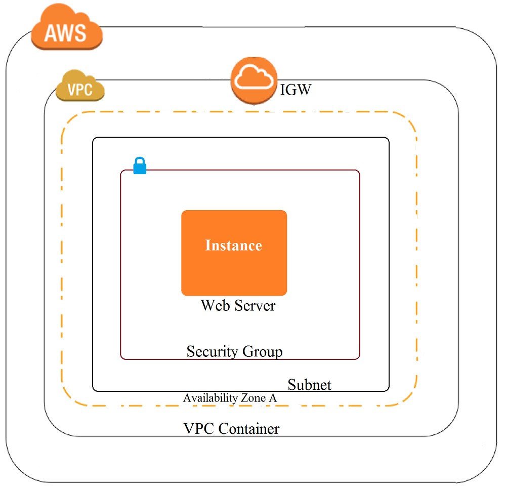
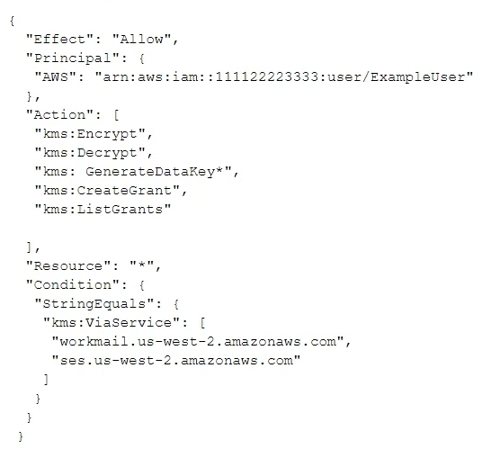
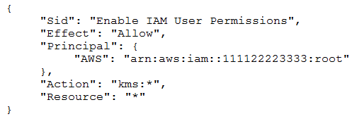
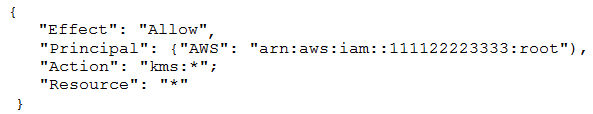
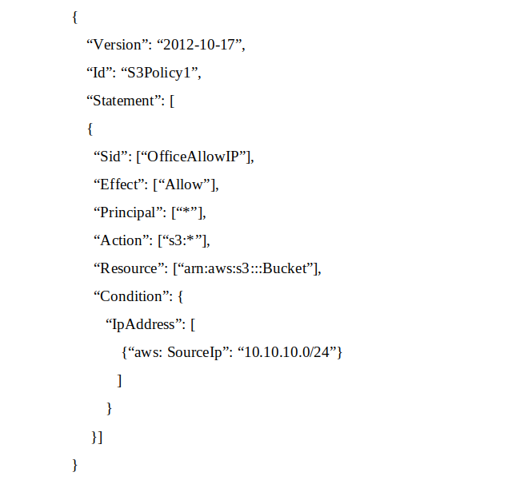
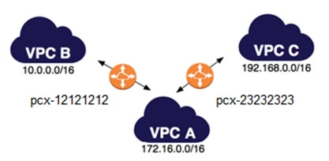
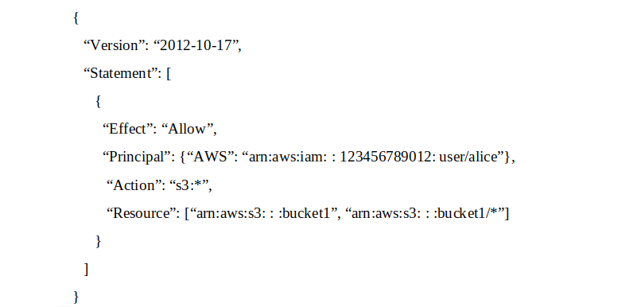
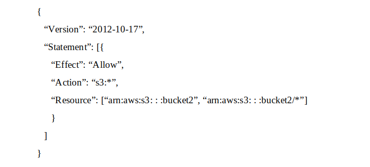
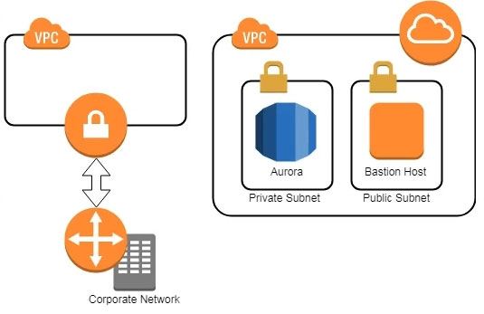

# Practice Exam 7

Click on the **Answer** button for the correct answer and its explanation.

If this practice exam has been helpful to you please share it with others and react to this below.

---

1. A company recently experienced a DDoS attack that prevented its web server from serving content. The website is static and hosts only HTML, CSS, and PDF files that users download. Based on the architecture shown in the image, what is the BEST way to protect the site against future attacks while minimizing the ongoing operational overhead?

    - A) Move all the files to an Amazon S3 bucket. Have the web server serve the files from the S3 bucket.
    - B) Launch a second Amazon EC2 instance in a new subnet. Launch an Application Load Balancer in front of both instances.
    - C) Launch an Application Load Balancer in front of the EC2 instance. Create an Amazon CloudFront distribution in front of the Application Load Balancer.
    - D) Move all the files to an S3 bucket. Create a CloudFront distribution in front of the bucket and terminate the web server.

<b>Answer</b>
 Correct Answer(s): D

2. The Information Technology department has stopped using Classic Load Balancers and switched to Application Load Balancers to save costs. After the switch, some users on older devices are no longer able to connect to the website. What is causing this situation?

    - A) Application Load Balancers do not support older web browsers.
    - B) The Perfect Forward Secrecy settings are not configured correctly.
    - C) The intermediate certificate is installed within the Application Load Balancer.
    - D) The cipher suites on the Application Load Balancers are blocking connections.

<b>Answer</b>
 Correct Answer(s): D

3. A security team is responsible for reviewing AWS API call activity in the cloud environment for security violations. These events must be recorded and retained in a centralized location for both current and future AWS regions. What is the SIMPLEST way to meet these requirements?

    - A) Enable AWS Trusted Advisor security checks in the AWS Console, and report all security incidents for all regions.
    - B) Enable AWS CloudTrail by creating individual trails for each region, and specify a single Amazon S3 bucket to receive log files for later analysis.
    - C) Enable AWS CloudTrail by creating a new trail and applying the trail to all regions. Specify a single Amazon S3 bucket as the storage location.
    - D) Enable Amazon CloudWatch logging for all AWS services across all regions, and aggregate them to a single Amazon S3 bucket for later analysis.

<b>Answer</b>
 Correct Answer(s): C

4. A Security Administrator is performing a log analysis as a result of a suspected AWS account compromise. The Administrator wants to analyze suspicious AWS CloudTrail log files but is overwhelmed by the volume of audit logs being generated. What approach enables the Administrator to search through the logs MOST efficiently?

    - A) Implement a `write-only` CloudTrail event filter to detect any modifications to the AWS account resources.
    - B) Configure Amazon Macie to classify and discover sensitive data in the Amazon S3 bucket that contains the CloudTrail audit logs.
    - C) Configure Amazon Athena to read from the CloudTrail S3 bucket and query the logs to examine account activities.
    - D) Enable Amazon S3 event notifications to trigger an AWS Lambda function that sends an email alarm when there are new CloudTrail API entries.

<b>Answer</b>
 Correct Answer(s): C

5. During a recent security audit, it was discovered that multiple teams in a large organization have placed restricted data in multiple Amazon S3 buckets, and the data may have been exposed. The auditor has requested that the organization identify all possible objects that contain personally identifiable information (PII) and then determine whether this information has been accessed. What solution will allow the Security team to complete this request?

    - A) Using Amazon Athena, query the impacted S3 buckets by using the PII query identifier function. Then, create a new Amazon CloudWatch metric for Amazon S3 object access to alert when the objects are accessed.
    - B) Enable Amazon Macie on the S3 buckets that were impacted, then perform data classification. For identified objects that contain PII, use the research function for auditing AWS CloudTrail logs and S3 bucket logs for GET operations.
    - C) Enable Amazon GuardDuty and enable the PII rule set on the S3 buckets that were impacted, then perform data classification. Using the PII findings report from GuardDuty, query the S3 bucket logs by using Athena for GET operations.
    - D) Enable Amazon Inspector on the S3 buckets that were impacted, then perform data classification. For identified objects that contain PII, query the S3 bucket logs by using Athena for GET operations.

<b>Answer</b>
 Correct Answer(s): B

6. During a recent internal investigation, it was discovered that all API logging was disabled in a production account, and the root user had created new API keys that appear to have been used several times. What could have been done to detect and automatically remediate the incident?

    - A) Using Amazon Inspector, review all of the API calls and configure the inspector agent to leverage SNS topics to notify security of the change to AWS CloudTrail, and revoke the new API keys for the root user.
    - B) Using AWS Config, create a config rule that detects when AWS CloudTrail is disabled, as well as any calls to the root user create-api-key. Then use a Lambda function to re-enable CloudTrail logs and deactivate the root API keys.
    - C) Using Amazon CloudWatch, create a CloudWatch event that detects AWS CloudTrail deactivation and a separate Amazon Trusted Advisor check to automatically detect the creation of root API keys. Then use a Lambda function to enable AWS CloudTrail and deactivate the root API keys.
    - D) Using Amazon CloudTrail, create a new CloudTrail event that detects the deactivation of CloudTrail logs, and a separate CloudTrail event that detects the creation of root API keys. Then use a Lambda function to enable CloudTrail and deactivate the root API keys.

<b>Answer</b>
 Correct Answer(s): B

7. An application has a requirement to be resilient across not only Availability Zones within the application's primary region but also be available within another region altogether. Which of the following supports this requirement for AWS resources that are encrypted by AWS KMS?

    - A) Copy the application's AWS KMS CMK from the source region to the target region so that it can be used to decrypt the resource after it is copied to the target region.
    - B) Configure AWS KMS to automatically synchronize the CMK between regions so that it can be used to decrypt the resource in the target region.
    - C) Use AWS services that replicate data across regions, and re-wrap the data encryption key created in the source region by using the CMK in the target region so that the target region's CMK can decrypt the database encryption key.
    - D) Configure the target region's AWS service to communicate with the source region's AWS KMS so that it can decrypt the resource in the target region.

<b>Answer</b>
 Correct Answer(s): C

8. A Security Administrator is configuring an Amazon S3 bucket and must meet the following security requirements: Encryption in transit Encryption at rest Logging of all object retrievals in AWS CloudTrail Which of the following meet these security requirements? (Choose THREE)

    - A) Specify `"aws:SecureTransport": "true"` within a condition in the S3 bucket policy.
    - B) Enable a security group for the S3 bucket that allows port 443, but not port 80.
    - C) Set up default encryption for the S3 bucket.
    - D) Enable Amazon CloudWatch Logs for the AWS account.
    - E) Enable API logging of data events for all S3 objects.
    - F) Enable S3 object versioning for the S3 bucket.

<b>Answer</b>
 Correct Answer(s): A, C, E

9. What is the function of the following AWS Key Management Service (KMS) key policy attached to a customer master key (CMK)?

    - A) The Amazon WorkMail and Amazon SES services have delegated KMS encrypt and decrypt permissions to the ExampleUser principal in the 111122223333 account.
    - B) The ExampleUser principal can transparently encrypt and decrypt email exchanges specifically between ExampleUser and AWS.
    - C) The CMK is to be used for encrypting and decrypting only when the principal is ExampleUser and the request comes from WorkMail or SES in the specified region.
    - D) The key policy allows WorkMail or SES to encrypt or decrypt on behalf of the user for any CMK in the account.

<b>Answer</b>
 Correct Answer(s): C

10. A Security Engineer who was reviewing AWS Key Management Service (AWS KMS) key policies found this statement in each key policy in the company AWS account. What does the statement allow?

    - A) All principals from all AWS accounts to use the key.
    - B) Only the root user from account 111122223333 to use the key.
    - C) All principals from account 111122223333 to use the key but only on Amazon S3.
    - D) Only principals from account 111122223333 that have an IAM policy applied that grants access to this key to use the key.

<b>Answer</b>
 Correct Answer(s): D

11. The Security Engineer created a new AWS Key Management Service (AWS KMS) key with the following key policy. What are the effects of the key policy? (Choose TWO)

    - A) The policy allows access for the AWS account 111122223333 to manage key access though IAM policies.
    - B) The policy allows all IAM users in account 111122223333 to have full access to the KMS key.
    - C) The policy allows the root user in account 111122223333 to have full access to the KMS key.
    - D) The policy allows the KMS service-linked role in account 111122223333 to have full access to the KMS key.
    - E) The policy allows all IAM roles in account 111122223333 to have full access to the KMS key.

<b>Answer</b>
 Correct Answer(s): A, C

12. A Software Engineer wrote a customized reporting service that will run on a fleet of Amazon EC2 instances. The company security policy states that application logs for the reporting service must be centrally collected. What is the MOST efficient way to meet these requirements?

    - A) Write an AWS Lambda function that logs into the EC2 instance to pull the application logs from the EC2 instance and persists them into an Amazon S3 bucket.
    - B) Enable AWS CloudTrail logging for the AWS account, create a new Amazon S3 bucket, and then configure Amazon CloudWatch Logs to receive the application logs from CloudTrail.
    - C) Create a simple cron job on the EC2 instances that synchronizes the application logs to an Amazon S3 bucket by using rsync.
    - D) Install the Amazon CloudWatch Logs Agent on the EC2 instances, and configure it to send the application logs to CloudWatch Logs.

<b>Answer</b>
 Correct Answer(s): D

13. A Security Engineer is trying to determine whether the encryption keys used in an AWS service are in compliance with certain regulatory standards. Which of the following actions should the Engineer perform to get further guidance?

    - A) Read the AWS Customer Agreement.
    - B) Use AWS Artifact to access AWS compliance reports.
    - C) Post the question on the AWS Discussion Forums.
    - D) Run AWS Config and evaluate the configuration outputs.

<b>Answer</b>
 Correct Answer(s): B

14. The Development team receives an error message each time the team members attempt to encrypt or decrypt a Secure String parameter from the SSM Parameter Store by using an AWS KMS customer managed key (CMK). Which CMK-related issues could be responsible? (Choose TWO)

    - A) The CMK specified in the application does not exist.
    - B) The CMK specified in the application is currently in use.
    - C) The CMK specified in the application is using the CMK KeyID instead of CMK Amazon Resource Name.
    - D) The CMK specified in the application is not enabled.
    - E) The CMK specified in the application is using an alias.

<b>Answer</b>
 Correct Answer(s): A, D

15. An application has been written that publishes custom metrics to Amazon CloudWatch. Recently, IAM changes have been made on the account and the metrics are no longer being reported. Which of the following is the LEAST permissive solution that will allow the metrics to be delivered?

    - A) Add a statement to the IAM policy used by the application to allow `logs:putLogEvents` and `logs:createLogStream`.
    - B) Modify the IAM role used by the application by adding the CloudWatchFullAccess managed policy.
    - C) Add a statement to the IAM policy used by the application to allow `cloudwatch:putMetricData`.
    - D) Add a trust relationship to the IAM role used by the application for cloudwatch.amazonaws.com.

<b>Answer</b>
 Correct Answer(s): C

16. A Developer's laptop was stolen. The laptop was not encrypted, and it contained the SSH key used to access multiple Amazon EC2 instances. A SecurityEngineer has verified that the key has not been used, and has blocked port 22 to all EC2 instances while developing a response plan. How can the Security Engineer further protect currently running instances?

    - A) Delete the key-pair key from the EC2 console, then create a new key pair.
    - B) Use the modify-instance-attribute API to change the key on any EC2 instance that is using the key.
    - C) Use the EC2 RunCommand to modify the authorized_keys file on any EC2 instance that is using the key.
    - D) Update the key pair in any AMI used to launch the EC2 instances, then restart the EC2 instances.

<b>Answer</b>
 Correct Answer(s): C

17. An organization has tens of applications deployed on thousands of Amazon EC2 instances. During testing, the Application team needs information to let them know whether the network access control lists (network ACLs) and security groups are working as expected. How can the Application team's requirements be met?

    - A) Turn on VPC Flow Logs, send the logs to Amazon S3, and use Amazon Athena to query the logs.
    - B) Install an Amazon Inspector agent on each EC2 instance, send the logs to Amazon S3, and use Amazon EMR to query the logs.
    - C) Create an AWS Config rule for each network ACL and security group configuration, send the logs to Amazon S3, and use Amazon Athena to query the logs.
    - D) Turn on AWS CloudTrail, send the trails to Amazon S3, and use AWS Lambda to query the trails.

<b>Answer</b>
 Correct Answer(s): A

18. An application outputs logs to a text file. The logs must be continuously monitored for security incidents. Which design will meet the requirements with MINIMUM effort?

    - A) Create a scheduled process to copy the component's logs into Amazon S3. Use S3 events to trigger a Lambda function that updates Amazon CloudWatch metrics with the log data. Set up CloudWatch alerts based on the metrics.
    - B) Install and configure the Amazon CloudWatch Logs agent on the application's EC2 instance. Create a CloudWatch metric filter to monitor the application logs. Set up CloudWatch alerts based on the metrics.
    - C) Create a scheduled process to copy the application log files to AWS CloudTrail. Use S3 events to trigger Lambda functions that update CloudWatch metrics with the log data. Set up CloudWatch alerts based on the metrics.
    - D) Create a file watcher that copies data to Amazon Kinesis when the application writes to the log file. Have Kinesis trigger a Lambda function to update Amazon CloudWatch metrics with the log data. Set up CloudWatch alerts based on the metrics.

<b>Answer</b>
 Correct Answer(s): B

19. The Security Engineer for a mobile game has to implement a method to authenticate users so that they can save their progress. Because most of the users are part of the same OpenID-Connect compatible social media website, the Security Engineer would like to use that as the identity provider. Which solution is the SIMPLEST way to allow the authentication of users using their social media identities?

    - A) Amazon Cognito.
    - B) AssumeRoleWithWebIdentity API.
    - C) Amazon Cloud Directory.
    - D) Active Directory (AD) Connector.

<b>Answer</b>
 Correct Answer(s): A

20. A Software Engineer is trying to figure out why network connectivity to an Amazon EC2 instance does not appear to be working correctly. Its security group allows inbound HTTP traffic from 0.0.0.0/0, and the outbound rules have not been modified from the default. A custom network ACL associated with its subnet allows inbound HTTP traffic from 0.0.0.0/0 and has no outbound rules. What would resolve the connectivity issue?

    - A) The outbound rules on the security group do not allow the response to be sent to the client on the ephemeral port range.
    - B) The outbound rules on the security group do not allow the response to be sent to the client on the HTTP port.
    - C) An outbound rule must be added to the network ACL to allow the response to be sent to the client on the ephemeral port range.
    - D) An outbound rule must be added to the network ACL to allow the response to be sent to the client on the HTTP port.

<b>Answer</b>
 Correct Answer(s): C

21. A Security Engineer has been asked to create an automated process to disable IAM user access keys that are more than three months old. Which of the following options should the Security Engineer use?

    - A) In the AWS Console, choose the IAM service and select `Users`. Review the `Access Key Age` column.
    - B) Define an IAM policy that denies access if the key age is more than three months and apply to all users.
    - C) Write a script that uses the GenerateCredentialReport, GetCredentialReport, and UpdateAccessKey APIs.
    - D) Create an Amazon CloudWatch alarm to detect aged access keys and use an AWS Lambda function to disable the keys older than 90 days.

<b>Answer</b>
 Correct Answer(s): C

22. The InfoSec team has mandated that in the future only approved Amazon Machine Images (AMIs) can be used. How can the InfoSec team ensure compliance with this mandate?

    - A) Terminate all Amazon EC2 instances and relaunch them with approved AMIs.
    - B) Patch all running instances by using AWS Systems Manager.
    - C) Deploy AWS Config rules and check all running instances for compliance.
    - D) Define a metric filter in Amazon CloudWatch Logs to verify compliance.

<b>Answer</b>
 Correct Answer(s): C

23. A pharmaceutical company has digitized versions of historical prescriptions stored on premises. The company would like to move these prescriptions to AWS and perform analytics on the data in them. Any operation with this data requires that the data be encrypted in transit and at rest. Which application flow would meet the data protection requirements on AWS?

    - A) Digitized files -> Amazon Kinesis Data Analytics.
    - B) Digitized files -> Amazon Kinesis Data Firehose -> Amazon S3 -> Amazon Athena.
    - C) Digitized files -> Amazon Kinesis Data Streams -> Kinesis Client Library consumer -> Amazon S3 -> Athena.
    - D) Digitized files -> Amazon Kinesis Data Firehose -> Amazon Elasticsearch.

<b>Answer</b>
 Correct Answer(s): B

24. A company uses AWS Organization to manage 50 AWS accounts. The finance staff members log in as AWS IAM users in the FinanceDept AWS account. The staff members need to read the consolidated billing information in the MasterPayer AWS account. They should not be able to view any other resources in the MasterPayer AWS account. IAM access to billing has been enabled in the MasterPayer account. Which of the following approaches grants the finance staff the permissions they require without granting any unnecessary permissions?

    - A) Create an IAM group for the finance users in the FinanceDept account, then attach the AWS managed ReadOnlyAccess IAM policy to the group.
    - B) Create an IAM group for the finance users in the MasterPayer account, then attach the AWS managed ReadOnlyAccess IAM policy to the group.
    - C) Create an AWS IAM role in the FinanceDept account with the ViewBilling permission, then grant the finance users in the MasterPayer account the permission to assume that role.
    - D) Create an AWS IAM role in the MasterPayer account with the ViewBilling permission, then grant the finance users in the FinanceDept account the permission to assume that role.

<b>Answer</b>
 Correct Answer(s): D

25. A Security Engineer has been asked to troubleshoot inbound connectivity to a web server. This single web server is not receiving inbound connections from the internet, whereas all other web servers are functioning properly. The architecture includes network ACLs, security groups, and a virtual security appliance. In addition, the Development team has implemented Application Load Balancers (ALBs) to distribute the load across all web servers. It is a requirement that traffic between the web servers and the internet flow through the virtual security appliance. The Security Engineer has verified the following: 1. The rule set in the Security Groups is correct 2. The rule set in the network ACLs is correct 3. The rule set in the virtual appliance is correct Which of the following are other valid items to troubleshoot in this scenario? (Choose TWO)

    - A) Verify that the 0.0.0.0/0 route in the route table for the web server subnet points to a NAT gateway.
    - B) Verify which Security Group is applied to the particular web server's elastic network interface (ENI).
    - C) Verify that the 0.0.0.0/0 route in the route table for the web server subnet points to the virtual security appliance.
    - D) Verify the registered targets in the ALB.
    - E) Verify that the 0.0.0.0/0 route in the public subnet points to a NAT gateway.

<b>Answer</b>
 Correct Answer(s): B, D

26. Amazon CloudWatch Logs agent is successfully delivering logs to the CloudWatch Logs service. However, logs stop being delivered after the associated log stream has been active for a specific number of hours. What steps are necessary to identify the cause of this phenomenon? (Choose TWO)

    - A) Ensure that file permissions for monitored files that allow the CloudWatch Logs agent to read the file have not been modified.
    - B) Verify that the OS Log rotation rules are compatible with the configuration requirements for agent streaming.
    - C) Configure an Amazon Kinesis producer to first put the logs into Amazon Kinesis Streams.
    - D) Create a CloudWatch Logs metric to isolate a value that changes at least once during the period before logging stops.
    - E) Use AWS CloudFormation to dynamically create and maintain the configuration file for the CloudWatch Logs agent.

<b>Answer</b>
 Correct Answer(s): A, B

27. A company has deployed a custom DNS server in AWS. The Security Engineer wants to ensure that Amazon EC2 instances cannot use the Amazon-provided DNS. How can the Security Engineer block access to the Amazon-provided DNS in the VPC?

    - A) Deny access to the Amazon DNS IP within all security groups.
    - B) Add a rule to all network access control lists that deny access to the Amazon DNS IP.
    - C) Add a route to all route tables that black holes traffic to the Amazon DNS IP.
    - D) Disable DNS resolution within the VPC configuration.

<b>Answer</b>
 Correct Answer(s): D

28. Which of the following minimizes the potential attack surface for applications?

    - A) Use security groups to provide stateful firewalls for Amazon EC2 instances at the hypervisor level.
    - B) Use network ACLs to provide stateful firewalls at the VPC level to prevent access to any specific AWS resource.
    - C) Use AWS Direct Connect for secure trusted connections between EC2 instances within private subnets.
    - D) Design network security in a single layer within the perimeter network (also known as DMZ, demilitarized zone, and screened subnet) to facilitate quicker responses to threats.

<b>Answer</b>
 Correct Answer(s): A

29. A distributed web application is installed across several EC2 instances in public subnets residing in two Availability Zones. Apache logs show several intermittent brute-force attacks from hundreds of IP addresses at the layer 7 level over the past six months. What would be the BEST way to reduce the potential impact of these attacks in the future?

    - A) Use custom route tables to prevent malicious traffic from routing to the instances.
    - B) Update security groups to deny traffic from the originating source IP addresses.
    - C) Use network ACLs.
    - D) Install intrusion prevention software (IPS) on each instance.

<b>Answer</b>
 Correct Answer(s): D

30. A company plans to move most of its IT infrastructure to AWS. They want to leverage their existing on-premises Active Directory as an identity provider for AWS. Which combination of steps should a Security Engineer take to federate the company's on-premises Active Directory with AWS? (Choose TWO)

    - A) Create IAM roles with permissions corresponding to each Active Directory group.
    - B) Create IAM groups with permissions corresponding to each Active Directory group.
    - C) Configure Amazon Cloud Directory to support a SAML provider.
    - D) Configure Active Directory to add relying party trust between Active Directory and AWS.
    - E) Configure Amazon Cognito to add relying party trust between Active Directory and AWS.

<b>Answer</b>
 Correct Answer(s): A, D

31. A security alert has been raised for an Amazon EC2 instance in a customer account that is exhibiting strange behavior. The Security Engineer must first isolate the EC2 instance and then use tools for further investigation. What should the Security Engineer use to isolate and research this event? (Choose THREE)

    - A) AWS CloudTrail.
    - B) Amazon Athena.
    - C) AWS Key Management Service (AWS KMS).
    - D) VPC Flow Logs.
    - E) AWS Firewall Manager.
    - F) Security groups.

<b>Answer</b>
 Correct Answer(s): A, D, F

32. An organization wants to be alerted when an unauthorized Amazon EC2 instance in its VPC performs a network port scan against other instances in the VPC. When the Security team performs its own internal tests in a separate account by using pre-approved third-party scanners from the AWS Marketplace, the Security team also then receives multiple Amazon GuardDuty events from Amazon CloudWatch alerting on its test activities. How can the Security team suppress alerts about authorized security tests while still receiving alerts about the unauthorized activity?

    - A) Use a filter in AWS CloudTrail to exclude the IP addresses of the Security team's EC2 instances.
    - B) Add the Elastic IP addresses of the Security team's EC2 instances to a trusted IP list in Amazon GuardDuty.
    - C) Install the Amazon Inspector agent on the EC2 instances that the Security team uses.
    - D) Grant the Security team's EC2 instances a role with permissions to call Amazon GuardDuty API operations.

<b>Answer</b>
 Correct Answer(s): B

33. An organization is moving non-business-critical applications to AWS while maintaining a mission-critical application in an on-premises data center. An on-premises application must share limited confidential information with the applications in AWS. The internet performance is unpredictable. Which configuration will ensure continued connectivity between sites MOST securely?

    - A) VPN and a cached storage gateway.
    - B) AWS Snowball Edge.
    - C) VPN Gateway over AWS Direct Connect.
    - D) AWS Direct Connect.

<b>Answer</b>
 Correct Answer(s): C

34. An application has been built with Amazon EC2 instances that retrieve messages from Amazon SQS. Recently, IAM changes were made and the instances can no longer retrieve messages. What actions should be taken to troubleshoot the issue while maintaining least privilege? (Choose TWO)

    - A) Configure and assign an MFA device to the role used by the instances.
    - B) Verify that the SQS resource policy does not explicitly deny access to the role used by the instances.
    - C) Verify that the access key attached to the role used by the instances is active.
    - D) Attach the AmazonSQSFullAccess managed policy to the role used by the instances.
    - E) Verify that the role attached to the instances contains policies that allow access to the queue.

<b>Answer</b>
 Correct Answer(s): B, E

35. Which of the following is the most efficient way to automate the encryption of AWS CloudTrail logs using a Customer Master Key (CMK) in AWS KMS?

    - A) Use the KMS direct encrypt function on the log data every time a CloudTrail log is generated.
    - B) Use the default Amazon S3 server-side encryption with S3-managed keys to encrypt and decrypt the CloudTrail logs.
    - C) Configure CloudTrail to use server-side encryption using KMS-managed keys to encrypt and decrypt CloudTrail logs.
    - D) Use encrypted API endpoints so that all AWS API calls generate encrypted CloudTrail log entries using the TLS certificate from the encrypted API call.

<b>Answer</b>
 Correct Answer(s): C

36. An organization is using AWS CloudTrail, Amazon CloudWatch Logs, and Amazon CloudWatch to send alerts when new access keys are created. However, the alerts are no longer appearing in the Security Operations mail box. Which of the following actions would resolve this issue?

    - A) In CloudTrail, verify that the trail logging bucket has a log prefix configured.
    - B) In Amazon SNS, determine whether the `Account spend limit` has been reached for this alert.
    - C) In SNS, ensure that the subscription used by these alerts has not been deleted.
    - D) In CloudWatch, verify that the alarm threshold `consecutive periods` value is equal to, or greater than 1.

<b>Answer</b>
 Correct Answer(s): C

37. A Security Engineer must add additional protection to a legacy web application by adding the following HTTP security headers: `-Content Security-Policy -X-Frame-Options -X-XSS-Protection`. The Engineer does not have access to the source code of the legacy web application. Which of the following approaches would meet this requirement?

    - A) Configure an Amazon Route 53 routing policy to send all web traffic that does not include the required headers to a black hole.
    - B) Implement an AWS Lambda@Edge origin response function that inserts the required headers.
    - C) Migrate the legacy application to an Amazon S3 static website and front it with an Amazon CloudFront distribution.
    - D) Construct an AWS WAF rule to replace existing HTTP headers with the required security headers by using regular expressions.

<b>Answer</b>
 Correct Answer(s): B

38. During a security event, it is discovered that some Amazon EC2 instances have not been sending Amazon CloudWatch logs. Which steps can the Security Engineer take to troubleshoot this issue? (Choose TWO)

    - A) Connect to the EC2 instances that are not sending the appropriate logs and verify that the CloudWatch Logs agent is running.
    - B) Log in to the AWS account and select CloudWatch Logs. Check for any monitored EC2 instances that are in the `Alerting` state and restart them using the EC2 console.
    - C) Verify that the EC2 instances have a route to the public AWS API endpoints.
    - D) Connect to the EC2 instances that are not sending logs. Use the command prompt to verify that the right permissions have been set for the Amazon SNS topic.
    - E) Verify that the network access control lists and security groups of the EC2 instances have the access to send logs over SNMP.

<b>Answer</b>
 Correct Answer(s): A, C

39. A Security Engineer discovers that developers have been adding rules to security groups that allow SSH and RDP traffic from 0.0.0.0/0 instead of the organization firewall IP. What is the most efficient way to remediate the risk of this activity?

    - A) Delete the internet gateway associated with the VPC.
    - B) Use network access control lists to block source IP addresses matching 0.0.0.0/0.
    - C) Use a host-based firewall to prevent access from all but the organization's firewall IP.
    - D) Use AWS Config rules to detect 0.0.0.0/0 and invoke an AWS Lambda function to update the security group with the organization's firewall IP.

<b>Answer</b>
 Correct Answer(s): D

40. In response to the past DDoS attack experiences, a Security Engineer has set up an Amazon CloudFront distribution for an Amazon S3 bucket. There is concern that some users may bypass the CloudFront distribution and access the S3 bucket directly. What must be done to prevent users from accessing the S3 objects directly by using URLs?

    - A) Change the S3 bucket/object permission so that only the bucket owner has access.
    - B) Set up a CloudFront origin access identity (OAI), and change the S3 bucket/object permission so that only the OAI has access.
    - C) Create IAM roles for CloudFront, and change the S3 bucket/object permission so that only the IAM role has access.
    - D) Redirect S3 bucket access to the corresponding CloudFront distribution.

<b>Answer</b>
 Correct Answer(s): B

41. A company plans to move most of its IT infrastructure to AWS. The company wants to leverage its existing on-premises Active Directory as an identity provider for AWS. Which steps should be taken to authenticate to AWS services using the company's on-premises Active Directory? (Choose THREE)

    - A) Create IAM roles with permissions corresponding to each Active Directory group.
    - B) Create IAM groups with permissions corresponding to each Active Directory group.
    - C) Create a SAML provider with IAM.
    - D) Create a SAML provider with Amazon Cloud Directory.
    - E) Configure AWS as a trusted relying party for the Active Directory.
    - F) Configure IAM as a trusted relying party for Amazon Cloud Directory.

<b>Answer</b>
 Correct Answer(s): A, C, E

42. A Security Analyst attempted to troubleshoot the monitoring of suspicious security group changes. The Analyst was told that there is an Amazon CloudWatch alarm in place for these AWS CloudTrail log events. The Analyst tested the monitoring setup by making a configuration change to the security group but did not receive any alerts. Which of the following troubleshooting steps should the Analyst perform?

    - A) Ensure that CloudTrail and S3 bucket access logging is enabled for the Analyst's AWS account.
    - B) Verify that a metric filter was created and then mapped to an alarm. Check the alarm notification action.
    - C) Check the CloudWatch dashboards to ensure that there is a metric configured with an appropriate dimension for security group changes.
    - D) Verify that the Analyst's account is mapped to an IAM policy that includes permissions for `cloudwatch: GetMetricStatistics` and `Cloudwatch: ListMetrics`.

<b>Answer</b>
 Correct Answer(s): B

43. Example.com hosts its internal document repository on Amazon EC2 instances. The application runs on EC2 instances and previously stored the documents on encrypted Amazon EBS volumes. To optimize the application for scale, example.com has moved the files to Amazon S3. The security team has mandated that all the files are securely deleted from the EBS volume, and it must certify that the data is unreadable before releasing the underlying disks. Which of the following methods will ensure that the data is unreadable by anyone else?

    - A) Change the volume encryption on the EBS volume to use a different encryption mechanism. Then, release the EBS volumes back to AWS.
    - B) Release the volumes back to AWS. AWS immediately wipes the disk after it is deprovisioned.
    - C) Delete the encryption key used to encrypt the EBS volume. Then, release the EBS volumes back to AWS.
    - D) Delete the data by using the operating system delete commands. Run Quick Format on the drive and then release the EBS volumes back to AWS.

<b>Answer</b>
 Correct Answer(s): C

44. A Systems Administrator has written the following Amazon S3 bucket policy designed to allow access to an S3 bucket for only an authorized AWS IAM user from the IP address range 10.10.10.0/24. When trying to download an object from the S3 bucket from 10.10.10.40, the IAM user receives an access denied message. What does the Administrator need to change to grant access to the user?

    - A) Change the `Resource` from `arn: aws:s3:::Bucket` to `arn:aws:s3:::Bucket/*`.
    - B) Change the `Principal` from `*` to {AWS:`arn:aws:iam: : account-number: user/username`}.
    - C) Change the `Version` from `2012-10-17` to the last revised date of the policy.
    - D) Change the `Action` from `["s3:*"]` to `["s3:GetObject", "s3:ListBucket"]`.

<b>Answer</b>
 Correct Answer(s): A

45. The Security Engineer has discovered that a new application that deals with highly sensitive data is storing Amazon S3 objects with the following key pattern, which itself contains highly sensitive data. Pattern: "randomID_datestamp_PII.csv" Example: "1234567_12302017_000-00-0000 csv" The bucket where these objects are being stored is using server-side encryption (SSE). Which solution is the most secure and cost-effective option to protect the sensitive data?

    - A) Remove the sensitive data from the object name, and store the sensitive data using S3 user-defined metadata.
    - B) Add an S3 bucket policy that denies the action `s3:GetObject`.
    - C) Use a random and unique S3 object key, and create an S3 metadata index in Amazon DynamoDB using client-side encrypted attributes.
    - D) Store all sensitive objects in Binary Large Objects (BLOBS) in an encrypted Amazon RDS instance.

<b>Answer</b>
 Correct Answer(s): C

46. AWS CloudTrail is being used to monitor API calls in an organization. An audit revealed that CloudTrail is failing to deliver events to Amazon S3 as expected. What initial actions should be taken to allow delivery of CloudTrail events to S3? (Choose TWO)

    - A) Verify that the S3 bucket policy allow CloudTrail to write objects.
    - B) Verify that the IAM role used by CloudTrail has access to write to Amazon CloudWatch Logs.
    - C) Remove any lifecycle policies on the S3 bucket that are archiving objects to Amazon Glacier.
    - D) Verify that the S3 bucket defined in CloudTrail exists.
    - E) Verify that the log file prefix defined in CloudTrail exists in the S3 bucket.

<b>Answer</b>
 Correct Answer(s): A, D

47. Due to new compliance requirements, a Security Engineer must enable encryption with customer-provided keys on corporate data that is stored in DynamoDB. The company wants to retain full control of the encryption keys. Which DynamoDB feature should the Engineer use to achieve compliance'?

    - A) Use AWS Certificate Manager to request a certificate. Use that certificate to encrypt data prior to uploading it to DynamoDB.
    - B) Enable S3 server-side encryption with the customer-provided keys. Upload the data to Amazon S3, and then use S3Copy to move all data to DynamoDB
    - C) Create a KMS master key. Generate per-record data keys and use them to encrypt data prior to uploading it to DynamoDS. Dispose of the cleartext and encrypted data keys after encryption without storing.
    - D) Use the DynamoDB Java encryption client to encrypt data prior to uploading it to DynamoDB.

<b>Answer</b>
 Correct Answer(s): D

48. A Security Engineer must design a system that can detect whether a file on an Amazon EC2 host has been modified. The system must then alert the Security Engineer of the modification. What is the MOST efficient way to meet these requirements?

    - A) Install antivirus software and ensure that signatures are up-to-date. Configure Amazon CloudWatch alarms to send alerts for security events.
    - B) Install host-based IDS software to check for file integrity. Export the logs to Amazon CloudWatch Logs for monitoring and alerting.
    - C) Export system log files to Amazon S3. Parse the log files using an AWS Lambda function that will send alerts of any unauthorized system login attempts through Amazon SNS.
    - D) Use Amazon CloudWatch Logs to detect file system changes. If a change is detected, automatically terminate and recreate the instance from the most recent AMI. Use Amazon SNS to send notification of the event.

<b>Answer</b>
 Correct Answer(s): B

49. A company has multiple VPCs in their account that are peered, as shown in the diagram. A Security Engineer wants to perform penetration tests of the Amazon EC2 instances in all three VPCs. How can this be accomplished? (Choose TWO)

    - A) Deploy a pre-authorized scanning engine from the AWS Marketplace into VPC B, and use it to scan instances in all three VPCs. Do not complete the penetration test request form.
    - B) Deploy a pre-authorized scanning engine from the Marketplace into each VPC, and scan instances in each VPC from the scanning engine in that VPC. Do not complete the penetration test request form.
    - C) Create a VPN connection from the data center to VPC A. Use an on-premises scanning engine to scan the instances in all three VPCs. Complete the penetration test request form for all three VPCs.
    - D) Create a VPN connection from the data center to each of the three VPCs. Use an on-premises scanning engine to scan the instances in each VPC. Do not complete the penetration test request form.
    - E) Create a VPN connection from the data center to each of the three VPCs. Use an on-premises scanning engine to scan the instances in each VPC. Complete the penetration test request form for all three VPCs.

<b>Answer</b>
 Correct Answer(s): B, D

50. For compliance reasons, an organization limits the use of resources to three specific AWS regions. It wants to be alerted when any resources are launched in unapproved regions. Which of the following approaches will provide alerts on any resources launched in an unapproved region?

    - A) Develop an alerting mechanism based on processing AWS CloudTrail logs.
    - B) Monitor Amazon S3 Event Notifications for objects stored in buckets in unapproved regions.
    - C) Analyze Amazon CloudWatch Logs for activities in unapproved regions.
    - D) Use AWS Trusted Advisor to alert on all resources being created.

<b>Answer</b>
 Correct Answer(s): A

51. A company runs an application on AWS that needs to be accessed only by employees. Most employees work from the office, but others work remotely or travel. How can the Security Engineer protect this workload so that only employees can access it?

    - A) Add each employee's home IP address to the security group for the application so that only those users can access the workload.
    - B) Create a virtual gateway for VPN connectivity for each employee, and restrict access to the workload from within the VPC.
    - C) Use a VPN appliance from the AWS Marketplace for users to connect to, and restrict workload access to traffic from that appliance.
    - D) Route all traffic to the workload through AWS WAF. Add each employee's home IP address into an AWS WAF rule, and block all other traffic.

<b>Answer</b>
 Correct Answer(s): C

52. A Security Architect is evaluating managed solutions for storage of encryption keys. The requirements are: Storage is accessible by using only VPCs. Service has tamper-evident controls. Access logging is enabled. Storage has high availability. Which of the following services meets these requirements?

    - A) Amazon S3 with default encryption.
    - B) AWS CloudHSM.
    - C) Amazon DynamoDB with server-side encryption.
    - D) AWS Systems Manager Parameter Store.

<b>Answer</b>
 Correct Answer(s): B

53. An AWS account includes two S3 buckets: bucket1 and bucket2. The bucket2 does not have a policy defined, but bucket1 has the following bucket policy. In addition, the same account has an IAM User named `alice`, with the following IAM policy. Which buckets can user `alice` access?

    - A) Bucket1 only.
    - B) Bucket2 only.
    - C) Both bucket1 and bucket2.
    - D) Neither bucket1 nor bucket2.

<b>Answer</b>
 Correct Answer(s): C

54. An organization has three applications running on AWS, each accessing the same data on Amazon S3. The data on Amazon S3 is server-side encrypted by using an AWS KMS Customer Master Key (CMK). What is the recommended method to ensure that each application has its own programmatic access control permissions on the KMS CMK?

    - A) Change the key policy permissions associated with the KMS CMK for each application when it must access the data in Amazon S3.
    - B) Have each application assume an IAM role that provides permissions to use the AWS Certificate Manager CMK.
    - C) Have each application use a grant on the KMS CMK to add or remove specific access controls on the KMS CMK.
    - D) Have each application use an IAM policy in a user context to have specific access permissions on the KMS CMK.

<b>Answer</b>
 Correct Answer(s): C

55. The Security Engineer is given the following requirements for an application that is running on Amazon EC2 and managed by using AWS CloudFormation templates with EC2 Auto Scaling groups: -Have the EC2 instances bootstrapped to connect to a backend database. -Ensure that the database credentials are handled securely. -Ensure that retrievals of database credentials are logged. Which of the following is the MOST efficient way to meet these requirements?

    - A) Pass databases credentials to EC2 by using CloudFormation stack parameters with the property set to true. Ensure that the instance is configured to log to Amazon CloudWatch Logs.
    - B) Store database passwords in AWS Systems Manager Parameter Store by using SecureString parameters. Set the IAM role for the EC2 instance profile to allow access to the parameters.
    - C) Create an AWS Lambda that ingests the database password and persists it to Amazon S3 with server-side encryption. Have the EC2 instances retrieve the S3 object on startup, and log all script invocations to syslog.
    - D) Write a script that is passed in as UserData so that it is executed upon launch of the EC2 instance. Ensure that the instance is configured to log to Amazon CloudWatch Logs.

<b>Answer</b>
 Correct Answer(s): B

56. A company has two AWS accounts, each containing one VPC. The first VPC has a VPN connection with its corporate network. The second VPC, without a VPN, hosts an Amazon Aurora database cluster in private subnets. Developers manage the Aurora database from a bastion host in a public subnet as shown in the image. A security review has flagged this architecture as vulnerable, and a Security Engineer has been asked to make this design more secure. The company has a short deadline and a second VPN connection to the Aurora account is not possible. How can the Security Engineer securely set up the bastion host?

    - A) Move the bastion host to the VPC with VPN connectivity. Create a VPC peering relationship between the bastion host VPC and Aurora VPC.
    - B) Create an SSH port forwarding tunnel on the Developer's workstation to the bastion host to ensure that only authorized SSH clients can access the bastion host.
    - C) Move the bastion host to the VPC with VPN connectivity. Create a cross-account trust relationship between the bastion VPC and Aurora VPC, and update the Aurora security group for the relationship.
    - D) Create an AWS Direct Connect connection between the corporate network and the Aurora account, and adjust the Aurora security group for this connection.

<b>Answer</b>
 Correct Answer(s): A

57. An organization operates a web application that serves users globally. The application runs on Amazon EC2 instances behind an Application Load Balancer. There is an Amazon CloudFront distribution in front of the load balancer, and the organization uses AWS WAF. The application is currently experiencing a volumetric attack whereby the attacker is exploiting a bug in a popular mobile game. The application is being flooded with HTTP requests from all over the world with the User-Agent set to the following string: Mozilla/5.0 (compatible; ExampleCorp; ExampleGame/1.22; Mobile/1.0) What mitigation can be applied to block attacks resulting from this bug while continuing to service legitimate requests?

    - A) Create a rule in AWS WAF rules with conditions that block requests based on the presence of ExampleGame/1.22 in the User-Agent header.
    - B) Create a geographic restriction on the CloudFront distribution to prevent access to the application from most geographic regions.
    - C) Create a rate-based rule in AWS WAF to limit the total number of requests that the web application services.
    - D) Create an IP-based blacklist in AWS WAF to block the IP addresses that are originating from requests that contain ExampleGame/1.22 in the User-Agent header.

<b>Answer</b>
 Correct Answer(s): A

58. Some highly sensitive analytics workloads are to be moved to Amazon EC2 hosts. Threat modeling has found that a risk exists where a subnet could be maliciously or accidentally exposed to the internet. Which of the following mitigations should be recommended?

    - A) Use AWS Config to detect whether an Internet Gateway is added and use an AWS Lambda function to provide auto-remediation.
    - B) Within the Amazon VPC configuration, mark the VPC as private and disable Elastic IP addresses.
    - C) Use IPv6 addressing exclusively on the EC2 hosts, as this prevents the hosts from being accessed from the internet.
    - D) Move the workload to a Dedicated Host, as this provides additional network security controls and monitoring.

<b>Answer</b>
 Correct Answer(s): A

59. A Developer who is following AWS best practices for secure code development requires an application to encrypt sensitive data to be stored at rest, locally in the application, using AWS KMS. What is the simplest and MOST secure way to decrypt this data when required?

    - A) Request KMS to provide the stored unencrypted data key and then use the retrieved data key to decrypt the data.
    - B) Keep the plaintext data key stored in Amazon DynamoDB protected with IAM policies. Query DynamoDB to retrieve the data key to decrypt the data.
    - C) Use the Encrypt API to store an encrypted version of the data key with another customer managed key. Decrypt the data key and use it to decrypt the data when required.
    - D) Store the encrypted data key alongside the encrypted data. Use the Decrypt API to retrieve the data key to decrypt the data when required.

<b>Answer</b>
 Correct Answer(s): D

60. An organization receives an alert that indicates that an EC2 instance behind an ELB Classic Load Balancer has been compromised. What techniques will limit lateral movement and allow evidence gathering?

    - A) Remove the instance from the load balancer and terminate it.
    - B) Remove the instance from the load balancer, and shut down access to the instance by tightening the security group.
    - C) Reboot the instance and check for any Amazon CloudWatch alarms.
    - D) Stop the instance and make a snapshot of the root EBS volume.

<b>Answer</b>
 Correct Answer(s): B

61. A Development team has asked for help configuring the IAM roles and policies in a new AWS account. The team using the account expects to have hundreds of master keys and therefore does not want to manage access control for customer master keys (CMKs). Which of the following will allow the team to manage AWS KMS permissions in IAM without the complexity of editing individual key policies?

    - A) The account's CMK key policy must allow the account's IAM roles to perform KMS EnableKey.
    - B) Newly created CMKs must have a key policy that allows the root principal to perform all actions.
    - C) Newly created CMKs must allow the root principal to perform the kms CreateGrant API operation.
    - D) Newly created CMKs must mirror the IAM policy of the KMS key administrator.

<b>Answer</b>
 Correct Answer(s): B

62. An Amazon EC2 instance is part of an EC2 Auto Scaling group that is behind an Application Load Balancer (ALB). It is suspected that the EC2 instance has been compromised. Which steps should be taken to investigate the suspected compromise? (Choose THREE)

    - A) Detach the elastic network interface from the EC2 instance.
    - B) Initiate an Amazon Elastic Block Store volume snapshot of all volumes on the EC2 instance.
    - C) Disable any Amazon Route 53 health checks associated with the EC2 instance.
    - D) De-register the EC2 instance from the ALB and detach it from the Auto Scaling group.
    - E) Attach a security group that has restrictive ingress and egress rules to the EC2 instance.
    - F) Add a rule to an AWS WAF to block access to the EC2 instance.

<b>Answer</b>
 Correct Answer(s): B, D, E

63. A Security Engineer is implementing a solution to allow users to seamlessly encrypt Amazon S3 objects without having to touch the keys directly. The solution must be highly scalable without requiring continual management. Additionally, the organization must be able to immediately delete the encryption keys. Which solution meets these requirements?

    - A) Use AWS KMS with AWS managed keys and the ScheduleKeyDeletion API with a PendingWindowInDays set to 0 to remove the keys if necessary.
    - B) Use KMS with AWS imported key material and then use the DeletelmportedKeyMaterial API to remove the key material if necessary.
    - C) Use AWS CloudHSM to store the keys and then use the CloudHSM API or the PKCS11 library to delete the keys if necessary.
    - D) Use the Systems Manager Parameter Store to store the keys and then use the service API operations to delete the key if necessary.

<b>Answer</b>
 Correct Answer(s): B

64. An application uses Amazon Cognito to manage end users' permissions when directly accessing AWS resources, including Amazon DynamoDB. A new feature request reads as follows: Provide a mechanism to mark customers as suspended pending investigation or suspended permanently. Customers should still be able to log in when suspended, but should not be able to make changes. The priorities are to reduce complexity and avoid potential for future security issues. Which approach will meet these requirements and priorities?

    - A) Create a new database field `suspended_status` and modify the application logic to validate that field when processing requests.
    - B) Add suspended customers to second Cognito user pool and update the application login flow to check both user pools.
    - C) Use Amazon Cognito Sync to push out a `suspension_status` parameter and split the IAM policy into normal users and suspended users.
    - D) Move suspended customers to a second Cognito group and define an appropriate IAM access policy for the group.

<b>Answer</b>
 Correct Answer(s): D

65. A company stores data on an Amazon EBS volume attached to an Amazon EC2 instance. The data is asynchronously replicated to an Amazon S3 bucket. Both the EBS volume and the S3 bucket are encrypted with the same AWS KMS Customer Master Key (CMK). A former employee scheduled a deletion of that CMK before leaving the company. The company's Developer Operations department learns about this only after the CMK has been deleted. Which steps must be taken to address this situation?

    - A) Copy the data directly from the EBS encrypted volume before the volume is detached from the EC2 instance.
    - B) Recover the data from the EBS encrypted volume using an earlier version of the KMS backing key.
    - C) Make a request to AWS Support to recover the S3 encrypted data.
    - D) Make a request to AWS Support to restore the deleted CMK, and use it to recover the data.

<b>Answer</b>
 Correct Answer(s): A

